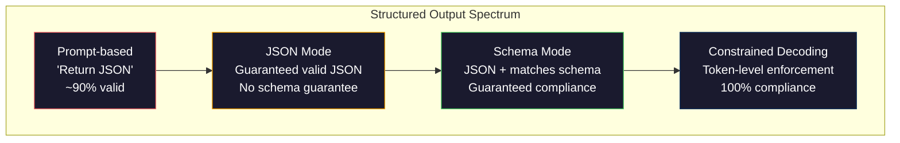
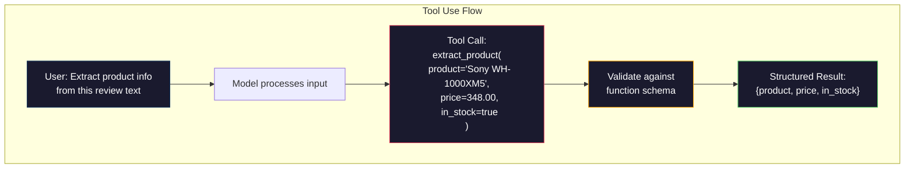

# 구조화된 출력(Structured Outputs): JSON, 스키마 검증, 제약 디코딩

> 당신의 LLM은 문자열을 반환한다. 당신의 애플리케이션은 JSON이 필요하다. 그 간극은 어떤 모델 환각보다도 더 많은 프로덕션 시스템을 무너뜨렸다. 구조화된 출력(structured output)은 자연어와 타입이 지정된 데이터 사이의 다리다. 제대로 하면 당신의 LLM은 신뢰할 수 있는 API가 된다. 잘못하면 새벽 3시에 정규표현식으로 자유 텍스트를 파싱하고 있게 된다.

**Type:** Build
**Languages:** Python
**Prerequisites:** Phase 10, Lessons 01-05 (LLMs from Scratch)
**Time:** ~90분
**Related:** Phase 5 · 20 (Structured Outputs & Constrained Decoding)은 디코더 수준 이론(FSM/CFG 로짓 프로세서, Outlines, XGrammar)을 다룬다. 이 레슨은 프로덕션 SDK 표면(OpenAI `response_format`, Anthropic tool use, Instructor)에 초점을 둔다 — API 아래에서 무슨 일이 일어나는지 이해하고 싶다면 Phase 5 · 20을 먼저 읽어라.

## 학습 목표 (Learning Objectives)

- OpenAI와 Anthropic API 파라미터를 사용해 JSON 모드와 스키마 제약 출력 구현하기
- 잘못된 형식의 LLM 출력을 거부하고 오류 피드백으로 재시도하는 Pydantic 검증 계층 만들기
- 제약 디코딩(constrained decoding)이 후처리 없이 토큰(token) 수준에서 유효한 JSON을 어떻게 강제하는지 설명하기
- 비구조화 텍스트를 타입이 지정된 데이터 구조로 신뢰성 있게 변환하는 견고한 추출 프롬프트 설계하기

## 문제 (The Problem)

당신이 LLM에게 묻는다: "이 텍스트에서 제품 이름, 가격, 재고 여부를 추출하라." 그것이 응답한다:

```
The product is the Sony WH-1000XM5 headphones, which cost $348.00 and are currently in stock.
```

그것은 완벽하게 정확한 답이다. 또한 당신의 애플리케이션에는 완전히 쓸모없다. 당신의 재고 시스템은 `{"product": "Sony WH-1000XM5", "price": 348.00, "in_stock": true}`가 필요하다. 특정 키, 특정 타입, 특정 값 제약을 가진 JSON 객체가 필요하다. 문장은 필요 없다.

순진한 해법: 프롬프트에 "Respond in JSON"을 더한다. 이것은 90%의 경우 작동한다. 나머지 10%에서는 모델이 JSON을 마크다운 코드 펜스로 감싸거나, "Here's the JSON:" 같은 서두를 더하거나, 괄호를 일찍 닫아 구문적으로 무효한 JSON을 만든다. JSON 파서가 충돌한다. 파이프라인(pipeline)이 깨진다. try/except와 재시도 루프를 더한다. 재시도는 때때로 다른 데이터를 만든다. 이제 파싱 문제 위에 일관성 문제가 생겼다.

이것은 프롬프트 엔지니어링 문제가 아니다. 디코딩 문제다. 모델은 토큰을 왼쪽에서 오른쪽으로 생성한다. 각 위치에서 10만 개 이상의 선택지로 이루어진 어휘에서 가장 가능성 높은 다음 토큰을 고른다. 그 선택지의 대부분은 어느 위치에서든 무효한 JSON을 만들 것이다. 모델이 방금 `{"price":`를 내보냈다면, 다음 토큰은 숫자, 따옴표(문자열용), `null`, `true`, `false`, 또는 음수 부호여야 한다. 그 외의 어떤 것도 무효한 JSON을 만든다. 제약이 없으면 모델은 구문적으로 치명적으로 잘못된, 완벽하게 합리적인 영어 단어를 고를 수 있다.

## 개념 (The Concept)

### 구조화된 출력의 스펙트럼 (The Structured Output Spectrum)

구조화된 출력 제어에는 네 가지 수준이 있으며, 각각이 앞의 것보다 더 신뢰성이 높다.



**프롬프트 기반(Prompt-based)** ("Respond in valid JSON"): 강제 없음. 모델은 보통 따르지만 때로는 그렇지 않다. 신뢰성: ~90%. 실패 양상: 마크다운 펜스, 서두 텍스트, 잘린 출력, 잘못된 구조.

**JSON 모드(JSON mode)**: API가 출력이 유효한 JSON임을 보장한다. OpenAI의 `response_format: { type: "json_object" }`가 이를 활성화한다. 출력은 오류 없이 파싱된다. 그러나 기대하는 스키마와 일치하지 않을 수 있다 — 여분의 키, 잘못된 타입, 누락된 필드.

**스키마 모드(Schema mode)**: API가 JSON Schema를 받아 출력이 그것과 일치함을 보장한다. 2026년에 모든 주요 프로바이더가 이를 기본 지원한다: OpenAI의 `response_format: { type: "json_schema", json_schema: {...} }`(또한 `tool_choice="required"`로도), Anthropic의 `input_schema`를 사용한 tool use, Gemini의 `response_schema` + `response_mime_type: "application/json"`. 출력은 당신이 지정한 정확한 키, 타입, 제약을 갖는다.

**제약 디코딩(Constrained decoding)**: 생성 중 각 토큰 위치에서, 디코더는 무효한 출력을 만들 모든 토큰을 마스킹한다. 스키마가 숫자를 요구하는데 모델이 문자를 내보내려 하면, 그 토큰의 확률이 0으로 설정된다. 모델은 유효한 출력으로 이어지는 토큰만 만들 수 있다. 이것이 OpenAI의 구조화된 출력 모드와 Outlines, Guidance 같은 라이브러리가 내부적으로 구현하는 것이다.

### JSON Schema: 계약 언어 (JSON Schema: The Contract Language)

JSON Schema는 모델(또는 검증 계층)에게 출력이 어떤 형태여야 하는지 말하는 방법이다. 모든 주요 구조화된 출력 시스템이 그것을 사용한다.

```json
{
  "type": "object",
  "properties": {
    "product": { "type": "string" },
    "price": { "type": "number", "minimum": 0 },
    "in_stock": { "type": "boolean" },
    "categories": {
      "type": "array",
      "items": { "type": "string" }
    }
  },
  "required": ["product", "price", "in_stock"]
}
```

이 스키마는 말한다: 출력은 문자열 `product`, 음수가 아닌 숫자 `price`, 불리언 `in_stock`, 선택적 문자열 배열 `categories`를 가진 객체여야 한다. 일치하지 않는 출력은 거부된다.

스키마는 어려운 경우를 처리한다: 중첩 객체, 타입이 지정된 항목을 가진 배열, 열거형(문자열을 특정 값으로 제약), 패턴 매칭(문자열에 대한 정규표현식), 그리고 조합자(다형적 출력을 위한 oneOf, anyOf, allOf).

### Pydantic 패턴 (The Pydantic Pattern)

Python에서는 JSON Schema를 손으로 쓰지 않는다. Pydantic 모델을 정의하면 그것이 스키마를 생성해준다.

```python
from pydantic import BaseModel

class Product(BaseModel):
    product: str
    price: float
    in_stock: bool
    categories: list[str] = []
```

이것은 위와 같은 JSON Schema를 만든다. Instructor 라이브러리(와 OpenAI의 SDK)는 Pydantic 모델을 직접 받는다: 모델 클래스를 넘기면, 검증된 인스턴스를 돌려받는다. LLM 출력이 일치하지 않으면 Instructor가 자동으로 재시도한다.

### 함수 호출 / 도구 사용 (Function Calling / Tool Use)

같은 문제에 대한 대안 인터페이스다. 모델에게 JSON을 직접 만들도록 요청하는 대신, 타입이 지정된 파라미터를 가진 "도구"(함수)를 정의한다. 모델은 구조화된 인수를 가진 함수 호출을 출력한다. OpenAI는 이것을 "function calling"이라고 부른다. Anthropic은 "tool use"라고 부른다. 결과는 같다: 구조화된 데이터.



도구 사용은 모델이 단지 파라미터를 채우는 것이 아니라 어느 함수를 호출할지 골라야 할 때 선호된다. 10개의 다른 추출 스키마가 있고 모델이 입력에 따라 올바른 것을 골라야 한다면, 도구 사용은 스키마 선택과 구조화된 출력을 둘 다 준다.

### 흔한 실패 양상 (Common Failure Modes)

스키마 강제가 있어도, 구조화된 출력은 미묘한 방식으로 실패할 수 있다.

**환각된 값(Hallucinated values)**: 출력이 스키마와 일치하지만 지어낸 데이터를 담고 있다. 텍스트가 $348이라고 말하는데 모델이 `{"price": 299.99}`를 만든다. 스키마 검증은 이를 잡을 수 없다 — 타입은 맞고, 값은 틀렸다.

**열거형 혼동(Enum confusion)**: 필드를 `["in_stock", "out_of_stock", "preorder"]`로 제약한다. 모델이 `"available"`을 출력한다 — 의미적으로는 맞지만, 허용 집합에 없다. 좋은 제약 디코딩은 이를 막는다. 프롬프트 기반 접근법은 막지 못한다.

**중첩 객체 깊이(Nested object depth)**: 깊게 중첩된 스키마(4단계 이상)는 더 많은 오류를 만든다. 중첩의 각 단계는 모델이 구조를 놓칠 수 있는 또 다른 지점이다.

**배열 길이(Array length)**: 모델은 배열에 너무 많거나 너무 적은 항목을 만들 수 있다. 스키마는 `minItems`와 `maxItems`를 지원하지만 모든 프로바이더가 디코딩 수준에서 그것들을 강제하지는 않는다.

**선택적 필드 누락(Optional field omission)**: 모델은 기술적으로 선택적이지만 당신의 사용 사례에는 의미적으로 중요한 필드를 누락한다. 데이터가 가끔 빠지더라도 스키마에서 그것들을 필수로 설정하라 — 모델이 명시적으로 `null`을 만들게 강제하라.

## 직접 만들기 (Build It)

### 1단계: JSON Schema 검증기

Python 객체가 JSON Schema와 일치하는지 확인하는 검증기를 밑바닥부터 만든다. 이것이 준수를 확인하기 위해 출력 쪽에서 실행되는 것이다.

```python
import json

def validate_schema(data, schema):
    errors = []
    _validate(data, schema, "", errors)
    return errors

def _validate(data, schema, path, errors):
    schema_type = schema.get("type")

    if schema_type == "object":
        if not isinstance(data, dict):
            errors.append(f"{path}: expected object, got {type(data).__name__}")
            return
        for key in schema.get("required", []):
            if key not in data:
                errors.append(f"{path}.{key}: required field missing")
        properties = schema.get("properties", {})
        for key, value in data.items():
            if key in properties:
                _validate(value, properties[key], f"{path}.{key}", errors)

    elif schema_type == "array":
        if not isinstance(data, list):
            errors.append(f"{path}: expected array, got {type(data).__name__}")
            return
        min_items = schema.get("minItems", 0)
        max_items = schema.get("maxItems", float("inf"))
        if len(data) < min_items:
            errors.append(f"{path}: array has {len(data)} items, minimum is {min_items}")
        if len(data) > max_items:
            errors.append(f"{path}: array has {len(data)} items, maximum is {max_items}")
        items_schema = schema.get("items", {})
        for i, item in enumerate(data):
            _validate(item, items_schema, f"{path}[{i}]", errors)

    elif schema_type == "string":
        if not isinstance(data, str):
            errors.append(f"{path}: expected string, got {type(data).__name__}")
            return
        enum_values = schema.get("enum")
        if enum_values and data not in enum_values:
            errors.append(f"{path}: '{data}' not in allowed values {enum_values}")

    elif schema_type == "number":
        if not isinstance(data, (int, float)):
            errors.append(f"{path}: expected number, got {type(data).__name__}")
            return
        minimum = schema.get("minimum")
        maximum = schema.get("maximum")
        if minimum is not None and data < minimum:
            errors.append(f"{path}: {data} is less than minimum {minimum}")
        if maximum is not None and data > maximum:
            errors.append(f"{path}: {data} is greater than maximum {maximum}")

    elif schema_type == "boolean":
        if not isinstance(data, bool):
            errors.append(f"{path}: expected boolean, got {type(data).__name__}")

    elif schema_type == "integer":
        if not isinstance(data, int) or isinstance(data, bool):
            errors.append(f"{path}: expected integer, got {type(data).__name__}")
```

### 2단계: Pydantic 스타일 모델을 스키마로

최소한의 클래스-스키마 변환기를 만든다. Python 클래스를 정의하고 그 JSON Schema를 자동으로 생성한다.

```python
class SchemaField:
    def __init__(self, field_type, required=True, default=None, enum=None, minimum=None, maximum=None):
        self.field_type = field_type
        self.required = required
        self.default = default
        self.enum = enum
        self.minimum = minimum
        self.maximum = maximum

def python_type_to_schema(field):
    type_map = {
        str: "string",
        int: "integer",
        float: "number",
        bool: "boolean",
    }

    schema = {}

    if field.field_type in type_map:
        schema["type"] = type_map[field.field_type]
    elif field.field_type == list:
        schema["type"] = "array"
        schema["items"] = {"type": "string"}
    elif isinstance(field.field_type, dict):
        schema = field.field_type

    if field.enum:
        schema["enum"] = field.enum
    if field.minimum is not None:
        schema["minimum"] = field.minimum
    if field.maximum is not None:
        schema["maximum"] = field.maximum

    return schema

def model_to_schema(name, fields):
    properties = {}
    required = []

    for field_name, field in fields.items():
        properties[field_name] = python_type_to_schema(field)
        if field.required:
            required.append(field_name)

    return {
        "type": "object",
        "properties": properties,
        "required": required,
    }
```

### 3단계: 제약 토큰 필터

제약 디코딩을 시뮬레이션한다. 부분 JSON 문자열과 스키마가 주어지면, 현재 위치에서 어느 토큰 범주가 유효한지 결정한다.

```python
def next_valid_tokens(partial_json, schema):
    stripped = partial_json.strip()

    if not stripped:
        return ["{"]

    try:
        json.loads(stripped)
        return ["<EOS>"]
    except json.JSONDecodeError:
        pass

    last_char = stripped[-1] if stripped else ""

    if last_char == "{":
        return ['"', "}"]
    elif last_char == '"':
        if stripped.endswith('":'):
            return ['"', "0-9", "true", "false", "null", "[", "{"]
        return ["a-z", '"']
    elif last_char == ":":
        return [" ", '"', "0-9", "true", "false", "null", "[", "{"]
    elif last_char == ",":
        return [" ", '"', "{", "["]
    elif last_char in "0123456789":
        return ["0-9", ".", ",", "}", "]"]
    elif last_char == "}":
        return [",", "}", "]", "<EOS>"]
    elif last_char == "]":
        return [",", "}", "<EOS>"]
    elif last_char == "[":
        return ['"', "0-9", "true", "false", "null", "{", "[", "]"]
    else:
        return ["any"]

def demonstrate_constrained_decoding():
    partial_states = [
        '',
        '{',
        '{"product"',
        '{"product":',
        '{"product": "Sony"',
        '{"product": "Sony",',
        '{"product": "Sony", "price":',
        '{"product": "Sony", "price": 348',
        '{"product": "Sony", "price": 348}',
    ]

    print(f"{'Partial JSON':<45} {'Valid Next Tokens'}")
    print("-" * 80)
    for state in partial_states:
        valid = next_valid_tokens(state, {})
        display = state if state else "(empty)"
        print(f"{display:<45} {valid}")
```

### 4단계: 추출 파이프라인

모든 것을 추출 파이프라인으로 결합한다: 스키마를 정의하고, LLM이 구조화된 출력을 만드는 것을 시뮬레이션하고, 출력을 검증하고, 재시도를 처리한다.

```python
def simulate_llm_extraction(text, schema, attempt=0):
    if "headphones" in text.lower() or "sony" in text.lower():
        if attempt == 0:
            return '{"product": "Sony WH-1000XM5", "price": 348.00, "in_stock": true, "categories": ["audio", "headphones"]}'
        return '{"product": "Sony WH-1000XM5", "price": 348.00, "in_stock": true}'

    if "laptop" in text.lower():
        return '{"product": "MacBook Pro 16", "price": 2499.00, "in_stock": false, "categories": ["computers"]}'

    return '{"product": "Unknown", "price": 0, "in_stock": false}'

def extract_with_retry(text, schema, max_retries=3):
    for attempt in range(max_retries):
        raw = simulate_llm_extraction(text, schema, attempt)

        try:
            data = json.loads(raw)
        except json.JSONDecodeError as e:
            print(f"  Attempt {attempt + 1}: JSON parse error -- {e}")
            continue

        errors = validate_schema(data, schema)
        if not errors:
            return data

        print(f"  Attempt {attempt + 1}: Schema validation errors -- {errors}")

    return None

product_schema = {
    "type": "object",
    "properties": {
        "product": {"type": "string"},
        "price": {"type": "number", "minimum": 0},
        "in_stock": {"type": "boolean"},
        "categories": {"type": "array", "items": {"type": "string"}},
    },
    "required": ["product", "price", "in_stock"],
}
```

### 5단계: 전체 파이프라인 실행

```python
def run_demo():
    print("=" * 60)
    print("  Structured Output Pipeline Demo")
    print("=" * 60)

    print("\n--- Schema Definition ---")
    product_fields = {
        "product": SchemaField(str),
        "price": SchemaField(float, minimum=0),
        "in_stock": SchemaField(bool),
        "categories": SchemaField(list, required=False),
    }
    generated_schema = model_to_schema("Product", product_fields)
    print(json.dumps(generated_schema, indent=2))

    print("\n--- Schema Validation ---")
    test_cases = [
        ({"product": "Test", "price": 10.0, "in_stock": True}, "Valid object"),
        ({"product": "Test", "price": -5.0, "in_stock": True}, "Negative price"),
        ({"product": "Test", "in_stock": True}, "Missing price"),
        ({"product": "Test", "price": "ten", "in_stock": True}, "String as price"),
        ("not an object", "String instead of object"),
    ]

    for data, label in test_cases:
        errors = validate_schema(data, product_schema)
        status = "PASS" if not errors else f"FAIL: {errors}"
        print(f"  {label}: {status}")

    print("\n--- Constrained Decoding Simulation ---")
    demonstrate_constrained_decoding()

    print("\n--- Extraction Pipeline ---")
    texts = [
        "The Sony WH-1000XM5 headphones are priced at $348 and currently available.",
        "The new MacBook Pro 16-inch laptop costs $2499 but is sold out.",
        "This is a random sentence with no product info.",
    ]

    for text in texts:
        print(f"\n  Input: {text[:60]}...")
        result = extract_with_retry(text, product_schema)
        if result:
            print(f"  Output: {json.dumps(result)}")
        else:
            print(f"  Output: FAILED after retries")
```

## 라이브러리로 써보기 (Use It)

### OpenAI 구조화된 출력

```python
# from openai import OpenAI
# from pydantic import BaseModel
#
# client = OpenAI()
#
# class Product(BaseModel):
#     product: str
#     price: float
#     in_stock: bool
#
# response = client.beta.chat.completions.parse(
#     model="gpt-5-mini",
#     messages=[
#         {"role": "system", "content": "Extract product information."},
#         {"role": "user", "content": "Sony WH-1000XM5, $348, in stock"},
#     ],
#     response_format=Product,
# )
#
# product = response.choices[0].message.parsed
# print(product.product, product.price, product.in_stock)
```

OpenAI의 구조화된 출력 모드는 내부적으로 제약 디코딩을 사용한다. 모델이 생성하는 모든 토큰은 Pydantic 스키마와 일치하는 출력을 만들도록 보장된다. 재시도가 필요 없다. 검증이 필요 없다. 제약이 디코딩 과정에 내장되어 있다.

### Anthropic 도구 사용

```python
# import anthropic
#
# client = anthropic.Anthropic()
#
# response = client.messages.create(
#     model="claude-opus-4-7",
#     max_tokens=1024,
#     tools=[{
#         "name": "extract_product",
#         "description": "Extract product information from text",
#         "input_schema": {
#             "type": "object",
#             "properties": {
#                 "product": {"type": "string"},
#                 "price": {"type": "number"},
#                 "in_stock": {"type": "boolean"},
#             },
#             "required": ["product", "price", "in_stock"],
#         },
#     }],
#     messages=[{"role": "user", "content": "Extract: Sony WH-1000XM5, $348, in stock"}],
# )
```

Anthropic은 도구 사용을 통해 구조화된 출력을 달성한다. 모델은 input_schema와 일치하는 구조화된 인수를 가진 도구 호출을 내보낸다. 같은 결과, 다른 API 표면.

### Instructor 라이브러리

```python
# pip install instructor
# import instructor
# from openai import OpenAI
# from pydantic import BaseModel
#
# client = instructor.from_openai(OpenAI())
#
# class Product(BaseModel):
#     product: str
#     price: float
#     in_stock: bool
#
# product = client.chat.completions.create(
#     model="gpt-5-mini",
#     response_model=Product,
#     messages=[{"role": "user", "content": "Sony WH-1000XM5, $348, in stock"}],
# )
```

Instructor는 임의의 LLM 클라이언트를 감싸고 검증과 함께 자동 재시도를 더한다. 첫 시도가 검증에 실패하면, 오류를 맥락으로 모델에게 다시 보내 출력을 고치라고 요청한다. 이것은 OpenAI뿐 아니라 어느 프로바이더에서도 작동한다.

## 산출물 (Ship It)

이 레슨은 `outputs/prompt-structured-extractor.md`를 만든다 -- 스키마 정의가 주어지면 임의의 텍스트에서 구조화된 데이터를 추출하는 재사용 가능한 프롬프트 템플릿. JSON Schema와 비구조화 텍스트를 넣으면, 검증된 JSON을 반환한다.

또한 `outputs/skill-structured-outputs.md`를 만든다 -- 당신의 프로바이더, 신뢰성 요구, 스키마 복잡도에 따라 올바른 구조화된 출력 전략을 고르기 위한 의사결정 프레임워크.

## 연습 문제 (Exercises)

1. 스키마 검증기를 `oneOf`(데이터가 여러 스키마 중 정확히 하나와 일치해야 함)를 지원하도록 확장하라. 이것은 다형적 출력을 처리한다 — 예를 들어, 서로 다른 형태를 가진 `Product` 또는 `Service` 객체일 수 있는 필드.

2. 두 스키마를 비교해 깨지는 변경(필수 필드 제거, 타입 변경)과 깨지지 않는 변경(선택적 필드 추가, 제약 완화)을 식별하는 "스키마 diff" 도구를 만들라. 이것은 프로덕션에서 추출 스키마를 버전 관리하는 데 필수적이다.

3. 더 현실적인 제약 디코딩 시뮬레이터를 구현하라. JSON Schema와 100개 토큰(문자, 숫자, 구두점, 키워드)의 어휘가 주어지면, 생성을 단계별로 거치며 각 위치에서 무효한 토큰을 마스킹하라. 각 단계에서 어휘의 몇 퍼센트가 유효한지 측정하라.

4. 추출 평가 스위트를 만들라. 손으로 레이블링한 JSON 출력을 가진 50개 제품 설명을 만들어라. 50개 모두에 추출 파이프라인을 실행하고 정확 일치(exact match), 필드 수준 정확도, 타입 준수를 측정하라. 어느 필드가 올바르게 추출하기 가장 어려운지 식별하라.

5. 추출 파이프라인에 "신뢰도 점수"를 더하라. 추출된 각 필드에 대해, 모델이 얼마나 확신하는지 추정하라(토큰 확률 기반, 또는 추출을 3번 실행해 일관성 측정). 낮은 신뢰도 필드를 사람 검토용으로 표시하라.

## 핵심 용어 (Key Terms)

| 용어 | 사람들이 말하는 것 | 실제 의미 |
|------|----------------|----------------------|
| JSON 모드(JSON mode) | "JSON을 반환한다" | 구문적으로 유효한 JSON 출력을 보장하지만 특정 스키마를 강제하지는 않는 API 플래그 |
| 구조화된 출력(Structured output) | "타입이 지정된 JSON" | 올바른 키, 타입, 제약을 가진 특정 JSON Schema와 일치하는 출력 |
| 제약 디코딩(Constrained decoding) | "안내된 생성" | 각 토큰 위치에서 무효한 출력을 만들 토큰을 마스킹하는 것 -- 100% 스키마 준수를 보장 |
| JSON Schema | "JSON 템플릿" | JSON 데이터의 구조, 타입, 제약을 기술하는 선언적 언어(OpenAPI, JSON Forms 등이 사용) |
| Pydantic | "Python 데이터클래스+" | 타입 검증을 가진 데이터 모델을 정의하는 Python 라이브러리, FastAPI와 Instructor가 JSON Schema를 생성하는 데 사용 |
| 함수 호출(Function calling) | "도구 사용" | LLM이 자유 텍스트 대신 구조화된 함수 호출(이름 + 타입이 지정된 인수)을 출력하는 것 -- OpenAI와 Anthropic 모두 지원 |
| Instructor | "LLM을 위한 Pydantic" | LLM 클라이언트를 감싸 검증된 Pydantic 인스턴스를 반환하는 Python 라이브러리, 검증 실패 시 자동 재시도 |
| 토큰 마스킹(Token masking) | "어휘 필터링" | 생성 중 특정 토큰 확률을 0으로 설정해 모델이 그것들을 만들 수 없게 하는 것 |
| 스키마 준수(Schema compliance) | "형태가 일치한다" | 출력이 모든 필수 필드, 올바른 타입, 제약 내의 값을 가지며, 허용되지 않는 여분 필드가 없는 것 |
| 재시도 루프(Retry loop) | "될 때까지 다시 시도" | 검증 오류를 모델에게 다시 보내 출력을 고치라고 요청하는 것 -- Instructor가 설정 가능한 최대치까지 자동으로 수행 |

## 더 읽을거리 (Further Reading)

- [OpenAI Structured Outputs Guide](https://platform.openai.com/docs/guides/structured-outputs) -- OpenAI API의 JSON Schema 기반 제약 디코딩에 대한 공식 문서
- [Willard & Louf, 2023 -- "Efficient Guided Generation for Large Language Models"](https://arxiv.org/abs/2307.09702) -- Outlines 논문, 토큰 수준 제약을 위해 JSON Schema를 유한 상태 기계로 컴파일하는 방법을 기술
- [Instructor documentation](https://python.useinstructor.com/) -- Pydantic 검증과 재시도로 임의의 LLM에서 구조화된 출력을 얻기 위한 표준 라이브러리
- [Anthropic Tool Use Guide](https://docs.anthropic.com/en/docs/tool-use) -- Claude가 JSON Schema input_schema를 사용한 도구 사용으로 구조화된 출력을 구현하는 방법
- [JSON Schema specification](https://json-schema.org/) -- 모든 주요 구조화된 출력 시스템이 사용하는 스키마 언어의 전체 명세
- [Outlines library](https://github.com/outlines-dev/outlines) -- 유한 상태 기계로 컴파일된 정규표현식과 JSON Schema를 사용하는 오픈소스 제약 생성
- [Dong et al., "XGrammar: Flexible and Efficient Structured Generation Engine for Large Language Models" (MLSys 2025)](https://arxiv.org/abs/2411.15100) -- 현재 최첨단 문법 엔진; 토큰당 ~100 ns에 토큰을 마스킹하는 푸시다운 오토마톤 컴파일.
- [Beurer-Kellner et al., "Prompting Is Programming: A Query Language for Large Language Models" (LMQL)](https://arxiv.org/abs/2212.06094) -- 제약 디코딩을 타입과 값 제약을 가진 쿼리 언어로 틀 잡는 LMQL 논문.
- [Microsoft Guidance (framework docs)](https://github.com/guidance-ai/guidance) -- 템플릿 주도 제약 생성; Outlines와 XGrammar의 벤더 비종속 보완재.
