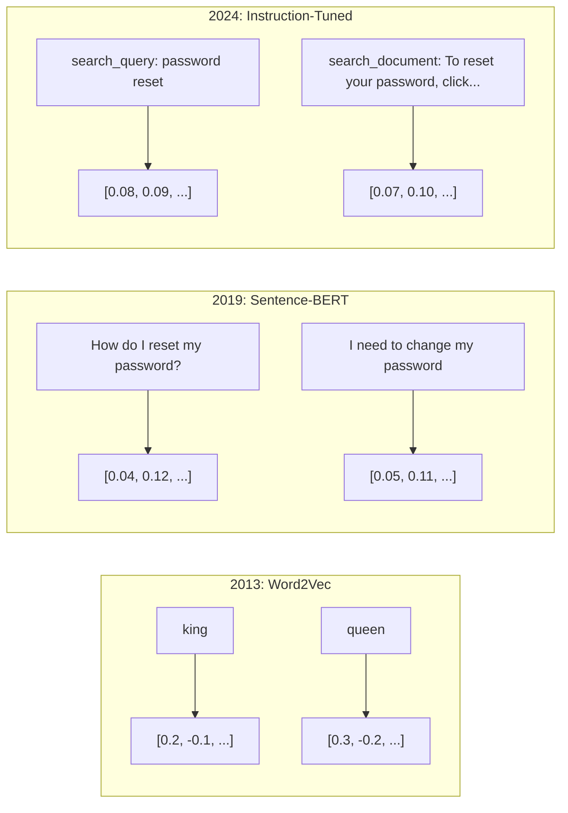
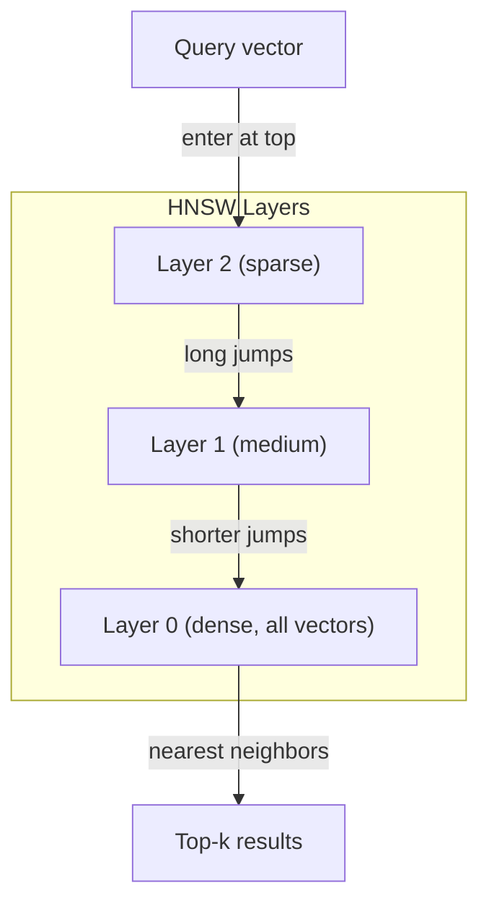
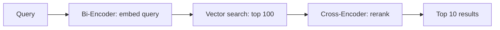

# 임베딩(Embeddings)과 벡터 표현

> 텍스트는 이산적이다. 수학은 연속적이다. LLM에게 "유사한" 문서를 찾거나, 의미를 비교하거나, 키워드 너머를 검색하라고 요청할 때마다 우리는 이 두 세계를 잇는 다리에 의존한다. 그 다리가 임베딩(embedding)이다. 임베딩을 이해하지 못하면 현대 AI를 이해하는 게 아니라 그저 쓰는 것일 뿐이다.

**Type:** Build
**Languages:** Python
**Prerequisites:** Phase 11, Lesson 01 (Prompt Engineering)
**Time:** ~75분
**Related:** Phase 5 · 22 (Embedding Models Deep Dive)는 밀집(dense) vs 희소(sparse) vs 다중 벡터, 마트료시카(Matryoshka) 절단, 축별 모델 선택을 다룬다. 이 레슨은 프로덕션 파이프라인(벡터 DB, HNSW, 유사도 수학)에 초점을 둔다. 모델을 고르기 전에 Phase 5 · 22를 읽어라.

## 학습 목표 (Learning Objectives)

- API 프로바이더와 오픈소스 모델을 사용해 텍스트 임베딩을 생성하고, 그것들 사이의 코사인 유사도(cosine similarity)를 계산하기
- 임베딩이 키워드 검색이 처리할 수 없는 어휘 불일치(vocabulary mismatch) 문제를 어떻게 해결하는지 설명하기
- 정확한 키워드 매칭이 아니라 의미로 문서를 검색하는 의미 검색(semantic search) 인덱스 만들기
- 검색 벤치마크(benchmark)(precision@k, recall)를 사용해 임베딩 품질을 평가하고, 작업에 맞는 임베딩 모델 고르기

## 문제 (The Problem)

지원 티켓이 10,000개 있다고 하자. 한 고객이 "my payment didn't go through"라고 쓴다. 이때 유사한 과거 티켓을 찾아야 한다. 키워드 검색은 "payment"와 "didn't go through"를 포함하는 티켓을 찾지만, "transaction failed", "charge was declined", "billing error"는 놓친다. 이 티켓들은 완전히 다른 단어로 정확히 같은 문제를 묘사한다.

이것이 어휘 불일치 문제다. 인간 언어에는 같은 것을 말하는 수십 가지 방법이 있다. 키워드 검색은 각 단어를 의미 없는 독립적 기호로 취급하므로, "declined"와 "didn't go through"가 같은 개념을 가리킨다는 것을 알지 못한다.

필요한 것은 철자가 아니라 의미가 유사도를 결정하는 텍스트 표현이다. "my payment didn't go through"와 "transaction was declined"를 어떤 수학적 공간에서 가까이 두면서, "payment"라는 단어를 공유함에도 "my payment arrived on time"은 멀리 밀어내는 방법이 필요하다.

그 표현이 임베딩이다.

## 개념 (The Concept)

### 임베딩이란 무엇인가? (What Is an Embedding?)

임베딩은 텍스트의 의미를 나타내는 부동소수점 숫자의 밀집 벡터(dense vector)다. "밀집"이라는 단어가 중요하다 — 대부분의 차원이 0인 희소 표현(bag-of-words, TF-IDF)과 달리, 모든 차원이 정보를 담는다.

"The cat sat on the mat"은 `[0.023, -0.041, 0.087, ..., 0.012]` 같은 것이 된다 — 모델에 따라 768개에서 3072개의 숫자 목록이다. 이 숫자들은 의미를 부호화한다. 직접 들여다보는 대상이 아니라 서로 비교하는 대상이다.

### Word2Vec의 돌파구 (The Word2Vec Breakthrough)

2013년, Google의 Tomas Mikolov와 동료들은 Word2Vec을 발표했다. 핵심 통찰: 단어를 그 이웃들로부터(또는 이웃들을 한 단어로부터) 예측하도록 신경망(neural network)을 학습시키면, 은닉층(hidden layer) 가중치(weight)가 의미 있는 벡터 표현이 된다.

그 유명한 결과:

```
king - man + woman = queen
```

단어 임베딩에 대한 벡터 산술이 의미적 관계를 포착한다. "man"에서 "woman"으로의 방향은 "king"에서 "queen"으로의 방향과 거의 같다. 이것이 이 분야가 기하학이 의미를 부호화할 수 있다는 것을 깨달은 순간이었다.

Word2Vec은 300차원 벡터를 만들었다. 각 단어는 맥락과 무관하게 하나의 벡터를 얻었다. "river bank"의 "Bank"와 "bank account"의 "bank"는 같은 임베딩을 가졌다. 이 한계가 다음 10년의 연구를 이끌었다.

### 단어에서 문장으로 (From Words to Sentences)

단어 임베딩은 단일 토큰(token)을 나타낸다. 프로덕션 시스템은 전체 문장, 문단, 또는 문서를 임베딩해야 한다. 네 가지 접근법이 등장했다:

**평균(Averaging)**: 문장의 모든 단어 벡터의 평균을 취한다. 저렴하고, 손실이 있으며, 짧은 텍스트에는 놀랍도록 괜찮다. 단어 순서를 완전히 잃는다 — "dog bites man"과 "man bites dog"는 동일한 임베딩을 얻는다.

**CLS 토큰(CLS token)**: 트랜스포머(transformer) 모델(BERT, 2018)은 전체 입력을 나타내는 특수 [CLS] 토큰 임베딩을 출력한다. 평균보다 낫지만 [CLS] 토큰은 유사도가 아니라 다음 문장 예측을 위해 학습되었다.

**대조 학습(Contrastive learning)**: 유사한 쌍을 함께 밀고 비유사한 쌍을 떨어뜨리도록 모델을 명시적으로 학습시킨다. Sentence-BERT(Reimers & Gurevych, 2019)는 이 접근법을 사용했고 현대 임베딩 모델의 기초가 되었다. "How do I reset my password?"와 "I need to change my password"가 주어지면, 모델은 이것들이 거의 동일한 벡터를 가져야 한다는 것을 학습한다.

**지시 튜닝 임베딩(Instruction-tuned embeddings)**: 최신 접근법. E5와 GTE 같은 모델은 모델에게 어떤 종류의 임베딩을 만들어야 하는지 알려주는 작업 접두사("search_query:", "search_document:")를 받는다. 이것은 하나의 모델이 여러 작업을 처리하게 해준다.



### 현대 임베딩 모델 (Modern Embedding Models)

시장은 소수의 프로덕션급 옵션으로 정착했다(2026년 초 기준 MTEB 점수, MTEB v2):

| Model | Provider | Dimensions | MTEB | Context | Cost / 1M tokens |
|-------|----------|-----------|------|---------|------------------|
| Gemini Embedding 2 | Google | 3072 (Matryoshka) | 67.7 (retrieval) | 8192 | $0.15 |
| embed-v4 | Cohere | 1024 (Matryoshka) | 65.2 | 128K | $0.12 |
| voyage-4 | Voyage AI | 1024/2048 (Matryoshka) | 66.8 | 32K | $0.12 |
| text-embedding-3-large | OpenAI | 3072 (Matryoshka) | 64.6 | 8192 | $0.13 |
| text-embedding-3-small | OpenAI | 1536 (Matryoshka) | 62.3 | 8192 | $0.02 |
| BGE-M3 | BAAI | 1024 (dense+sparse+ColBERT) | 63.0 multilingual | 8192 | Open-weight |
| Qwen3-Embedding | Alibaba | 4096 (Matryoshka) | 66.9 | 32K | Open-weight |
| Nomic-embed-v2 | Nomic | 768 (Matryoshka) | 63.1 | 8192 | Open-weight |

MTEB(Massive Text Embedding Benchmark) v2는 검색, 분류, 클러스터링, 재순위화, 요약에 걸친 100개 이상의 작업을 포괄한다. 높을수록 좋다. 2026년까지 오픈웨이트 모델(Qwen3-Embedding, BGE-M3)은 대부분의 축에서 비공개 호스팅 모델과 대등하거나 능가한다. Gemini Embedding 2는 순수 검색에서 선두이고, Voyage/Cohere는 특정 도메인(금융, 법률, 코드)에서 선두다. 무언가를 확정하기 전에 항상 자신의 실제 쿼리로 직접 벤치마크하라.

### 유사도 지표 (Similarity Metrics)

두 임베딩 벡터가 주어지면, 그것들이 얼마나 유사한지 측정하는 세 가지 방법:

**코사인 유사도(Cosine similarity)**: 두 벡터 사이 각도의 코사인. -1(반대)에서 1(동일한 방향)까지 범위. 크기를 무시한다 — 10단어 문장과 500단어 문서가 같은 방향을 가리키면 1.0이 나온다. 사용 사례의 90%에서 기본으로 쓰는 지표다.

```
cosine_sim(a, b) = dot(a, b) / (||a|| * ||b||)
```

**내적(Dot product)**: 두 벡터의 원시 내적. 벡터가 정규화(단위 길이)되면 코사인 유사도와 동일하다. 계산이 더 빠르다. OpenAI의 임베딩은 정규화되어 있어, 내적과 코사인이 같은 순위를 준다.

```
dot(a, b) = sum(a_i * b_i)
```

**유클리드(L2) 거리(Euclidean (L2) distance)**: 벡터 공간에서의 직선 거리. 작을수록 = 더 유사. 크기 차이에 민감하다. 방향만이 아니라 공간에서의 절대 위치가 중요할 때 사용한다.

```
L2(a, b) = sqrt(sum((a_i - b_i)^2))
```

언제 어느 것을 쓸지:

| 지표 | 사용할 때 | 피할 때 |
|--------|----------|------------|
| 코사인 유사도 | 길이가 다른 텍스트 비교; 대부분의 검색 작업 | 크기가 정보를 담을 때 |
| 내적 | 임베딩이 이미 정규화됨; 최대 속도 | 벡터의 크기가 다양할 때 |
| 유클리드 거리 | 클러스터링; 공간적 최근접 이웃 문제 | 길이가 크게 다른 문서 비교 |

### 벡터 데이터베이스와 HNSW (Vector Databases and HNSW)

무차별(brute-force) 유사도 검색은 쿼리를 저장된 모든 벡터와 비교한다. 1536차원의 벡터 100만 개에서, 그것은 쿼리당 15억 번의 곱셈-덧셈 연산이다. 너무 느리다.

벡터 데이터베이스는 근사 최근접 이웃(Approximate Nearest Neighbor, ANN) 알고리즘으로 이를 해결한다. 지배적인 알고리즘은 HNSW(Hierarchical Navigable Small World)다:

1. 벡터의 다층 그래프를 만든다
2. 상위 층은 희소하다 — 멀리 떨어진 클러스터 사이의 장거리 연결
3. 하위 층은 밀집하다 — 가까운 벡터 사이의 세밀한 연결
4. 검색은 상위 층에서 시작해, 탐욕적으로 내려가며 정제한다
5. O(n) 대신 O(log n) 시간에 근사 top-k 결과를 반환한다

HNSW는 작은 정확도 손실(보통 95-99% 재현율)을 거대한 속도 향상과 맞바꾼다. 1천만 개 벡터에서, 무차별은 수 초가 걸린다. HNSW는 수 밀리초가 걸린다.



프로덕션 옵션:

| Database | Type | Best for | Max scale |
|----------|------|----------|-----------|
| Pinecone | Managed SaaS | Zero-ops production | Billions |
| Weaviate | Open source | Self-hosted, hybrid search | 100M+ |
| Qdrant | Open source | High performance, filtering | 100M+ |
| ChromaDB | Embedded | Prototyping, local dev | 1M |
| pgvector | Postgres extension | Already using Postgres | 10M |
| FAISS | Library | In-process, research | 1B+ |

### 청킹 전략 (Chunking Strategies)

문서는 단일 벡터로 임베딩하기에는 너무 길다. 50페이지 PDF는 수십 개의 주제를 다룬다 — 그 임베딩은 모든 것의 평균이 되어, 어떤 특정한 것과도 유사하지 않다. 문서를 청크(chunk)로 나누고 각각을 임베딩한다.

**고정 크기 청킹(Fixed-size chunking)**: M 토큰 겹침으로 매 N 토큰마다 나눈다. 단순하고 예측 가능하다. 문서에 명확한 구조가 없을 때 잘 작동한다. 50 토큰 겹침을 가진 512 토큰 청크: 청크 1은 토큰 0-511, 청크 2는 토큰 462-973이다.

**문장 기반 청킹(Sentence-based chunking)**: 문장 경계에서 나누며, 토큰 한도에 도달할 때까지 문장을 묶는다. 각 청크는 적어도 하나의 완전한 문장이다. 생각을 반으로 자르지 않기 때문에 고정 크기보다 낫다.

**재귀 청킹(Recursive chunking)**: 먼저 가장 큰 경계(섹션 헤더)에서 나누려 한다. 여전히 너무 크면 문단 경계를 시도한다. 그다음 문장 경계. 그다음 글자 한도. 이것이 LangChain의 `RecursiveCharacterTextSplitter`이며 혼합 형식 말뭉치에 잘 작동한다.

**의미 청킹(Semantic chunking)**: 각 문장을 임베딩한 다음, 임베딩이 유사한 연속 문장을 묶는다. 임베딩 유사도가 임계값 아래로 떨어지면 새 청크를 시작한다. 비싸지만(모든 문장을 개별적으로 임베딩해야 함) 가장 일관된 청크를 만든다.

| 전략 | 복잡도 | 품질 | 적합한 용도 |
|----------|-----------|---------|----------|
| Fixed-size | Low | Decent | 비구조화 텍스트, 로그 |
| Sentence-based | Low | Good | 기사, 이메일 |
| Recursive | Medium | Good | Markdown, HTML, 혼합 문서 |
| Semantic | High | Best | 결정적인 검색 품질 |

대부분의 시스템에서 최적 지점: 50 토큰 겹침을 가진 256-512 토큰 청크.

### 바이 인코더 vs 크로스 인코더 (Bi-Encoders vs Cross-Encoders)

바이 인코더(bi-encoder)는 쿼리와 문서를 독립적으로 임베딩한 다음 벡터를 비교한다. 빠르다 — 쿼리를 한 번 임베딩하고 미리 계산된 문서 임베딩과 비교한다. 이것이 검색에 사용하는 것이다.

크로스 인코더(cross-encoder)는 쿼리와 문서를 단일 입력으로 받아 관련성 점수를 출력한다. 느리다 — 각 쿼리-문서 쌍을 전체 모델로 처리한다. 그러나 쿼리와 문서 토큰에 동시에 어텐션할 수 있어 훨씬 더 정확하다.

프로덕션 패턴: 바이 인코더가 top-100 후보를 검색하고, 크로스 인코더가 그것들을 top-10으로 재순위화한다. 이것이 검색-후-재순위화(retrieve-then-rerank) 파이프라인이다.



재순위화 모델: Cohere Rerank 3.5(쿼리 1000건당 $2), BGE-reranker-v2(무료, 오픈소스), Jina Reranker v2(무료, 오픈소스).

### 마트료시카 임베딩 (Matryoshka Embeddings)

전통적인 임베딩은 전부 아니면 전무다. 1536차원 벡터는 1536개의 float를 사용한다. 재학습 없이는 256차원으로 절단할 수 없다.

마트료시카 표현 학습(Matryoshka Representation Learning, Kusupati et al., 2022)이 이를 고친다. 모델은 첫 N개 차원이 가장 중요한 정보를 포착하도록 학습된다, 러시아 인형처럼. 1536차원 마트료시카 임베딩을 256차원으로 절단하면 약간의 정확도를 잃지만 여전히 기능한다.

OpenAI의 text-embedding-3-small과 text-embedding-3-large는 `dimensions` 파라미터를 통해 마트료시카 절단을 지원한다. 1536 대신 256차원을 요청하면 저장 공간이 6배 줄어들고 MTEB 벤치마크에서 약 3-5%의 정확도 손실이 있다.

### 이진 양자화 (Binary Quantization)

float32로 저장된 1536차원 임베딩은 6,144바이트를 사용한다. 1천만 문서를 곱하라: 벡터만으로 61 GB.

이진 양자화(binary quantization)는 각 float를 단일 비트로 변환한다. 양수 값은 1이 되고 음수 값은 0이 된다. 저장 공간이 6,144바이트에서 192바이트로 줄어든다 — 32배 감소. 유사도는 해밍 거리(Hamming distance, 다른 비트 수 세기)를 사용해 계산되며, CPU는 이를 단일 명령으로 할 수 있다.

정확도 타격은 검색 재현율에서 약 5-10%다. 흔한 패턴: 수백만 벡터에 대한 1차 검색에는 이진 양자화를, 그다음 top-1000을 완전 정밀도 벡터로 재채점한다. 이것은 32배 적은 메모리로 완전 정밀도 정확도의 95% 이상을 얻게 해준다.

## 직접 만들기 (Build It)

우리는 의미 검색 엔진을 밑바닥부터 만든다. 벡터 데이터베이스 없음. 외부 임베딩 API 없음. 수학에는 numpy를 쓴 순수 Python.

### 1단계: 텍스트 청킹

```python
def chunk_text(text, chunk_size=200, overlap=50):
    words = text.split()
    chunks = []
    start = 0
    while start < len(words):
        end = start + chunk_size
        chunk = " ".join(words[start:end])
        chunks.append(chunk)
        start += chunk_size - overlap
    return chunks


def chunk_by_sentences(text, max_chunk_tokens=200):
    sentences = text.replace("\n", " ").split(".")
    sentences = [s.strip() + "." for s in sentences if s.strip()]
    chunks = []
    current_chunk = []
    current_length = 0
    for sentence in sentences:
        sentence_length = len(sentence.split())
        if current_length + sentence_length > max_chunk_tokens and current_chunk:
            chunks.append(" ".join(current_chunk))
            current_chunk = []
            current_length = 0
        current_chunk.append(sentence)
        current_length += sentence_length
    if current_chunk:
        chunks.append(" ".join(current_chunk))
    return chunks
```

### 2단계: 밑바닥부터 임베딩 만들기

우리는 L2 정규화를 사용한 TF-IDF로 단순한 밀집 임베딩을 구현한다. 이것은 신경망 임베딩이 아니지만, 같은 계약을 따른다: 텍스트 입력, 고정 크기 벡터 출력, 유사한 텍스트는 유사한 벡터를 만든다.

```python
import math
import numpy as np
from collections import Counter

class SimpleEmbedder:
    def __init__(self):
        self.vocab = []
        self.idf = []
        self.word_to_idx = {}

    def fit(self, documents):
        vocab_set = set()
        for doc in documents:
            vocab_set.update(doc.lower().split())
        self.vocab = sorted(vocab_set)
        self.word_to_idx = {w: i for i, w in enumerate(self.vocab)}
        n = len(documents)
        self.idf = np.zeros(len(self.vocab))
        for i, word in enumerate(self.vocab):
            doc_count = sum(1 for doc in documents if word in doc.lower().split())
            self.idf[i] = math.log((n + 1) / (doc_count + 1)) + 1

    def embed(self, text):
        words = text.lower().split()
        count = Counter(words)
        total = len(words) if words else 1
        vec = np.zeros(len(self.vocab))
        for word, freq in count.items():
            if word in self.word_to_idx:
                tf = freq / total
                vec[self.word_to_idx[word]] = tf * self.idf[self.word_to_idx[word]]
        norm = np.linalg.norm(vec)
        if norm > 0:
            vec = vec / norm
        return vec
```

### 3단계: 유사도 함수

```python
def cosine_similarity(a, b):
    dot = np.dot(a, b)
    norm_a = np.linalg.norm(a)
    norm_b = np.linalg.norm(b)
    if norm_a == 0 or norm_b == 0:
        return 0.0
    return float(dot / (norm_a * norm_b))


def dot_product(a, b):
    return float(np.dot(a, b))


def euclidean_distance(a, b):
    return float(np.linalg.norm(a - b))
```

### 4단계: 무차별 검색을 가진 벡터 인덱스

```python
class VectorIndex:
    def __init__(self):
        self.vectors = []
        self.texts = []
        self.metadata = []

    def add(self, vector, text, meta=None):
        self.vectors.append(vector)
        self.texts.append(text)
        self.metadata.append(meta or {})

    def search(self, query_vector, top_k=5, metric="cosine"):
        scores = []
        for i, vec in enumerate(self.vectors):
            if metric == "cosine":
                score = cosine_similarity(query_vector, vec)
            elif metric == "dot":
                score = dot_product(query_vector, vec)
            elif metric == "euclidean":
                score = -euclidean_distance(query_vector, vec)
            else:
                raise ValueError(f"Unknown metric: {metric}")
            scores.append((i, score))
        scores.sort(key=lambda x: x[1], reverse=True)
        results = []
        for idx, score in scores[:top_k]:
            results.append({
                "text": self.texts[idx],
                "score": score,
                "metadata": self.metadata[idx],
                "index": idx
            })
        return results

    def size(self):
        return len(self.vectors)
```

### 5단계: 의미 검색 엔진

```python
class SemanticSearchEngine:
    def __init__(self, chunk_size=200, overlap=50):
        self.embedder = SimpleEmbedder()
        self.index = VectorIndex()
        self.chunk_size = chunk_size
        self.overlap = overlap

    def index_documents(self, documents, source_names=None):
        all_chunks = []
        all_sources = []
        for i, doc in enumerate(documents):
            chunks = chunk_text(doc, self.chunk_size, self.overlap)
            all_chunks.extend(chunks)
            name = source_names[i] if source_names else f"doc_{i}"
            all_sources.extend([name] * len(chunks))
        self.embedder.fit(all_chunks)
        for chunk, source in zip(all_chunks, all_sources):
            vec = self.embedder.embed(chunk)
            self.index.add(vec, chunk, {"source": source})
        return len(all_chunks)

    def search(self, query, top_k=5, metric="cosine"):
        query_vec = self.embedder.embed(query)
        return self.index.search(query_vec, top_k, metric)

    def search_with_scores(self, query, top_k=5):
        results = self.search(query, top_k)
        return [
            {
                "text": r["text"][:200],
                "source": r["metadata"].get("source", "unknown"),
                "score": round(r["score"], 4)
            }
            for r in results
        ]
```

### 6단계: 유사도 지표 비교

```python
def compare_metrics(engine, query, top_k=3):
    results = {}
    for metric in ["cosine", "dot", "euclidean"]:
        hits = engine.search(query, top_k=top_k, metric=metric)
        results[metric] = [
            {"score": round(h["score"], 4), "preview": h["text"][:80]}
            for h in hits
        ]
    return results
```

## 라이브러리로 써보기 (Use It)

프로덕션 임베딩 API를 쓰면 아키텍처는 동일하게 유지된다. 임베더만 바뀐다:

```python
from openai import OpenAI

client = OpenAI()

def openai_embed(texts, model="text-embedding-3-small", dimensions=None):
    kwargs = {"model": model, "input": texts}
    if dimensions:
        kwargs["dimensions"] = dimensions
    response = client.embeddings.create(**kwargs)
    return [item.embedding for item in response.data]
```

OpenAI를 사용한 마트료시카 절단 -- 같은 모델, 더 적은 차원, 더 낮은 저장 공간:

```python
full = openai_embed(["semantic search query"], dimensions=1536)
compact = openai_embed(["semantic search query"], dimensions=256)
```

256차원 벡터는 6배 적은 저장 공간을 사용한다. 1천만 문서라면 10 GB 대 61 GB의 차이다. 정확도 손실은 표준 벤치마크에서 약 3-5%다.

Cohere를 사용한 재순위화:

```python
import cohere

co = cohere.ClientV2()

results = co.rerank(
    model="rerank-v3.5",
    query="What is the refund policy?",
    documents=["Full refund within 30 days...", "No refunds after 90 days..."],
    top_n=3
)
```

API 의존성 없는 로컬 임베딩:

```python
from sentence_transformers import SentenceTransformer

model = SentenceTransformer("BAAI/bge-small-en-v1.5")
embeddings = model.encode(["semantic search query", "another document"])
```

우리가 만든 VectorIndex 클래스는 이것들 중 어느 것과도 작동한다. 임베딩 함수만 교체하면 검색 로직은 그대로 둔 채로 쓸 수 있다.

## 산출물 (Ship It)

이 레슨은 다음을 만든다:
- `outputs/prompt-embedding-advisor.md` -- 특정 사용 사례에 맞는 임베딩 모델과 전략을 고르기 위한 프롬프트
- `outputs/skill-embedding-patterns.md` -- 에이전트에게 프로덕션에서 임베딩을 효과적으로 사용하는 법을 가르치는 스킬

## 연습 문제 (Exercises)

1. **지표 비교**: 같은 5개 쿼리를 코사인 유사도, 내적, 유클리드 거리를 사용해 샘플 문서에 대해 실행하라. 각각의 top-3 결과를 기록하라. 어느 쿼리에서 지표들이 불일치하는가? 왜?

2. **청크 크기 실험**: 샘플 문서를 50, 100, 200, 500 단어의 청크 크기로 인덱싱하라. 각각에 대해 5개 쿼리를 실행하고 top-1 유사도 점수를 기록하라. 청크 크기와 검색 품질의 관계를 그래프로 그려라. 더 큰 청크가 해를 끼치기 시작하는 지점을 찾아라.

3. **마트료시카 시뮬레이션**: 500차원 벡터를 만드는 SimpleEmbedder를 만들라. 50, 100, 200, 500차원으로 절단하라. 각 절단에서 검색 재현율이 어떻게 저하되는지 측정하라. 이것은 실제 학습 트릭 없이 마트료시카 동작을 시뮬레이션한다.

4. **이진 양자화**: 검색 엔진의 임베딩을 가져와, 이진으로 변환하고(양수면 1, 음수면 0), 해밍 거리 검색을 구현하라. top-10 결과를 완전 정밀도 코사인 유사도와 비교하라. 겹침 비율을 측정하라.

5. **문장 기반 청킹**: 고정 크기 청킹을 `chunk_by_sentences`로 교체하라. 같은 쿼리를 실행하고 검색 점수를 비교하라. 문장 경계를 존중하는 것이 결과를 개선하는가?

## 핵심 용어 (Key Terms)

| 용어 | 사람들이 말하는 것 | 실제 의미 |
|------|----------------|----------------------|
| 임베딩(Embedding) | "텍스트를 숫자로" | 기하학적 근접성이 의미적 유사도를 부호화하는 밀집 벡터 |
| Word2Vec | "원조 임베딩" | 맥락 단어를 예측해 단어 벡터를 학습한 2013년 모델; 벡터 산술이 의미를 부호화함을 증명 |
| 코사인 유사도(Cosine similarity) | "두 벡터가 얼마나 유사한가" | 벡터 사이 각도의 코사인; 1 = 동일한 방향, 0 = 직교, -1 = 반대 |
| HNSW | "빠른 벡터 검색" | Hierarchical Navigable Small World 그래프 -- O(log n) 근사 최근접 이웃 검색을 가능하게 하는 다층 구조 |
| 바이 인코더(Bi-encoder) | "따로 임베딩하고, 빠르게 비교" | 쿼리와 문서를 독립적으로 벡터로 인코딩; 사전 계산과 빠른 검색을 가능하게 함 |
| 크로스 인코더(Cross-encoder) | "느리지만 정확한 재순위기" | 쿼리-문서 쌍을 전체 모델로 함께 처리; 더 높은 정확도, 사전 계산 없음 |
| 마트료시카 임베딩(Matryoshka embeddings) | "절단 가능한 벡터" | 첫 N개 차원이 가장 중요한 정보를 포착하도록 학습되어 가변 크기 저장을 가능하게 하는 임베딩 |
| 이진 양자화(Binary quantization) | "1비트 임베딩" | 해밍 거리 검색으로 32배 저장 공간 감소를 위해 float 벡터를 이진(부호 비트만)으로 변환 |
| 청킹(Chunking) | "임베딩을 위해 문서 나누기" | 각각이 독립적으로 임베딩되고 검색될 수 있도록 문서를 256-512 토큰 세그먼트로 쪼개기 |
| 벡터 데이터베이스(Vector database) | "임베딩을 위한 검색 엔진" | 벡터 저장과 대규모 근사 최근접 이웃 검색에 최적화된 데이터 저장소 |
| 대조 학습(Contrastive learning) | "비교로 학습" | 유사한 쌍 임베딩을 함께 밀고 비유사한 쌍 임베딩을 떨어뜨리는 학습 접근법 |
| MTEB | "임베딩 벤치마크" | Massive Text Embedding Benchmark -- 8개 작업에 걸친 56개 데이터셋; 임베딩 모델 비교의 표준 |

## 더 읽을거리 (Further Reading)

- Mikolov et al., "Efficient Estimation of Word Representations in Vector Space" (2013) -- king-queen 유추로 임베딩 혁명을 시작한 Word2Vec 논문
- Reimers & Gurevych, "Sentence-BERT: Sentence Embeddings using Siamese BERT-Networks" (2019) -- 문장 수준 유사도를 위해 바이 인코더를 학습시키는 방법, 현대 임베딩 모델의 기초
- Kusupati et al., "Matryoshka Representation Learning" (2022) -- OpenAI가 text-embedding-3에 채택한 가변 차원 임베딩 뒤의 기법
- Malkov & Yashunin, "Efficient and Robust Approximate Nearest Neighbor using Hierarchical Navigable Small World Graphs" (2018) -- HNSW 논문, 대부분의 프로덕션 벡터 검색 뒤의 알고리즘
- OpenAI Embeddings Guide (platform.openai.com/docs/guides/embeddings) -- 마트료시카 차원 축소를 포함한 text-embedding-3 모델의 실용 참조
- MTEB Leaderboard (huggingface.co/spaces/mteb/leaderboard) -- 작업과 언어에 걸쳐 모든 임베딩 모델을 비교하는 실시간 벤치마크
- [Muennighoff et al., "MTEB: Massive Text Embedding Benchmark" (EACL 2023)](https://arxiv.org/abs/2210.07316) -- 리더보드가 보고하는 8개 작업 범주(분류, 클러스터링, 쌍 분류, 재순위화, 검색, STS, 요약, 이중 텍스트 마이닝)를 정의하는 벤치마크; 단일 MTEB 점수를 신뢰하기 전에 읽어라.
- [Sentence Transformers documentation](https://www.sbert.net/) -- 바이 인코더 vs 크로스 인코더, 풀링 전략, 그리고 이 레슨이 구현하는 적재-분할-임베딩-저장 RAG 파이프라인에 대한 정전적 참조.
