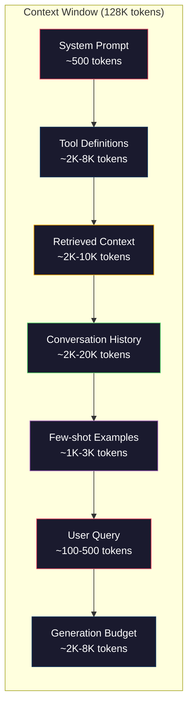
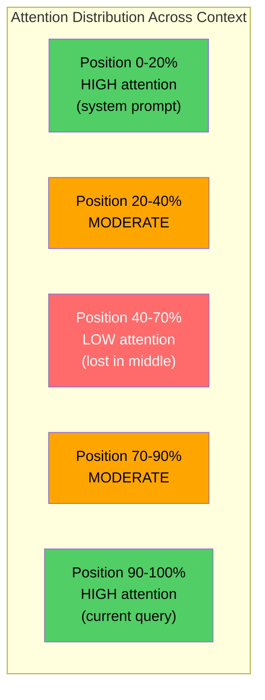
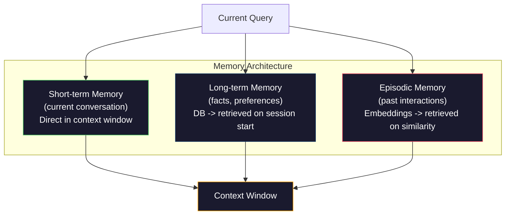

# 컨텍스트 엔지니어링(Context Engineering): 윈도우, 예산, 메모리, 검색

> 프롬프트 엔지니어링(prompt engineering)은 부분집합이다. 컨텍스트 엔지니어링(context engineering)이 게임 전체다. 프롬프트(prompt)는 사용자가 입력하는 문자열이다. 컨텍스트(context)는 모델(model)의 윈도우에 들어가는 모든 것이다: 시스템 지시, 검색된 문서, 도구 정의, 대화 이력, 퓨샷(few-shot) 예시, 그리고 프롬프트 자체. 2026년 최고의 AI 엔지니어는 컨텍스트 엔지니어다. 그들은 무엇이 들어가고, 무엇이 빠지고, 어떤 순서로 들어갈지를 결정한다.

**Type:** Build
**Languages:** Python
**Prerequisites:** Phase 10 (LLMs from Scratch), Phase 11 Lesson 01-02
**Time:** ~90분
**Related:** Phase 11 · 15 (Prompt Caching) — 캐시 친화적 레이아웃은 컨텍스트 엔지니어링의 확장이다. Phase 5 · 28 (Long-Context Evaluation) — NIAH/RULER로 중간에서 길 잃기를 측정하는 방법.

## 학습 목표 (Learning Objectives)

- 모든 컨텍스트 윈도우 구성 요소(시스템 프롬프트, 도구, 이력, 검색된 문서, 생성 여유분)에 걸쳐 토큰(token) 예산 계산하기
- 컨텍스트 윈도우 관리 전략 구현하기: 대화 이력에 대한 절단(truncation), 요약(summarization), 슬라이딩 윈도우(sliding window)
- 가장 관련 있는 정보에 모델의 어텐션(attention)을 최대화하기 위해 컨텍스트 구성 요소를 우선순위화하고 배치하기
- 쿼리 유형과 사용 가능한 윈도우 공간에 따라 토큰을 동적으로 할당하는 컨텍스트 조립기 만들기

## 문제 (The Problem)

Claude Opus 4.7은 200K 토큰 윈도우를 가진다(베타에서 1M). GPT-5는 400K를 가진다. Gemini 3 Pro는 2M을 가진다. Llama 4는 10M을 주장한다. 이 숫자들은 채우기 전까지는 거대하게 들린다.

여기 코딩 어시스턴트의 실제 분석이 있다. 시스템 프롬프트: 500토큰. 50개 도구를 위한 도구 정의: 8,000토큰. 검색된 문서: 4,000토큰. 대화 이력(10턴): 6,000토큰. 현재 사용자 쿼리: 200토큰. 생성 예산(최대 출력): 4,000토큰. 합계: 22,700토큰. 그것은 128K 윈도우의 18%에 불과하다.

그러나 어텐션은 컨텍스트 길이에 따라 선형으로 확장되지 않는다. 128K 토큰의 컨텍스트를 가진 모델은 이차 어텐션 비용을 치른다(바닐라 트랜스포머에서 O(n^2), 다만 대부분의 프로덕션 모델은 효율적인 어텐션 변형을 사용한다). 더 중요하게, 검색 정확도가 저하된다. "건초 더미 속 바늘(Needle in a Haystack)" 테스트는 모델이 긴 컨텍스트의 중간에 놓인 정보를 찾는 데 어려움을 겪는다는 것을 보여준다. Liu et al. (2023)의 연구는 LLM이 긴 컨텍스트의 시작과 끝에 있는 정보를 거의 완벽한 정확도로 검색하지만, 중간(컨텍스트의 40-70% 위치)에 놓인 정보에는 정확도가 10-20% 떨어진다는 것을 보였다. 이 "중간에서 길 잃기(lost-in-the-middle)" 효과는 모델마다 다르지만 현재의 모든 아키텍처에 영향을 준다.

실용적 교훈: 200K 토큰을 사용할 수 있다는 것이 200K 토큰을 쓰는 것이 효과적이라는 뜻은 아니다. 신중하게 선별된 10K 토큰 컨텍스트가 종종 마구잡이로 던져 넣은 100K 토큰 컨텍스트를 능가한다. 컨텍스트 엔지니어링은 컨텍스트 윈도우 내에서 신호 대 잡음비를 최대화하는 분야다.

윈도우에 넣는 모든 토큰은 더 관련 있는 정보를 담을 토큰을 밀어낸다. 모든 무관한 도구 정의, 모든 낡은 대화 턴, 질문에 답하지 않는 검색된 텍스트의 모든 청크 — 각각이 모델을 그 작업에서 조금씩 더 나쁘게 만든다.

## 개념 (The Concept)

### 컨텍스트 윈도우는 희소 자원이다 (The Context Window is a Scarce Resource)

컨텍스트 윈도우를 디스크가 아니라 RAM이라고 생각하라. 빠르고 직접 접근 가능하지만 제한되어 있다. 모든 것을 담을 수는 없다. 선택해야 한다.



각 구성 요소가 공간을 두고 경쟁한다. 도구 정의를 더 추가하면 대화 이력을 위한 공간이 줄어든다. 검색된 컨텍스트를 더 추가하면 퓨샷 예시를 위한 공간이 줄어든다. 컨텍스트 엔지니어링은 작업 성능을 최대화하기 위해 이 예산을 할당하는 기술이다.

### 중간에서 길 잃기 (Lost-in-the-Middle)

컨텍스트 엔지니어링에서 가장 중요한 경험적 발견이다. 모델은 컨텍스트의 시작과 끝에 있는 정보에 더 잘 어텐션한다. 중간에 있는 정보는 더 낮은 어텐션 점수를 받고 무시될 가능성이 더 높다.

Liu et al. (2023)은 이를 체계적으로 테스트했다. 그들은 관련 문서를 20개의 무관한 문서 사이 다양한 위치에 놓고 답변 정확도를 측정했다. 관련 문서가 처음이나 마지막일 때, 정확도는 85-90%였다. 중간(20개 중 10번째 위치)에 있을 때, 정확도는 60-70%로 떨어졌다.

이것은 직접적인 엔지니어링 함의를 갖는다:

- 가장 중요한 정보를 먼저 둔다(시스템 프롬프트, 결정적 지시)
- 현재 쿼리와 가장 관련 있는 컨텍스트를 마지막에 둔다(최신성 편향이 도움이 된다)
- 컨텍스트의 중간을 가장 낮은 우선순위 구역으로 취급한다
- 중간에 정보를 포함해야 한다면, 핵심을 끝에서 복제한다



### 컨텍스트 구성 요소 (Context Components)

**시스템 프롬프트(System prompt)**: 페르소나, 제약, 행동 규칙을 설정한다. 이것은 먼저 가고 턴 전반에 걸쳐 일정하게 유지된다. Claude Code는 도구 정의와 행동 지시를 포함해 시스템 프롬프트에 대략 6,000토큰을 사용한다. 빡빡하게 유지하라. 시스템 프롬프트의 모든 단어는 모든 API 호출마다 반복된다.

**도구 정의(Tool definitions)**: 각 도구는 50-200토큰(이름, 설명, 파라미터 스키마)을 더한다. 각 150토큰짜리 50개 도구는 어떤 대화가 일어나기도 전에 7,500토큰이다. 동적 도구 선택 — 현재 쿼리에 관련된 도구만 포함하는 것 — 은 이를 60-80% 줄일 수 있다.

**검색된 컨텍스트(Retrieved context)**: 벡터 데이터베이스의 문서, 검색 결과, 파일 내용. 검색의 품질이 응답의 품질을 직접 결정한다. 나쁜 검색은 검색이 없는 것보다 더 나쁘다. 윈도우를 잡음으로 채우고 모델을 엉뚱한 쪽으로 적극 인도하기 때문이다.

**대화 이력(Conversation history)**: 이전의 모든 사용자 메시지와 어시스턴트 응답. 대화 길이에 따라 선형으로 늘어난다. 턴당 200토큰의 50턴 대화는 10,000토큰의 이력이다. 그 대부분은 현재 쿼리와 무관하다.

**퓨샷 예시(Few-shot examples)**: 원하는 행동을 시연하는 입력/출력 쌍. 잘 선택된 두세 개의 예시가 종종 수천 토큰의 지시보다 출력 품질을 더 높인다. 다만 예시도 공간을 차지한다.

**생성 예산(Generation budget)**: 모델의 응답을 위해 예약된 토큰. 윈도우를 한계까지 채우면 모델은 답할 공간이 없다. 생성을 위해 적어도 2,000-4,000토큰을 예약하라.

### 컨텍스트 압축 전략 (Context Compression Strategies)

**이력 요약(History summarization)**: 모든 이전 턴을 그대로 유지하는 대신, 주기적으로 대화를 요약한다. 100토큰의 "We discussed X, decided Y, and the user wants Z"가 2,000토큰을 차지하던 10턴을 대체한다. 이력이 임계값(예: 5,000토큰)을 초과하면 요약을 실행한다.

**관련성 필터링(Relevance filtering)**: 각 검색된 문서를 현재 쿼리에 대해 채점하고 임계값 아래의 문서를 버린다. 10개 청크를 검색했는데 3개만 관련이 있다면, 나머지 7개를 버린다. 평범한 10개보다 매우 관련 있는 3개를 갖는 것이 낫다.

**도구 가지치기(Tool pruning)**: 사용자 쿼리의 의도를 분류하고 그 의도에 관련된 도구만 포함한다. 코드 질문은 캘린더 도구가 필요 없다. 일정 질문은 파일 시스템 도구가 필요 없다. 이것은 도구 정의를 8,000토큰에서 1,000토큰으로 줄일 수 있다.

**재귀 요약(Recursive summarization)**: 매우 긴 문서의 경우, 단계적으로 요약한다. 먼저 각 섹션을 요약한 다음, 요약들을 요약한다. 50페이지 문서가 핵심을 포착하는 500토큰 요약이 된다.

### 메모리 시스템 (Memory Systems)

컨텍스트 엔지니어링은 세 가지 시간 지평을 아우른다.

**단기 메모리(Short-term memory)**: 현재 대화. 컨텍스트 윈도우에 직접 저장된다. 각 턴마다 늘어난다. 요약과 절단으로 관리된다.

**장기 메모리(Long-term memory)**: 대화 전반에 걸쳐 지속되는 사실과 선호. "사용자는 TypeScript를 선호한다." "프로젝트는 PostgreSQL을 사용한다." 데이터베이스에 저장되고, 세션 시작 시 검색된다. Claude Code는 이것을 CLAUDE.md 파일에 저장한다. ChatGPT는 자체 메모리 기능에 저장한다.

**일화 메모리(Episodic memory)**: 관련될 수 있는 특정 과거 상호작용. "지난 화요일, 우리는 auth 모듈에서 비슷한 문제를 디버깅했다." 임베딩(embedding)으로 저장되고, 현재 대화가 과거 일화와 일치할 때 검색된다.



### 동적 컨텍스트 조립 (Dynamic Context Assembly)

핵심 통찰: 다른 쿼리는 다른 컨텍스트가 필요하다. 정적 시스템 프롬프트 + 정적 도구 + 정적 이력은 낭비다. 최고의 시스템은 쿼리마다 컨텍스트를 동적으로 조립한다.

1. 쿼리 의도를 분류한다
2. 관련 도구를 선택한다(모든 도구가 아니라)
3. 관련 문서를 검색한다(고정된 집합이 아니라)
4. 관련 이력 턴을 포함한다(모든 이력이 아니라)
5. 작업 유형에 맞는 퓨샷 예시를 추가한다
6. 모든 것을 중요도로 배치한다: 결정적인 것 먼저, 중요한 것 마지막, 선택적인 것 중간에

이것이 좋은 AI 애플리케이션과 위대한 애플리케이션을 가른다. 모델은 같다. 컨텍스트가 차별화 요소다.

## 직접 만들기 (Build It)

### 1단계: 토큰 카운터

측정할 수 없는 것을 예산화할 수 없다. 단순한 토큰 카운터를 만든다(정확한 개수는 토크나이저[tokenizer]에 따라 다르므로, 공백 분할을 사용한 근사).

```python
import json
import numpy as np
from collections import OrderedDict

def count_tokens(text):
    if not text:
        return 0
    return int(len(text.split()) * 1.3)

def count_tokens_json(obj):
    return count_tokens(json.dumps(obj))
```

### 2단계: 컨텍스트 예산 관리자

핵심 추상화. 예산 관리자는 각 구성 요소가 사용하는 토큰 수를 추적하고 한도를 강제한다.

```python
class ContextBudget:
    def __init__(self, max_tokens=128000, generation_reserve=4000):
        self.max_tokens = max_tokens
        self.generation_reserve = generation_reserve
        self.available = max_tokens - generation_reserve
        self.allocations = OrderedDict()

    def allocate(self, component, content, max_tokens=None):
        tokens = count_tokens(content)
        if max_tokens and tokens > max_tokens:
            words = content.split()
            target_words = int(max_tokens / 1.3)
            content = " ".join(words[:target_words])
            tokens = count_tokens(content)

        used = sum(self.allocations.values())
        if used + tokens > self.available:
            allowed = self.available - used
            if allowed <= 0:
                return None, 0
            words = content.split()
            target_words = int(allowed / 1.3)
            content = " ".join(words[:target_words])
            tokens = count_tokens(content)

        self.allocations[component] = tokens
        return content, tokens

    def remaining(self):
        used = sum(self.allocations.values())
        return self.available - used

    def utilization(self):
        used = sum(self.allocations.values())
        return used / self.max_tokens

    def report(self):
        total_used = sum(self.allocations.values())
        lines = []
        lines.append(f"Context Budget Report ({self.max_tokens:,} token window)")
        lines.append("-" * 50)
        for component, tokens in self.allocations.items():
            pct = tokens / self.max_tokens * 100
            bar = "#" * int(pct / 2)
            lines.append(f"  {component:<25} {tokens:>6} tokens ({pct:>5.1f}%) {bar}")
        lines.append("-" * 50)
        lines.append(f"  {'Used':<25} {total_used:>6} tokens ({total_used/self.max_tokens*100:.1f}%)")
        lines.append(f"  {'Generation reserve':<25} {self.generation_reserve:>6} tokens")
        lines.append(f"  {'Remaining':<25} {self.remaining():>6} tokens")
        return "\n".join(lines)
```

### 3단계: 중간에서 길 잃기 재배치

재배치 전략을 구현한다: 가장 중요한 항목은 처음과 마지막에, 가장 덜 중요한 것은 중간에 간다.

```python
def reorder_lost_in_middle(items, scores):
    paired = sorted(zip(scores, items), reverse=True)
    sorted_items = [item for _, item in paired]

    if len(sorted_items) <= 2:
        return sorted_items

    first_half = sorted_items[::2]
    second_half = sorted_items[1::2]
    second_half.reverse()

    return first_half + second_half

def score_relevance(query, documents):
    query_words = set(query.lower().split())
    scores = []
    for doc in documents:
        doc_words = set(doc.lower().split())
        if not query_words:
            scores.append(0.0)
            continue
        overlap = len(query_words & doc_words) / len(query_words)
        scores.append(round(overlap, 3))
    return scores
```

### 4단계: 대화 이력 압축기

토큰 예산을 되찾기 위해 오래된 대화 턴을 요약한다.

```python
class ConversationManager:
    def __init__(self, max_history_tokens=5000):
        self.turns = []
        self.summaries = []
        self.max_history_tokens = max_history_tokens

    def add_turn(self, role, content):
        self.turns.append({"role": role, "content": content})
        self._compress_if_needed()

    def _compress_if_needed(self):
        total = sum(count_tokens(t["content"]) for t in self.turns)
        if total <= self.max_history_tokens:
            return

        while total > self.max_history_tokens and len(self.turns) > 4:
            old_turns = self.turns[:2]
            summary = self._summarize_turns(old_turns)
            self.summaries.append(summary)
            self.turns = self.turns[2:]
            total = sum(count_tokens(t["content"]) for t in self.turns)

    def _summarize_turns(self, turns):
        parts = []
        for t in turns:
            content = t["content"]
            if len(content) > 100:
                content = content[:100] + "..."
            parts.append(f"{t['role']}: {content}")
        return "Previous: " + " | ".join(parts)

    def get_context(self):
        parts = []
        if self.summaries:
            parts.append("[Conversation Summary]")
            for s in self.summaries:
                parts.append(s)
        parts.append("[Recent Conversation]")
        for t in self.turns:
            parts.append(f"{t['role']}: {t['content']}")
        return "\n".join(parts)

    def token_count(self):
        return count_tokens(self.get_context())
```

### 5단계: 동적 도구 선택기

현재 쿼리에 관련된 도구만 포함한다. 의도를 분류한 다음, 필터링한다.

```python
TOOL_REGISTRY = {
    "read_file": {
        "description": "Read contents of a file",
        "tokens": 120,
        "categories": ["code", "files"],
    },
    "write_file": {
        "description": "Write content to a file",
        "tokens": 150,
        "categories": ["code", "files"],
    },
    "search_code": {
        "description": "Search for patterns in codebase",
        "tokens": 130,
        "categories": ["code"],
    },
    "run_command": {
        "description": "Execute a shell command",
        "tokens": 140,
        "categories": ["code", "system"],
    },
    "create_calendar_event": {
        "description": "Create a new calendar event",
        "tokens": 180,
        "categories": ["calendar"],
    },
    "list_emails": {
        "description": "List recent emails",
        "tokens": 160,
        "categories": ["email"],
    },
    "send_email": {
        "description": "Send an email message",
        "tokens": 200,
        "categories": ["email"],
    },
    "web_search": {
        "description": "Search the web for information",
        "tokens": 140,
        "categories": ["research"],
    },
    "query_database": {
        "description": "Run a SQL query on the database",
        "tokens": 170,
        "categories": ["code", "data"],
    },
    "generate_chart": {
        "description": "Generate a chart from data",
        "tokens": 190,
        "categories": ["data", "visualization"],
    },
}

def classify_intent(query):
    query_lower = query.lower()

    intent_keywords = {
        "code": ["code", "function", "bug", "error", "file", "implement", "refactor", "debug", "test"],
        "calendar": ["meeting", "schedule", "calendar", "appointment", "event"],
        "email": ["email", "mail", "send", "inbox", "message"],
        "research": ["search", "find", "what is", "how does", "explain", "look up"],
        "data": ["data", "query", "database", "chart", "graph", "analytics", "sql"],
    }

    scores = {}
    for intent, keywords in intent_keywords.items():
        score = sum(1 for kw in keywords if kw in query_lower)
        if score > 0:
            scores[intent] = score

    if not scores:
        return ["code"]

    max_score = max(scores.values())
    return [intent for intent, score in scores.items() if score >= max_score * 0.5]

def select_tools(query, token_budget=2000):
    intents = classify_intent(query)
    relevant = {}
    total_tokens = 0

    for name, tool in TOOL_REGISTRY.items():
        if any(cat in intents for cat in tool["categories"]):
            if total_tokens + tool["tokens"] <= token_budget:
                relevant[name] = tool
                total_tokens += tool["tokens"]

    return relevant, total_tokens
```

### 6단계: 전체 컨텍스트 조립 파이프라인

모든 것을 연결한다. 쿼리가 주어지면, 최적 컨텍스트를 동적으로 조립한다.

```python
class ContextEngine:
    def __init__(self, max_tokens=128000, generation_reserve=4000):
        self.budget = ContextBudget(max_tokens, generation_reserve)
        self.conversation = ConversationManager(max_history_tokens=5000)
        self.system_prompt = (
            "You are a helpful AI assistant. You have access to tools for "
            "code editing, file management, web search, and data analysis. "
            "Use the appropriate tools for each task. Be concise and accurate."
        )
        self.knowledge_base = [
            "Python 3.12 introduced type parameter syntax for generic classes using bracket notation.",
            "The project uses PostgreSQL 16 with pgvector for embedding storage.",
            "Authentication is handled by Supabase Auth with JWT tokens.",
            "The frontend is built with Next.js 15 using the App Router.",
            "API rate limits are set to 100 requests per minute per user.",
            "The deployment pipeline uses GitHub Actions with Docker multi-stage builds.",
            "Test coverage must be above 80% for all new modules.",
            "The codebase follows the repository pattern for data access.",
        ]

    def assemble(self, query):
        self.budget = ContextBudget(self.budget.max_tokens, self.budget.generation_reserve)

        system_content, _ = self.budget.allocate("system_prompt", self.system_prompt, max_tokens=1000)

        tools, tool_tokens = select_tools(query, token_budget=2000)
        tool_text = json.dumps(list(tools.keys()))
        tool_content, _ = self.budget.allocate("tools", tool_text, max_tokens=2000)

        relevance = score_relevance(query, self.knowledge_base)
        threshold = 0.1
        relevant_docs = [
            doc for doc, score in zip(self.knowledge_base, relevance)
            if score >= threshold
        ]

        if relevant_docs:
            doc_scores = [s for s in relevance if s >= threshold]
            reordered = reorder_lost_in_middle(relevant_docs, doc_scores)
            doc_text = "\n".join(reordered)
            doc_content, _ = self.budget.allocate("retrieved_context", doc_text, max_tokens=3000)

        history_text = self.conversation.get_context()
        if history_text.strip():
            history_content, _ = self.budget.allocate("conversation_history", history_text, max_tokens=5000)

        query_content, _ = self.budget.allocate("user_query", query, max_tokens=500)

        return self.budget

    def chat(self, query):
        self.conversation.add_turn("user", query)
        budget = self.assemble(query)
        response = f"[Response to: {query[:50]}...]"
        self.conversation.add_turn("assistant", response)
        return budget


def run_demo():
    print("=" * 60)
    print("  Context Engineering Pipeline Demo")
    print("=" * 60)

    engine = ContextEngine(max_tokens=128000, generation_reserve=4000)

    print("\n--- Query 1: Code task ---")
    budget = engine.chat("Fix the bug in the authentication module where JWT tokens expire too early")
    print(budget.report())

    print("\n--- Query 2: Research task ---")
    budget = engine.chat("What is the best approach for implementing vector search in PostgreSQL?")
    print(budget.report())

    print("\n--- Query 3: After conversation history builds up ---")
    for i in range(8):
        engine.conversation.add_turn("user", f"Follow-up question number {i+1} about the implementation details of the system")
        engine.conversation.add_turn("assistant", f"Here is the response to follow-up {i+1} with technical details about the architecture")

    budget = engine.chat("Now implement the changes we discussed")
    print(budget.report())

    print("\n--- Tool Selection Examples ---")
    test_queries = [
        "Fix the bug in auth.py",
        "Schedule a meeting with the team for Tuesday",
        "Show me the database query performance stats",
        "Search for best practices on error handling",
    ]

    for q in test_queries:
        tools, tokens = select_tools(q)
        intents = classify_intent(q)
        print(f"\n  Query: {q}")
        print(f"  Intents: {intents}")
        print(f"  Tools: {list(tools.keys())} ({tokens} tokens)")

    print("\n--- Lost-in-the-Middle Reordering ---")
    docs = ["Doc A (most relevant)", "Doc B (somewhat relevant)", "Doc C (least relevant)",
            "Doc D (relevant)", "Doc E (moderately relevant)"]
    scores = [0.95, 0.60, 0.20, 0.80, 0.50]
    reordered = reorder_lost_in_middle(docs, scores)
    print(f"  Original order: {docs}")
    print(f"  Scores:         {scores}")
    print(f"  Reordered:      {reordered}")
    print(f"  (Most relevant at start and end, least relevant in middle)")
```

## 라이브러리로 써보기 (Use It)

### Claude Code의 컨텍스트 전략

Claude Code는 계층적 접근으로 컨텍스트를 관리한다. 시스템 프롬프트는 행동 규칙과 도구 정의를 포함한다(~6K 토큰). 파일을 열면, 그 내용이 컨텍스트로 주입된다. 검색하면, 결과가 추가된다. 오래된 대화 턴은 요약된다. CLAUDE.md는 세션 전반에 걸쳐 지속되는 장기 메모리를 제공한다.

핵심 엔지니어링 결정: Claude Code는 전체 코드베이스를 컨텍스트에 던져 넣지 않는다. 관련 파일을 필요 시 검색한다. 이것이 실제로 적용된 컨텍스트 엔지니어링이다.

### Cursor의 동적 컨텍스트 로딩

Cursor는 전체 코드베이스를 임베딩으로 인덱싱한다. 쿼리를 입력하면 벡터 유사도로 가장 관련 있는 파일과 코드 블록을 검색한다. 그 조각들만 컨텍스트 윈도우에 들어간다. 50만 줄 코드베이스가 가장 관련 있는 5-10개의 코드 블록으로 압축된다.

이것이 패턴이다: 모든 것을 임베딩하고, 필요 시 검색하고, 중요한 것만 포함한다.

### ChatGPT 메모리

ChatGPT는 사용자 선호와 사실을 장기 메모리로 저장한다. 각 대화 시작 시, 관련 메모리가 검색되어 시스템 프롬프트에 포함된다. "사용자는 Python을 선호한다"는 5토큰이 들지만 대화 전반에 걸쳐 수백 토큰의 반복 지시를 절약한다.

### 컨텍스트 엔지니어링으로서의 RAG

검색 증강 생성(Retrieval-Augmented Generation, RAG)은 형식화된 컨텍스트 엔지니어링이다. 지식을 모델의 가중치(학습)나 시스템 프롬프트(정적 컨텍스트)에 쑤셔 넣는 대신, 쿼리 시점에 관련 문서를 검색해 컨텍스트 윈도우에 주입한다. 전체 RAG 파이프라인 — 청킹, 임베딩, 검색, 재순위화 — 은 하나의 문제를 풀기 위해 존재한다: 올바른 정보를 컨텍스트 윈도우에 넣는 것.

## 산출물 (Ship It)

이 레슨은 `outputs/prompt-context-optimizer.md`를 만든다 -- 컨텍스트 조립 전략을 감사하고 최적화를 권장하는 재사용 가능한 프롬프트. 시스템 프롬프트, 도구 개수, 평균 이력 길이, 검색 전략을 넣으면 토큰 낭비를 짚어내고 개선을 제안한다.

또한 `outputs/skill-context-engineering.md`를 만든다 -- 작업 유형, 컨텍스트 윈도우 크기, 지연 예산에 따라 컨텍스트 조립 파이프라인을 설계하기 위한 의사결정 프레임워크.

## 연습 문제 (Exercises)

1. ContextBudget 클래스에 "토큰 낭비 탐지기"를 추가하라. 예산의 30% 이상을 사용하는 구성 요소를 표시하고 각 구성 요소 유형에 특화된 압축 전략(이력 요약, 도구 가지치기, 문서 재순위화)을 제안해야 한다.

2. 검색된 컨텍스트에 의미적 중복 제거를 구현하라. 두 검색된 문서가 80% 이상 유사하면(단어 겹침 또는 그들 임베딩의 코사인 유사도로), 더 높은 점수의 것만 유지하라. 이것이 얼마나 많은 토큰 예산을 회복하는지 측정하라.

3. "컨텍스트 리플레이" 도구를 만들라. 대화 기록이 주어지면, ContextEngine을 통해 리플레이하고 예산 할당이 턴마다 어떻게 바뀌는지 시각화하라. 시간에 따른 구성 요소별 토큰 사용을 그래프로 그려라. 컨텍스트가 압축되기 시작하는 턴을 식별하라.

4. 우선순위 기반 도구 선택기를 구현하라. 이진 포함/제외 대신, 각 도구에 현재 쿼리에 대한 관련성 점수를 부여하라. 도구 예산이 소진될 때까지 관련성 내림차순으로 도구를 포함하라. 5, 10, 20, 50개 도구를 포함했을 때의 작업 성능을 비교하라.

5. 다중 전략 컨텍스트 압축기를 만들라. 세 가지 압축 전략(절단, 요약, 핵심 문장 추출)을 구현하고 20개 문서 집합에서 벤치마크하라. 압축률과 정보 보존 사이의 트레이드오프(trade-off)를 측정하라(압축된 버전이 여전히 쿼리에 대한 답을 담고 있는가?).

## 핵심 용어 (Key Terms)

| 용어 | 사람들이 말하는 것 | 실제 의미 |
|------|----------------|----------------------|
| 컨텍스트 윈도우(Context window) | "모델이 얼마나 읽을 수 있는가" | 모델이 단일 순방향 패스에서 처리하는 토큰(입력 + 출력)의 최대 개수 -- GPT-5는 400K, Claude Opus 4.7은 200K(1M 베타), Gemini 3 Pro는 2M |
| 컨텍스트 엔지니어링(Context engineering) | "고급 프롬프트 엔지니어링" | 무엇이 컨텍스트 윈도우에 들어가고, 어떤 순서로, 어떤 우선순위로 들어갈지를 결정하는 분야 -- 검색, 압축, 도구 선택, 메모리 관리를 아우른다 |
| 중간에서 길 잃기(Lost-in-the-middle) | "모델이 중간 내용을 잊는다" | LLM이 컨텍스트의 시작과 끝에 더 잘 어텐션하며, 중간에 놓인 정보에는 10-20% 정확도 하락이 있다는 경험적 발견 |
| 토큰 예산(Token budget) | "남은 토큰이 얼마인가" | 구성 요소(시스템 프롬프트, 도구, 이력, 검색, 생성)에 걸쳐 컨텍스트 윈도우 용량을 구성 요소별 한도와 함께 명시적으로 할당하는 것 |
| 동적 컨텍스트(Dynamic context) | "그때그때 로딩하기" | 의도 분류, 관련 도구 선택, 검색 결과에 기반해 각 쿼리마다 컨텍스트 윈도우를 다르게 조립하는 것 |
| 이력 요약(History summarization) | "대화 압축하기" | 그대로의 오래된 대화 턴을 간결한 요약으로 대체해, 핵심 정보를 보존하면서 토큰 비용을 줄이는 것 |
| 도구 가지치기(Tool pruning) | "관련 도구만 포함하기" | 쿼리 의도를 분류하고 일치하는 도구 정의만 포함해, 도구 토큰 비용을 60-80% 줄이는 것 |
| 장기 메모리(Long-term memory) | "세션 전반에 걸쳐 기억하기" | 데이터베이스에 저장되고 세션 시작 시 검색되는 사실과 선호 -- CLAUDE.md, ChatGPT 메모리, 유사 시스템 |
| 일화 메모리(Episodic memory) | "특정 과거 사건 기억하기" | 임베딩으로 저장되고 현재 쿼리가 과거 대화와 유사할 때 검색되는 과거 상호작용 |
| 생성 예산(Generation budget) | "답을 위한 공간" | 모델의 출력을 위해 예약된 토큰 -- 컨텍스트가 윈도우를 완전히 채우면, 모델은 응답할 공간이 없다 |

## 더 읽을거리 (Further Reading)

- [Liu et al., 2023 -- "Lost in the Middle: How Language Models Use Long Contexts"](https://arxiv.org/abs/2307.03172) -- 위치 의존적 어텐션에 대한 결정적 연구, 모델이 긴 컨텍스트의 중간에 있는 정보에 어려움을 겪음을 보임
- [Anthropic's Contextual Retrieval blog post](https://www.anthropic.com/news/contextual-retrieval) -- Anthropic이 맥락 인식 청크 검색에 어떻게 접근해 검색 실패를 49% 줄이는지
- [Simon Willison's "Context Engineering"](https://simonwillison.net/2025/Jun/27/context-engineering/) -- 이 분야를 명명하고 프롬프트 엔지니어링과 구별한 블로그 글
- [LangChain documentation on RAG](https://python.langchain.com/docs/tutorials/rag/) -- 컨텍스트 엔지니어링 패턴으로서의 검색 증강 생성의 실용적 구현
- [Greg Kamradt's Needle in a Haystack test](https://github.com/gkamradt/LLMTest_NeedleInAHaystack) -- 모든 주요 모델에 걸쳐 위치 의존적 검색 실패를 드러낸 벤치마크
- [Pope et al., "Efficiently Scaling Transformer Inference" (2022)](https://arxiv.org/abs/2211.05102) -- 컨텍스트 길이가 메모리와 지연 시간을 어떻게 좌우하는지, 그리고 KV 캐시, MQA, GQA가 예산 계산을 어떻게 바꾸는지
- [Agrawal et al., "SARATHI: Efficient LLM Inference by Piggybacking Decodes with Chunked Prefills" (2023)](https://arxiv.org/abs/2308.16369) -- 긴 프롬프트를 TTFT에서는 비싸지만 TPOT에서는 저렴하게 만드는 추론의 두 단계; 컨텍스트 채우기 트레이드오프 뒤의 실제 진실
- [Ainslie et al., "GQA: Training Generalized Multi-Query Transformer Models from Multi-Head Checkpoints" (EMNLP 2023)](https://arxiv.org/abs/2305.13245) -- 품질 손실 없이 프로덕션 디코더에서 KV 메모리를 8배 줄인 그룹 쿼리 어텐션 논문
