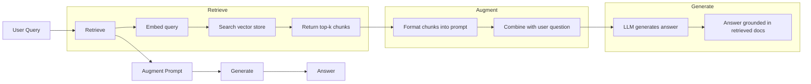
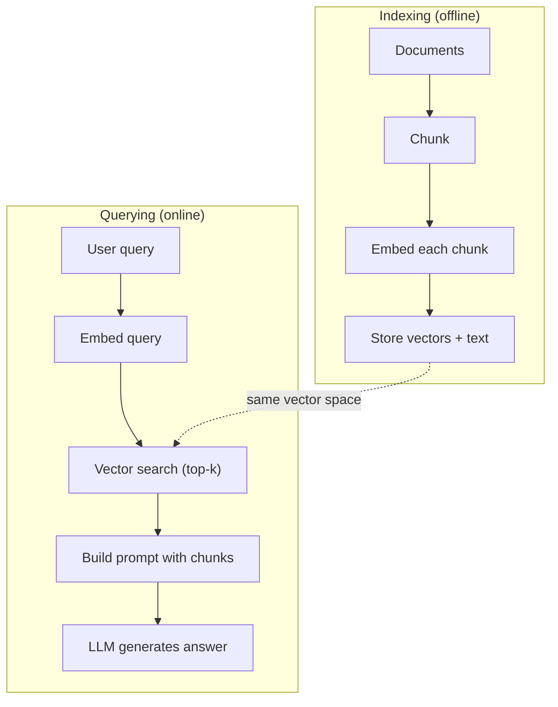

# RAG (검색 증강 생성, Retrieval-Augmented Generation)

> LLM은 학습 마감 시점까지의 모든 것을 안다. 하지만 회사의 문서, 코드베이스, 지난주 회의록은 전혀 모른다. RAG는 관련 문서를 검색해 프롬프트(prompt)에 쑤셔 넣어 이 문제를 해결한다. 프로덕션 AI에서 가장 많이 배포된 패턴이다. 이 강좌에서 한 가지만 만든다면, RAG 파이프라인(pipeline)을 만들어라.

**Type:** Build
**Languages:** Python
**Prerequisites:** Phase 10 (LLMs from Scratch), Phase 11 Lessons 01-05
**Time:** ~90분
**Related:** Phase 5 · 23 (Chunking Strategies for RAG) — 여섯 가지 청킹 알고리즘과 각각이 이기는 경우. Phase 5 · 22 (Embedding Models Deep Dive) — 임베더 고르기. Phase 11 · 07 (Advanced RAG) — 하이브리드 검색, 재순위화, 쿼리 변환.

## 학습 목표 (Learning Objectives)

- 완전한 RAG 파이프라인 만들기: 문서 로딩, 청킹(chunking), 임베딩(embedding), 벡터 저장, 검색, 생성
- 적절한 인덱싱으로 벡터 데이터베이스(ChromaDB, FAISS, 또는 Pinecone)를 사용한 의미 검색(semantic search) 구현하기
- 지식 근거 애플리케이션에서 왜 RAG가 파인튜닝(fine-tuning)보다 선호되는지 설명하기(비용, 신선도, 출처 표기)
- 검색 지표(정밀도, 재현율)와 생성 지표(충실도, 관련성)를 사용해 RAG 품질 평가하기

## 문제 (The Problem)

회사용 챗봇을 만든다고 하자. 한 고객이 "What's the refund policy for enterprise plans?"라고 묻는다. LLM은 전형적인 SaaS 환불 정책을 일반적으로 설명하며 응답한다. 200페이지 내부 위키에 묻혀 있는 실제 정책은 엔터프라이즈 고객이 60일 기간에 일할 계산 환불을 받는다고 명시한다. LLM은 이 문서를 본 적이 없다. 학습하지 않은 것을 알 수는 없다.

파인튜닝은 한 가지 해법이다. LLM을 가져와 내부 문서로 학습시키고 갱신된 모델을 배포한다. 이 방법은 작동하지만 심각한 문제가 있다. 파인튜닝은 수천 달러의 연산 비용이 든다. 문서가 바뀌는 순간 모델은 낡는다. 모델이 어느 출처에서 끌어왔는지 알 방법이 없다. 그리고 회사가 다음 달에 다른 제품 라인을 인수하면, 다시 파인튜닝한다.

RAG는 다른 해법이다. 모델은 건드리지 않는다. 질문이 들어오면 문서 저장소에서 관련 구절을 검색해 질문 앞에 프롬프트로 붙여 넣고, 모델이 그 구절들을 맥락으로 사용해 답하게 한다. 문서 저장소는 몇 분 안에 갱신할 수 있다. 어느 문서가 검색되었는지 정확히 볼 수 있다. 모델 자체는 절대 바뀌지 않는다. 이것이 RAG가 프로덕션에서 지배적인 패턴인 이유다: 더 저렴하고, 더 신선하고, 더 감사 가능하며, 어느 LLM과도 작동한다.

## 개념 (The Concept)

### RAG 패턴 (The RAG Pattern)

전체 패턴은 네 단계에 들어맞는다:



쿼리 -> 검색 -> 프롬프트 증강 -> 생성. 모든 RAG 시스템은 이 패턴을 따른다. 프로덕션 RAG 시스템 간의 차이는 각 단계의 세부 사항에 있다: 어떻게 청킹하는가, 어떻게 임베딩하는가, 어떻게 검색하는가, 어떻게 프롬프트를 구성하는가.

### 왜 RAG가 파인튜닝을 이기는가 (Why RAG Beats Fine-Tuning)

| 고려 사항 | 파인튜닝 | RAG |
|---------|------------|-----|
| 비용 | 학습 1회당 $1,000-$100,000+ | 쿼리당 $0.01-$0.10 (임베딩 + LLM) |
| 신선도 | 재학습 전까지 낡음 | 문서 재인덱싱으로 몇 분 안에 갱신 |
| 감사 가능성 | 답을 출처로 추적 불가 | 정확히 검색된 구절을 보여줄 수 있음 |
| 환각 | 여전히 자유롭게 환각함 | 검색된 문서에 근거함 |
| 데이터 프라이버시 | 학습 데이터가 가중치에 구워짐 | 문서가 자체 벡터 저장소에 남음 |

파인튜닝은 모델의 가중치(weight)를 영구적으로 바꾼다. RAG는 모델의 컨텍스트를 일시적으로 바꾼다. 대부분의 애플리케이션에서는 일시적 컨텍스트면 충분하다.

파인튜닝이 이기는 한 가지 경우: 프롬프팅만으로는 달성할 수 없는 특정 스타일, 어조, 추론 패턴을 모델이 채택해야 할 때다. 사실 지식 검색이라면 RAG가 매번 이긴다.

### 임베딩 모델 (Embedding Models)

임베딩 모델은 텍스트를 밀집 벡터(dense vector)로 변환한다. 유사한 텍스트는 이 고차원 공간에서 가까이 있는 벡터를 만든다. "How do I reset my password?"와 "I need to change my password"는 공유하는 단어가 거의 없음에도 거의 동일한 벡터를 만든다. "The cat sat on the mat"은 매우 다른 벡터를 만든다.

흔한 임베딩 모델(2026년 라인업 — 전체 분석은 Phase 5 · 22 참조):

| Model | Dimensions | Provider | Notes |
|-------|-----------|----------|-------|
| text-embedding-3-small | 1536 (Matryoshka) | OpenAI | 대부분의 사용 사례에서 최고의 가격/성능 |
| text-embedding-3-large | 3072 (Matryoshka) | OpenAI | 더 높은 정확도, 256/512/1024로 절단 가능 |
| Gemini Embedding 2 | 3072 (Matryoshka) | Google | 최고 MTEB 검색; 8K 컨텍스트 |
| voyage-4 | 1024/2048 (Matryoshka) | Voyage AI | 도메인 변형(코드, 금융, 법률) |
| Cohere embed-v4 | 1024 (Matryoshka) | Cohere | 강한 다국어, 128K 컨텍스트 |
| BGE-M3 | 1024 (dense + sparse + ColBERT) | BAAI (open-weight) | 하나의 모델에서 세 가지 관점 |
| Qwen3-Embedding | 4096 (Matryoshka) | Alibaba (open-weight) | 최고 오픈웨이트 검색 점수 |
| all-MiniLM-L6-v2 | 384 | Open-weight (Sentence Transformers) | 프로토타이핑 베이스라인 |

이 레슨에서는 TF-IDF를 사용해 우리만의 단순한 임베딩을 만든다. TF-IDF가 프로덕션 시스템이 쓰는 것이어서가 아니라, 개념을 구체적으로 만들기 때문이다: 텍스트가 들어가고, 벡터가 나오고, 유사한 텍스트는 유사한 벡터를 만든다.

### 벡터 유사도 (Vector Similarity)

두 벡터가 주어지면, 유사도를 어떻게 측정하는가? 세 가지 옵션:

**코사인 유사도(Cosine similarity)**: 두 벡터 사이 각도의 코사인. -1(반대)에서 1(동일)까지 범위. 크기를 무시하고, 방향만 신경 쓴다. 이것이 RAG의 기본값이다.

```
cosine_sim(a, b) = dot(a, b) / (||a|| * ||b||)
```

**내적(Dot product)**: 원시 내적. 더 큰 벡터가 더 높은 점수를 받는다. 크기가 정보를 담을 때 유용하다(더 긴 문서가 더 관련 있을 수 있다).

```
dot(a, b) = sum(a_i * b_i)
```

**L2(유클리드) 거리(L2 (Euclidean) distance)**: 벡터 공간에서의 직선 거리. 거리가 작을수록 = 더 유사. 크기 차이에 민감하다.

```
L2(a, b) = sqrt(sum((a_i - b_i)^2))
```

코사인 유사도가 표준이다. 크기로 정규화하기 때문에 길이가 다른 문서를 우아하게 처리한다. 누군가 "벡터 검색"이라고 말하면, 거의 항상 코사인 유사도를 뜻한다.

### 청킹 전략 (Chunking Strategies)

문서는 단일 벡터로 임베딩하기에는 너무 길다. 50페이지 PDF는 수십 개의 주제를 담고 있어 끔찍한 임베딩을 만들 수 있다. 대신, 문서를 청크(chunk)로 나누고 각 청크를 따로 임베딩한다.

**고정 크기 청킹(Fixed-size chunking)**: 매 N 토큰마다 나눈다. 단순하고 예측 가능하다. 50 토큰 겹침을 가진 512 토큰 청크는 청크 1이 토큰 0-511, 청크 2가 토큰 462-973, 이런 식이라는 뜻이다. 겹침은 운 나쁜 경계에서 문장을 나누지 않도록 보장한다.

**의미 청킹(Semantic chunking)**: 자연스러운 경계에서 나눈다. 문단, 섹션, 또는 마크다운 헤더. 각 청크는 일관된 의미 단위다. 구현하기 더 복잡하지만 더 나은 검색을 만든다.

**재귀 청킹(Recursive chunking)**: 먼저 가장 큰 경계(섹션 헤더)에서 나누려 한다. 섹션이 여전히 너무 크면, 문단 경계에서 나눈다. 문단이 여전히 너무 크면, 문장 경계에서 나눈다. 이것이 LangChain RecursiveCharacterTextSplitter 접근법이며 실제로 잘 작동한다.

청크 크기는 사람들이 생각하는 것보다 더 중요하다:

- 너무 작음(64-128 토큰): 각 청크가 맥락이 부족하다. "It increased 15% last quarter"는 "it"이 무엇을 가리키는지 모르면 아무 의미도 없다.
- 너무 큼(2048+ 토큰): 각 청크가 여러 주제를 다뤄, 관련성을 희석한다. 매출 데이터를 검색하면, 10%는 매출에 대한 것이고 90%는 인원수에 대한 청크를 얻는다.
- 최적 지점(256-512 토큰): 자족적이기에 충분한 맥락, 관련성을 갖기에 충분히 집중됨.

대부분의 프로덕션 RAG 시스템은 50 토큰 겹침을 가진 256-512 토큰 청크를 사용한다. Anthropic의 RAG 가이드라인이 이 범위를 권장한다.

### 벡터 데이터베이스 (Vector Databases)

임베딩을 만들고 나면 이를 저장하고 검색할 곳이 필요하다. 옵션:

| Database | Type | Best for |
|----------|------|----------|
| FAISS | Library (in-process) | 프로토타이핑, 소~중 규모 데이터셋 |
| Chroma | Lightweight DB | 로컬 개발, 소규모 배포 |
| Pinecone | Managed service | 운영 오버헤드 없는 프로덕션 |
| Weaviate | Open source DB | 자체 호스팅 프로덕션 |
| pgvector | Postgres extension | 이미 Postgres 사용 중 |
| Qdrant | Open source DB | 고성능 자체 호스팅 |

이 레슨에서는 단순한 인메모리 벡터 저장소를 만든다. 벡터를 리스트에 저장하고 무차별(brute-force) 코사인 유사도 검색을 한다. 이것은 플랫 인덱스를 가진 FAISS와 동등하다. 느려지기 전까지 아마 100,000개 벡터로 확장된다. 프로덕션 시스템은 수백만 개의 벡터를 수 밀리초에 검색하기 위해 HNSW 같은 근사 최근접 이웃(approximate nearest neighbor, ANN) 알고리즘을 사용한다.

### 전체 파이프라인 (The Full Pipeline)



인덱싱 단계는 문서당 한 번(또는 문서가 갱신될 때) 실행된다. 쿼리 단계는 모든 사용자 요청마다 실행된다. 프로덕션에서, 인덱싱은 수 시간에 걸쳐 수백만 문서를 처리할 수 있다. 쿼리는 1초 이내에 응답해야 한다.

### 실제 수치 (Real Numbers)

대부분의 프로덕션 RAG 시스템은 다음 파라미터를 사용한다:

- **k = 5에서 10** 쿼리당 검색된 청크
- **청크 크기 = 256에서 512 토큰**, 50 토큰 겹침
- **컨텍스트 예산**: 쿼리당 2,500-5,000 토큰의 검색된 콘텐츠
- **전체 프롬프트**: ~8,000-16,000 토큰 (시스템 프롬프트 + 검색된 청크 + 대화 이력 + 사용자 쿼리)
- **임베딩 차원**: 모델에 따라 384-3072
- **인덱싱 처리량**: API 임베딩으로 초당 100-1,000 문서
- **쿼리 지연 시간**: 검색에 50-200ms, 생성에 500-3000ms

## 직접 만들기 (Build It)

### 1단계: 문서 청킹

```python
def chunk_text(text, chunk_size=200, overlap=50):
    words = text.split()
    chunks = []
    start = 0
    while start < len(words):
        end = start + chunk_size
        chunk = " ".join(words[start:end])
        chunks.append(chunk)
        start += chunk_size - overlap
    return chunks
```

### 2단계: TF-IDF 임베딩

우리는 단순한 임베딩 함수를 만든다. TF-IDF(Term Frequency-Inverse Document Frequency)는 신경망 임베딩이 아니지만, 단어 중요도를 포착하는 방식으로 텍스트를 벡터로 변환한다. 문서에서 빈번한 단어는 더 높은 TF를 얻는다. 말뭉치 전반에서 드문 단어는 더 높은 IDF를 얻는다. 그 곱은 중요하고 독특한 단어가 높은 값을 갖는 벡터를 준다.

```python
import math
from collections import Counter

def build_vocabulary(documents):
    vocab = set()
    for doc in documents:
        vocab.update(doc.lower().split())
    return sorted(vocab)

def compute_tf(text, vocab):
    words = text.lower().split()
    count = Counter(words)
    total = len(words)
    return [count.get(word, 0) / total for word in vocab]

def compute_idf(documents, vocab):
    n = len(documents)
    idf = []
    for word in vocab:
        doc_count = sum(1 for doc in documents if word in doc.lower().split())
        idf.append(math.log((n + 1) / (doc_count + 1)) + 1)
    return idf

def tfidf_embed(text, vocab, idf):
    tf = compute_tf(text, vocab)
    return [t * i for t, i in zip(tf, idf)]
```

### 3단계: 코사인 유사도 검색

```python
def cosine_similarity(a, b):
    dot = sum(x * y for x, y in zip(a, b))
    norm_a = math.sqrt(sum(x * x for x in a))
    norm_b = math.sqrt(sum(x * x for x in b))
    if norm_a == 0 or norm_b == 0:
        return 0.0
    return dot / (norm_a * norm_b)

def search(query_embedding, stored_embeddings, top_k=5):
    scores = []
    for i, emb in enumerate(stored_embeddings):
        sim = cosine_similarity(query_embedding, emb)
        scores.append((i, sim))
    scores.sort(key=lambda x: x[1], reverse=True)
    return scores[:top_k]
```

### 4단계: 프롬프트 구성

여기가 RAG의 "증강(augmented)"이 일어나는 곳이다. 검색된 청크를 가져와 프롬프트로 형식화하고, LLM에게 제공된 맥락에 기반해 답하라고 요청한다.

```python
def build_rag_prompt(query, retrieved_chunks):
    context = "\n\n---\n\n".join(
        f"[Source {i+1}]\n{chunk}"
        for i, chunk in enumerate(retrieved_chunks)
    )
    return f"""Answer the question based ONLY on the following context.
If the context doesn't contain enough information, say "I don't have enough information to answer that."

Context:
{context}

Question: {query}

Answer:"""
```

### 5단계: 완전한 RAG 파이프라인

```python
class RAGPipeline:
    def __init__(self):
        self.chunks = []
        self.embeddings = []
        self.vocab = []
        self.idf = []

    def index(self, documents):
        all_chunks = []
        for doc in documents:
            all_chunks.extend(chunk_text(doc))
        self.chunks = all_chunks
        self.vocab = build_vocabulary(all_chunks)
        self.idf = compute_idf(all_chunks, self.vocab)
        self.embeddings = [
            tfidf_embed(chunk, self.vocab, self.idf)
            for chunk in all_chunks
        ]

    def query(self, question, top_k=5):
        query_emb = tfidf_embed(question, self.vocab, self.idf)
        results = search(query_emb, self.embeddings, top_k)
        retrieved = [(self.chunks[i], score) for i, score in results]
        prompt = build_rag_prompt(
            question, [chunk for chunk, _ in retrieved]
        )
        return prompt, retrieved
```

### 6단계: 생성 (시뮬레이션)

프로덕션에서는 여기가 LLM API를 호출하는 곳이다. 이 레슨에서는 검색된 맥락에서 가장 관련 있는 문장을 추출해 생성을 시뮬레이션한다.

```python
def simple_generate(prompt, retrieved_chunks):
    query_words = set(prompt.lower().split("question:")[-1].split())
    best_sentence = ""
    best_score = 0
    for chunk in retrieved_chunks:
        for sentence in chunk.split("."):
            sentence = sentence.strip()
            if not sentence:
                continue
            words = set(sentence.lower().split())
            overlap = len(query_words & words)
            if overlap > best_score:
                best_score = overlap
                best_sentence = sentence
    return best_sentence if best_sentence else "I don't have enough information."
```

## 라이브러리로 써보기 (Use It)

실제 임베딩 모델과 LLM을 쓰면, 코드는 거의 바뀌지 않는다:

```python
from openai import OpenAI

client = OpenAI()

def embed(text):
    response = client.embeddings.create(
        model="text-embedding-3-small",
        input=text
    )
    return response.data[0].embedding

def generate(prompt):
    response = client.chat.completions.create(
        model="gpt-4o-mini",
        messages=[{"role": "user", "content": prompt}],
        temperature=0
    )
    return response.choices[0].message.content
```

또는 Anthropic으로:

```python
import anthropic

client = anthropic.Anthropic()

def generate(prompt):
    response = client.messages.create(
        model="claude-sonnet-4-20250514",
        max_tokens=1024,
        messages=[{"role": "user", "content": prompt}]
    )
    return response.content[0].text
```

파이프라인은 같다. 임베딩 함수를 교체하라. 생성 함수를 교체하라. 검색 로직, 청킹, 프롬프트 구성 — 어느 모델을 쓰든 모두 동일하다.

대규모 벡터 저장의 경우, 무차별 검색을 적절한 벡터 데이터베이스로 교체하라:

```python
import chromadb

client = chromadb.Client()
collection = client.create_collection("my_docs")

collection.add(
    documents=chunks,
    ids=[f"chunk_{i}" for i in range(len(chunks))]
)

results = collection.query(
    query_texts=["What is the refund policy?"],
    n_results=5
)
```

Chroma는 임베딩을 내부적으로 처리하고(기본적으로 all-MiniLM-L6-v2를 사용) 벡터를 로컬 데이터베이스에 저장한다. 같은 패턴, 다른 배관.

## 산출물 (Ship It)

이 레슨은 다음을 만든다:
- `outputs/prompt-rag-architect.md` -- 특정 사용 사례에 맞는 RAG 시스템을 설계하기 위한 프롬프트
- `outputs/skill-rag-pipeline.md` -- 에이전트에게 RAG 파이프라인을 만들고 디버깅하는 법을 가르치는 스킬

## 연습 문제 (Exercises)

1. TF-IDF 임베딩을 단순한 bag-of-words 접근법(이진: 단어가 있으면 1, 없으면 0)으로 교체하라. 샘플 문서에서 검색 품질을 비교하라. TF-IDF는 드문 단어에 더 높은 가중치를 주기 때문에 능가해야 한다.

2. 청크 크기를 실험하라: 같은 문서 집합에서 50, 100, 200, 500 단어를 시도하라. 각 크기에 대해, 같은 5개 쿼리를 실행하고 top-3에 관련 청크를 반환하는 것이 몇 개인지 세라. 검색 품질이 정점에 이르는 최적 지점을 찾아라.

3. 각 청크에 메타데이터(출처 문서 이름, 청크 위치)를 추가하라. LLM이 출처를 인용하도록 출처 표기를 포함하게 프롬프트 템플릿을 수정하라.

4. 단순한 평가를 구현하라: 10개의 질문-답변 쌍이 주어지면, 각 질문을 RAG 파이프라인을 통해 실행하고, 검색된 청크 중 몇 퍼센트가 답을 담고 있는지 측정하라. 이것이 k에서의 검색 재현율이다.

5. 대화 인식 RAG 파이프라인을 만들라: 마지막 3개 교환의 이력을 유지하고 검색된 청크와 함께 프롬프트에 포함하라. 가격에 대해 물은 후 "What about enterprise?" 같은 후속 질문으로 테스트하라.

## 핵심 용어 (Key Terms)

| 용어 | 사람들이 말하는 것 | 실제 의미 |
|------|----------------|----------------------|
| RAG | "당신의 문서를 읽는 AI" | 관련 문서를 검색하고, 프롬프트에 붙여 넣고, 그 문서에 근거한 답을 생성하는 것 |
| 임베딩(Embedding) | "텍스트를 숫자로 변환" | 유사한 의미가 유사한 벡터를 만드는 텍스트의 밀집 벡터 표현 |
| 벡터 데이터베이스(Vector database) | "AI를 위한 검색 엔진" | 벡터를 저장하고 유사도로 최근접 이웃을 찾는 데 최적화된 데이터 저장소 |
| 청킹(Chunking) | "문서를 조각으로 나누기" | 각각이 독립적으로 임베딩되고 검색될 수 있도록 문서를 더 작은 세그먼트(보통 256-512 토큰)로 쪼개기 |
| 코사인 유사도(Cosine similarity) | "두 벡터가 얼마나 유사한가" | 두 벡터 사이 각도의 코사인; 1 = 동일한 방향, 0 = 직교, -1 = 반대 |
| Top-k 검색(Top-k retrieval) | "k개의 최선 매치 얻기" | 벡터 저장소에서 쿼리와 가장 유사한 k개의 청크를 반환 |
| 컨텍스트 윈도우(Context window) | "LLM이 볼 수 있는 텍스트 양" | LLM이 단일 요청에서 처리할 수 있는 토큰의 최대 개수; 검색된 청크는 이 안에 들어가야 함 |
| 증강 생성(Augmented generation) | "주어진 맥락으로 답하기" | 학습된 지식에만 의존하는 대신 검색된 문서를 맥락으로 사용해 응답을 생성하는 것 |
| TF-IDF | "단어 중요도 채점" | Term Frequency 곱하기 Inverse Document Frequency; 단어가 말뭉치 내에서 얼마나 독특한지로 가중치를 매김 |
| 인덱싱(Indexing) | "검색을 위해 문서 준비하기" | 쿼리 시점에 검색될 수 있도록 문서를 청킹, 임베딩, 저장하는 오프라인 과정 |

## 더 읽을거리 (Further Reading)

- Lewis et al., "Retrieval-Augmented Generation for Knowledge-Intensive NLP Tasks" (2020) -- 검색-후-생성 패턴을 형식화한 Facebook AI Research의 원조 RAG 논문
- Anthropic's RAG documentation (docs.anthropic.com) -- 청크 크기, 프롬프트 구성, 평가에 대한 실용적 가이드라인
- Pinecone Learning Center, "What is RAG?" -- 프로덕션 고려 사항과 함께 RAG 파이프라인의 명료한 시각적 설명
- Sentence-BERT: Reimers & Gurevych (2019) -- all-MiniLM 임베딩 모델 뒤의 논문, 의미적 유사도를 위해 바이 인코더를 학습시키는 법을 보임
- [Karpukhin et al., "Dense Passage Retrieval for Open-Domain Question Answering" (EMNLP 2020)](https://arxiv.org/abs/2004.04906) -- 밀집 바이 인코더 검색이 오픈 도메인 QA에서 BM25를 이긴다는 것을 증명하고 현대 RAG 검색기의 패턴을 세운 DPR 논문
- [LlamaIndex High-Level Concepts](https://docs.llamaindex.ai/en/stable/getting_started/concepts.html) -- RAG 파이프라인을 만들 때 알아야 할 주요 개념: 데이터 로더, 노드 파서, 인덱스, 검색기, 응답 합성기
- [LangChain RAG tutorial](https://python.langchain.com/docs/tutorials/rag/) -- 반대 풍미의 오케스트레이터; 같은 검색-후-생성 패턴의 chain-of-runnables 관점
