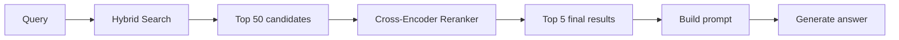
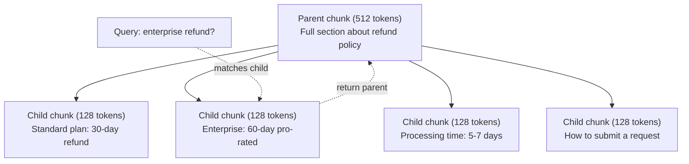
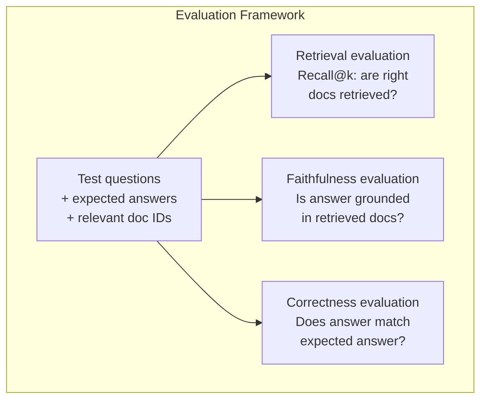

# 고급 RAG (청킹, 재순위화, 하이브리드 검색)

> 기본 RAG는 top-k개의 가장 유사한 청크(chunk)를 검색한다. 그것은 단순한 질문에 작동한다. 다중 홉(multi-hop) 추론, 모호한 쿼리, 큰 말뭉치에서는 무너진다. 고급 RAG는 문서 10개에서 작동하는 데모와 1천만 개에서 작동하는 시스템의 차이다.

**Type:** Build
**Languages:** Python
**Prerequisites:** Phase 11, Lesson 06 (RAG)
**Time:** ~90분
**Related:** Phase 5 · 23 (Chunking Strategies for RAG)는 여섯 가지 청킹 알고리즘 — 재귀, 의미, 문장, 부모-문서, 늦은 청킹(late chunking), 맥락 검색(contextual retrieval) — 을 Vectara/Anthropic 벤치마크(benchmark)와 함께 다룬다. 이 레슨은 그 위에 쌓는다: 하이브리드 검색, 재순위화, 쿼리 변환.

## 학습 목표 (Learning Objectives)

- 문서 구조와 맥락을 보존하는 고급 청킹 전략(의미, 재귀, 부모-자식) 구현하기
- BM25 키워드 매칭을 의미적 벡터 검색 및 크로스 인코더(cross-encoder) 재순위기와 결합한 하이브리드 검색 파이프라인(pipeline) 만들기
- 모호하거나 복잡한 질문에서 검색을 개선하기 위해 쿼리 변환 기법(HyDE, 다중 쿼리, 스텝백) 적용하기
- 흔한 RAG 실패 진단하고 고치기: 잘못된 청크 검색, 맥락에 답 없음, 다중 홉 추론 붕괴

## 문제 (The Problem)

Lesson 06에서 기본 RAG 파이프라인을 만들었다. 작은 말뭉치의 직관적인 질문에는 작동한다. 이제 이것들을 시도해 보라:

**모호한 쿼리**: "What was revenue last quarter?" 의미 검색은 매출 전략, 매출 전망, 매출 성장에 대한 CFO의 생각에 관한 청크를 반환한다. 모두 "revenue"라는 단어와 의미적으로 유사하다. 실제 숫자를 담은 것은 없다. 올바른 청크는 "$47.2M in Q3 2025"라고 말하지만 "revenue" 대신 "earnings"라는 단어를 쓴다. 임베딩(embedding) 모델은 "revenue strategy"가 "Q3 earnings were $47.2M"보다 쿼리에 더 가깝다고 생각한다.

**다중 홉 질문**: "Which team had the highest customer satisfaction score improvement?" 이것은 각 팀의 만족도 점수를 찾고, 비교하고, 최댓값을 식별해야 한다. 어떤 단일 청크도 답을 담고 있지 않다. 정보가 팀 보고서들에 흩어져 있다.

**큰 말뭉치 문제**: 청크가 200만 개 있다. 올바른 답은 청크 #1,847,293에 있다. top-5 검색은 청크 #14, #89,201, #1,200,000, #44, #901,333을 끌어온다. 임베딩 공간에서는 가깝지만, 답을 담은 것은 없다. 이 규모에서 근사 최근접 이웃 검색은 관련 결과가 top-k에서 밀려날 만큼의 충분한 오차를 들여온다.

기본 RAG는 벡터 유사도가 관련성과 같지 않기 때문에 실패한다. 청크는 답하는 데 유용하지 않으면서도 쿼리와 의미적으로 유사할 수 있다. 고급 RAG는 이를 네 가지 기법으로 다룬다: 하이브리드 검색(키워드 매칭 추가), 재순위화(후보를 더 신중하게 채점), 쿼리 변환(검색 전에 쿼리 수정), 더 나은 청킹(올바른 단위로 검색).

## 개념 (The Concept)

### 하이브리드 검색: 의미 + 키워드 (Hybrid Search: Semantic + Keyword)

의미 검색(벡터 유사도)은 의미를 이해하는 데 능하다. "How do I cancel my subscription?"은 공유하는 단어가 없음에도 "Steps to terminate your plan"과 매치된다. 그러나 정확한 매치를 놓친다. "Error code E-4021"은 임베딩 모델이 그것을 잡음으로 취급하면 "E-4021"을 담은 청크와 매치되지 않을 수 있다.

키워드 검색(BM25)은 그 반대다. 정확한 매치에 탁월하다. "E-4021"은 완벽하게 매치된다. 그러나 문서가 "terminate your plan"이라고 말하면 "cancel my subscription"은 결과를 0개 반환한다.

하이브리드 검색은 둘 다 실행한 다음 결과를 병합한다.

**BM25**(Best Matching 25)는 표준 키워드 검색 알고리즘이다. 1990년대부터 검색 엔진의 중추였다. 공식:

```
BM25(q, d) = sum over terms t in q:
    IDF(t) * (tf(t,d) * (k1 + 1)) / (tf(t,d) + k1 * (1 - b + b * |d| / avgdl))
```

여기서 tf(t,d)는 문서 d에서 t의 용어 빈도, IDF(t)는 역문서 빈도, |d|는 문서 길이, avgdl은 평균 문서 길이, k1은 용어 빈도 포화(saturation)를 제어하고(기본 1.2), b는 길이 정규화를 제어한다(기본 0.75).

쉬운 말로: BM25는 문서가 쿼리 용어(특히 드문 것)를 담을 때 더 높은 점수를 주지만, 반복된 용어에는 수확 체감이 있다. "revenue"라는 단어가 50번 있는 문서가 한 번 있는 문서보다 50배 더 관련 있는 것은 아니다.

### 상호 순위 융합 (RRF, Reciprocal Rank Fusion)

순위 리스트가 두 개 있다. 하나는 벡터 검색에서, 하나는 BM25에서 나온다. 어떻게 결합하는가? 상호 순위 융합(Reciprocal Rank Fusion)이 표준 접근법이다.

```
RRF_score(d) = sum over rankings R:
    1 / (k + rank_R(d))
```

여기서 k는 상위 순위 결과가 지배하지 못하게 막는 상수(보통 60)다.

벡터 검색에서 #1, BM25에서 #5인 문서는 다음을 얻는다: 1/(60+1) + 1/(60+5) = 0.0164 + 0.0154 = 0.0318

벡터 검색에서 #3, BM25에서 #2인 문서는 다음을 얻는다: 1/(60+3) + 1/(60+2) = 0.0159 + 0.0161 = 0.0320

RRF는 두 신호를 자연스럽게 균형 잡는다. 두 리스트 모두에서 높게 순위 매겨지는 문서가 최고 점수를 얻는다. 한 리스트에서 #1이지만 다른 리스트에 없는 문서는 적당한 점수를 얻는다. 이것은 원시 점수가 아니라 순위를 사용하기 때문에 견고하며, 그래서 두 시스템 간 점수 분포의 차이가 문제되지 않는다.

### 재순위화 (Reranking)

검색(벡터든, 키워드든, 하이브리드든)은 빠르지만 부정확하다. 바이 인코더(bi-encoder)를 사용한다: 쿼리와 각 문서가 독립적으로 임베딩된 다음 비교된다. 임베딩은 한 번 계산되고 캐시된다. 그래서 수백만 문서까지 확장된다.

재순위화는 크로스 인코더를 사용한다: 쿼리와 후보 문서가 함께 관련성 점수를 출력하는 모델에 입력된다. 모델은 두 텍스트를 동시에 보고 그것들 사이의 세밀한 상호작용을 포착할 수 있다. 크로스 인코더는 바이 인코더가 연결을 놓쳤더라도 "What were Q3 earnings?"가 "$47.2M in Q3"를 담은 청크와 매우 관련 있다는 것을 이해할 수 있다.

트레이드오프(trade-off): 크로스 인코더는 쿼리-문서 쌍을 함께 처리하기 때문에 바이 인코더보다 100-1000배 느리다. 백만 문서에 대해 크로스 인코더 점수를 미리 계산할 수 없다. 해법: 더 큰 후보 집합(하이브리드 검색에서 top-50)을 검색한 다음, 크로스 인코더로 재순위화해 최종 top-5를 얻는다.



흔한 재순위화 모델(2026년 라인업):
- Cohere Rerank 3.5: 매니지드 API, 다국어, 혼합 말뭉치에서 최고의 재현율 향상
- Voyage rerank-2.5: 매니지드 API, 호스팅 옵션 중 최저 지연 시간
- Jina-Reranker-v2 Multilingual: 오픈웨이트, 100개 이상 언어
- bge-reranker-v2-m3: 오픈웨이트, 강한 베이스라인
- cross-encoder/ms-marco-MiniLM-L-6-v2: 오픈웨이트, 프로토타이핑용 CPU에서 실행
- ColBERTv2 / Jina-ColBERT-v2: 늦은 상호작용(late-interaction) 다중 벡터 재순위기 — 채점 시 O(docs)가 아니라 O(tokens)

### 쿼리 변환 (Query Transformation)

때때로 문제는 검색이 아니라 쿼리 자체다. "What was that thing about the new policy change?"는 끔찍한 검색 쿼리다. 구체적인 용어가 없다. 임베딩이 모호하다. 어떤 검색 시스템도 이로부터 올바른 문서를 찾을 수 없다.

**쿼리 재작성(Query rewriting)**: 사용자 쿼리를 더 나은 검색 쿼리로 다시 표현한다. LLM이 이를 할 수 있다:

```
User: "What was that thing about the new policy change?"
Rewritten: "Recent policy changes and updates"
```

**HyDE(Hypothetical Document Embeddings)**: 쿼리로 검색하는 대신, 가상의 답을 생성하고, 그것을 임베딩하고, 유사한 실제 문서를 검색한다.

```
Query: "What is the refund policy for enterprise?"
Hypothetical answer: "Enterprise customers are eligible for a full refund
within 60 days of purchase. Refunds are pro-rated based on the remaining
subscription period and processed within 5-7 business days."
```

가상의 답을 임베딩하고 그것과 유사한 실제 문서를 검색한다. 직관: 가상의 답이 원래 질문보다 임베딩 공간에서 실제 답에 더 가까이 산다. 질문과 답은 다른 언어적 구조를 갖는다. 가상의 답을 생성함으로써 임베딩에서 "질문 공간"과 "답 공간" 사이의 간극을 잇는다.

HyDE는 검색 전에 LLM 호출을 하나 더한다. 그만큼 지연 시간(latency)이 500-2000ms 늘어난다. 원시 쿼리에서 검색 품질이 나쁠 때 그만한 가치가 있다.

### 부모-자식 청킹 (Parent-Child Chunking)

표준 청킹은 트레이드오프를 강요한다: 정밀한 검색을 위한 작은 청크, 충분한 맥락을 위한 큰 청크. 부모-자식 청킹은 이 트레이드오프를 없앤다.

검색을 위해 작은 청크(128 토큰)를 인덱싱한다. 작은 청크가 검색되면, 프롬프트(prompt)를 위해 그 부모 청크(512 토큰)를 반환한다. 작은 청크는 쿼리에 정밀하게 매치된다. 부모 청크는 LLM이 좋은 답을 생성할 충분한 맥락을 제공한다.



쿼리 "enterprise refund?"는 자식 청크 C2에 정밀하게 매치된다. 그러나 프롬프트는 처리 시간과 제출 과정에 대한 주변 맥락을 포함하는 전체 부모 청크 P를 받는다.

### 메타데이터 필터링 (Metadata Filtering)

벡터 검색을 실행하기 전에 메타데이터로 말뭉치를 필터링한다: 날짜, 출처, 범주, 작성자, 언어. 이렇게 하면 검색 공간이 줄고 무관한 결과를 막는다.

"What changed in the security policy last month?"는 보안 범주에서 지난 30일의 문서만 검색해야 한다. 메타데이터 필터링이 없으면 전체 말뭉치를 검색하다가 우연히 의미적으로 유사한 2년 된 보안 문서를 검색하게 된다.

프로덕션 RAG 시스템은 각 청크와 함께 메타데이터를 저장한다: 출처 문서, 생성 날짜, 범주, 작성자, 버전. 벡터 데이터베이스는 유사도 검색 전에 메타데이터로 사전 필터링하는 것을 지원하며, 이는 대규모 성능에 결정적이다.

### 평가 (Evaluation)

RAG 시스템을 만들었다. 그것이 작동하는지 어떻게 아는가? 세 가지 지표가 있다:

**검색 관련성(Recall@k)**: 알려진 관련 문서를 가진 테스트 질문 집합에 대해, 관련 문서의 몇 퍼센트가 top-k 결과에 나타나는가? 질문에 대한 답이 청크 #47에 있다면, 청크 #47이 top-5에 나타나는가?

**충실도(Faithfulness)**: 생성된 답이 검색된 문서에 근거하는가? 검색된 청크가 "60-day refund window"라고 말하는데 모델이 "90-day refund window"라고 말하면, 그것은 충실도 실패다. 모델이 올바른 맥락을 갖고도 환각했다.

**답 정확성(Answer correctness)**: 생성된 답이 기대 답과 일치하는가? 이것이 종단 간(end-to-end) 지표다. 검색 품질과 생성 품질을 결합한다.

단순한 충실도 검사: 생성된 답의 각 주장을 가져와 그것이 검색된 청크에 (실질적으로) 나타나는지 확인한다. 답이 어떤 검색된 청크에도 없는 사실을 담고 있다면, 그것은 환각일 가능성이 높다.



## 직접 만들기 (Build It)

### 1단계: BM25 구현

```python
import math
from collections import Counter

class BM25:
    def __init__(self, k1=1.2, b=0.75):
        self.k1 = k1
        self.b = b
        self.docs = []
        self.doc_lengths = []
        self.avg_dl = 0
        self.doc_freqs = {}
        self.n_docs = 0

    def index(self, documents):
        self.docs = documents
        self.n_docs = len(documents)
        self.doc_lengths = []
        self.doc_freqs = {}

        for doc in documents:
            words = doc.lower().split()
            self.doc_lengths.append(len(words))
            unique_words = set(words)
            for word in unique_words:
                self.doc_freqs[word] = self.doc_freqs.get(word, 0) + 1

        self.avg_dl = sum(self.doc_lengths) / self.n_docs if self.n_docs else 1

    def score(self, query, doc_idx):
        query_words = query.lower().split()
        doc_words = self.docs[doc_idx].lower().split()
        doc_len = self.doc_lengths[doc_idx]
        word_counts = Counter(doc_words)
        score = 0.0

        for term in query_words:
            if term not in word_counts:
                continue
            tf = word_counts[term]
            df = self.doc_freqs.get(term, 0)
            idf = math.log((self.n_docs - df + 0.5) / (df + 0.5) + 1)
            numerator = tf * (self.k1 + 1)
            denominator = tf + self.k1 * (1 - self.b + self.b * doc_len / self.avg_dl)
            score += idf * numerator / denominator

        return score

    def search(self, query, top_k=10):
        scores = [(i, self.score(query, i)) for i in range(self.n_docs)]
        scores.sort(key=lambda x: x[1], reverse=True)
        return scores[:top_k]
```

### 2단계: 상호 순위 융합

```python
def reciprocal_rank_fusion(ranked_lists, k=60):
    scores = {}
    for ranked_list in ranked_lists:
        for rank, (doc_id, _) in enumerate(ranked_list):
            if doc_id not in scores:
                scores[doc_id] = 0.0
            scores[doc_id] += 1.0 / (k + rank + 1)
    fused = sorted(scores.items(), key=lambda x: x[1], reverse=True)
    return fused
```

### 3단계: 하이브리드 검색 파이프라인

```python
def hybrid_search(query, chunks, vector_embeddings, vocab, idf, bm25_index, top_k=5, fusion_k=60):
    query_emb = tfidf_embed(query, vocab, idf)
    vector_results = search(query_emb, vector_embeddings, top_k=top_k * 3)
    bm25_results = bm25_index.search(query, top_k=top_k * 3)
    fused = reciprocal_rank_fusion([vector_results, bm25_results], k=fusion_k)
    return fused[:top_k]
```

### 4단계: 단순 재순위기

프로덕션에서는, 크로스 인코더 모델을 쓸 것이다. 여기서는 단어 겹침, 용어 중요도, 구절 매칭을 사용해 쿼리-문서 관련성을 채점하는 재순위기를 만든다.

```python
def rerank(query, candidates, chunks):
    query_words = set(query.lower().split())
    stop_words = {"the", "a", "an", "is", "are", "was", "were", "what", "how",
                  "why", "when", "where", "do", "does", "for", "of", "in", "to",
                  "and", "or", "on", "at", "by", "it", "its", "this", "that",
                  "with", "from", "be", "has", "have", "had", "not", "but"}
    query_terms = query_words - stop_words

    scored = []
    for doc_id, initial_score in candidates:
        chunk = chunks[doc_id].lower()
        chunk_words = set(chunk.split())

        term_overlap = len(query_terms & chunk_words)

        query_bigrams = set()
        q_list = [w for w in query.lower().split() if w not in stop_words]
        for i in range(len(q_list) - 1):
            query_bigrams.add(q_list[i] + " " + q_list[i + 1])
        bigram_matches = sum(1 for bg in query_bigrams if bg in chunk)

        position_boost = 0
        for term in query_terms:
            pos = chunk.find(term)
            if pos != -1 and pos < len(chunk) // 3:
                position_boost += 0.5

        rerank_score = (
            term_overlap * 1.0
            + bigram_matches * 2.0
            + position_boost
            + initial_score * 5.0
        )
        scored.append((doc_id, rerank_score))

    scored.sort(key=lambda x: x[1], reverse=True)
    return scored
```

### 5단계: HyDE (Hypothetical Document Embeddings)

```python
def hyde_generate_hypothesis(query):
    templates = {
        "what": "The answer to '{query}' is as follows: Based on our documentation, {topic} involves specific policies and procedures that define how the process works.",
        "how": "To address '{query}': The process involves several steps. First, you need to initiate the request. Then, the system processes it according to the defined rules.",
        "default": "Regarding '{query}': Our records indicate specific details and policies related to this topic that provide a comprehensive answer."
    }
    query_lower = query.lower()
    if query_lower.startswith("what"):
        template = templates["what"]
    elif query_lower.startswith("how"):
        template = templates["how"]
    else:
        template = templates["default"]

    topic_words = [w for w in query.lower().split()
                   if w not in {"what", "is", "the", "how", "do", "does", "a", "an",
                                "for", "of", "to", "in", "on", "at", "by", "and", "or"}]
    topic = " ".join(topic_words) if topic_words else "this topic"

    return template.format(query=query, topic=topic)


def hyde_search(query, chunks, vector_embeddings, vocab, idf, top_k=5):
    hypothesis = hyde_generate_hypothesis(query)
    hypothesis_emb = tfidf_embed(hypothesis, vocab, idf)
    results = search(hypothesis_emb, vector_embeddings, top_k)
    return results, hypothesis
```

### 6단계: 부모-자식 청킹

```python
def create_parent_child_chunks(text, parent_size=200, child_size=50):
    words = text.split()
    parents = []
    children = []
    child_to_parent = {}

    parent_idx = 0
    start = 0
    while start < len(words):
        parent_end = min(start + parent_size, len(words))
        parent_text = " ".join(words[start:parent_end])
        parents.append(parent_text)

        child_start = start
        while child_start < parent_end:
            child_end = min(child_start + child_size, parent_end)
            child_text = " ".join(words[child_start:child_end])
            child_idx = len(children)
            children.append(child_text)
            child_to_parent[child_idx] = parent_idx
            child_start += child_size

        parent_idx += 1
        start += parent_size

    return parents, children, child_to_parent
```

### 7단계: 충실도 평가

```python
def evaluate_faithfulness(answer, retrieved_chunks):
    answer_sentences = [s.strip() for s in answer.split(".") if len(s.strip()) > 10]
    if not answer_sentences:
        return 1.0, []

    grounded = 0
    ungrounded = []
    context = " ".join(retrieved_chunks).lower()

    for sentence in answer_sentences:
        words = set(sentence.lower().split())
        stop_words = {"the", "a", "an", "is", "are", "was", "were", "and", "or",
                      "to", "of", "in", "for", "on", "at", "by", "it", "this", "that"}
        content_words = words - stop_words
        if not content_words:
            grounded += 1
            continue

        matched = sum(1 for w in content_words if w in context)
        ratio = matched / len(content_words) if content_words else 0

        if ratio >= 0.5:
            grounded += 1
        else:
            ungrounded.append(sentence)

    score = grounded / len(answer_sentences) if answer_sentences else 1.0
    return score, ungrounded


def evaluate_retrieval_recall(queries_with_relevant, retrieval_fn, k=5):
    total_recall = 0.0
    results = []

    for query, relevant_indices in queries_with_relevant:
        retrieved = retrieval_fn(query, k)
        retrieved_indices = set(idx for idx, _ in retrieved)
        relevant_set = set(relevant_indices)
        hits = len(retrieved_indices & relevant_set)
        recall = hits / len(relevant_set) if relevant_set else 1.0
        total_recall += recall
        results.append({
            "query": query,
            "recall": recall,
            "hits": hits,
            "total_relevant": len(relevant_set)
        })

    avg_recall = total_recall / len(queries_with_relevant) if queries_with_relevant else 0
    return avg_recall, results
```

## 라이브러리로 써보기 (Use It)

재순위화를 위한 실제 크로스 인코더로:

```python
from sentence_transformers import CrossEncoder

reranker = CrossEncoder("cross-encoder/ms-marco-MiniLM-L-6-v2")

def rerank_with_cross_encoder(query, candidates, chunks, top_k=5):
    pairs = [(query, chunks[doc_id]) for doc_id, _ in candidates]
    scores = reranker.predict(pairs)
    scored = list(zip([doc_id for doc_id, _ in candidates], scores))
    scored.sort(key=lambda x: x[1], reverse=True)
    return scored[:top_k]
```

Cohere의 매니지드 재순위기로:

```python
import cohere

co = cohere.Client()

def rerank_with_cohere(query, candidates, chunks, top_k=5):
    docs = [chunks[doc_id] for doc_id, _ in candidates]
    response = co.rerank(
        model="rerank-english-v3.0",
        query=query,
        documents=docs,
        top_n=top_k
    )
    return [(candidates[r.index][0], r.relevance_score) for r in response.results]
```

실제 LLM을 사용한 HyDE로:

```python
import anthropic

client = anthropic.Anthropic()

def hyde_with_llm(query):
    response = client.messages.create(
        model="claude-sonnet-4-20250514",
        max_tokens=256,
        messages=[{
            "role": "user",
            "content": f"Write a short paragraph that would be a good answer to this question. Do not say you don't know. Just write what the answer would look like.\n\nQuestion: {query}"
        }]
    )
    return response.content[0].text
```

Weaviate를 사용한 프로덕션 하이브리드 검색으로:

```python
import weaviate

client = weaviate.connect_to_local()

collection = client.collections.get("Documents")
response = collection.query.hybrid(
    query="enterprise refund policy",
    alpha=0.5,
    limit=10
)
```

alpha 파라미터는 균형을 제어한다: 0.0 = 순수 키워드(BM25), 1.0 = 순수 벡터, 0.5 = 동등한 가중치. 대부분의 프로덕션 시스템은 0.3에서 0.7 사이의 alpha를 사용한다.

## 산출물 (Ship It)

이 레슨은 다음을 만든다:
- `outputs/prompt-advanced-rag-debugger.md` -- RAG 품질 문제를 진단하고 고치기 위한 프롬프트
- `outputs/skill-advanced-rag.md` -- 하이브리드 검색과 재순위화로 프로덕션급 RAG를 만들기 위한 스킬

## 연습 문제 (Exercises)

1. 샘플 문서에서 BM25 vs 벡터 검색 vs 하이브리드 검색을 비교하라. 5개 테스트 쿼리 각각에 대해, 어느 접근법이 가장 관련 있는 청크를 #1 위치에 반환하는지 기록하라. 하이브리드 검색은 5개 중 적어도 3개에서 이겨야 한다.

2. 메타데이터 필터를 구현하라. 각 문서에 "category" 필드(security, billing, api, product)를 추가하라. 벡터 검색을 실행하기 전에, 청크를 관련 범주로만 필터링하라. "What encryption is used?"로 테스트하고 보안 범주 청크만 검색하는지 확인하라.

3. Lesson 06의 단순 생성 함수를 사용해 전체 HyDE 파이프라인을 만들라. 5개 테스트 쿼리 모두에서 직접 쿼리 검색과 HyDE 검색 사이의 검색 품질(top-3 관련성)을 비교하라. HyDE는 모호한 쿼리에서 결과를 개선해야 한다.

4. 샘플 문서에 부모-자식 청킹 전략을 구현하라. child_size=30, parent_size=100을 사용하라. 자식 청크로 검색하되 프롬프트에는 부모 청크를 반환하라. 생성된 답을 chunk_size=50인 표준 청킹과 비교하라.

5. 평가 데이터셋을 만들라: 알려진 답 청크를 가진 10개 질문. (a) 벡터 검색만, (b) BM25만, (c) 하이브리드 검색, (d) 하이브리드 + 재순위화에 대해 Recall@3, Recall@5, Recall@10을 측정하라. 결과를 그래프로 그리고 재순위화가 가장 도움이 되는 곳을 식별하라.

## 핵심 용어 (Key Terms)

| 용어 | 사람들이 말하는 것 | 실제 의미 |
|------|----------------|----------------------|
| BM25 | "키워드 검색" | 용어 빈도, 역문서 빈도, 문서 길이 정규화로 문서를 채점하는 확률적 순위 알고리즘 |
| 하이브리드 검색(Hybrid search) | "양쪽의 장점" | 의미(벡터)와 키워드(BM25) 검색을 병렬로 실행한 다음, 순위 융합으로 결과를 병합하는 것 |
| 상호 순위 융합(Reciprocal Rank Fusion) | "순위 리스트 병합" | 모든 리스트에 걸쳐 각 문서에 대해 1/(k + rank)를 합산해 여러 순위 리스트를 결합하는 것 |
| 재순위화(Reranking) | "2차 채점" | 초기 검색의 후보 집합을 다시 채점하는 데 더 비싼 크로스 인코더 모델을 사용하는 것 |
| 크로스 인코더(Cross-encoder) | "공동 쿼리-문서 모델" | 쿼리와 문서를 단일 입력으로 받아 관련성 점수를 만드는 모델; 바이 인코더보다 정확하지만 전체 말뭉치 검색에는 너무 느림 |
| 바이 인코더(Bi-encoder) | "독립 임베딩 모델" | 쿼리와 문서를 독립적으로 임베딩하는 모델; 임베딩이 미리 계산되어 빠르지만, 크로스 인코더보다 덜 정확함 |
| HyDE | "가짜 답으로 검색" | 쿼리에 대한 가상의 답을 생성하고, 임베딩하고, 그것과 유사한 실제 문서를 검색하는 것 |
| 부모-자식 청킹(Parent-child chunking) | "작게 검색, 큰 맥락" | 정밀한 검색을 위해 작은 청크를 인덱싱하되 충분한 맥락을 제공하기 위해 더 큰 부모 청크를 반환하는 것 |
| 메타데이터 필터링(Metadata filtering) | "검색 전에 좁히기" | 검색 공간을 줄이기 위해 벡터 검색을 실행하기 전에 속성(날짜, 출처, 범주)으로 문서를 필터링하는 것 |
| 충실도(Faithfulness) | "근거를 유지했는가" | 생성된 답이 모델의 학습 데이터에서 환각된 것이 아니라 검색된 문서에 의해 뒷받침되는지 여부 |

## 더 읽을거리 (Further Reading)

- Robertson & Zaragoza, "The Probabilistic Relevance Framework: BM25 and Beyond" (2009) -- BM25에 대한 결정적 참조, 공식 뒤의 확률적 기초를 설명
- Cormack et al., "Reciprocal Rank Fusion Outperforms Condorcet and Individual Rank Learning Methods" (2009) -- RRF가 더 복잡한 융합 방법을 이긴다는 것을 보인 원조 RRF 논문
- Gao et al., "Precise Zero-Shot Dense Retrieval without Relevance Labels" (2022) -- 가상 문서 임베딩이 어떤 학습 데이터 없이도 검색을 개선한다는 것을 시연한 HyDE 논문
- Nogueira & Cho, "Passage Re-ranking with BERT" (2019) -- BM25 위의 크로스 인코더 재순위화가 검색 품질을 크게 개선함을 보임
- [Khattab et al., "DSPy: Compiling Declarative Language Model Calls into Self-Improving Pipelines" (2023)](https://arxiv.org/abs/2310.03714) -- 프롬프트 구성과 가중치 선택을 검색 파이프라인에 대한 최적화 문제로 취급한다; "LLM을 프롬프트"하는 대신 "LLM을 프로그래밍"하려면 읽어라
- [Edge et al., "From Local to Global: A Graph RAG Approach to Query-Focused Summarization" (Microsoft Research 2024)](https://arxiv.org/abs/2404.16130) -- GraphRAG 논문: 질의 초점 요약을 위한 개체-관계 추출 + Leiden 커뮤니티 탐지; 전역 vs 지역 검색의 구분
- [Asai et al., "Self-RAG: Learning to Retrieve, Generate, and Critique through Self-Reflection" (ICLR 2024)](https://arxiv.org/abs/2310.11511) -- 반성 토큰으로 자기 평가하는 RAG; 정적 검색-후-생성을 넘어선 에이전트형 프런티어
- [LangChain Query Construction blog](https://blog.langchain.dev/query-construction/) -- 검색 전 단계로서 자연어 쿼리를 구조화된 데이터베이스 쿼리(Text-to-SQL, Cypher)로 번역하는 방법
