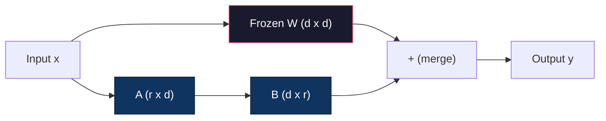
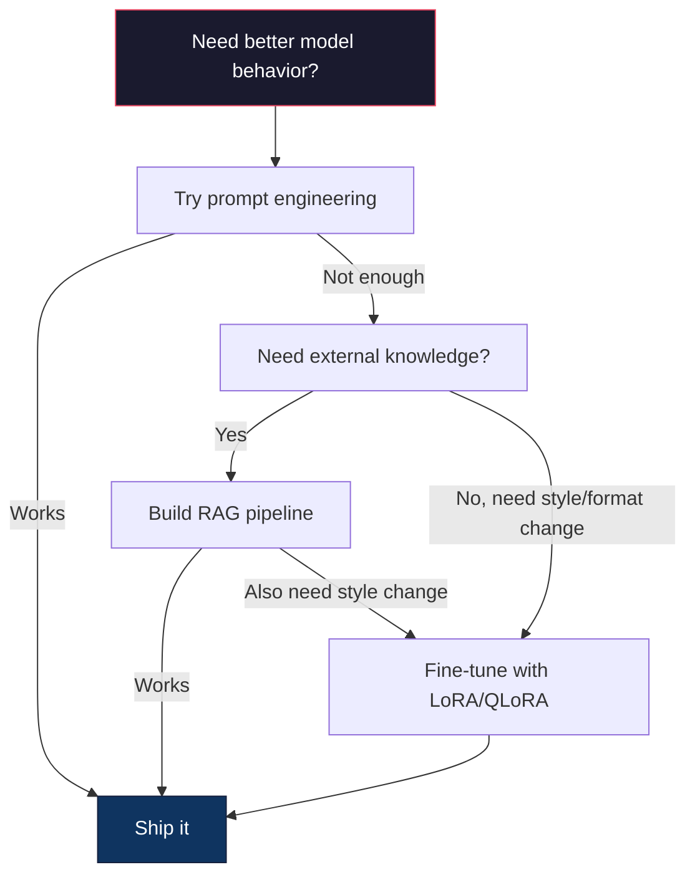

# LoRA & QLoRA로 하는 파인튜닝(Fine-Tuning)

> 7B 모델(model)을 완전 파인튜닝(full fine-tuning)하려면 56GB의 VRAM이 필요하다. 당신은 그것을 갖고 있지 않다. 대부분의 회사도 마찬가지다. LoRA는 파라미터(parameter)의 1% 미만을 학습시켜 같은 모델을 6GB에서 파인튜닝하게 해준다. 이것은 타협이 아니다 -- 대부분의 작업에서 완전 파인튜닝 품질과 대등하다. 오픈소스 파인튜닝 생태계 전체가 이 한 가지 트릭 위에서 돌아간다.

**Type:** Build
**Languages:** Python
**Prerequisites:** Phase 10, Lesson 06 (Instruction Tuning / SFT)
**Time:** ~75분
**Related:** Phase 10은 SFT/DPO 루프를 밑바닥부터 다룬다. 이 레슨은 그것들을 2026년 PEFT 툴킷(PEFT, TRL, Unsloth, Axolotl, LLaMA-Factory)에 연결한다.

## 학습 목표 (Learning Objectives)

- 저랭크 어댑터 행렬(A와 B)을 사전 학습된 모델의 어텐션(attention) 층(layer)에 주입해 LoRA 구현하기
- LoRA vs 완전 파인튜닝의 파라미터 절약 계산하기: d_model 차원의 랭크 r은 d^2 대신 2*r*d개의 파라미터를 학습한다
- QLoRA(4비트 양자화된 베이스 + LoRA 어댑터)를 사용해 소비자용 GPU 메모리 안에 들어맞게 모델 파인튜닝하기
- 배포(deployment)를 위해 LoRA 가중치(weight)를 베이스 모델에 다시 병합하고 어댑터가 있을 때와 없을 때의 추론(inference) 속도 비교하기

## 문제 (The Problem)

당신에게 베이스 모델이 있다. Llama 3 8B. 당신은 그것이 회사의 목소리로 고객 지원 티켓에 답하기를 원한다. SFT가 답이다. 그러나 SFT에는 비용 문제가 있다.

완전 파인튜닝은 모델의 모든 파라미터를 갱신한다. Llama 3 8B는 80억 개의 파라미터를 갖는다. fp16에서 각 파라미터는 2바이트를 차지한다. 가중치를 로드하는 데만 16GB다. 학습 중에는 그래디언트(gradient)(16GB), Adam을 위한 옵티마이저(optimizer) 상태(모멘텀 + 분산에 32GB), 그리고 활성값(activation)도 필요하다. 합계: 단일 8B 모델에 대략 56GB의 VRAM.

A100 80GB는 이것을 간신히 담을 수 있다. A100 두 개는 클라우드 프로바이더에서 시간당 $3-4가 든다. 50,000개 예시에 3 에폭(epoch) 학습하는 데 6-10시간이 걸린다. 그것은 실험당 $30-40이다. 하이퍼파라미터(hyperparameter)를 제대로 맞추려고 실험을 10번 돌리면 어떤 것도 배포하기 전에 $400을 썼다.

이것을 Llama 3 70B로 확장하면 숫자가 터무니없어진다. 가중치만으로 140GB. 클러스터가 필요하다. 실험당 $100+.

더 깊은 문제도 있다. 완전 파인튜닝은 모델의 모든 가중치를 수정한다. 고객 지원 데이터로 파인튜닝하면, 모델의 일반 능력을 저하시킬 수 있다. 그것을 파국적 망각(catastrophic forgetting)이라고 부른다. 모델은 당신의 작업에는 더 나아지고 다른 모든 것에는 더 나빠진다.

당신은 더 적은 파라미터를 학습하고, 더 적은 메모리를 쓰며, 모델의 기존 지식을 파괴하지 않는 방법이 필요하다.

## 개념 (The Concept)

### LoRA: 저랭크 적응 (LoRA: Low-Rank Adaptation)

Microsoft의 Edward Hu와 동료들은 2021년 6월에 LoRA를 발표했다. 논문의 통찰: 파인튜닝 중의 가중치 갱신은 낮은 내재적 랭크(intrinsic rank)를 갖는다. 4096x4096 가중치 행렬(matrix)의 1670만 개 파라미터를 모두 갱신할 필요가 없다. 갱신의 유용한 정보는 랭크 16 또는 32의 행렬로 포착될 수 있다.

여기 수학이 있다. 표준 선형 층은 다음을 계산한다:

```
y = Wx
```

여기서 W는 d_out x d_in 행렬이다. 4096x4096 어텐션 투영의 경우, 그것은 16,777,216개의 파라미터다.

LoRA는 W를 동결하고 저랭크 분해를 더한다:

```
y = Wx + BAx
```

여기서 B는 (d_out x r)이고 A는 (r x d_in)이다. 랭크 r은 d보다 훨씬 작다 -- 보통 8, 16, 또는 32.

4096x4096 층에서 r=16의 경우:
- 원래 파라미터: 4096 x 4096 = 16,777,216
- LoRA 파라미터: (4096 x 16) + (16 x 4096) = 65,536 + 65,536 = 131,072
- 감소: 131,072 / 16,777,216 = 0.78%

당신은 파라미터의 0.78%를 학습하고 품질의 95-100%를 얻고 있다.



A는 무작위 가우시안으로 초기화된다. B는 0으로 초기화된다. 이것은 LoRA 기여가 0에서 시작한다는 뜻이다 -- 모델은 원래 행동에서 학습을 시작해 점진적으로 적응을 배운다.

### 스케일링 계수: 알파 (The Scaling Factor: Alpha)

LoRA는 저랭크 갱신이 출력에 얼마나 영향을 주는지 제어하는 스케일링 계수 알파(alpha)를 도입한다:

```
y = Wx + (alpha / r) * BAx
```

alpha = r일 때, 스케일링은 1배다. alpha = 2r(흔한 기본값)일 때, 스케일링은 2배다. 이 하이퍼파라미터는 베이스 학습률과 독립적으로 LoRA 경로의 학습률(learning rate)을 제어한다.

실용적 가이드:
- alpha = 2 * rank는 흔한 커뮤니티 관례다(원조 논문은 대부분의 실험에서 alpha = rank를 사용했다)
- alpha = rank는 1배 스케일링을 주며, 보수적이지만 안정적이다
- 더 높은 alpha는 스텝당 더 큰 갱신을 뜻하며, 수렴(convergence)을 빠르게 하거나 불안정을 일으킬 수 있다

### LoRA를 어디에 적용할까 (Where to Apply LoRA)

트랜스포머(transformer)에는 많은 선형 층이 있다. 그것들 모두에 LoRA를 추가할 필요는 없다. 원조 논문은 다른 조합을 테스트했다:

| Target Layers | Trainable Params (7B) | Quality |
|--------------|----------------------|---------|
| q_proj only | 4.7M | Good |
| q_proj + v_proj | 9.4M | Better |
| q_proj + k_proj + v_proj + o_proj | 18.9M | Best for attention |
| All linear (attention + MLP) | 37.7M | Marginal gain, 2x params |

대부분의 작업에 대한 최적 지점: q_proj + v_proj. 이것은 셀프 어텐션(self-attention)의 쿼리와 값 투영을 겨냥하며, 모델이 무엇에 어텐션하고 어떤 정보를 추출하는지를 제어한다. MLP 층을 추가하면 코드 생성 같은 복잡한 작업에는 도움이 되지만 더 단순한 작업에서는 수확 체감을 위해 파라미터 수를 두 배로 늘린다.

### 랭크 선택 (Rank Selection)

랭크 r은 적응의 표현력을 제어한다:

| Rank | Trainable Params (per layer) | Best For |
|------|---------------------------|----------|
| 4 | 32,768 | Simple classification, sentiment |
| 8 | 65,536 | Single-domain Q&A, summarization |
| 16 | 131,072 | Multi-domain tasks, instruction following |
| 32 | 262,144 | Complex reasoning, code generation |
| 64 | 524,288 | Diminishing returns for most tasks |
| 128 | 1,048,576 | Rarely justified |

Hu et al.은 r=4가 이미 단순한 작업에 대한 적응의 대부분을 포착한다는 것을 보였다. r=8과 r=16이 실제로 가장 흔한 선택이다. r=64를 넘어서는 것은 품질을 거의 개선하지 않으며 LoRA의 메모리 이점을 잃기 시작한다.

### QLoRA: 4비트 양자화 + LoRA (QLoRA: 4-Bit Quantization + LoRA)

University of Washington의 Tim Dettmers와 동료들은 2023년 5월에 QLoRA를 발표했다. 아이디어: 동결된 베이스 모델을 4비트 정밀도로 양자화한 다음, 그 위에 fp16으로 LoRA 어댑터를 붙인다.

이것은 메모리 방정식을 극적으로 바꾼다:

| Method | Weight Memory (7B) | Training Memory (7B) | GPU Required |
|--------|-------------------|---------------------|-------------|
| Full fine-tune (fp16) | 14GB | ~56GB | 1x A100 80GB |
| LoRA (fp16 base) | 14GB | ~18GB | 1x A100 40GB |
| QLoRA (4-bit base) | 3.5GB | ~6GB | 1x RTX 3090 24GB |

QLoRA는 세 가지 기술적 기여를 한다:

**NF4(Normal Float 4-bit)**: 신경망(neural network) 가중치를 위해 특별히 설계된 새로운 데이터 타입. 신경망 가중치는 대략 정규 분포(probability distribution)를 따른다. NF4는 표준 정규 분포의 분위수에 16개의 양자화 수준을 배치한다. 이것은 정규 분포 데이터에 대해 정보 이론적으로 최적이다. 균등 4비트 양자화(INT4)나 표준 Float4보다 정보를 덜 잃는다.

**이중 양자화(Double quantization)**: 양자화 상수 자체가 메모리를 차지한다. 64개 가중치의 각 블록은 fp32 스케일 계수(4바이트)가 필요하다. 7B 모델의 경우, 그것은 추가 0.4GB다. 이중 양자화는 이 상수를 fp8로 양자화해, 오버헤드를 0.1GB로 줄인다. 작지만 누적된다.

**페이지드 옵티마이저(Paged optimizers)**: 학습 중, 옵티마이저 상태(Adam의 모멘텀과 분산)는 긴 시퀀스에서 GPU 메모리를 초과할 수 있다. 페이지드 옵티마이저는 NVIDIA의 통합 메모리를 사용해 GPU 메모리가 소진되면 옵티마이저 상태를 CPU RAM으로 자동으로 페이지 아웃하고, 필요할 때 다시 페이지 인한다. 이것은 약간의 처리량(throughput)을 대가로 OOM 충돌을 방지한다.

### 품질 문제 (The Quality Question)

파라미터를 줄이거나 베이스를 양자화하는 것이 품질을 해치는가? 여러 논문의 결과:

| Method | MMLU (5-shot) | MT-Bench | HumanEval |
|--------|--------------|----------|-----------|
| Full fine-tune (Llama 2 7B) | 48.3 | 6.72 | 14.6 |
| LoRA r=16 | 47.9 | 6.68 | 14.0 |
| QLoRA r=16 (NF4) | 47.5 | 6.61 | 13.4 |
| QLoRA r=64 (NF4) | 48.1 | 6.70 | 14.2 |

r=16의 LoRA는 대부분의 벤치마크(benchmark)에서 완전 파인튜닝의 1% 이내다. r=16의 QLoRA는 또 다른 1% 미만을 잃는다. r=64의 QLoRA는 90% 적은 메모리를 쓰면서 본질적으로 완전 파인튜닝과 대등하다.

### 실제 비용 (Real-World Costs)

Llama 3 8B를 50,000개 예시(3 에폭)로 파인튜닝:

| Method | GPU | Time | Cost |
|--------|-----|------|------|
| Full fine-tune | 2x A100 80GB | 8 hours | ~$32 |
| LoRA r=16 | 1x A100 40GB | 4 hours | ~$8 |
| QLoRA r=16 | 1x RTX 4090 24GB | 6 hours | ~$5 |
| QLoRA r=16 (Unsloth) | 1x RTX 4090 24GB | 2.5 hours | ~$2 |
| QLoRA r=16 | 1x T4 16GB | 12 hours | ~$4 |

단일 소비자용 GPU에서의 QLoRA는 점심값보다 적게 든다. 이것이 오픈웨이트 파인튜닝 커뮤니티가 2023년에 폭발한 이유이고 아래의 모든 학습 프레임워크가 2026년에 QLoRA를 기본으로 출시하는 이유다.

### 2026년 PEFT 스택 (The 2026 PEFT stack)

| Framework | What it is | Pick when |
|-----------|-----------|-----------|
| **Hugging Face PEFT** | 정전적 LoRA/QLoRA/DoRA/IA3 라이브러리 | 원시 제어를 원하고 학습 루프가 이미 `transformers.Trainer` 위에 있을 때 |
| **TRL** | HF의 피드백 기반 강화 학습 트레이너(SFT, DPO, GRPO, PPO, ORPO) | SFT 후 DPO/GRPO가 필요할 때; PEFT 위에 구축됨 |
| **Unsloth** | 순방향/역방향 패스의 Triton 커널 재작성 | 정확도 손실 없이 2-5배 속도 향상 + 절반의 VRAM을 원할 때; Llama/Mistral/Qwen 계열 |
| **Axolotl** | PEFT + TRL + DeepSpeed + Unsloth 위의 YAML 설정 래퍼 | 재현 가능하고 버전 관리되는 학습 실행을 원할 때 |
| **LLaMA-Factory** | PEFT + TRL 위의 GUI/CLI/API | 코드 없는 파인튜닝을 원할 때; 100개 이상 모델 계열 지원 |
| **torchtune** | `transformers` 의존성 없는 네이티브 PyTorch 레시피 | 최소 의존성을 원하고 조직이 이미 PyTorch로 표준화되어 있을 때 |

경험칙: 연구 용도 또는 일회성 실험 → PEFT. 반복 가능한 프로덕션(production) 파이프라인(pipeline) → Unsloth 커널을 활성화한 Axolotl. 버리는 프로토타이핑 → LLaMA-Factory.

### 어댑터 병합 (Merging Adapters)

학습 후, 당신에게는 두 가지가 있다: 동결된 베이스 모델과 작은 LoRA 어댑터(보통 10-100MB). 당신은 다음 중 하나를 할 수 있다:

1. **그것들을 분리해 둔다**: 베이스 모델을 로드하고, 그 위에 어댑터를 로드한다. 다른 작업을 위해 어댑터를 교체한다. 이것이 하나의 베이스 모델에서 여러 파인튜닝된 변형을 서빙하는 방법이다.

2. **그것들을 영구적으로 병합한다**: W' = W + (alpha/r) * BA를 계산하고 결과를 새로운 전체 모델로 저장한다. 병합된 모델은 원본과 같은 크기다. 추론 오버헤드 없음. 관리할 어댑터 없음.

여러 작업(고객 지원 어댑터, 코드 어댑터, 번역 어댑터)을 서빙하려면, 그것들을 분리해 둔다. 단일 특화 모델을 배포하려면, 병합한다.

여러 어댑터를 결합하기 위한 고급 병합 기법:

- **TIES-Merging**(Yadav et al. 2023): 작은 크기의 파라미터를 잘라내고, 부호 충돌을 해결한 다음, 병합한다. 어댑터 간 간섭을 줄인다.
- **DARE**(Yu et al. 2023): 병합 전에 어댑터 파라미터를 무작위로 떨어뜨리고 나머지를 재조정한다. 능력을 결합하는 데 놀랍도록 효과적이다.
- **태스크 산술(Task arithmetic)**: 단순히 어댑터 가중치를 더하거나 뺀다. "코드" 어댑터와 "수학" 어댑터를 더하면 종종 둘 다 잘하는 모델이 나온다.

### 파인튜닝하지 말아야 할 때 (When NOT to Fine-Tune)

파인튜닝은 세 번째 옵션이지 첫 번째가 아니다.

**첫째: 프롬프트 엔지니어링.** 더 나은 시스템 프롬프트를 써라. 퓨샷(few-shot) 예시를 추가하라. 사고 연쇄(chain-of-thought)를 사용하라. 이것은 비용이 없고 몇 분이 걸린다. 프롬프팅이 당신을 거기까지 80% 데려간다면, 아마 파인튜닝할 필요가 없다.

**둘째: RAG.** 모델이 당신의 특정 데이터(문서, 지식 베이스, 제품 카탈로그)에 대해 알아야 한다면, 검색이 그것을 가중치에 구워 넣는 것보다 더 저렴하고 유지보수 가능하다. Lesson 06을 보라.

**셋째: 파인튜닝.** 프롬프팅으로 달성할 수 없는 특정 스타일, 형식, 추론 패턴을 모델이 채택해야 할 때 이것을 사용하라. 일관된 구조화된 출력이 필요할 때. 더 큰 모델을 더 작은 모델로 증류해야 할 때. 지연 시간(latency)이 중요하고 퓨샷 프롬프팅의 추가 토큰을 감당할 수 없을 때.



## 직접 만들기 (Build It)

우리는 순수 PyTorch로 LoRA를 밑바닥부터 구현한다. 라이브러리 없음. 마법 없음. 당신은 LoRA 층을 만들고, 모델에 주입하고, 학습시키고, 가중치를 다시 병합할 것이다.

### 1단계: LoRA 층

```python
import torch
import torch.nn as nn
import math

class LoRALayer(nn.Module):
    def __init__(self, in_features, out_features, rank=8, alpha=16):
        super().__init__()
        self.rank = rank
        self.alpha = alpha
        self.scaling = alpha / rank

        self.A = nn.Parameter(torch.randn(in_features, rank) * (1 / math.sqrt(rank)))
        self.B = nn.Parameter(torch.zeros(rank, out_features))

    def forward(self, x):
        return (x @ self.A @ self.B) * self.scaling
```

A는 스케일된 무작위 값으로 초기화된다. B는 0으로 초기화된다. 곱 BA는 0에서 시작하므로, 모델은 원래 행동으로 시작한다.

### 2단계: LoRA로 감싼 선형 층

```python
class LinearWithLoRA(nn.Module):
    def __init__(self, linear, rank=8, alpha=16):
        super().__init__()
        self.linear = linear
        self.lora = LoRALayer(
            linear.in_features, linear.out_features, rank, alpha
        )

        for param in self.linear.parameters():
            param.requires_grad = False

    def forward(self, x):
        return self.linear(x) + self.lora(x)
```

원래 선형 층은 동결된다. LoRA 파라미터(A와 B)만 학습 가능하다.

### 3단계: 모델에 LoRA 주입

```python
def inject_lora(model, target_modules, rank=8, alpha=16):
    for param in model.parameters():
        param.requires_grad = False

    lora_layers = {}
    for name, module in model.named_modules():
        if isinstance(module, nn.Linear):
            if any(t in name for t in target_modules):
                parent_name = ".".join(name.split(".")[:-1])
                child_name = name.split(".")[-1]
                parent = dict(model.named_modules())[parent_name]
                lora_linear = LinearWithLoRA(module, rank, alpha)
                setattr(parent, child_name, lora_linear)
                lora_layers[name] = lora_linear
    return lora_layers
```

먼저, 모델의 모든 파라미터를 동결한다. 그다음 모델 트리를 순회하며, 대상 이름과 일치하는 선형 층을 찾아, LoRA로 감싼 버전으로 교체한다. LoRA A와 B 행렬이 전체 모델에서 유일하게 학습 가능한 파라미터다.

### 4단계: 파라미터 세기

```python
def count_parameters(model):
    total = sum(p.numel() for p in model.parameters())
    trainable = sum(p.numel() for p in model.parameters() if p.requires_grad)
    frozen = total - trainable
    return {
        "total": total,
        "trainable": trainable,
        "frozen": frozen,
        "trainable_pct": 100 * trainable / total if total > 0 else 0
    }
```

### 5단계: 가중치 다시 병합

```python
def merge_lora_weights(model):
    for name, module in model.named_modules():
        if isinstance(module, LinearWithLoRA):
            with torch.no_grad():
                merged = (
                    module.lora.A @ module.lora.B
                ) * module.lora.scaling
                module.linear.weight.data += merged.T
            parent_name = ".".join(name.split(".")[:-1])
            child_name = name.split(".")[-1]
            if parent_name:
                parent = dict(model.named_modules())[parent_name]
            else:
                parent = model
            setattr(parent, child_name, module.linear)
```

병합 후, LoRA 층은 사라진다. 모델은 적응이 가중치에 구워진 채 원본과 같은 크기다. 추론 오버헤드 없음.

### 6단계: 시뮬레이션된 QLoRA 양자화

```python
def quantize_to_nf4(tensor, block_size=64):
    blocks = tensor.reshape(-1, block_size)
    scales = blocks.abs().max(dim=1, keepdim=True).values / 7.0
    scales = torch.clamp(scales, min=1e-8)
    quantized = torch.round(blocks / scales).clamp(-8, 7).to(torch.int8)
    return quantized, scales

def dequantize_from_nf4(quantized, scales, original_shape):
    dequantized = quantized.float() * scales
    return dequantized.reshape(original_shape)
```

이것은 64개 블록 내에서 가중치를 16개의 이산 수준으로 매핑해 4비트 양자화를 시뮬레이션한다. 프로덕션 QLoRA는 GPU에서 진짜 NF4를 위해 bitsandbytes 라이브러리를 사용한다.

### 7단계: 학습 루프

```python
def train_lora(model, data, epochs=5, lr=1e-3, batch_size=4):
    optimizer = torch.optim.AdamW(
        [p for p in model.parameters() if p.requires_grad], lr=lr
    )
    criterion = nn.MSELoss()

    losses = []
    for epoch in range(epochs):
        epoch_loss = 0.0
        n_batches = 0
        indices = torch.randperm(len(data["inputs"]))

        for i in range(0, len(indices), batch_size):
            batch_idx = indices[i:i + batch_size]
            x = data["inputs"][batch_idx]
            y = data["targets"][batch_idx]

            output = model(x)
            loss = criterion(output, y)

            optimizer.zero_grad()
            loss.backward()
            optimizer.step()

            epoch_loss += loss.item()
            n_batches += 1

        avg_loss = epoch_loss / n_batches
        losses.append(avg_loss)

    return losses
```

### 8단계: 전체 데모

```python
def demo():
    torch.manual_seed(42)
    d_model = 256
    n_classes = 10

    model = nn.Sequential(
        nn.Linear(d_model, 512),
        nn.ReLU(),
        nn.Linear(512, 512),
        nn.ReLU(),
        nn.Linear(512, n_classes),
    )

    n_samples = 500
    x = torch.randn(n_samples, d_model)
    y = torch.randint(0, n_classes, (n_samples,))
    y_onehot = torch.zeros(n_samples, n_classes).scatter_(1, y.unsqueeze(1), 1.0)

    data = {"inputs": x, "targets": y_onehot}

    params_before = count_parameters(model)

    lora_layers = inject_lora(
        model, target_modules=["0", "2"], rank=8, alpha=16
    )

    params_after = count_parameters(model)

    losses = train_lora(model, data, epochs=20, lr=1e-3)

    merge_lora_weights(model)
    params_merged = count_parameters(model)

    return {
        "params_before": params_before,
        "params_after": params_after,
        "params_merged": params_merged,
        "losses": losses,
    }
```

데모는 작은 모델을 만들고, 두 층에 LoRA를 주입하고, 학습시키고, 가중치를 다시 병합한다. 파라미터 수는 LoRA 학습 중에 완전 학습 가능에서 ~1% 학습 가능으로 떨어졌다가, 병합 후에는 원래 아키텍처로 돌아간다.

## 라이브러리로 써보기 (Use It)

Hugging Face 생태계로, 실제 모델에서의 LoRA는 약 20줄이 걸린다:

```python
from transformers import AutoModelForCausalLM, AutoTokenizer
from peft import LoraConfig, get_peft_model, TaskType

model = AutoModelForCausalLM.from_pretrained("meta-llama/Llama-3.1-8B")
tokenizer = AutoTokenizer.from_pretrained("meta-llama/Llama-3.1-8B")

lora_config = LoraConfig(
    task_type=TaskType.CAUSAL_LM,
    r=16,
    lora_alpha=32,
    lora_dropout=0.05,
    target_modules=["q_proj", "v_proj"],
)

model = get_peft_model(model, lora_config)
model.print_trainable_parameters()
```

QLoRA의 경우, bitsandbytes 양자화를 추가한다:

```python
from transformers import BitsAndBytesConfig

bnb_config = BitsAndBytesConfig(
    load_in_4bit=True,
    bnb_4bit_quant_type="nf4",
    bnb_4bit_compute_dtype=torch.bfloat16,
    bnb_4bit_use_double_quant=True,
)

model = AutoModelForCausalLM.from_pretrained(
    "meta-llama/Llama-3.1-8B",
    quantization_config=bnb_config,
    device_map="auto",
)

model = get_peft_model(model, lora_config)
```

그게 전부다. 같은 학습 루프. 같은 데이터 파이프라인. 베이스 모델이 이제 4비트로 살고, LoRA 어댑터는 fp16으로 학습하며, 전체가 6GB에 들어맞는다.

Hugging Face Trainer로 학습:

```python
from transformers import TrainingArguments, Trainer
from datasets import load_dataset

dataset = load_dataset("tatsu-lab/alpaca", split="train[:5000]")

training_args = TrainingArguments(
    output_dir="./lora-llama",
    num_train_epochs=3,
    per_device_train_batch_size=4,
    gradient_accumulation_steps=4,
    learning_rate=2e-4,
    fp16=True,
    logging_steps=10,
    save_strategy="epoch",
    optim="paged_adamw_8bit",
)

trainer = Trainer(
    model=model,
    args=training_args,
    train_dataset=dataset,
)

trainer.train()

model.save_pretrained("./lora-adapter")
```

저장된 어댑터는 10-100MB다. 베이스 모델은 건드리지 않은 채로 있다. 전체 모델을 재배포하지 않고 Hugging Face Hub에서 어댑터를 공유할 수 있다.

## 산출물 (Ship It)

이 레슨은 다음을 만든다:
- `outputs/prompt-lora-advisor.md` -- 당신의 특정 작업에 대한 LoRA 랭크, 대상 모듈, 하이퍼파라미터를 결정하는 데 도움을 주는 프롬프트
- `outputs/skill-fine-tuning-guide.md` -- 에이전트에게 언제 그리고 어떻게 파인튜닝할지에 대한 의사결정 트리를 가르치는 스킬

## 연습 문제 (Exercises)

1. **랭크 절제 연구.** 랭크 2, 4, 8, 16, 32, 64로 데모를 실행하라. 최종 손실 vs 랭크를 그래프로 그려라. 랭크를 두 배로 해도 더 이상 손실이 절반이 되지 않는 수확 체감 지점을 찾아라. 256차원 특성(feature)에 대한 단순 분류 작업의 경우, 이것은 r=8-16 근처여야 한다.

2. **대상 모듈 비교.** inject_lora를 수정해 층 "0"만, 층 "2"만, 층 "4"만, 그리고 셋 다를 겨냥하라. 각 변형을 20 에폭 학습시켜라. 수렴 속도와 최종 손실을 비교하라. 이것은 q_proj vs v_proj vs 모든 선형 층을 겨냥하는 실제 결정을 반영한다.

3. **양자화 오차 분석.** 학습된 모델의 가중치 행렬을 quantize_to_nf4 / dequantize_from_nf4 전후로 가져오라. 평균 제곱 오차, 최대 절대 오차, 원본과 재구성된 가중치 사이의 상관관계를 계산하라. block_size 값 32, 64, 128, 256으로 실험하라.

4. **다중 어댑터 서빙.** 데이터의 다른 부분집합(짝수 인덱스 vs 홀수 인덱스)으로 두 개의 LoRA 어댑터를 학습시켜라. 두 어댑터를 모두 저장하라. 베이스 모델을 한 번 로드한 다음, 어댑터를 교체하고 각각이 같은 입력에 다른 출력을 만드는지 확인하라. 이것이 프로덕션 시스템이 하나의 베이스에서 여러 파인튜닝된 모델을 서빙하는 방법이다.

5. **병합 vs 비병합 추론.** 같은 100개 입력에서 merge_lora_weights 전후의 LoRA 모델 출력을 비교하라. 출력이 동일한지(부동소수점 허용 오차 1e-5 이내) 확인하라. 그다음 둘 다의 추론 속도를 벤치마크하라 -- 병합된 것은 두 번이 아니라 단일 행렬 곱셈이므로 약간 더 빨라야 한다.

## 핵심 용어 (Key Terms)

| 용어 | 사람들이 말하는 것 | 실제 의미 |
|------|----------------|----------------------|
| LoRA | "효율적 파인튜닝" | Low-Rank Adaptation: 베이스 가중치를 동결하고, 그 곱이 전체 가중치 갱신을 근사하는 두 개의 작은 행렬 A와 B를 학습하는 것 |
| QLoRA | "노트북에서 파인튜닝" | Quantized LoRA: 베이스 모델을 4비트 NF4로 로드하고, 그 위에 fp16으로 LoRA 어댑터를 학습해, 6GB VRAM에서 7B 파인튜닝을 가능하게 함 |
| 랭크(Rank, r) | "모델이 얼마나 배울 수 있는가" | A와 B 행렬의 내부 차원; 표현력 vs 파라미터 수를 제어 |
| 알파(Alpha) | "LoRA 학습률" | LoRA 출력에 적용되는 스케일링 계수; alpha/r은 적응의 최종 출력에 대한 기여를 스케일링 |
| NF4 | "4비트 양자화" | Normal Float 4: 정규 분포 분위수에 양자화 수준을 가진 4비트 데이터 타입, 신경망 가중치에 최적 |
| 어댑터(Adapter) | "학습된 작은 부분" | 별도 파일(10-100MB)로 저장된 LoRA A와 B 행렬, 베이스 모델의 어떤 복사본 위에도 로드 가능 |
| 대상 모듈(Target modules) | "어느 층에 LoRA를 할까" | LoRA 어댑터가 주입되는 특정 선형 층(q_proj, v_proj 등) |
| 병합(Merging) | "구워 넣기" | W + (alpha/r) * BA를 계산하고 원래 가중치를 교체해, 추론 시 어댑터 오버헤드를 없애는 것 |
| 페이지드 옵티마이저(Paged optimizers) | "학습 중 OOM 나지 않기" | GPU 메모리가 소진되면 옵티마이저 상태(Adam 모멘텀, 분산)를 CPU로 오프로드하는 것 |
| 파국적 망각(Catastrophic forgetting) | "파인튜닝이 다른 모든 것을 망가뜨렸다" | 모든 가중치를 갱신하는 것이 모델이 이전에 학습한 능력을 잃게 만드는 경우 |

## 더 읽을거리 (Further Reading)

- Hu et al., "LoRA: Low-Rank Adaptation of Large Language Models" (2021) -- 저랭크 분해 방법을 도입한 원조 논문, GPT-3 175B에서 랭크를 4만큼 낮게 테스트
- Dettmers et al., "QLoRA: Efficient Finetuning of Quantized Language Models" (2023) -- NF4, 이중 양자화, 페이지드 옵티마이저를 도입해, 단일 48GB GPU에서 65B 파인튜닝을 가능하게 함
- PEFT library documentation (huggingface.co/docs/peft) -- Hugging Face 생태계에서 LoRA, QLoRA, 기타 파라미터 효율적 방법을 위한 표준 라이브러리
- Yadav et al., "TIES-Merging: Resolving Interference When Merging Models" (2023) -- 품질 저하 없이 여러 LoRA 어댑터를 결합하는 기법
- [Rafailov et al., "Direct Preference Optimization: Your Language Model is Secretly a Reward Model" (NeurIPS 2023)](https://arxiv.org/abs/2305.18290) -- DPO 유도; SFT 후에 오는 선호 튜닝 단계, 보상 모델 불필요
- [TRL documentation](https://huggingface.co/docs/trl/) -- `SFTTrainer`, `DPOTrainer`, `KTOTrainer`, 그리고 PEFT/bitsandbytes/Unsloth와의 통합 표면에 대한 공식 참조
- [Unsloth documentation](https://docs.unsloth.ai/) -- 파인튜닝 처리량을 두 배로 하고 메모리를 절반으로 하는 융합 커널; TRL 아래의 성능 계층
- [Axolotl documentation](https://axolotl-ai-cloud.github.io/axolotl/) -- YAML로 설정되는 다중 GPU SFT/DPO/QLoRA 트레이너; 손으로 쓴 스크립트의 config-as-code 대안
