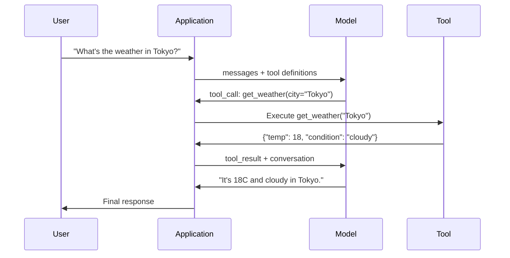

# 함수 호출(Function Calling)과 도구 사용(Tool Use)

> LLM은 아무것도 할 수 없다. 텍스트를 생성한다. 그것이 능력 전부다. 날씨를 확인할 수도, 데이터베이스를 쿼리할 수도, 이메일을 보낼 수도, 코드를 실행할 수도, 파일을 읽을 수도 없다. 당신이 본 모든 "AI 에이전트(agent)"는 어느 함수를 호출할지 말하는 JSON을 생성하는 LLM이다 -- 그리고 그것을 실제로 호출하는 것은 당신의 코드다. 모델(model)은 두뇌다. 도구는 손이다. 함수 호출은 그것들을 잇는 신경계다.

**Type:** Build
**Languages:** Python
**Prerequisites:** Phase 11 Lesson 03 (Structured Outputs)
**Time:** ~75분
**Related:** Phase 11 · 14 (Model Context Protocol) — 도구가 여러 호스트에 걸쳐 공유될 때, 인라인 함수 호출에서 MCP 서버로 졸업한다. 이 레슨은 인라인 경우를 다룬다; MCP는 프로토콜 경우를 다룬다.

## 학습 목표 (Learning Objectives)

- 함수 호출 루프 구현하기: 도구 스키마 정의, 모델의 도구 호출 JSON 파싱, 함수 실행, 결과 반환
- 모델이 신뢰성 있게 호출할 수 있는, 명확한 설명과 타입이 지정된 파라미터를 가진 도구 스키마 설계하기
- 복잡한 쿼리에 답하기 위해 여러 함수 호출을 연결하는 다중 턴 에이전트 루프 만들기
- 함수 호출 엣지 케이스(edge case) 처리하기: 병렬 도구 호출, 오류 전파, 무한 도구 루프 방지

## 문제 (The Problem)

당신은 챗봇을 만든다. 사용자가 묻는다: "What's the weather in Tokyo right now?"

모델이 응답한다: "I don't have access to real-time weather data, but based on the season, Tokyo is likely around 15 degrees Celsius..."

그것은 면책 문구로 차려입은 환각이다. 모델은 날씨를 모른다. 영원히 모를 것이다. 날씨는 매시간 바뀐다. 모델의 학습 데이터는 몇 달 전 것이다.

올바른 답은 OpenWeatherMap API를 호출하고, 현재 기온을 얻고, 실제 숫자를 반환해야 한다. 모델은 API를 호출할 수 없다. 당신의 코드는 할 수 있다. 빠진 조각: 모델이 "이 인수로 날씨 API를 호출해야 한다"고 말하게 하고 당신의 코드가 그것을 실행해 결과를 다시 입력하게 하는 구조화된 프로토콜.

이것이 함수 호출이다. 모델은 어느 함수를 어떤 인수로 호출할지 기술하는 구조화된 JSON을 출력한다. 당신의 애플리케이션이 함수를 실행한다. 결과가 대화로 다시 들어간다. 모델은 그 결과를 사용해 최종 답을 만든다.

함수 호출 없이는, LLM은 백과사전이다. 그것이 있으면, 에이전트가 된다.

## 개념 (The Concept)

### 함수 호출 루프 (The Function Calling Loop)

모든 도구 사용 상호작용은 같은 5단계 루프를 따른다.



1단계: 사용자가 메시지를 보낸다. 2단계: 모델이 도구 정의(사용 가능한 함수를 기술하는 JSON Schema)와 함께 메시지를 받는다. 3단계: 텍스트로 응답하는 대신, 모델은 도구 호출을 출력한다 -- 함수 이름과 인수를 가진 구조화된 JSON 객체. 4단계: 당신의 코드가 함수를 실행하고 결과를 포착한다. 5단계: 결과가 모델로 다시 가고, 모델은 이제 최종 답을 만들 실제 데이터를 갖는다.

모델은 결코 아무것도 실행하지 않는다. 무엇을 어떤 인수로 호출할지만 결정한다. 당신의 코드가 실행기다.

### 도구 정의: JSON Schema 계약 (Tool Definitions: The JSON Schema Contract)

각 도구는 함수가 무엇을 하는지, 어떤 인수를 받는지, 그 인수가 어떤 타입이어야 하는지를 모델에게 알려주는 JSON Schema로 정의된다.

```json
{
  "type": "function",
  "function": {
    "name": "get_weather",
    "description": "Get current weather for a city. Returns temperature in Celsius and conditions.",
    "parameters": {
      "type": "object",
      "properties": {
        "city": {
          "type": "string",
          "description": "City name, e.g. 'Tokyo' or 'San Francisco'"
        },
        "units": {
          "type": "string",
          "enum": ["celsius", "fahrenheit"],
          "description": "Temperature units"
        }
      },
      "required": ["city"]
    }
  }
}
```

`description` 필드가 결정적이다. 모델은 언제 그리고 어떻게 도구를 사용할지 결정하기 위해 그것들을 읽는다. "gets weather" 같은 모호한 설명은 "Get current weather for a city. Returns temperature in Celsius and conditions."보다 더 나쁜 도구 선택을 만든다. 설명은 도구 선택을 위한 프롬프트(prompt)다.

### 프로바이더 비교 (Provider Comparison)

모든 주요 프로바이더가 함수 호출을 지원하지만, API 표면은 다르다.

| Provider | API Parameter | Tool Call Format | Parallel Calls | Forced Calling |
|----------|--------------|-----------------|---------------|----------------|
| OpenAI (GPT-5, o4) | `tools` | `tool_calls[].function` | Yes (multiple per turn) | `tool_choice="required"` |
| Anthropic (Claude 4.6/4.7) | `tools` | `content[].type="tool_use"` | Yes (multiple blocks) | `tool_choice={"type":"any"}` |
| Google (Gemini 3) | `function_declarations` | `functionCall` | Yes | `function_calling_config` |
| Open-weight (Llama 4, Qwen3, DeepSeek-V3) | Native `tools` on Llama 4; Hermes or ChatML on others | Mixed | Model-dependent | Prompt-based or `tool_choice` if supported |

2026년까지 세 개의 비공개 프로바이더는 거의 동일한 JSON-Schema 기반 형식으로 수렴했다. Llama 4는 OpenAI의 형태와 일치하는 네이티브 `tools` 필드를 갖고 출시된다. 오픈웨이트 파인튜닝(fine-tuning)은 여전히 다양하다 — Hermes 형식(NousResearch)이 서드파티 파인튜닝에 가장 흔하다. 여러 호스트에 걸친 공유 도구의 경우, 인라인 함수 호출보다 MCP(Phase 11 · 14)를 선호하라 — 서버가 그들 모두에게 동일하다.

### 도구 선택: 자동, 필수, 특정 (Tool Choice: Auto, Required, Specific)

모델이 언제 도구를 사용할지 당신이 제어한다.

**자동(Auto)** (기본값): 모델이 도구를 호출할지 직접 응답할지 결정한다. "What's 2+2?" -- 직접 응답한다. "What's the weather?" -- 도구를 호출한다.

**필수(Required)**: 모델이 적어도 하나의 도구를 호출해야 한다. 사용자 의도가 도구를 필요로 한다는 것을 알 때 사용하라. 모델이 실제 데이터를 찾아보는 대신 추측하는 것을 방지한다.

**특정 함수(Specific function)**: 모델이 특정 함수를 호출하도록 강제한다. `tool_choice={"type":"function", "function": {"name": "get_weather"}}`는 쿼리와 무관하게 날씨 도구가 호출됨을 보장한다. 라우팅에 사용하라 -- 상위 로직이 이미 어느 도구가 필요한지 결정했을 때.

### 병렬 함수 호출 (Parallel Function Calling)

GPT-4o와 Claude는 단일 턴에서 여러 함수를 호출할 수 있다. 사용자가 묻는다: "What's the weather in Tokyo and New York?" 모델은 두 도구 호출을 동시에 출력한다:

```json
[
  {"name": "get_weather", "arguments": {"city": "Tokyo"}},
  {"name": "get_weather", "arguments": {"city": "New York"}}
]
```

당신의 코드는 둘 다 실행하고(이상적으로는 동시에), 두 결과를 반환하고, 모델은 하나의 응답을 합성한다. 이것은 왕복(round trip)을 2에서 1로 줄인다. 쿼리당 5-10개의 도구 호출을 하는 에이전트의 경우, 병렬 호출은 지연 시간(latency)을 60-80% 줄인다.

### 구조화된 출력 vs 함수 호출 (Structured Outputs vs Function Calling)

Lesson 03은 구조화된 출력(structured output)을 다뤘다. 함수 호출은 같은 JSON Schema 기계를 사용하지만, 다른 목적을 위해서다.

**구조화된 출력**: 모델이 특정 형태로 데이터를 만들도록 강제한다. 출력이 최종 산물이다. 예: 텍스트에서 제품 정보를 `{name, price, in_stock}`으로 추출.

**함수 호출**: 모델이 행동을 실행할 의도를 선언한다. 출력이 중간 단계다. 예: `get_weather(city="Tokyo")` -- 모델은 최종 답을 만드는 것이 아니라 행동을 요청하고 있다.

데이터 추출을 원할 때 구조화된 출력을 사용하라. 모델이 외부 시스템과 상호작용하기를 원할 때 함수 호출을 사용하라.

### 보안: 타협 불가 규칙 (Security: The Non-Negotiable Rules)

함수 호출은 LLM에게 줄 수 있는 가장 위험한 능력이다. 모델이 무엇을 실행할지 고른다. 당신의 도구 집합에 데이터베이스 쿼리가 포함되면, 모델이 쿼리를 구성한다. 셸 명령이 포함되면, 모델이 그것들을 쓴다.

**규칙 1: 모델이 생성한 SQL을 데이터베이스에 직접 넘기지 말라.** 모델은 DROP TABLE, UNION 주입, 또는 모든 행을 반환하는 쿼리를 생성할 수 있고 그렇게 할 것이다. 항상 매개변수화하라. 항상 검증하라. 항상 연산의 허용 목록(allowlist)을 사용하라.

**규칙 2: 함수를 허용 목록에 둔다.** 모델은 당신이 명시적으로 정의한 함수만 호출할 수 있다. 절대 "이름으로 임의의 함수를 실행"하는 범용 도구를 만들지 말라. 50개의 내부 함수가 있다면, 사용자가 필요한 5개만 노출하라.

**규칙 3: 인수를 검증한다.** 모델은 `"; DROP TABLE users; --"` 같은 도시 이름을 넘길 수 있다. 실행 전에 모든 인수를 기대 타입, 범위, 형식에 대해 검증하라.

**규칙 4: 도구 결과를 위생 처리한다.** 도구가 민감한 데이터(API 키, PII, 내부 오류)를 반환하면, 모델로 다시 보내기 전에 필터링하라. 모델은 도구 결과를 응답에 그대로 포함할 것이다.

**규칙 5: 도구 호출을 속도 제한한다.** 루프에 빠진 모델은 도구를 수백 번 호출할 수 있다. 최댓값을 설정하라(대화당 10-20번 호출이 합리적이다). 무한 루프를 끊어라.

### 오류 처리 (Error Handling)

도구는 실패한다. API는 타임아웃된다. 데이터베이스는 다운된다. 파일은 존재하지 않는다. 모델은 도구가 언제 그리고 왜 실패하는지 알아야 한다.

오류를 예외가 아니라 구조화된 도구 결과로 반환하라:

```json
{
  "error": true,
  "message": "City 'Toky' not found. Did you mean 'Tokyo'?",
  "code": "CITY_NOT_FOUND"
}
```

모델은 이것을 읽고, 인수를 조정하고, 재시도한다. 모델은 구조화된 오류 메시지에서 자기 교정을 잘한다. 빈 응답이나 일반적인 "something went wrong" 오류에서 회복하는 데는 서툴다.

### MCP: Model Context Protocol

MCP는 도구 상호운용성을 위한 Anthropic의 오픈 표준이다. 모든 애플리케이션이 자체 도구를 정의하는 대신, MCP는 보편적 프로토콜을 제공한다: 도구는 MCP 서버가 제공하고, MCP 클라이언트(Claude Code, Cursor, 또는 당신의 애플리케이션 같은)가 소비한다.

하나의 MCP 서버가 어느 호환 클라이언트에든 도구를 노출할 수 있다. Postgres MCP 서버는 어느 MCP 호환 에이전트에든 데이터베이스 접근을 준다. GitHub MCP 서버는 어느 에이전트에든 리포지토리 접근을 준다. 도구는 한 번 정의되고, 어디서나 사용된다.

MCP는 함수 호출에게 HTTP가 네트워킹에게 그러한 것이다. 그것은 전송 계층을 표준화해 도구가 이식 가능해지게 한다.

## 직접 만들기 (Build It)

### 1단계: 도구 레지스트리 정의

도구 정의와 그 구현을 저장하는 레지스트리를 만든다. 각 도구는 JSON Schema 정의(모델이 보는 것)와 Python 함수(당신의 코드가 실행하는 것)를 갖는다.

```python
import json
import math
import time
import hashlib


TOOL_REGISTRY = {}


def register_tool(name, description, parameters, function):
    TOOL_REGISTRY[name] = {
        "definition": {
            "type": "function",
            "function": {
                "name": name,
                "description": description,
                "parameters": parameters,
            },
        },
        "function": function,
    }
```

### 2단계: 5개 도구 구현

계산기, 날씨 조회, 웹 검색 시뮬레이터, 파일 리더, 코드 러너를 만든다.

```python
def calculator(expression, precision=2):
    allowed = set("0123456789+-*/.() ")
    if not all(c in allowed for c in expression):
        return {"error": True, "message": f"Invalid characters in expression: {expression}"}
    try:
        result = eval(expression, {"__builtins__": {}}, {"math": math})
        return {"result": round(float(result), precision), "expression": expression}
    except Exception as e:
        return {"error": True, "message": str(e)}


WEATHER_DB = {
    "tokyo": {"temp_c": 18, "condition": "cloudy", "humidity": 72, "wind_kph": 14},
    "new york": {"temp_c": 22, "condition": "sunny", "humidity": 45, "wind_kph": 8},
    "london": {"temp_c": 12, "condition": "rainy", "humidity": 88, "wind_kph": 22},
    "san francisco": {"temp_c": 16, "condition": "foggy", "humidity": 80, "wind_kph": 18},
    "sydney": {"temp_c": 25, "condition": "sunny", "humidity": 55, "wind_kph": 10},
}


def get_weather(city, units="celsius"):
    key = city.lower().strip()
    if key not in WEATHER_DB:
        suggestions = [c for c in WEATHER_DB if c.startswith(key[:3])]
        return {
            "error": True,
            "message": f"City '{city}' not found.",
            "suggestions": suggestions,
            "code": "CITY_NOT_FOUND",
        }
    data = WEATHER_DB[key].copy()
    if units == "fahrenheit":
        data["temp_f"] = round(data["temp_c"] * 9 / 5 + 32, 1)
        del data["temp_c"]
    data["city"] = city
    return data


SEARCH_DB = {
    "python function calling": [
        {"title": "OpenAI Function Calling Guide", "url": "https://platform.openai.com/docs/guides/function-calling", "snippet": "Learn how to connect LLMs to external tools."},
        {"title": "Anthropic Tool Use", "url": "https://docs.anthropic.com/en/docs/tool-use", "snippet": "Claude can interact with external tools and APIs."},
    ],
    "MCP protocol": [
        {"title": "Model Context Protocol", "url": "https://modelcontextprotocol.io", "snippet": "An open standard for connecting AI models to data sources."},
    ],
    "weather API": [
        {"title": "OpenWeatherMap API", "url": "https://openweathermap.org/api", "snippet": "Free weather API with current, forecast, and historical data."},
    ],
}


def web_search(query, max_results=3):
    key = query.lower().strip()
    for db_key, results in SEARCH_DB.items():
        if db_key in key or key in db_key:
            return {"query": query, "results": results[:max_results], "total": len(results)}
    return {"query": query, "results": [], "total": 0}


FILE_SYSTEM = {
    "data/config.json": '{"model": "gpt-4o", "temperature": 0.7, "max_tokens": 4096}',
    "data/users.csv": "name,email,role\nAlice,alice@example.com,admin\nBob,bob@example.com,user",
    "README.md": "# My Project\nA tool-use agent built from scratch.",
}


def read_file(path):
    if ".." in path or path.startswith("/"):
        return {"error": True, "message": "Path traversal not allowed.", "code": "FORBIDDEN"}
    if path not in FILE_SYSTEM:
        available = list(FILE_SYSTEM.keys())
        return {"error": True, "message": f"File '{path}' not found.", "available_files": available, "code": "NOT_FOUND"}
    content = FILE_SYSTEM[path]
    return {"path": path, "content": content, "size_bytes": len(content), "lines": content.count("\n") + 1}


def run_code(code, language="python"):
    if language != "python":
        return {"error": True, "message": f"Language '{language}' not supported. Only 'python' is available."}
    forbidden = ["import os", "import sys", "import subprocess", "exec(", "eval(", "__import__", "open("]
    for pattern in forbidden:
        if pattern in code:
            return {"error": True, "message": f"Forbidden operation: {pattern}", "code": "SECURITY_VIOLATION"}
    try:
        local_vars = {}
        exec(code, {"__builtins__": {"print": print, "range": range, "len": len, "str": str, "int": int, "float": float, "list": list, "dict": dict, "sum": sum, "min": min, "max": max, "abs": abs, "round": round, "sorted": sorted, "enumerate": enumerate, "zip": zip, "map": map, "filter": filter, "math": math}}, local_vars)
        result = local_vars.get("result", None)
        return {"success": True, "result": result, "variables": {k: str(v) for k, v in local_vars.items() if not k.startswith("_")}}
    except Exception as e:
        return {"error": True, "message": f"{type(e).__name__}: {e}"}
```

### 3단계: 모든 도구 등록

```python
def register_all_tools():
    register_tool(
        "calculator", "Evaluate a mathematical expression. Supports +, -, *, /, parentheses, and decimals. Returns the numeric result.",
        {"type": "object", "properties": {"expression": {"type": "string", "description": "Math expression, e.g. '(10 + 5) * 3'"}, "precision": {"type": "integer", "description": "Decimal places in result", "default": 2}}, "required": ["expression"]},
        calculator,
    )
    register_tool(
        "get_weather", "Get current weather for a city. Returns temperature, condition, humidity, and wind speed.",
        {"type": "object", "properties": {"city": {"type": "string", "description": "City name, e.g. 'Tokyo' or 'San Francisco'"}, "units": {"type": "string", "enum": ["celsius", "fahrenheit"], "description": "Temperature units, defaults to celsius"}}, "required": ["city"]},
        get_weather,
    )
    register_tool(
        "web_search", "Search the web for information. Returns a list of results with title, URL, and snippet.",
        {"type": "object", "properties": {"query": {"type": "string", "description": "Search query"}, "max_results": {"type": "integer", "description": "Maximum results to return", "default": 3}}, "required": ["query"]},
        web_search,
    )
    register_tool(
        "read_file", "Read the contents of a file. Returns the file content, size, and line count.",
        {"type": "object", "properties": {"path": {"type": "string", "description": "Relative file path, e.g. 'data/config.json'"}}, "required": ["path"]},
        read_file,
    )
    register_tool(
        "run_code", "Execute Python code in a sandboxed environment. Set a 'result' variable to return output.",
        {"type": "object", "properties": {"code": {"type": "string", "description": "Python code to execute"}, "language": {"type": "string", "enum": ["python"], "description": "Programming language"}}, "required": ["code"]},
        run_code,
    )
```

### 4단계: 함수 호출 루프 만들기

이것이 핵심 엔진이다. 모델이 어느 도구를 호출할지 결정하는 것을 시뮬레이션하고, 도구를 실행하고, 결과를 다시 입력한다.

```python
def simulate_model_decision(user_message, tools, conversation_history):
    msg = user_message.lower()

    if any(word in msg for word in ["weather", "temperature", "forecast"]):
        cities = []
        for city in WEATHER_DB:
            if city in msg:
                cities.append(city)
        if not cities:
            for word in msg.split():
                if word.capitalize() in [c.title() for c in WEATHER_DB]:
                    cities.append(word)
        if not cities:
            cities = ["tokyo"]
        calls = []
        for city in cities:
            calls.append({"name": "get_weather", "arguments": {"city": city.title()}})
        return calls

    if any(word in msg for word in ["calculate", "compute", "math", "what is", "how much"]):
        for token in msg.split():
            if any(c in token for c in "+-*/"):
                return [{"name": "calculator", "arguments": {"expression": token}}]
        if "+" in msg or "-" in msg or "*" in msg or "/" in msg:
            expr = "".join(c for c in msg if c in "0123456789+-*/.() ")
            if expr.strip():
                return [{"name": "calculator", "arguments": {"expression": expr.strip()}}]
        return [{"name": "calculator", "arguments": {"expression": "0"}}]

    if any(word in msg for word in ["search", "find", "look up", "google"]):
        query = msg.replace("search for", "").replace("look up", "").replace("find", "").strip()
        return [{"name": "web_search", "arguments": {"query": query}}]

    if any(word in msg for word in ["read", "file", "open", "cat", "show"]):
        for path in FILE_SYSTEM:
            if path.split("/")[-1].split(".")[0] in msg:
                return [{"name": "read_file", "arguments": {"path": path}}]
        return [{"name": "read_file", "arguments": {"path": "README.md"}}]

    if any(word in msg for word in ["run", "execute", "code", "python"]):
        return [{"name": "run_code", "arguments": {"code": "result = 'Hello from the sandbox!'", "language": "python"}}]

    return []


def execute_tool_call(tool_call):
    name = tool_call["name"]
    args = tool_call["arguments"]

    if name not in TOOL_REGISTRY:
        return {"error": True, "message": f"Unknown tool: {name}", "code": "UNKNOWN_TOOL"}

    tool = TOOL_REGISTRY[name]
    func = tool["function"]
    start = time.time()

    try:
        result = func(**args)
    except TypeError as e:
        result = {"error": True, "message": f"Invalid arguments: {e}"}

    elapsed_ms = round((time.time() - start) * 1000, 2)
    return {"tool": name, "result": result, "execution_time_ms": elapsed_ms}


def run_function_calling_loop(user_message, max_iterations=5):
    conversation = [{"role": "user", "content": user_message}]
    tool_definitions = [t["definition"] for t in TOOL_REGISTRY.values()]
    all_tool_results = []

    for iteration in range(max_iterations):
        tool_calls = simulate_model_decision(user_message, tool_definitions, conversation)

        if not tool_calls:
            break

        results = []
        for call in tool_calls:
            result = execute_tool_call(call)
            results.append(result)

        conversation.append({"role": "assistant", "content": None, "tool_calls": tool_calls})

        for result in results:
            conversation.append({"role": "tool", "content": json.dumps(result["result"]), "tool_name": result["tool"]})

        all_tool_results.extend(results)
        break

    return {"conversation": conversation, "tool_results": all_tool_results, "iterations": iteration + 1 if tool_calls else 0}
```

### 5단계: 인수 검증

실행 전에 도구 호출 인수를 JSON Schema에 대해 확인하는 검증기를 만든다.

```python
def validate_tool_arguments(tool_name, arguments):
    if tool_name not in TOOL_REGISTRY:
        return [f"Unknown tool: {tool_name}"]

    schema = TOOL_REGISTRY[tool_name]["definition"]["function"]["parameters"]
    errors = []

    if not isinstance(arguments, dict):
        return [f"Arguments must be an object, got {type(arguments).__name__}"]

    for required_field in schema.get("required", []):
        if required_field not in arguments:
            errors.append(f"Missing required argument: {required_field}")

    properties = schema.get("properties", {})
    for arg_name, arg_value in arguments.items():
        if arg_name not in properties:
            errors.append(f"Unknown argument: {arg_name}")
            continue

        prop_schema = properties[arg_name]
        expected_type = prop_schema.get("type")

        type_checks = {"string": str, "integer": int, "number": (int, float), "boolean": bool, "array": list, "object": dict}
        if expected_type in type_checks:
            if not isinstance(arg_value, type_checks[expected_type]):
                errors.append(f"Argument '{arg_name}': expected {expected_type}, got {type(arg_value).__name__}")

        if "enum" in prop_schema and arg_value not in prop_schema["enum"]:
            errors.append(f"Argument '{arg_name}': '{arg_value}' not in {prop_schema['enum']}")

    return errors
```

### 6단계: 데모 실행

```python
def run_demo():
    register_all_tools()

    print("=" * 60)
    print("  Function Calling & Tool Use Demo")
    print("=" * 60)

    print("\n--- Registered Tools ---")
    for name, tool in TOOL_REGISTRY.items():
        desc = tool["definition"]["function"]["description"][:60]
        params = list(tool["definition"]["function"]["parameters"].get("properties", {}).keys())
        print(f"  {name}: {desc}...")
        print(f"    params: {params}")

    print(f"\n--- Argument Validation ---")
    validation_tests = [
        ("get_weather", {"city": "Tokyo"}, "Valid call"),
        ("get_weather", {}, "Missing required arg"),
        ("get_weather", {"city": "Tokyo", "units": "kelvin"}, "Invalid enum value"),
        ("calculator", {"expression": 123}, "Wrong type (int for string)"),
        ("unknown_tool", {"x": 1}, "Unknown tool"),
    ]
    for tool_name, args, label in validation_tests:
        errors = validate_tool_arguments(tool_name, args)
        status = "VALID" if not errors else f"ERRORS: {errors}"
        print(f"  {label}: {status}")

    print(f"\n--- Tool Execution ---")
    direct_tests = [
        {"name": "calculator", "arguments": {"expression": "(10 + 5) * 3 / 2"}},
        {"name": "get_weather", "arguments": {"city": "Tokyo"}},
        {"name": "get_weather", "arguments": {"city": "Mars"}},
        {"name": "web_search", "arguments": {"query": "python function calling"}},
        {"name": "read_file", "arguments": {"path": "data/config.json"}},
        {"name": "read_file", "arguments": {"path": "../etc/passwd"}},
        {"name": "run_code", "arguments": {"code": "result = sum(range(1, 101))"}},
        {"name": "run_code", "arguments": {"code": "import os; os.system('rm -rf /')"}},
    ]
    for call in direct_tests:
        result = execute_tool_call(call)
        print(f"\n  {call['name']}({json.dumps(call['arguments'])})")
        print(f"    -> {json.dumps(result['result'], indent=None)[:100]}")
        print(f"    time: {result['execution_time_ms']}ms")

    print(f"\n--- Full Function Calling Loop ---")
    test_queries = [
        "What's the weather in Tokyo?",
        "Calculate (100 + 250) * 0.15",
        "Search for MCP protocol",
        "Read the config file",
        "Run some Python code",
        "Tell me a joke",
    ]
    for query in test_queries:
        print(f"\n  User: {query}")
        result = run_function_calling_loop(query)
        if result["tool_results"]:
            for tr in result["tool_results"]:
                print(f"    Tool: {tr['tool']} ({tr['execution_time_ms']}ms)")
                print(f"    Result: {json.dumps(tr['result'], indent=None)[:90]}")
        else:
            print(f"    [No tool called -- direct response]")
        print(f"    Iterations: {result['iterations']}")

    print(f"\n--- Parallel Tool Calls ---")
    multi_city_query = "What's the weather in tokyo and london?"
    print(f"  User: {multi_city_query}")
    result = run_function_calling_loop(multi_city_query)
    print(f"  Tool calls made: {len(result['tool_results'])}")
    for tr in result["tool_results"]:
        city = tr["result"].get("city", "unknown")
        temp = tr["result"].get("temp_c", "N/A")
        print(f"    {city}: {temp}C, {tr['result'].get('condition', 'N/A')}")

    print(f"\n--- Security Checks ---")
    security_tests = [
        ("read_file", {"path": "../../etc/passwd"}),
        ("run_code", {"code": "import subprocess; subprocess.run(['ls'])"}),
        ("calculator", {"expression": "__import__('os').system('ls')"}),
    ]
    for tool_name, args in security_tests:
        result = execute_tool_call({"name": tool_name, "arguments": args})
        blocked = result["result"].get("error", False)
        print(f"  {tool_name}({list(args.values())[0][:40]}): {'BLOCKED' if blocked else 'ALLOWED'}")
```

## 라이브러리로 써보기 (Use It)

### OpenAI 함수 호출

```python
# from openai import OpenAI
#
# client = OpenAI()
#
# tools = [{
#     "type": "function",
#     "function": {
#         "name": "get_weather",
#         "description": "Get current weather for a city",
#         "parameters": {
#             "type": "object",
#             "properties": {
#                 "city": {"type": "string"},
#                 "units": {"type": "string", "enum": ["celsius", "fahrenheit"]}
#             },
#             "required": ["city"]
#         }
#     }
# }]
#
# response = client.chat.completions.create(
#     model="gpt-4o",
#     messages=[{"role": "user", "content": "Weather in Tokyo?"}],
#     tools=tools,
#     tool_choice="auto",
# )
#
# tool_call = response.choices[0].message.tool_calls[0]
# args = json.loads(tool_call.function.arguments)
# result = get_weather(**args)
#
# final = client.chat.completions.create(
#     model="gpt-4o",
#     messages=[
#         {"role": "user", "content": "Weather in Tokyo?"},
#         response.choices[0].message,
#         {"role": "tool", "tool_call_id": tool_call.id, "content": json.dumps(result)},
#     ],
# )
# print(final.choices[0].message.content)
```

OpenAI는 도구 호출을 `response.choices[0].message.tool_calls`로 반환한다. 각 호출에는 결과를 반환할 때 포함해야 하는 `id`가 있다. 모델은 이 ID를 사용해 결과를 호출에 매칭한다. GPT-4o는 단일 응답에서 여러 도구 호출을 반환할 수 있다 -- 순회하며 그것들을 모두 실행하라.

### Anthropic 도구 사용

```python
# import anthropic
#
# client = anthropic.Anthropic()
#
# response = client.messages.create(
#     model="claude-sonnet-4-20250514",
#     max_tokens=1024,
#     tools=[{
#         "name": "get_weather",
#         "description": "Get current weather for a city",
#         "input_schema": {
#             "type": "object",
#             "properties": {
#                 "city": {"type": "string"},
#                 "units": {"type": "string", "enum": ["celsius", "fahrenheit"]}
#             },
#             "required": ["city"]
#         }
#     }],
#     messages=[{"role": "user", "content": "Weather in Tokyo?"}],
# )
#
# tool_block = next(b for b in response.content if b.type == "tool_use")
# result = get_weather(**tool_block.input)
#
# final = client.messages.create(
#     model="claude-sonnet-4-20250514",
#     max_tokens=1024,
#     tools=[...],
#     messages=[
#         {"role": "user", "content": "Weather in Tokyo?"},
#         {"role": "assistant", "content": response.content},
#         {"role": "user", "content": [{"type": "tool_result", "tool_use_id": tool_block.id, "content": json.dumps(result)}]},
#     ],
# )
```

Anthropic은 도구 호출을 `type: "tool_use"`인 콘텐츠 블록으로 반환한다. 도구 결과는 `type: "tool_result"`인 사용자 메시지에 들어간다. 핵심 차이에 주목하라: Anthropic은 도구 파라미터 정의에 `input_schema`를 사용하는 반면, OpenAI는 `parameters`를 사용한다.

### MCP 통합

```python
# MCP servers expose tools over a standardized protocol.
# Any MCP-compatible client can discover and call these tools.
#
# Example: connecting to a Postgres MCP server
#
# from mcp import ClientSession, StdioServerParameters
# from mcp.client.stdio import stdio_client
#
# server_params = StdioServerParameters(
#     command="npx",
#     args=["-y", "@modelcontextprotocol/server-postgres", "postgresql://localhost/mydb"],
# )
#
# async with stdio_client(server_params) as (read, write):
#     async with ClientSession(read, write) as session:
#         await session.initialize()
#         tools = await session.list_tools()
#         result = await session.call_tool("query", {"sql": "SELECT count(*) FROM users"})
```

MCP는 도구 구현을 도구 소비로부터 분리한다. Postgres 서버는 SQL을 안다. GitHub 서버는 API를 안다. 당신의 에이전트는 그저 도구를 발견하고 호출한다 -- 각 통합에 대해 프로바이더 특화 코드가 필요 없다.

## 산출물 (Ship It)

이 레슨은 `outputs/prompt-tool-designer.md`를 만든다 -- 도구 정의를 설계하기 위한 재사용 가능한 프롬프트 템플릿. 도구가 무엇을 하기를 원하는지 설명을 주면, 설명, 타입, 제약을 가진 완전한 JSON Schema 정의를 만든다.

또한 `outputs/skill-function-calling-patterns.md`를 만든다 -- 도구 설계, 오류 처리, 보안, 프로바이더 특화 패턴을 다루는, 프로덕션에서 함수 호출을 구현하기 위한 의사결정 프레임워크.

## 연습 문제 (Exercises)

1. **6번째 도구 추가: 데이터베이스 쿼리.** 인메모리 테이블을 가진 시뮬레이션된 SQL 도구를 구현하라. 도구는 테이블 이름과 필터 조건(원시 SQL이 아니라)을 받는다. 테이블 이름이 허용 목록에 있는지, 필터 연산자가 `=`, `>`, `<`, `>=`, `<=`로 제한되는지 검증하라. 일치하는 행을 JSON으로 반환하라.

2. **오류 피드백으로 재시도 구현.** 도구 호출이 실패하면(예: 도시를 찾을 수 없음), 오류 메시지를 모델 결정 함수에 다시 입력하고 인수를 교정하게 하라. 각 호출이 몇 번 재시도하는지 추적하라. 도구 호출당 최대 3번의 재시도를 설정하라.

3. **다중 단계 에이전트 만들기.** 일부 쿼리는 도구 호출을 연결해야 한다: "Read the config file and tell me what model is configured, then search the web for that model's pricing." 모델이 더 이상 도구가 필요 없다고 결정할 때까지 실행되는 루프를 구현하고, 누적된 결과를 각 결정 단계에 전달하라. 무한 루프를 방지하기 위해 10회 반복으로 제한하라.

4. **도구 선택 정확도 측정.** 기대 도구 이름을 가진 30개 테스트 쿼리를 만들라. 30개 모두에 결정 함수를 실행하고 올바른 도구를 선택하는 비율을 측정하라. 어느 쿼리가 도구 간 혼동을 가장 많이 일으키는지 식별하라.

5. **도구 호출 캐싱 구현.** 같은 도구가 60초 이내에 동일한 인수로 호출되면, 다시 실행하는 대신 캐시된 결과를 반환하라. `(tool_name, frozenset(args.items()))`로 키가 매겨진 딕셔너리를 사용하라. 20개 쿼리를 가진 대화에 걸쳐 캐시 적중률을 측정하라.

## 핵심 용어 (Key Terms)

| 용어 | 사람들이 말하는 것 | 실제 의미 |
|------|----------------|----------------------|
| 함수 호출(Function calling) | "도구 사용" | 모델이 특정 인수로 호출할 함수를 기술하는 구조화된 JSON을 출력하는 것 -- 모델이 아니라 당신의 코드가 그것을 실행함 |
| 도구 정의(Tool definition) | "함수 스키마" | 도구의 이름, 목적, 파라미터, 타입을 기술하는 JSON Schema 객체 -- 모델은 언제 그리고 어떻게 도구를 사용할지 결정하기 위해 이것을 읽음 |
| 도구 선택(Tool choice) | "호출 모드" | 모델이 도구를 호출해야 하는지(required), 호출할 수 있는지(auto), 또는 특정 도구를 호출해야 하는지(named)를 제어 |
| 병렬 호출(Parallel calling) | "다중 도구" | 모델이 단일 턴에서 여러 도구 호출을 출력해 왕복을 줄이는 것 -- GPT-4o와 Claude 모두 지원 |
| 도구 결과(Tool result) | "함수 출력" | 도구를 실행한 반환값으로, 모델이 응답에 실제 데이터를 사용할 수 있도록 메시지로 모델에게 다시 보내짐 |
| 인수 검증(Argument validation) | "입력 검사" | 도구를 실행하기 전에 모델이 생성한 인수가 기대 타입, 범위, 제약과 일치하는지 확인하는 것 |
| MCP | "도구 프로토콜" | Model Context Protocol -- 어느 호환 클라이언트든 발견하고 호출할 수 있는 서버를 통해 도구를 노출하기 위한 Anthropic의 오픈 표준 |
| 에이전트 루프(Agent loop) | "ReAct 루프" | 모델이 응답할 충분한 정보를 가질 때까지 모델-도구-결정, 코드-도구-실행, 결과-되먹임의 반복 주기 |
| 도구 오염(Tool poisoning) | "도구를 통한 프롬프트 주입" | 도구 결과가 모델의 행동을 조작하는 지시를 담는 공격 -- 모든 도구 출력을 위생 처리하라 |
| 속도 제한(Rate limiting) | "호출 예산" | 무한 루프와 폭주하는 API 비용을 방지하기 위해 대화당 도구 호출의 최대 개수를 설정하는 것 |

## 더 읽을거리 (Further Reading)

- [OpenAI Function Calling Guide](https://platform.openai.com/docs/guides/function-calling) -- 병렬 호출, 강제 호출, 구조화된 인수를 포함한 GPT-4o로의 도구 사용에 대한 결정적 참조
- [Anthropic Tool Use Guide](https://docs.anthropic.com/en/docs/tool-use) -- input_schema, 다중 도구 응답, tool_choice 설정을 가진 Claude의 도구 사용 구현
- [Model Context Protocol Specification](https://modelcontextprotocol.io) -- 서버/클라이언트 아키텍처를 가진, AI 애플리케이션 전반의 도구 상호운용성을 위한 오픈 표준
- [Schick et al., 2023 -- "Toolformer: Language Models Can Teach Themselves to Use Tools"](https://arxiv.org/abs/2302.04761) -- LLM이 언제 그리고 어떻게 외부 도구를 호출할지 결정하도록 학습시키는 것에 대한 기초 논문
- [Patil et al., 2023 -- "Gorilla: Large Language Model Connected with Massive APIs"](https://arxiv.org/abs/2305.15334) -- 환각 감소와 함께 1,645개 API에 걸쳐 정확한 API 호출을 위해 LLM을 파인튜닝하기
- [Berkeley Function Calling Leaderboard](https://gorilla.cs.berkeley.edu/leaderboard.html) -- GPT-4o, Claude, Gemini, 오픈 모델에 걸쳐 함수 호출 정확도를 비교하는 실시간 벤치마크
- [Yao et al., "ReAct: Synergizing Reasoning and Acting in Language Models" (ICLR 2023)](https://arxiv.org/abs/2210.03629) -- 모든 도구 호출 주위의 외부 에이전트 루프인 Thought-Action-Observation 루프; 이 레슨이 끝나는 곳에서, Phase 14가 이어받는다
- [Anthropic — Building effective agents (Dec 2024)](https://www.anthropic.com/research/building-effective-agents) -- 단일 도구 사용 원시 요소로부터 만들어진 다섯 가지 조합 가능한 패턴(프롬프트 체이닝, 라우팅, 병렬화, 오케스트레이터-워커, 평가자-최적화자)
