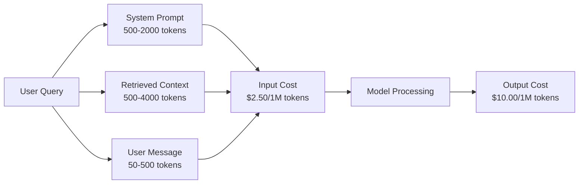
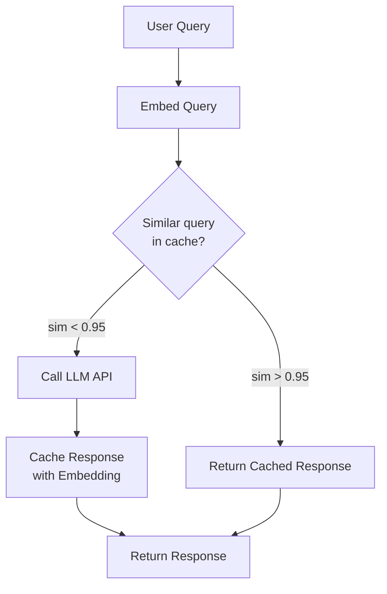
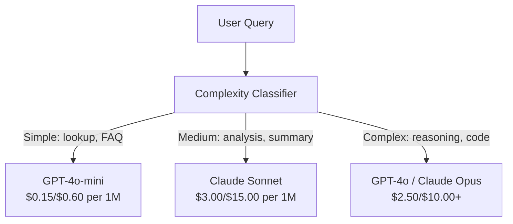

# 캐싱, 레이트 리밋, 비용 최적화 (Caching, Rate Limiting & Cost Optimization)

> 대부분의 AI 스타트업은 나쁜 모델 때문에 죽지 않는다. 나쁜 단위 경제성(unit economics) 때문에 죽는다. 단 한 번의 GPT-4o 호출은 1센트의 몇 분의 일이 든다. 하루에 10번 호출하는 1만 명의 사용자는 입력 토큰(token)만으로 $250가 든다 -- 단 1달러도 청구하기 전에. 살아남는 회사는 모든 API 호출을 함수 호출이 아니라 금융 거래로 취급하는 회사다.

**Type:** Build
**Languages:** Python
**Prerequisites:** Phase 11 Lesson 09 (Function Calling)
**Time:** ~45분
**Related:** Phase 11 · 15 (Prompt Caching) — 이 레슨은 애플리케이션 계층 캐싱(시맨틱 캐시, 정확 해시 캐시, 모델 라우팅)을 다룬다. Lesson 15는 프로바이더 계층 프롬프트(prompt) 캐싱(Anthropic cache_control, OpenAI 자동, Gemini CachedContent)을 다룬다. 50-95% 비용 절감을 위해 둘을 결합하라.

## 학습 목표 (Learning Objectives)

- 새 API 호출을 하는 대신 반복되거나 유사한 쿼리를 캐시에서 제공하는 시맨틱 캐싱(semantic caching) 구현하기
- 프로바이더별 요청당 비용을 계산하고 토큰 인식 레이트 리밋(rate limiting)과 예산 알림 구현하기
- 프롬프트 압축, 모델 라우팅(비싼 것 대 싼 것), 응답 캐싱을 갖춘 비용 최적화 계층 구축하기
- 서로 다른 쿼리 유형에 대해 정확 매칭, 시맨틱 유사도, 프리픽스 캐싱을 사용하는 계층화된 캐싱 전략 설계하기

## 문제 (The Problem)

당신은 RAG 챗봇을 만든다. 아름답게 동작한다. 사용자들이 좋아한다.

그러다 청구서가 도착한다.

GPT-5는 입력 토큰 100만 개당 $5, 출력 100만 개당 $15가 든다. Claude Opus 4.7은 입력 $15 / 출력 $75다. Gemini 3 Pro는 입력 $1.25 / 출력 $5다. GPT-5-mini는 $0.25/$2다. 아래 가격은 예시이며, 항상 프로바이더의 현재 가격 페이지를 확인하라.

스타트업을 죽이는 계산은 이렇다:

- 일일 활성 사용자 10,000명
- 사용자당 하루 10개 쿼리
- 쿼리당 입력 토큰 1,000개(시스템 프롬프트 + 컨텍스트 + 사용자 메시지)
- 응답당 출력 토큰 500개

**일일 입력 비용:** 10,000 x 10 x 1,000 / 1,000,000 x $2.50 = **$250/일**
**일일 출력 비용:** 10,000 x 10 x 500 / 1,000,000 x $10.00 = **$500/일**
**월간 총액:** **$22,500/월**

이것은 LLM만이다. 임베딩(embedding), 벡터 데이터베이스 호스팅, 인프라를 더하라. 챗봇 하나에 월 $30,000를 보고 있는 것이다.

잔인한 부분: 그 쿼리의 40-60%가 거의 중복이다. 사용자들은 같은 질문을 약간 다른 단어로 묻는다. 모든 요청에 걸쳐 동일한 당신의 시스템 프롬프트는 매번 청구된다. RAG가 검색한 컨텍스트 문서는 같은 주제를 묻는 사용자들에 걸쳐 반복된다.

당신은 중복 연산에 대해 정가를 지불하고 있다.

## 개념 (The Concept)

### LLM 호출의 비용 해부 (The Cost Anatomy of an LLM Call)

모든 API 호출에는 다섯 가지 비용 구성 요소가 있다.



시스템 프롬프트는 조용한 킬러다. 모든 요청과 함께 전송되는 1,500토큰 시스템 프롬프트는 그 프리픽스만으로 요청 100만 건당 $3.75가 든다. 하루 10만 요청이면, 그것은 절대 변하지 않는 텍스트에 대해 $375/일 -- $11,250/월 -- 이다.

### 프로바이더 캐싱: 내장 할인 (Provider Caching: Built-in Discounts)

세 주요 프로바이더 모두 2026년에 프로바이더 측 프롬프트 캐싱을 제공하지만, 작동 방식은 다르다. 심화 내용은 Phase 11 · 15를 보라.

| 프로바이더 | 메커니즘 | 할인 | 최소 | 캐시 지속 시간 |
|----------|-----------|----------|---------|----------------|
| Anthropic | 명시적 cache_control 마커 | 캐시 히트 시 90% (쓰기 시 25% 추가 지불) | 1,024 토큰 (Sonnet/Opus), 2,048 (Haiku) | 기본 5분; 확장 1시간 (쓰기 프리미엄 2배) |
| OpenAI | 자동 프리픽스 매칭 | 캐시 히트 시 50% | 1,024 토큰 | 최선 노력으로 최대 1시간 |
| Google Gemini | 명시적 CachedContent API | ~75% 감소 (저장소 비용 추가) | 4,096 (Flash) / 32,768 (Pro) | 사용자 설정 가능 TTL |

**Anthropic의 접근법**은 명시적이다. 프롬프트의 섹션을 `cache_control: {"type": "ephemeral"}`로 표시한다. 첫 요청은 25% 쓰기 프리미엄을 지불한다. 동일한 프리픽스를 가진 후속 요청은 90% 할인을 받는다. 평소 $0.005가 드는 2,000토큰 시스템 프롬프트는 캐시 히트 시 $0.000625가 든다. 10만 요청에 걸쳐, 이는 $437.50/일을 절약한다.

**OpenAI의 접근법**은 자동이다. 이전 요청과 일치하는 어떤 프롬프트 프리픽스든 50% 할인을 받는다. 마커가 필요 없다. 트레이드오프(trade-off): 할인이 적고, 제어가 적지만, 구현 노력이 0이다.

### 시맨틱 캐싱: 당신의 커스텀 계층 (Semantic Caching: Your Custom Layer)

프로바이더 캐싱은 동일한 프리픽스에 대해서만 동작한다. 시맨틱 캐싱은 더 어려운 경우를 처리한다: 같은 의미를 가진 서로 다른 쿼리.

"반품 정책이 뭐예요?"와 "어떻게 물건을 반품하나요?"는 서로 다른 문자열이지만 동일한 의도다. 시맨틱 캐시는 두 쿼리를 임베딩하고, 코사인 유사도를 계산하고, 유사도가 임계값(보통 0.92-0.95)을 넘으면 캐시된 응답을 반환한다.



임베딩 비용은 무시할 만하다. OpenAI의 text-embedding-3-small은 100만 토큰당 $0.02가 든다. 캐시를 확인하는 것은 전체 LLM 호출에 비해 거의 비용이 들지 않는다.

### 정확 캐싱: 해시와 매치 (Exact Caching: Hash and Match)

결정론적 호출(temperature=0, 같은 모델, 같은 프롬프트)에는 정확 캐싱이 더 단순하고 빠르다. 전체 프롬프트를 해시하고, 캐시를 확인하고, 찾으면 반환한다.

이는 다음에 완벽하게 동작한다:
- 시스템 프롬프트 + 고정 컨텍스트 + 동일한 사용자 쿼리
- 동일한 도구 정의를 가진 함수 호출
- 같은 문서가 여러 번 처리되는 배치(batch) 처리

### 레이트 리밋: 당신의 예산 보호하기 (Rate Limiting: Protecting Your Budget)

레이트 리밋은 단지 공정성에 관한 것이 아니다. 그것은 생존에 관한 것이다.

**토큰 버킷 알고리즘:** 각 사용자는 초당 R 속도로 채워지는 N개 토큰의 버킷을 받는다. 요청은 버킷에서 토큰을 소비한다. 버킷이 비면 요청이 거부된다. 이는 버스트(버킷을 한 번에 다 사용)를 허용하면서 평균 속도를 강제한다.

**사용자별 할당량:** 사용자 티어별로 일일/월간 토큰 한도를 설정한다.

| 티어 | 일일 토큰 한도 | 분당 최대 요청 | 모델 접근 |
|------|------------------|------------------|-------------|
| Free | 50,000 | 10 | GPT-4o-mini만 |
| Pro | 500,000 | 60 | GPT-4o, Claude Sonnet |
| Enterprise | 5,000,000 | 300 | 모든 모델 |

### 모델 라우팅: 적합한 작업에 적합한 모델 (Model Routing: Right Model for the Right Job)

모든 쿼리가 GPT-4o를 필요로 하지는 않는다.

"가게 몇 시에 닫아요?"는 출력 100만당 $10짜리 모델을 요구하지 않는다. 출력 100만당 $0.60인 GPT-4o-mini가 완벽하게 처리한다. 출력 100만당 $1.25인 Claude Haiku가 처리한다. 간단한 분류기(classifier)가 싼 쿼리는 싼 모델로, 복잡한 쿼리는 비싼 모델로 라우팅한다.



잘 튜닝된 라우터는 모델 비용만으로 40-70%를 절약한다.

### 비용 추적: 돈이 어디로 가는지 알기 (Cost Tracking: Know Where the Money Goes)

측정하지 않는 것은 최적화할 수 없다. 모든 API 호출을 다음과 함께 로깅하라:

- 타임스탬프
- 모델 이름
- 입력 토큰
- 출력 토큰
- 지연 시간(ms)
- 계산된 비용($)
- 사용자 ID
- 캐시 히트/미스
- 요청 카테고리

이 데이터는 어느 기능이 비싼지, 어느 사용자가 많이 소비하는지, 캐싱이 어디서 가장 큰 영향을 미치는지 드러낸다.

### 배칭: 대량 할인 (Batching: Bulk Discounts)

OpenAI의 Batch API는 요청을 비동기적으로 50% 할인으로 처리한다. 최대 50,000개 요청의 배치를 제출하면, 결과가 24시간 이내에 돌아온다.

배칭을 다음에 사용하라:
- 야간 문서 처리
- 대량 분류
- 평가 실행
- 데이터 보강 파이프라인

다음에는 안 됨: 실시간 사용자 대면 쿼리(지연 시간이 중요함).

### 예산 알림과 서킷 브레이커 (Budget Alerts and Circuit Breakers)

서킷 브레이커(circuit breaker)는 한도에 도달하면 지출을 멈춘다. 없으면, 버그나 악용이 몇 시간 만에 월간 예산을 태워버릴 수 있다.

세 가지 임계값을 설정하라:
1. **경고** (예산의 70%): 알림 전송
2. **스로틀** (예산의 85%): 더 싼 모델로만 전환
3. **중지** (예산의 95%): 새 요청 거부, 캐시된 응답만 반환

### 최적화 스택 (The Optimization Stack)

이 기법들을 순서대로 적용하라. 각 계층은 이전 계층 위에 복리로 쌓인다.

| 계층 | 기법 | 일반적 절감 | 구현 노력 |
|-------|-----------|----------------|----------------------|
| 1 | 프로바이더 프롬프트 캐싱 | 30-50% | 낮음 (캐시 마커 추가) |
| 2 | 정확 캐싱 | 10-20% | 낮음 (해시 + 딕셔너리) |
| 3 | 시맨틱 캐싱 | 15-30% | 중간 (임베딩 + 유사도) |
| 4 | 모델 라우팅 | 40-70% | 중간 (분류기) |
| 5 | 레이트 리밋 | 예산 보호 | 낮음 (토큰 버킷) |
| 6 | 프롬프트 압축 | 10-30% | 중간 (프롬프트 재작성) |
| 7 | 배칭 | 적격 항목에 50% | 낮음 (배치 API) |

계층 1-5를 적용한 RAG 앱은 보통 비용을 $22,500/월에서 $4,000-6,000/월로 줄인다. 그것이 런웨이를 태우는 것과 비즈니스를 구축하는 것의 차이다.

### 실제 절감: 전과 후 (Real Savings: Before and After)

다음은 10,000 DAU를 서빙하는 RAG 챗봇의 실제 분석이다.

| 지표 | 최적화 전 | 최적화 후 | 절감 |
|--------|--------------------|--------------------|---------|
| 월간 LLM 비용 | $22,500 | $5,200 | 77% |
| 쿼리당 평균 비용 | $0.0075 | $0.0017 | 77% |
| 캐시 히트율 | 0% | 52% | -- |
| mini로 라우팅된 쿼리 | 0% | 65% | -- |
| P95 지연 시간 | 2,800ms | 900ms (캐시 히트: 50ms) | 68% |
| 월간 임베딩 비용 | $0 | $180 | (새 비용) |
| 총 월간 비용 | $22,500 | $5,380 | 76% |

시맨틱 캐싱을 위한 임베딩 비용($180/월)은 캐시 히트의 첫 한 시간 안에 본전을 뽑는다.

## 직접 만들기 (Build It)

### 1단계: 비용 계산기

주요 모델의 현재 가격을 아는 토큰 비용 계산기를 만든다.

```python
import hashlib
import time
import json
import math
from dataclasses import dataclass, field


MODEL_PRICING = {
    "gpt-4o": {"input": 2.50, "output": 10.00, "cached_input": 1.25},
    "gpt-4o-mini": {"input": 0.15, "output": 0.60, "cached_input": 0.075},
    "gpt-4.1": {"input": 2.00, "output": 8.00, "cached_input": 0.50},
    "gpt-4.1-mini": {"input": 0.40, "output": 1.60, "cached_input": 0.10},
    "gpt-4.1-nano": {"input": 0.10, "output": 0.40, "cached_input": 0.025},
    "o3": {"input": 2.00, "output": 8.00, "cached_input": 0.50},
    "o3-mini": {"input": 1.10, "output": 4.40, "cached_input": 0.55},
    "o4-mini": {"input": 1.10, "output": 4.40, "cached_input": 0.275},
    "claude-opus-4": {"input": 15.00, "output": 75.00, "cached_input": 1.50},
    "claude-sonnet-4": {"input": 3.00, "output": 15.00, "cached_input": 0.30},
    "claude-haiku-3.5": {"input": 0.80, "output": 4.00, "cached_input": 0.08},
    "gemini-2.5-pro": {"input": 1.25, "output": 10.00, "cached_input": 0.3125},
    "gemini-2.5-flash": {"input": 0.15, "output": 0.60, "cached_input": 0.0375},
}


def calculate_cost(model, input_tokens, output_tokens, cached_input_tokens=0):
    if model not in MODEL_PRICING:
        return {"error": f"Unknown model: {model}"}
    pricing = MODEL_PRICING[model]
    non_cached = input_tokens - cached_input_tokens
    input_cost = (non_cached / 1_000_000) * pricing["input"]
    cached_cost = (cached_input_tokens / 1_000_000) * pricing["cached_input"]
    output_cost = (output_tokens / 1_000_000) * pricing["output"]
    total = input_cost + cached_cost + output_cost
    return {
        "model": model,
        "input_tokens": input_tokens,
        "output_tokens": output_tokens,
        "cached_input_tokens": cached_input_tokens,
        "input_cost": round(input_cost, 6),
        "cached_input_cost": round(cached_cost, 6),
        "output_cost": round(output_cost, 6),
        "total_cost": round(total, 6),
    }
```

### 2단계: 정확 캐시

전체 프롬프트를 해시하고 동일한 요청에 대해 캐시된 응답을 반환한다.

```python
class ExactCache:
    def __init__(self, max_size=1000, ttl_seconds=3600):
        self.cache = {}
        self.max_size = max_size
        self.ttl = ttl_seconds
        self.hits = 0
        self.misses = 0

    def _hash(self, model, messages, temperature):
        key_data = json.dumps({"model": model, "messages": messages, "temperature": temperature}, sort_keys=True)
        return hashlib.sha256(key_data.encode()).hexdigest()

    def get(self, model, messages, temperature=0.0):
        if temperature > 0:
            self.misses += 1
            return None
        key = self._hash(model, messages, temperature)
        if key in self.cache:
            entry = self.cache[key]
            if time.time() - entry["timestamp"] < self.ttl:
                self.hits += 1
                entry["access_count"] += 1
                return entry["response"]
            del self.cache[key]
        self.misses += 1
        return None

    def put(self, model, messages, temperature, response):
        if temperature > 0:
            return
        if len(self.cache) >= self.max_size:
            oldest_key = min(self.cache, key=lambda k: self.cache[k]["timestamp"])
            del self.cache[oldest_key]
        key = self._hash(model, messages, temperature)
        self.cache[key] = {
            "response": response,
            "timestamp": time.time(),
            "access_count": 1,
        }

    def stats(self):
        total = self.hits + self.misses
        return {
            "hits": self.hits,
            "misses": self.misses,
            "hit_rate": round(self.hits / total, 4) if total > 0 else 0,
            "cache_size": len(self.cache),
        }
```

### 3단계: 시맨틱 캐시

쿼리를 임베딩하고 유사도가 임계값을 넘으면 캐시된 응답을 반환한다.

```python
def simple_embed(text):
    words = text.lower().split()
    vocab = {}
    for w in words:
        vocab[w] = vocab.get(w, 0) + 1
    norm = math.sqrt(sum(v * v for v in vocab.values()))
    if norm == 0:
        return {}
    return {k: v / norm for k, v in vocab.items()}


def cosine_similarity(a, b):
    if not a or not b:
        return 0.0
    all_keys = set(a) | set(b)
    dot = sum(a.get(k, 0) * b.get(k, 0) for k in all_keys)
    return dot


class SemanticCache:
    def __init__(self, similarity_threshold=0.85, max_size=500, ttl_seconds=3600):
        self.entries = []
        self.threshold = similarity_threshold
        self.max_size = max_size
        self.ttl = ttl_seconds
        self.hits = 0
        self.misses = 0

    def get(self, query):
        query_embedding = simple_embed(query)
        now = time.time()
        best_match = None
        best_sim = 0.0
        for entry in self.entries:
            if now - entry["timestamp"] > self.ttl:
                continue
            sim = cosine_similarity(query_embedding, entry["embedding"])
            if sim > best_sim:
                best_sim = sim
                best_match = entry
        if best_match and best_sim >= self.threshold:
            self.hits += 1
            best_match["access_count"] += 1
            return {"response": best_match["response"], "similarity": round(best_sim, 4), "original_query": best_match["query"]}
        self.misses += 1
        return None

    def put(self, query, response):
        if len(self.entries) >= self.max_size:
            self.entries.sort(key=lambda e: e["timestamp"])
            self.entries.pop(0)
        self.entries.append({
            "query": query,
            "embedding": simple_embed(query),
            "response": response,
            "timestamp": time.time(),
            "access_count": 1,
        })

    def stats(self):
        total = self.hits + self.misses
        return {
            "hits": self.hits,
            "misses": self.misses,
            "hit_rate": round(self.hits / total, 4) if total > 0 else 0,
            "cache_size": len(self.entries),
        }
```

### 4단계: 레이트 리미터

사용자별 할당량을 갖춘 토큰 버킷 레이트 리미터.

```python
class TokenBucketRateLimiter:
    def __init__(self):
        self.buckets = {}
        self.tiers = {
            "free": {"capacity": 50_000, "refill_rate": 500, "max_requests_per_min": 10},
            "pro": {"capacity": 500_000, "refill_rate": 5_000, "max_requests_per_min": 60},
            "enterprise": {"capacity": 5_000_000, "refill_rate": 50_000, "max_requests_per_min": 300},
        }

    def _get_bucket(self, user_id, tier="free"):
        if user_id not in self.buckets:
            tier_config = self.tiers.get(tier, self.tiers["free"])
            self.buckets[user_id] = {
                "tokens": tier_config["capacity"],
                "capacity": tier_config["capacity"],
                "refill_rate": tier_config["refill_rate"],
                "last_refill": time.time(),
                "request_timestamps": [],
                "max_rpm": tier_config["max_requests_per_min"],
                "tier": tier,
                "total_tokens_used": 0,
            }
        return self.buckets[user_id]

    def _refill(self, bucket):
        now = time.time()
        elapsed = now - bucket["last_refill"]
        refill = int(elapsed * bucket["refill_rate"])
        if refill > 0:
            bucket["tokens"] = min(bucket["capacity"], bucket["tokens"] + refill)
            bucket["last_refill"] = now

    def check(self, user_id, tokens_needed, tier="free"):
        bucket = self._get_bucket(user_id, tier)
        self._refill(bucket)
        now = time.time()
        bucket["request_timestamps"] = [t for t in bucket["request_timestamps"] if now - t < 60]
        if len(bucket["request_timestamps"]) >= bucket["max_rpm"]:
            return {"allowed": False, "reason": "rate_limit", "retry_after_seconds": 60 - (now - bucket["request_timestamps"][0])}
        if bucket["tokens"] < tokens_needed:
            deficit = tokens_needed - bucket["tokens"]
            wait = deficit / bucket["refill_rate"]
            return {"allowed": False, "reason": "token_limit", "tokens_available": bucket["tokens"], "retry_after_seconds": round(wait, 1)}
        return {"allowed": True, "tokens_available": bucket["tokens"]}

    def consume(self, user_id, tokens_used, tier="free"):
        bucket = self._get_bucket(user_id, tier)
        bucket["tokens"] -= tokens_used
        bucket["request_timestamps"].append(time.time())
        bucket["total_tokens_used"] += tokens_used

    def get_usage(self, user_id):
        if user_id not in self.buckets:
            return {"error": "User not found"}
        b = self.buckets[user_id]
        return {
            "user_id": user_id,
            "tier": b["tier"],
            "tokens_remaining": b["tokens"],
            "capacity": b["capacity"],
            "total_tokens_used": b["total_tokens_used"],
            "utilization": round(b["total_tokens_used"] / b["capacity"], 4) if b["capacity"] else 0,
        }
```

### 5단계: 비용 추적기

모든 호출을 로깅하고 누적 합계를 계산한다.

```python
class CostTracker:
    def __init__(self, monthly_budget=1000.0):
        self.logs = []
        self.monthly_budget = monthly_budget
        self.alerts = []

    def log_call(self, model, input_tokens, output_tokens, cached_input_tokens=0, latency_ms=0, user_id="anonymous", cache_status="miss"):
        cost = calculate_cost(model, input_tokens, output_tokens, cached_input_tokens)
        entry = {
            "timestamp": time.time(),
            "model": model,
            "input_tokens": input_tokens,
            "output_tokens": output_tokens,
            "cached_input_tokens": cached_input_tokens,
            "latency_ms": latency_ms,
            "cost": cost["total_cost"],
            "user_id": user_id,
            "cache_status": cache_status,
        }
        self.logs.append(entry)
        self._check_budget()
        return entry

    def _check_budget(self):
        total = self.total_cost()
        pct = total / self.monthly_budget if self.monthly_budget > 0 else 0
        if pct >= 0.95 and not any(a["level"] == "stop" for a in self.alerts):
            self.alerts.append({"level": "stop", "message": f"Budget 95% consumed: ${total:.2f}/${self.monthly_budget:.2f}", "timestamp": time.time()})
        elif pct >= 0.85 and not any(a["level"] == "throttle" for a in self.alerts):
            self.alerts.append({"level": "throttle", "message": f"Budget 85% consumed: ${total:.2f}/${self.monthly_budget:.2f}", "timestamp": time.time()})
        elif pct >= 0.70 and not any(a["level"] == "warning" for a in self.alerts):
            self.alerts.append({"level": "warning", "message": f"Budget 70% consumed: ${total:.2f}/${self.monthly_budget:.2f}", "timestamp": time.time()})

    def total_cost(self):
        return round(sum(e["cost"] for e in self.logs), 6)

    def cost_by_model(self):
        by_model = {}
        for e in self.logs:
            m = e["model"]
            if m not in by_model:
                by_model[m] = {"calls": 0, "cost": 0, "input_tokens": 0, "output_tokens": 0}
            by_model[m]["calls"] += 1
            by_model[m]["cost"] = round(by_model[m]["cost"] + e["cost"], 6)
            by_model[m]["input_tokens"] += e["input_tokens"]
            by_model[m]["output_tokens"] += e["output_tokens"]
        return by_model

    def cache_savings(self):
        cache_hits = [e for e in self.logs if e["cache_status"] == "hit"]
        if not cache_hits:
            return {"saved": 0, "cache_hits": 0}
        saved = 0
        for e in cache_hits:
            full_cost = calculate_cost(e["model"], e["input_tokens"], e["output_tokens"])
            saved += full_cost["total_cost"]
        return {"saved": round(saved, 4), "cache_hits": len(cache_hits)}

    def summary(self):
        if not self.logs:
            return {"total_calls": 0, "total_cost": 0}
        total_latency = sum(e["latency_ms"] for e in self.logs)
        cache_hits = sum(1 for e in self.logs if e["cache_status"] == "hit")
        return {
            "total_calls": len(self.logs),
            "total_cost": self.total_cost(),
            "avg_cost_per_call": round(self.total_cost() / len(self.logs), 6),
            "avg_latency_ms": round(total_latency / len(self.logs), 1),
            "cache_hit_rate": round(cache_hits / len(self.logs), 4),
            "cost_by_model": self.cost_by_model(),
            "cache_savings": self.cache_savings(),
            "budget_remaining": round(self.monthly_budget - self.total_cost(), 2),
            "budget_utilization": round(self.total_cost() / self.monthly_budget, 4) if self.monthly_budget > 0 else 0,
            "alerts": self.alerts,
        }
```

### 6단계: 모델 라우터

쿼리를 처리할 수 있는 가장 싼 모델로 라우팅한다.

```python
SIMPLE_KEYWORDS = ["what time", "hours", "address", "phone", "price", "return policy", "hello", "hi", "thanks", "yes", "no"]
COMPLEX_KEYWORDS = ["analyze", "compare", "explain why", "write code", "debug", "architect", "design", "trade-off", "evaluate"]


def classify_complexity(query):
    q = query.lower()
    if len(q.split()) <= 5 or any(kw in q for kw in SIMPLE_KEYWORDS):
        return "simple"
    if any(kw in q for kw in COMPLEX_KEYWORDS):
        return "complex"
    return "medium"


def route_model(query, tier="pro"):
    complexity = classify_complexity(query)
    routing_table = {
        "simple": {"free": "gpt-4.1-nano", "pro": "gpt-4o-mini", "enterprise": "gpt-4o-mini"},
        "medium": {"free": "gpt-4o-mini", "pro": "claude-sonnet-4", "enterprise": "claude-sonnet-4"},
        "complex": {"free": "gpt-4o-mini", "pro": "gpt-4o", "enterprise": "claude-opus-4"},
    }
    model = routing_table[complexity].get(tier, "gpt-4o-mini")
    return {"query": query, "complexity": complexity, "model": model, "tier": tier}
```

### 7단계: 데모 실행하기

```python
def simulate_llm_call(model, query):
    input_tokens = len(query.split()) * 4 + 500
    output_tokens = 150 + (len(query.split()) * 2)
    latency = 200 + (output_tokens * 2)
    return {
        "model": model,
        "response": f"[Simulated {model} response to: {query[:50]}...]",
        "input_tokens": input_tokens,
        "output_tokens": output_tokens,
        "latency_ms": latency,
    }


def run_demo():
    print("=" * 60)
    print("  Caching, Rate Limiting & Cost Optimization Demo")
    print("=" * 60)

    print("\n--- Model Pricing ---")
    for model, pricing in list(MODEL_PRICING.items())[:6]:
        cost_1k = calculate_cost(model, 1000, 500)
        print(f"  {model}: ${cost_1k['total_cost']:.6f} per 1K in + 500 out")

    print("\n--- Cost Comparison: 100K Requests ---")
    for model in ["gpt-4o", "gpt-4o-mini", "claude-sonnet-4", "claude-haiku-3.5"]:
        cost = calculate_cost(model, 1000 * 100_000, 500 * 100_000)
        print(f"  {model}: ${cost['total_cost']:.2f}")

    print("\n--- Anthropic Cache Savings ---")
    no_cache = calculate_cost("claude-sonnet-4", 2000, 500, 0)
    with_cache = calculate_cost("claude-sonnet-4", 2000, 500, 1500)
    saving = no_cache["total_cost"] - with_cache["total_cost"]
    print(f"  Without cache: ${no_cache['total_cost']:.6f}")
    print(f"  With 1500 cached tokens: ${with_cache['total_cost']:.6f}")
    print(f"  Savings per call: ${saving:.6f} ({saving/no_cache['total_cost']*100:.1f}%)")

    exact_cache = ExactCache(max_size=100, ttl_seconds=300)
    semantic_cache = SemanticCache(similarity_threshold=0.75, max_size=100)
    rate_limiter = TokenBucketRateLimiter()
    tracker = CostTracker(monthly_budget=100.0)

    print("\n--- Exact Cache ---")
    messages_1 = [{"role": "user", "content": "What is the return policy?"}]
    result = exact_cache.get("gpt-4o-mini", messages_1, 0.0)
    print(f"  First lookup: {'HIT' if result else 'MISS'}")
    exact_cache.put("gpt-4o-mini", messages_1, 0.0, "You can return items within 30 days.")
    result = exact_cache.get("gpt-4o-mini", messages_1, 0.0)
    print(f"  Second lookup: {'HIT' if result else 'MISS'} -> {result}")
    result = exact_cache.get("gpt-4o-mini", messages_1, 0.7)
    print(f"  With temp=0.7: {'HIT' if result else 'MISS (non-deterministic, skip cache)'}")
    print(f"  Stats: {exact_cache.stats()}")

    print("\n--- Semantic Cache ---")
    test_queries = [
        ("What is the return policy?", "Items can be returned within 30 days with receipt."),
        ("How do I return an item?", None),
        ("What are your store hours?", "We are open 9am-9pm Monday through Saturday."),
        ("When does the store open?", None),
        ("Tell me about quantum computing", "Quantum computers use qubits..."),
        ("Explain quantum mechanics", None),
    ]
    for query, response in test_queries:
        cached = semantic_cache.get(query)
        if cached:
            print(f"  '{query[:40]}' -> CACHE HIT (sim={cached['similarity']}, original='{cached['original_query'][:40]}')")
        elif response:
            semantic_cache.put(query, response)
            print(f"  '{query[:40]}' -> MISS (stored)")
        else:
            print(f"  '{query[:40]}' -> MISS (no match)")
    print(f"  Stats: {semantic_cache.stats()}")

    print("\n--- Rate Limiting ---")
    for i in range(12):
        check = rate_limiter.check("user_1", 1000, "free")
        if check["allowed"]:
            rate_limiter.consume("user_1", 1000, "free")
        status = "OK" if check["allowed"] else f"BLOCKED ({check['reason']})"
        if i < 5 or not check["allowed"]:
            print(f"  Request {i+1}: {status}")
    print(f"  Usage: {rate_limiter.get_usage('user_1')}")

    print("\n--- Model Routing ---")
    routing_queries = [
        "What time do you close?",
        "Summarize this quarterly earnings report",
        "Analyze the trade-offs between microservices and monoliths",
        "Hello",
        "Write code for a binary search tree with deletion",
    ]
    for q in routing_queries:
        route = route_model(q, "pro")
        print(f"  '{q[:50]}' -> {route['model']} ({route['complexity']})")

    print("\n--- Full Pipeline: Before vs After Optimization ---")
    queries = [
        "What is the return policy?",
        "How do I return something?",
        "What are your hours?",
        "When do you open?",
        "Explain the difference between TCP and UDP",
        "Compare TCP vs UDP protocols",
        "Hello",
        "What is your phone number?",
        "Write a Python function to sort a list",
        "Analyze the pros and cons of serverless architecture",
    ]

    print("\n  [Before: no caching, single model (gpt-4o)]")
    tracker_before = CostTracker(monthly_budget=1000.0)
    for q in queries:
        result = simulate_llm_call("gpt-4o", q)
        tracker_before.log_call("gpt-4o", result["input_tokens"], result["output_tokens"], latency_ms=result["latency_ms"], cache_status="miss")
    before = tracker_before.summary()
    print(f"  Total cost: ${before['total_cost']:.6f}")
    print(f"  Avg cost/call: ${before['avg_cost_per_call']:.6f}")
    print(f"  Avg latency: {before['avg_latency_ms']}ms")

    print("\n  [After: caching + routing + rate limiting]")
    exact_c = ExactCache()
    semantic_c = SemanticCache(similarity_threshold=0.75)
    tracker_after = CostTracker(monthly_budget=1000.0)

    for q in queries:
        messages = [{"role": "user", "content": q}]
        cached = exact_c.get("gpt-4o", messages, 0.0)
        if cached:
            tracker_after.log_call("gpt-4o-mini", 0, 0, latency_ms=5, cache_status="hit")
            continue
        sem_cached = semantic_c.get(q)
        if sem_cached:
            tracker_after.log_call("gpt-4o-mini", 0, 0, latency_ms=15, cache_status="hit")
            continue
        route = route_model(q)
        result = simulate_llm_call(route["model"], q)
        tracker_after.log_call(route["model"], result["input_tokens"], result["output_tokens"], latency_ms=result["latency_ms"], cache_status="miss")
        exact_c.put(route["model"], messages, 0.0, result["response"])
        semantic_c.put(q, result["response"])

    after = tracker_after.summary()
    print(f"  Total cost: ${after['total_cost']:.6f}")
    print(f"  Avg cost/call: ${after['avg_cost_per_call']:.6f}")
    print(f"  Avg latency: {after['avg_latency_ms']}ms")
    print(f"  Cache hit rate: {after['cache_hit_rate']:.0%}")

    if before["total_cost"] > 0:
        savings_pct = (1 - after["total_cost"] / before["total_cost"]) * 100
        print(f"\n  SAVINGS: {savings_pct:.1f}% cost reduction")
        print(f"  Latency improvement: {(1 - after['avg_latency_ms'] / before['avg_latency_ms']) * 100:.1f}% faster")

    print("\n--- Budget Alerts Demo ---")
    alert_tracker = CostTracker(monthly_budget=0.01)
    for i in range(5):
        alert_tracker.log_call("gpt-4o", 5000, 2000, latency_ms=500)
    print(f"  Total spent: ${alert_tracker.total_cost():.6f} / ${alert_tracker.monthly_budget}")
    for alert in alert_tracker.alerts:
        print(f"  ALERT [{alert['level'].upper()}]: {alert['message']}")

    print("\n--- Cost Breakdown by Model ---")
    multi_tracker = CostTracker(monthly_budget=500.0)
    for _ in range(50):
        multi_tracker.log_call("gpt-4o-mini", 800, 200, latency_ms=150)
    for _ in range(30):
        multi_tracker.log_call("claude-sonnet-4", 1500, 500, latency_ms=400)
    for _ in range(10):
        multi_tracker.log_call("gpt-4o", 2000, 800, latency_ms=600)
    for _ in range(10):
        multi_tracker.log_call("claude-opus-4", 3000, 1000, latency_ms=1200)
    breakdown = multi_tracker.cost_by_model()
    for model, data in sorted(breakdown.items(), key=lambda x: x[1]["cost"], reverse=True):
        print(f"  {model}: {data['calls']} calls, ${data['cost']:.6f}, {data['input_tokens']:,} in / {data['output_tokens']:,} out")
    print(f"  Total: ${multi_tracker.total_cost():.6f}")

    print("\n" + "=" * 60)
    print("  Demo complete.")
    print("=" * 60)


if __name__ == "__main__":
    run_demo()
```

## 라이브러리로 써보기 (Use It)

### Anthropic 프롬프트 캐싱

```python
# import anthropic
#
# client = anthropic.Anthropic()
#
# response = client.messages.create(
#     model="claude-sonnet-4-20250514",
#     max_tokens=1024,
#     system=[
#         {
#             "type": "text",
#             "text": "You are a helpful customer support agent for Acme Corp...",
#             "cache_control": {"type": "ephemeral"},
#         }
#     ],
#     messages=[{"role": "user", "content": "What is the return policy?"}],
# )
#
# print(f"Input tokens: {response.usage.input_tokens}")
# print(f"Cache creation tokens: {response.usage.cache_creation_input_tokens}")
# print(f"Cache read tokens: {response.usage.cache_read_input_tokens}")
```

첫 호출은 캐시에 쓴다(25% 프리미엄). 같은 시스템 프롬프트 프리픽스를 가진 모든 후속 호출은 캐시에서 읽는다(90% 할인). 캐시는 5분간 지속되며 매 히트마다 타이머를 리셋한다.

### OpenAI 자동 캐싱

```python
# from openai import OpenAI
#
# client = OpenAI()
#
# response = client.chat.completions.create(
#     model="gpt-4o",
#     messages=[
#         {"role": "system", "content": "You are a helpful customer support agent..."},
#         {"role": "user", "content": "What is the return policy?"},
#     ],
# )
#
# print(f"Prompt tokens: {response.usage.prompt_tokens}")
# print(f"Cached tokens: {response.usage.prompt_tokens_details.cached_tokens}")
# print(f"Completion tokens: {response.usage.completion_tokens}")
```

OpenAI는 자동으로 캐싱한다. 최근 요청과 일치하는 1,024개 이상 토큰의 어떤 프롬프트 프리픽스든 50% 할인을 받는다. 코드 변경이 필요 없다 -- 동작하는지 확인하려면 응답에서 `prompt_tokens_details.cached_tokens`를 확인하라.

### OpenAI Batch API

```python
# import json
# from openai import OpenAI
#
# client = OpenAI()
#
# requests = []
# for i, query in enumerate(queries):
#     requests.append({
#         "custom_id": f"request-{i}",
#         "method": "POST",
#         "url": "/v1/chat/completions",
#         "body": {
#             "model": "gpt-4o-mini",
#             "messages": [{"role": "user", "content": query}],
#         },
#     })
#
# with open("batch_input.jsonl", "w") as f:
#     for r in requests:
#         f.write(json.dumps(r) + "\n")
#
# batch_file = client.files.create(file=open("batch_input.jsonl", "rb"), purpose="batch")
# batch = client.batches.create(input_file_id=batch_file.id, endpoint="/v1/chat/completions", completion_window="24h")
# print(f"Batch ID: {batch.id}, Status: {batch.status}")
```

Batch API는 모든 토큰에 균일하게 50% 할인을 준다. 결과는 24시간 이내에 도착한다. 비실시간 워크로드에 완벽하다: 평가, 데이터 레이블링, 대량 요약.

### Redis를 사용한 프로덕션 시맨틱 캐시

```python
# import redis
# import numpy as np
# from openai import OpenAI
#
# r = redis.Redis()
# client = OpenAI()
#
# def get_embedding(text):
#     response = client.embeddings.create(model="text-embedding-3-small", input=text)
#     return response.data[0].embedding
#
# def semantic_cache_lookup(query, threshold=0.95):
#     query_emb = np.array(get_embedding(query))
#     keys = r.keys("cache:emb:*")
#     best_sim, best_key = 0, None
#     for key in keys:
#         stored_emb = np.frombuffer(r.get(key), dtype=np.float32)
#         sim = np.dot(query_emb, stored_emb) / (np.linalg.norm(query_emb) * np.linalg.norm(stored_emb))
#         if sim > best_sim:
#             best_sim, best_key = sim, key
#     if best_sim >= threshold and best_key:
#         response_key = best_key.decode().replace("cache:emb:", "cache:resp:")
#         return r.get(response_key).decode()
#     return None
```

프로덕션에서는 선형 스캔을 벡터 인덱스(Redis Vector Search, Pinecone, 또는 pgvector)로 교체하라. 선형 스캔은 1,000개 미만의 엔트리에 동작한다. 그 이상에서는 O(log n) 조회를 위해 ANN(근사 최근접 이웃, approximate nearest neighbor)을 사용하라.

## 산출물 (Ship It)

이 레슨은 `outputs/prompt-cost-optimizer.md`를 만든다 -- 당신의 LLM 애플리케이션을 분석하고 예상 절감액과 함께 구체적인 비용 최적화를 추천하는 재사용 가능한 프롬프트다.

또한 `outputs/skill-cost-patterns.md`를 만든다 -- 당신의 사용 사례에 맞는 올바른 캐싱 전략, 레이트 리밋 설정, 모델 라우팅 규칙을 선택하기 위한 결정 프레임워크다.

## 연습 문제 (Exercises)

1. **시맨틱 캐시에 LRU 축출 구현하기.** 가장 오래된 것 우선 축출을 가장 오래 사용되지 않은 것(LRU)으로 교체하라. 각 엔트리의 마지막 접근 시간을 추적하고 캐시가 가득 차면 가장 오래된 접근 시간을 가진 엔트리를 축출하라. 100개 쿼리에 걸쳐 두 전략 간 히트율을 비교하라.

2. **비용 예측 도구 만들기.** API 호출 로그(CostTracker 로그)가 주어지면, 직전 7일 평균에 기반해 월간 비용을 예측하라. 평일/주말 패턴을 고려하라. 예측된 월간 비용이 예산을 20% 넘게 초과하면 알림을 트리거하라.

3. **계층화된 시맨틱 캐싱 구현하기.** 두 개의 유사도 임계값을 사용하라: 고신뢰 히트를 위한 0.98(즉시 반환)과 중신뢰 히트를 위한 0.90(고지와 함께 반환: "비슷한 이전 질문에 기반하면..."). 각 히트가 어느 계층에서 왔는지 추적하고 사용자 만족도 차이를 측정하라.

4. **모델 라우팅 분류기 만들기.** 키워드 기반 분류기를 임베딩 기반 분류기로 교체하라. 50개의 레이블된 쿼리(simple/medium/complex)를 임베딩한 다음, 가장 가까운 레이블된 예시를 찾아 새 쿼리를 분류하라. 20개 쿼리의 테스트 세트에 대해 분류 정확도를 측정하라.

5. **저하 수준을 갖춘 서킷 브레이커 구현하기.** 예산 70%에서 경고를 로깅하라. 85%에서 모든 라우팅을 가장 싼 모델(gpt-4o-mini)로 자동 전환하라. 95%에서 캐시된 응답만 제공하고 새 쿼리를 거부하라. $1.00 예산에 대해 1,000개 요청을 시뮬레이션해 테스트하고 각 임계값이 올바르게 트리거되는지 검증하라.

## 핵심 용어 (Key Terms)

| 용어 | 사람들이 말하는 것 | 실제 의미 |
|------|----------------|----------------------|
| 프롬프트 캐싱(Prompt caching) | "시스템 프롬프트를 캐시한다" | 반복되는 프롬프트 프리픽스가 할인을 받는 프로바이더 수준 캐싱(Anthropic 90%, OpenAI 50%) -- OpenAI는 코드 변경 불필요, Anthropic은 명시적 마커 필요 |
| 시맨틱 캐싱(Semantic caching) | "스마트 캐싱" | 쿼리를 임베딩하고, 과거 쿼리와의 유사도를 계산하고, 유사도가 임계값을 넘으면 캐시된 응답을 반환하는 것 -- 정확 매칭이 놓치는 패러프레이즈를 잡아낸다 |
| 정확 캐싱(Exact caching) | "해시 캐싱" | 전체 프롬프트(모델 + 메시지 + temperature)를 해시하고 동일한 입력에 대해 캐시된 응답을 반환하는 것 -- temperature=0 결정론적 호출에만 동작한다 |
| 토큰 버킷(Token bucket) | "레이트 리미터" | 각 사용자가 초당 R 속도로 채워지는 N개 토큰의 버킷을 가지는 알고리즘 -- R의 평균 속도를 강제하면서 N까지의 버스트를 허용한다 |
| 모델 라우팅(Model routing) | "구두쇠 라우팅" | 분류기를 사용해 간단한 쿼리는 싼 모델(GPT-4o-mini, Haiku)로, 복잡한 쿼리는 비싼 모델(GPT-4o, Opus)로 보내는 것 -- 모델 비용 40-70% 절약 |
| 비용 추적(Cost tracking) | "미터링" | 돈이 정확히 어디로 가는지와 어느 기능이 비싼지 알기 위해 모델, 토큰, 지연 시간, 비용, 사용자 ID와 함께 모든 API 호출을 로깅하는 것 |
| 서킷 브레이커(Circuit breaker) | "킬 스위치" | 지출이 예산 한도에 접근할 때 서비스를 자동으로 저하시키거나(더 싼 모델, 캐시만) 요청을 완전히 중지하는 것 |
| Batch API | "대량 할인" | 50% 할인으로 비동기 처리하는 OpenAI -- 최대 50,000개 요청 제출, 24시간 이내 결과 수신 |
| 프롬프트 압축(Prompt compression) | "토큰 다이어트" | 의미를 보존하면서 더 적은 토큰을 사용하도록 시스템 프롬프트와 컨텍스트를 재작성하는 것 -- 짧은 프롬프트는 비용이 적고 종종 성능도 더 낫다 |
| 캐시 히트율(Cache hit rate) | "캐시 효율" | LLM을 호출하는 대신 캐시에서 제공되는 요청의 비율 -- 프로덕션 챗봇은 40-60%가 일반적이며, 비용을 비례적으로 절약한다 |

## 더 읽을거리 (Further Reading)

- [Anthropic Prompt Caching Guide](https://docs.anthropic.com/en/docs/build-with-claude/prompt-caching) -- Anthropic의 명시적 cache_control 마커, 가격, 캐시 수명 동작에 관한 공식 문서
- [OpenAI Prompt Caching](https://platform.openai.com/docs/guides/prompt-caching) -- OpenAI의 자동 캐싱, usage 필드를 통한 캐시 히트 확인 방법, 최소 프리픽스 길이
- [OpenAI Batch API](https://platform.openai.com/docs/guides/batch) -- 비동기 처리를 위한 50% 할인, JSONL 형식, 24시간 완료 윈도우, 50K 요청 한도
- [GPTCache](https://github.com/zilliztech/GPTCache) -- 여러 임베딩 백엔드, 벡터 저장소, 축출 정책을 지원하는 오픈소스 시맨틱 캐싱 라이브러리
- [Martian Model Router](https://docs.withmartian.com) -- 각 쿼리를 처리할 수 있는 가장 싼 모델을 자동으로 선택하는 프로덕션 모델 라우팅
- [Not Diamond](https://www.notdiamond.ai) -- 프로바이더 전반에 걸쳐 비용/품질 트레이드오프를 최적화하기 위해 당신의 트래픽 패턴에서 학습하는 ML 기반 모델 라우터
- [Helicone](https://www.helicone.ai) -- 프록시 계층으로서 비용 추적, 캐싱, 레이트 리밋, 예산 알림을 갖춘 LLM 관측성 플랫폼
- [Dean & Barroso, "The Tail at Scale" (CACM 2013)](https://research.google/pubs/the-tail-at-scale/) -- 지연 시간, 처리량, TTFT/TPOT 백분위수, 헤지된 요청; "P95를 여전히 충족하는 가장 싼 모델을 골라라" 뒤의 비용 모델
- [Kwon et al., "Efficient Memory Management for Large Language Model Serving with PagedAttention" (SOSP 2023)](https://arxiv.org/abs/2309.06180) -- vLLM 논문; 페이지드 KV 캐시 + 연속 배칭이 처리량에서 단순 서버를 24배 능가하는 이유, "캐싱과 비용" 아래의 인프라 계층
- [Dao et al., "FlashAttention-2: Faster Attention with Better Parallelism and Work Partitioning" (ICLR 2024)](https://arxiv.org/abs/2307.08691) -- 프롬프트 캐싱과 직교하는 커널 수준 비용 절감; 전체 비용 곡선 그림을 위해 추측 디코딩 및 GQA와 함께 읽으라
