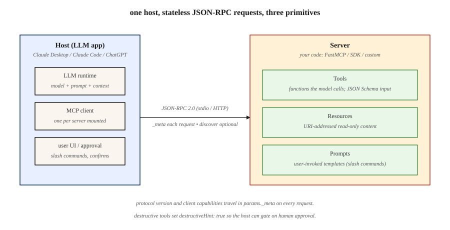

# Model Context Protocol (MCP)

> MCP는 AI 호스트에게 도구, 리소스, 프롬프트를 찾아내고 불러 쓰는 프로토콜 하나를 준다. 2026-07-28 개정판은 그 프로토콜을 무상태로 만들었다. 역량과 버전 맥락이 연결에 묶인 악수가 아니라 요청마다 실려 다닌다.

**Type:** Build
**Languages:** Python
**Prerequisites:** Phase 11 · 09 (Function Calling), Phase 11 · 03 (Structured Outputs)
**Time:** ~75 minutes

## 학습 목표 (Learning Objectives)

- MCP의 호스트, 클라이언트, 서버, 전송, 서버 기본 요소를 구별한다.
- MCP 2026-07-28이 요구하는 메타데이터를 갖춘 JSON-RPC 요청을 만든다.
- `server/discover`로 버전, 신원, 역량을 들여다본다.
- 도구, 리소스, 프롬프트에서 타입이 붙고 캐시를 아는 결과를 돌려준다.
- 현대의 무상태 MCP가 악수 시대의 서버와 어떻게 맞물리는지 설명한다.
- 서버를 위한 안전한 상태, 전송, 승인 경계를 고른다.

## 문제 (The Problem)

여러분의 애플리케이션에 데이터베이스 질의, 캘린더 작업, 파일 읽기가 필요하다. 공통 프로토콜이 없으면, AI 호스트마다 같은 기능을 두고 탐색, 호출, 오류, 전송, 인가를 잇는 코드를 따로 만들어야 한다.

MCP는 그 통합 행렬을 줄여 준다. 서버가 표준 JSON-RPC 표면을 게시한다. 규격을 지키는 클라이언트는 서버마다 다른 어댑터 없이도 그 표면을 찾아내고, 모델이나 사용자에게 보여 주고, 불러 쓰고, 결과를 해석할 수 있다.

놓치기 쉬운 중요한 경계가 있다. MCP는 통신을 표준화한다. 모델이 어떤 도구를 불러야 하는지 정해 주지도, 신뢰할 수 없는 내용을 안전하게 만들어 주지도, 무상태 요청을 지속되는 애플리케이션 상태로 바꿔 주지도 않는다. 그 판단은 여전히 여러분의 호스트와 서버의 몫이다.

## 개념 (The Concept)



### 서버의 세 기본 요소 (The three server primitives)

1. **도구(Tools)** 는 호출할 수 있는 동작이다. 도구마다 이름, 설명, JSON 스키마 입력, 처리기가 있다.
2. **리소스(Resources)** 는 이름이 붙고 URI로 주소를 지정하는, 클라이언트가 읽을 수 있는 내용이다.
3. **프롬프트(Prompts)** 는 호스트가 사용자에게 내놓을 수 있는 재사용 가능한 템플릿이다.

호스트는 AI 애플리케이션이다. 그 호스트 안의 MCP 클라이언트가 서버 하나와 이야기한다. 전송이 둘 사이로 JSON-RPC 메시지를 실어 나른다.

### 무상태 요청이 악수를 대신한다 (Stateless requests replace the handshake)

MCP 2026-07-28은 `initialize`와 `notifications/initialized`를 걷어냈다. 프로토콜 수준의 세션도 없앴다. 모든 요청이 그것을 해석하는 데 필요한 맥락을 `params._meta`에 싣는다.

```json
{
  "jsonrpc": "2.0",
  "id": 1,
  "method": "tools/list",
  "params": {
    "_meta": {
      "io.modelcontextprotocol/protocolVersion": "2026-07-28",
      "io.modelcontextprotocol/clientCapabilities": {},
      "io.modelcontextprotocol/clientInfo": {
        "name": "lesson-client",
        "version": "1.0.0"
      }
    }
  }
}
```

프로토콜 버전과 클라이언트 역량은 필수다. 클라이언트 신원은 넣어 두는 편이 좋다. `_meta`가 없거나, 필수 필드가 빠졌거나, 필수 필드의 타입이 틀리면 형식이 어긋난 것이라 잘못된 매개변수(`-32602`)를 돌려준다. 형식은 맞지만 서버가 지원하지 않는 버전 문자열에는 `UnsupportedProtocolVersionError`(`-32022`)를 돌려준다. 서버는 앞선 협상 기록을 되찾지 않고도 유효한 요청을 처리할 수 있다.

무상태라고 해서 애플리케이션이 상태를 가질 수 없다는 뜻은 아니다. 그 상태가 MCP 연결이나 `Mcp-Session-Id` 뒤에 숨지 않는다는 뜻이다. 작업 흐름에 연속성이 필요하면 서버가 불투명한 핸들을 발급하고, 클라이언트가 이후 호출에서 그 핸들을 평범한 도구 인자로 넘긴다. 인가는 여전히 요청마다 확인해야 한다.

### 탐색과 버전 선택 (Discovery and version selection)

현대 서버는 모두 `server/discover`를 구현한다. 그 결과는 지원 버전, 역량, 서버 신원을 알린다.

```json
{
  "jsonrpc": "2.0",
  "id": 1,
  "result": {
    "resultType": "complete",
    "supportedVersions": ["2026-07-28"],
    "capabilities": {
      "tools": {},
      "resources": {},
      "prompts": {}
    },
    "ttlMs": 3600000,
    "cacheScope": "public",
    "_meta": {
      "io.modelcontextprotocol/serverInfo": {
        "name": "demo-server",
        "version": "1.0.0"
      }
    }
  }
}
```

클라이언트가 다른 메서드를 바로 부르고 버전 오류를 처리해도 되지만, 탐색을 거치면 역량 표시와 버전 선택이 명시적이 된다. 지원하지 않는 버전에는 코드 `-32022`인 `UnsupportedProtocolVersionError`를 돌려준다. 그 데이터에는 서버 개정판 배열인 `supported`와 거부된 개정판인 `requested`가 들어 있다.

stdio에서 두 시대를 다루는 클라이언트는 `server/discover`로 탐지한다. 탐색 결과나 `UnsupportedProtocolVersionError` 같은 인식 가능한 현대 오류는 서버가 현대 방식임을 알려 준다. 현대 방식으로 인식되지 않는 오류나 타임아웃일 때만 2025-11-25의 `initialize` 흐름으로 물러설 수 있다. 레거시 동작은 호환성 코드이지 현대의 기본값이 아니다.

### 결과는 명시적이다 (Results are explicit)

2026-07-28의 모든 코어 결과에는 `resultType`이 있다.

- `complete`는 작업이 끝났다는 뜻이다.
- `input_required`는 Multi Round-Trip Requests 방식으로 한 번 더 오가야 한다는 뜻이다. 코어 서버는 `tools/call`, `resources/read`, `prompts/get`에서만 이것을 돌려줄 수 있다.

클라이언트는 `resultType`이 빠진 레거시 결과를 complete로 취급해야 한다.

서버는 모든 결과의 `_meta`에 `io.modelcontextprotocol/serverInfo`를 넣는 편이 좋다. 이 신원은 스스로 밝힌 값이며 표시와 로깅, 디버깅을 위한 것이지 보안 판단을 위한 것이 아니다.

목록과 읽기 결과에는 `ttlMs`와 `cacheScope`도 실린다. `tools/list`의 결정적인 순서에 신선도 힌트가 더해지면 클라이언트가 탐색을 안전하게 캐시할 수 있고 프롬프트 캐시도 안정된다. `cacheScope: public`은 공유 캐싱을 허락하고, `private`는 재사용을 호출 맥락 안으로 가둔다.

### 전선 형식과 전송 (The wire format and transport)

MCP는 stdio나 Streamable HTTP 위에서 JSON-RPC 2.0을 쓴다.

- 요청에는 `jsonrpc`, `id`, `method`, `params`가 있다.
- 응답에는 짝이 맞는 `id`와 `result` 또는 `error` 중 하나가 있다.
- 알림에는 `id`가 없고 응답을 기대하지 않는다.

현대 Streamable HTTP는 POST를 받는 엔드포인트 하나를 내놓는다. JSON-RPC 메시지마다 자기 POST를 갖는다. 요청 POST는 JSON 객체 하나를 받거나, 최종 응답으로 끝나는 요청 범위 Server-Sent Events 스트림을 받는다. 받아들인 알림 POST는 응답 본문 없이 HTTP 202를 받는다. 이 코어 개정판은 Streamable HTTP 위에서 클라이언트가 서버로 보내는 알림을 정의하지 않는다.

2026-07-28에는 독립 MCP GET 스트림도, DELETE 세션 엔드포인트도, `Mcp-Session-Id`도, `Last-Event-ID` 재생도 없다. 오래 유지되는 변경 알림은 응답이 SSE 스트림으로 열린 채 남는 `subscriptions/listen` POST를 쓴다.

### 서버가 먼저 요청하지 않는 클라이언트 입력 (Client input without server-initiated requests)

이전 개정판에서는 서버가 `sampling/createMessage`, `roots/list`, `elicitation/create` 같은 요청을 스트림으로 보낼 수 있었다. 현행 프로토콜은 대신 Multi Round-Trip Requests를 쓴다. 해당하는 도구 호출, 리소스 읽기, 프롬프트 조회는 `inputRequests`나 `requestState` 중 적어도 하나와 함께 `resultType: input_required`를 돌려준다. 클라이언트는 요청된 입력을 모아, 새 JSON-RPC ID와 그에 맞는 `inputResponses`를 실어 원래 메서드를 재시도하고, `requestState`가 주어졌다면 그것을 정확히 그대로 되돌려 보낸다. `inputRequests`가 없었다면 재시도에서 `inputResponses`를 뺀다.

루트, 샘플링, 로깅은 아직 작동하지만 폐기 예정이므로 새 구현은 채택하지 않아야 한다. 기존의 루트나 샘플링 요청은 서버가 클라이언트로 보내는 독립 JSON-RPC 요청이 아니라 MRTR의 `inputRequests` 안에 실려 간다. 명시적인 파일이나 디렉터리 매개변수, 리소스 URI, 서버 설정, 모델 제공자 직접 통합을 먼저 쓰라. stdio 진단에는 stderr를, 실제 운영 원격 측정에는 OpenTelemetry를 쓰라.

```figure
mcp-nxm-collapse
```

## 만들어 보기 (Build It)

### 1단계: 서버 표면을 등록한다 (Step 1: register a server surface)

요청 계약이 바뀌었어도 등록은 여전히 단순하다.

```python
server = MCPServer("demo-server")

@server.tool(
    "add",
    "Add two integers.",
    {
        "type": "object",
        "properties": {
            "a": {"type": "integer"},
            "b": {"type": "integer"}
        },
        "required": ["a", "b"]
    }
)
def add(a: int, b: int) -> dict:
    return {"sum": a + b}
```

`code/main.py`에 실린 구현은 리소스와 프롬프트도 함께 등록한다. 프로토콜을 SDK에 맡기지 않고 봉투 하나하나를 볼 수 있도록 일부러 표준 라이브러리만 쓴다.

### 2단계: 모든 요청에 메타데이터를 붙인다 (Step 2: attach metadata to every request)

```python
def request(method, params=None):
    body_params = dict(params or {})
    body_params["_meta"] = {
        "io.modelcontextprotocol/protocolVersion": "2026-07-28",
        "io.modelcontextprotocol/clientCapabilities": {},
        "io.modelcontextprotocol/clientInfo": {
            "name": "demo-client",
            "version": "1.0.0"
        }
    }
    return {
        "jsonrpc": "2.0",
        "id": 1,
        "method": method,
        "params": body_params
    }
```

이 메타데이터를 연결 객체에만 담아 두지 마라. 서버는 요청마다 그것을 검증한다.

### 3단계: 목록을 받기 전에 탐색해도 된다 (Step 3: optionally discover before listing)

`server/discover`를 부르고, 지원되는 버전을 고른 다음, `tools/list`를 부르라. 버전을 이미 알고 `-32022`를 처리할 수 있다면 `tools/list`를 바로 불러도 된다.

예제는 도구 목록을 이름 순서로 돌려주고 `ttlMs`, `cacheScope`, `resultType`, 서버 신원을 붙인다. 도구 호출은 출력이 현재 상태에 따라 달라질 수 있으므로 캐시할 수 없는 complete 결과를 돌려준다.

### 4단계: 같은 요청을 HTTP에 대응시킨다 (Step 4: map the same request to HTTP)

원격 `tools/call` POST에는 JSON-RPC 본문을 복제한 헤더가 들어간다.

```http
POST /mcp HTTP/1.1
Content-Type: application/json
Accept: application/json, text/event-stream
MCP-Protocol-Version: 2026-07-28
Mcp-Method: tools/call
Mcp-Name: add
```

`MCP-Protocol-Version` 헤더는 `_meta`의 버전과 같아야 한다. `Mcp-Method`는 모든 JSON-RPC 요청에 필수이며 `method`와 같아야 한다. `Mcp-Name`은 `tools/call`, `resources/read`, `prompts/get`에만 필수이며, 각각 도구 이름, 리소스 URI, 프롬프트 이름과 같아야 한다. 필수 헤더가 빠졌거나 어긋나면 `HeaderMismatch` 코드 `-32020`과 함께 HTTP 400을 돌려준다.

### 5단계: 안전은 프로토콜 상태 바깥에서 강제한다 (Step 5: enforce safety outside protocol state)

- HTTP 요청마다 인가와 대상을 검증한다.
- 로컬 서버는 localhost에 바인딩하고 Streamable HTTP에서는 `Origin`을 검증한다.
- 상태를 바꾸는 도구에는 `destructiveHint: true`를 달고 호스트 승인을 요구한다.
- 폐기 예정인 루트에 기대지 말고 디렉터리와 파일 범위를 명시적으로 넘긴다.
- 리소스와 도구 출력을 신뢰할 수 없는 데이터로 다룬다.
- stdio에서는 stdout을 JSON-RPC 전용으로 남기고 진단은 stderr에 쓴다.

## 직접 해 보기 (Use It)

레슨 디렉터리에서 실행하라.

```bash
python3 code/main.py
cd code
python3 -m unittest discover tests -v
```

첫 줄은 프로토콜 `2026-07-28`에서 `demo-server`를 탐색했다고 알려 줘야 한다. 그다음 `MCPClient.request`를 들여다보라. 호출마다 `_meta`를 다시 만들어 붙인다. 요청 하나에서 메타데이터를 빼고 서버가 그것을 거부하는지 확인해 보라.

## 결과물 (Ship It)

`outputs/skill-mcp-server-designer.md`는 어떤 도메인을 무상태 MCP 설계로 바꿔 준다. 통과 기준으로 탐색 결과, 요청별 메타데이터 정책, 캐시를 아는 결정적 목록, 명시적 상태 핸들, 전송 헤더, 인가, 승인 규칙을 요구한다.

## MCP 깊이 파고들기 (Continue the MCP Deep Dive)

이 레슨은 프로토콜 모형을 준다. 페이즈 13은 실제 운영의 경계 네 곳을 각각 만들고 확인하는 레슨으로 다룬다.

1. [MCP 도구 계약과 내용](../../../13-tools-and-protocols/28-mcp-tool-contracts-and-content/docs/ko.md)은 닫힌 입력 스키마, 구조화된 내용, 라우팅 메타데이터, 불투명한 페이지 나누기, 완성 인가, 그리고 프로토콜 오류와 도구 도메인 오류의 차이를 다룬다.
2. [MCP 신뢰성, 취소, 흐름 제어](../../../13-tools-and-protocols/29-mcp-reliability-cancellation-and-flow-control/docs/ko.md)는 요청 취소, 지속되는 태스크 취소, 기한, 멱등성, 배압, 프록시 버퍼링, 재연결 동작을 다룬다.
3. [MCP 레지스트리 공급망, 승인, 표류, 롤백](../../../13-tools-and-protocols/30-mcp-registry-supply-chain-and-drift/docs/ko.md)은 이름 공간 증명, 산출물 출처, 불변 고정, 살아 있는 표류, 레지스트리 상태, 승인 증거, 롤백을 다룬다.
4. [MCP 적합성 엔지니어링](../../../13-tools-and-protocols/31-mcp-conformance-versioning-and-operations/docs/ko.md)은 모범 전선 기록과 부정 전선 기록, 엄격한 버전 시대, SDK 차이, 프록시 증거, 가리기, 건강 관문, 배포 롤백을 다룬다.

서버가 팀 경계나 신뢰 경계를 넘어갈 예정이라면 순서대로 따라가라. 이 넷을 합치면 "메서드가 동작한다"에서 "배포를 거치는 동안에도 계약이 안전하고 진단 가능한 상태로 남는다"로 옮겨 간다.

## 연습 문제 (Exercises)

1. `subtract` 도구를 추가하고 `tools/list`가 여전히 알파벳 순서인지 확인하라.
2. 프로토콜 버전 키를 빼고 잘못된 매개변수(`-32602`)가 나오는지 확인하라. 그다음 형식은 맞지만 지원되지 않는 버전 `2025-11-25`를 보내 `-32022`를 확인하고, `requested`가 그 개정판을 되돌려 주는지 본 뒤 `supported`에서 하나를 고르라.
3. 생성 작업에 서버가 발급한 `draftId`를 추가하고, 갱신 작업에서 그것을 인자로 요구하라. 그것이 왜 프로토콜 세션이 아니라 애플리케이션 상태인지 설명하라.
4. 사용자 확인이 필요한 도구에서 `input_required`를 돌려주라. 서버가 클라이언트로 보내는 JSON-RPC 요청을 지어내는 대신, 새 ID와 `inputResponses` 항목, 정확한 `requestState`를 실어 원래 호출을 재시도하라.
5. 두 시대를 다루는 stdio 클라이언트를 그려 보라. 결과나 인식 가능한 현대 오류는 현대로 취급하고, 인식하지 못하는 오류나 타임아웃일 때만 `initialize`로 물러서게 하라.

## 핵심 용어 (Key Terms)

| 용어 | 사람들이 하는 말 | 실제로 뜻하는 것 |
|------|-----------------|------------------------|
| MCP | "LLM용 도구 프로토콜" | 서버 탐색, 도구, 리소스, 프롬프트, 확장을 위한 JSON-RPC 프로토콜 |
| Host | "AI 앱" | 모델과 UI를 쥐고 MCP 클라이언트를 하나 이상 얹는 쪽 |
| Client | "커넥터" | 호스트를 대신해 서버 하나와 MCP로 이야기하는 쪽 |
| Stateless MCP | "세션 없음" | 모든 요청이 버전과 역량을 싣고, 연결을 키로 삼는 프로토콜 상태가 없다 |
| `server/discover` | "역량 탐침" | 버전, 역량, 신원을 알리는 필수 서버 메서드 |
| `resultType` | "결과 상태" | 결과가 `complete`인지 `input_required`인지 표시한다 |
| State handle | "작업 흐름 id" | 평범한 인자로 넘기는, 서버가 발급한 애플리케이션 식별자 |
| Streamable HTTP | "원격 전송" | JSON이나 요청 범위 SSE로 응답하는 POST 엔드포인트 하나 |
| MRTR | "묻고 재시도" | 결과에 담긴 입력 요청과 그에 이은 원래 작업의 재시도 |

## 더 읽을거리 (Further Reading)

- [MCP 2026-07-28 key changes](https://modelcontextprotocol.io/specification/2026-07-28/changelog)
- [MCP server discovery](https://modelcontextprotocol.io/specification/2026-07-28/server/discover)
- [MCP Streamable HTTP](https://modelcontextprotocol.io/specification/2026-07-28/basic/transports/streamable-http)
- [MCP Multi Round-Trip Requests](https://modelcontextprotocol.io/specification/2026-07-28/basic/patterns/mrtr)
- [MCP deprecated features](https://modelcontextprotocol.io/specification/2026-07-28/deprecated)
