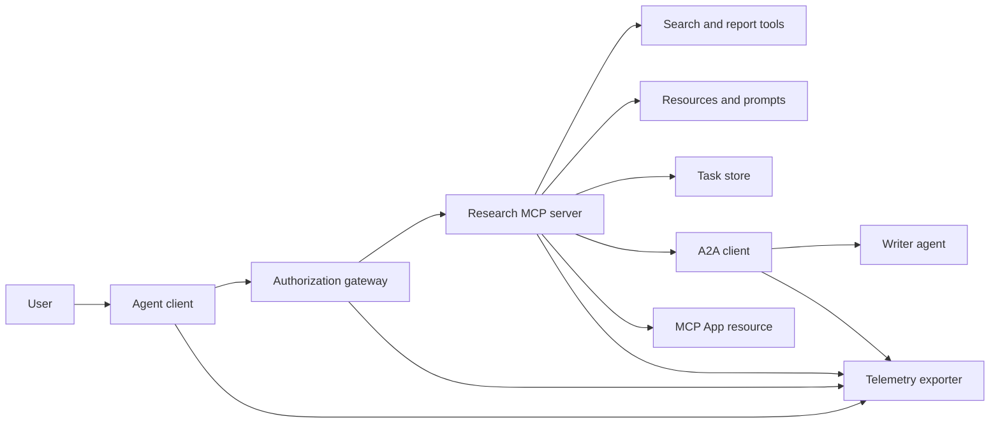
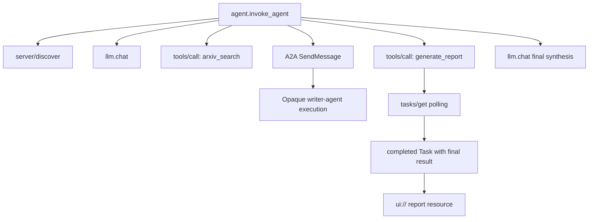
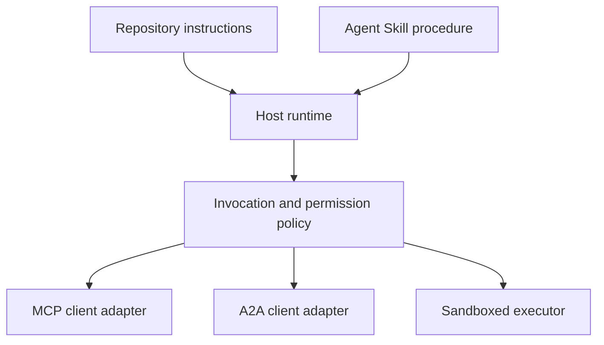

# 캡스톤: 무상태 도구 생태계 (Capstone: Stateless Tool Ecosystem)

> 실제 운영되는 에이전트 시스템은 기능을 쌓아 올린 더미가 아니라 경계의 집합이다. 이 캡스톤은 읽기 쉬운 프로세스 내 시뮬레이션을, 실제 배포가 여전히 필요로 하는 프로토콜 클라이언트, 인가 서버, 모래상자, 원격 측정 내보내기와 갈라놓는다.

**Type:** Build
**Languages:** Python (stdlib, in-process simulation)
**Prerequisites:** Phase 13 · 01 through 22, using MCP revision `2026-07-28`
**Time:** ~120 minutes

## 학습 목표 (Learning Objectives)

- 도구 호출, 태스크 모양의 결과, 위임된 작업, UI 리소스, 인가 정책, 추적 기록을 하나의 흐름으로 엮는다.
- 연결 세션에 기대지 않고 모든 MCP 요청에 프로토콜 버전, 클라이언트 신원, 역량을 싣는다.
- 쓰기 전에 서버를 탐색하고, 오래 걸리는 작업은 공식 Tasks 확장으로 몰고 간다.
- 프로토콜 모양의 시뮬레이션을 MCP, A2A, OAuth, OpenTelemetry 구현과 구별한다.
- 시뮬레이션된 경계 하나하나를 그것을 대체해야 할 실제 운영 구성 요소에 대응시킨다.
- `AGENTS.md`, 에이전트 스킬, 런타임 어댑터, 도구, 보안 정책을 각자의 역할에 남겨 둔다.
- 어떤 주장이 지역 출력으로 확인되고 어떤 주장이 실제 통합 테스트를 필요로 하는지 설명한다.

## 문제 (The Problem)

조사와 보고서 작성 시스템을 설계한다고 하자. 사용자가 에이전트 프로토콜에 관한 논문을 달라고 한다. 시스템은 논문 목록을 검색하고, 요약을 위임하고, 보고서를 만들고, UI 리소스를 돌려주고, 시스템을 지나간 경로를 기록한다.

그 한 문장이 서로 독립적인 계약 여럿을 감추고 있다.

- 모델을 향한 도구 스키마,
- 무상태 요청 봉투와 서버 탐색 계약,
- 행위자, 스코프, 도구 신원에 대한 게이트웨이 판단,
- 오래 걸리는 작업의 계약,
- 위임 프로토콜,
- 호스트와 앱을 잇는 다리,
- 추적 전파와 내보내기,
- 재사용 가능한 운영 절차.

`code/main.py`는 평범한 파이썬 함수와 딕셔너리로 그 경계들을 눈에 보이게 둔다. 전송을 열지도, arXiv에 접속하지도, OAuth를 수행하지도, A2A 서버를 부르지도, MCP 앱을 그리지도, 원격 측정을 내보내지도 않는다. 그래서 시뮬레이션을 규격을 지키는 서비스인 양 내세우지 않으면서도 제어 흐름을 들여다보기 쉽다.

## 개념 (The Concept)

### 목표 구조 (Target architecture)



이 구조는 공개된 프로토콜 방식들을 개념적으로 엮어 본 것이다. 어느 제품의 비공개 내부에 대한 주장이 아니다.

### 목표 추적 (Target trace)



실제 구현에서는 모든 중계 지점이 추적 맥락을 전파한다. 스팬 이름과 속성은 고른 계측 버전이 지원하는 OpenTelemetry 의미 규약을 따라야 한다. 추적 식별자를 공유한다는 사실만으로는 부모 자식 관계나 내보내기, 백엔드 수집이 올바르다는 증명이 되지 않는다.

### 현행 프로토콜 표면 (Current protocol surfaces)

옛 초안에서 기억하는 이름이 아니라 현행 프로토콜이 정의한 메서드 이름을 쓰라.

| 경계 | 현행 표면 | 이 캡스톤이 흉내 내는 것 |
|---|---|---|
| MCP discovery | 필수인 `server/discover` | 버전, 역량, 서버 신원을 돌려주는 직접 함수 |
| MCP request context | 모든 `params._meta`에 실리는 버전, 역량, 클라이언트 신원 | 흉내 낸 호출마다 새로 넘기는 요청 메타데이터 |
| MCP tool call | `tools/call` | 파이썬 함수 직접 호출 |
| MCP task polling | `tasks/get`을 쓰는 `io.modelcontextprotocol/tasks` | working 핸들에 이어, 최종 결과를 담은 completed 태스크 |
| A2A delegation | gRPC와 JSON-RPC의 `SendMessage`, HTTP+JSON의 `POST /message:send` | 원격 호출도 인위적 지연도 없는 중첩 스팬 하나 |
| MCP App calling a server tool | `app.callServerTool({ name, arguments })` | 살아 있는 다리가 없는 HTML 문자열 |
| OAuth authorization | 인가 서버, 보호된 리소스 메타데이터, 대상과 스코프 검증 | 정적인 토큰 조회와 스코프 포함 여부 |
| OpenTelemetry | SDK, 전파기, 내보내기, 수집기 또는 백엔드 | 메모리 안의 스팬 딕셔너리 |

프로토콜 이름은 첫 겹일 뿐이다. 실제 운영 테스트는 직렬화, 인증 실패, 취소, 타임아웃, 재시도, 버전 호환성을 진짜 전선 위에서 돌려 봐야 한다.

### 무상태 MCP가 통합 경계를 바꾼다 (Stateless MCP changes the integration boundary)

개정판 `2026-07-28`은 프로토콜 세션과 `initialize` / `notifications/initialized` 악수를 걷어냈다. `Mcp-Session-Id`도 없앴다. 모든 요청이 이름 공간이 붙은 `_meta` 필드를 싣는다.

```json
{
  "io.modelcontextprotocol/protocolVersion": "2026-07-28",
  "io.modelcontextprotocol/clientCapabilities": {
    "extensions": {
      "io.modelcontextprotocol/tasks": {}
    }
  },
  "io.modelcontextprotocol/clientInfo": {
    "name": "capstone-client",
    "version": "1.0.0"
  }
}
```

서버는 `server/discover`를 반드시 구현해야 한다. 평범한 결과는 `resultType: "complete"`를 쓰고, 태스크 핸들은 `resultType: "task"`를 쓴다. 결과마다 `_meta.io.modelcontextprotocol/serverInfo`로 서버를 밝히는 것이 좋다.

태스크 확장에는 `tasks/get`, `tasks/update`, `tasks/cancel`이 있다. 도구가 먼저 `resultType: "task"`를 돌려줄 수 있고, `tasks/get` 자체는 `resultType: "complete"`를 돌려주며, 완료된 `Task`가 최종 결과를 담는다. 옛 `tasks/result`와 `tasks/list` 메서드는 현행 확장에 없다. 클라이언트는 태스크 핸들을 받을 수 있는 바로 그 요청에서 `io.modelcontextprotocol/tasks`를 알려야 한다. 그러지 않으면 서버는 빠진 클라이언트 역량 객체 모양으로, 즉 `extensions.io.modelcontextprotocol/tasks`를 담은 `requiredCapabilities`와 함께 `-32021`을 돌려준다.

### 보안 태세 (Security posture)

의도한 배포는 방어를 겹겹이 쌓는다.

- 클라이언트 종류가 요구할 때 PKCE를 곁들인 OAuth 인가,
- 발급된 접근 토큰에 대한 리소스와 대상 결속,
- 요청된 도구와 스코프를 확인하는 게이트웨이 RBAC,
- 모델이 보는 맥락 바깥에 두는 상위 자격 증명,
- 고정하거나 검토한 도구 설명 목록,
- 신뢰할 수 없는 입력, 민감한 데이터, 결과가 무거운 동작에 대한 둘의 규칙 검토,
- 파일 시스템, 프로세스, 네트워크, 자격 증명, 자원 한계를 스킬 바깥에서 강제하는 실행 모래상자.

예제는 정적인 토큰과 스코프 검사, 설명 해시만 구현한다. 정책 흐름을 보여 주는 데는 쓸모가 있지만 보안 검증에는 아니다.

### 스킬은 절차이지 전송이 아니다 (Skills are procedure, not transport)

에이전트 스킬은 조사 작업 흐름을 어떻게 수행할지, 어떤 도구 계약을 기대할지, 어떤 증거를 남길지, 언제 멈출지를 런타임에게 알려 줄 수 있다. MCP 서버를 존재하게 하거나, A2A 호환성을 만들거나, 스코프를 주거나, 모래상자를 만들어 낼 수는 없다.



절차가 동반 파일을 참조한다면 스킬 디렉터리 전체를 함께 내놓으라. 이 옛 캡스톤의 납작한 산출물은 과정용 설계도이지, 호스트가 이식 가능한 묶음을 보존한다는 증거가 아니다. 레슨 24부터 27까지가 묶음 생애주기 전체를 만들고 시험한다.

### 과정 산출물 메타데이터는 지역 어댑터다 (Course artifact metadata is a local adapter)

과정 카탈로그와 설치 프로그램은 `skill-*.md`라는 이름의 납작한 파일을 알아보지만, 그것은 이식 가능한 에이전트 스킬 꾸러미 계약이 아니라 이 저장소의 관례다. 그 최소한의 프런트매터 파서는 최상위 키만 읽는다. 그래서 이 레슨은 이식 가능한 신원 필드와 과정 카탈로그 필드를 같은 층에 둔다.

```yaml
---
name: ecosystem-blueprint
description: Produce a full Phase 13 ecosystem architecture for a product need.
version: "1.0.0"
phase: "13"
lesson: "23"
tags: [mcp, capstone, ecosystem, architecture, a2a, otel]
---
```

`name`과 `description`이 이식 가능한 신원 필드다. `version`, `phase`, `lesson`, `tags`는 이 과정에만 있는 카탈로그 확장이다. 과정 파서는 `--tag capstone`이 걸리도록 `tags`를 한 줄짜리 목록으로 요구한다.

이식 가능한 디렉터리 스킬은 문자열 값 확장 데이터를 위해 선택적인 `metadata` 맵을 쓸 수 있다. 그렇다고 `metadata`가 이 저장소의 카탈로그 스키마와 바꿔 쓸 수 있는 것은 아니다. 이 납작한 파일이 `version`이나 `tags`를 `metadata` 아래에 중첩시키면, 최소한의 파서는 들여 쓴 그 키들을 건너뛰고, 카탈로그는 빈 버전을 기록하고, 태그로 걸러도 산출물을 찾지 못한다. 실제 운영 호스트는 안전한 YAML 파서를 쓰고 자기가 문서로 남긴 스키마를 검증해야 한다.

### 시뮬레이션과 실제 운영 (Simulation versus production)

| 계층 | `code/main.py` | 실제 운영에서의 대체물 | 필요한 증거 |
|---|---|---|---|
| Discovery | `server_discover()`와 정적 `TOOLS` | `server/discover`에 이은 캐시를 아는 `tools/list` | 전선 기록, 결정적 순서, 스키마 검증 |
| Authentication | 토큰을 키로 삼은 딕셔너리 | OAuth 인가와 리소스 서버 검증 | 발급자, 대상, 스코프, 만료, 실패 테스트 |
| Authorization | 스코프 포함 여부 | 행위자, 도구, 대상, 테넌트에 묶인 게이트웨이 정책 | 허용과 거부 감사 사례 |
| Search | 정적인 논문 표본 | 검색 API 또는 MCP 서버 | 출처, 순위, 오류 테스트 |
| Tasks | 지역 핸들과 즉시 응답하는 `tasks/get` | `tasks/get`, `tasks/update`, `tasks/cancel`, TTL을 갖춘 지속되는 `io.modelcontextprotocol/tasks` 저장소 | 상태 전이, 입력, 취소, 복구 테스트 |
| Delegation | 잠깐 멈춤과 중첩 스팬 | A2A 클라이언트와 원격 Agent Card | 계약, 타임아웃, 재시도, 불투명성 테스트 |
| App | HTML 문자열과 URI | MCP Apps 리소스와 `App` 다리 | CSP, 권한, 도구 호출, 브라우저 테스트 |
| Telemetry | 메모리 안의 목록 | OTel SDK와 내보내기 | 수집기 수신과 trace-parent 단언 |
| Sandbox | 없음 | 호스트가 강제하는 격리 실행기 | 탈출, 유출, 비밀 값, 자원 한계 테스트 |

이 표가 인수인계 경계다. 지역 실행이 초록불이라는 것은 시뮬레이션만 확인해 준다.

### 페이즈 13 지도 (Phase 13 map)

| 레슨 | 기여하는 것 |
|---|---|
| 01-05 | 도구 인터페이스, 호출, 스키마, 구조화된 결과, 결정적 검증 |
| 06-14 | 무상태 MCP 요청 봉투, 탐색, 전송, 리소스, 프롬프트, 확장, Apps |
| 15-18 | 오염 방어, OAuth, 게이트웨이, 레지스트리, 실제 운영 인증 |
| 19 | A2A 메시지와 태스크 위임 |
| 20 | OpenTelemetry GenAI 추적 설계 |
| 21 | 모델 제공자 라우팅 |
| 22 | 이식 가능한 스킬 계약과 런타임 경계 |

```figure
t3-capstone-chain
```

## 만들어 보기 (Build It)

프로세스 안에서 도는 실습 장치를 실행하라.

```bash
cd phases/13-tools-and-protocols/23-capstone-tool-ecosystem
python3 code/main.py
```

다섯 가지를 살펴보라.

1. `server/discover`가 개정판 `2026-07-28`과 Tasks 확장을 알린다.
2. Alice는 읽고 보고서를 만들 수 있지만, Bob의 쓰기 스코프 호출은 거부된다.
3. 조율자 한 번의 실행에서 지역 스팬이 모두 같은 추적 식별자를 공유하고 부모 스팬 식별자를 기록한다.
4. 보고서는 태스크 핸들로 시작한다. `tasks/get`이 최종 결과에 텍스트와 `ui://` 참조를 담은 완료된 태스크를 돌려준다.
5. 조율자가 경계 스팬만 기록하므로 위임받은 작성기는 불투명한 채로 남는다.
6. 어떤 출력도 네트워크 연결, OAuth 교환, 수집기 내보내기, 브라우저 렌더링, 모래상자 실행이 일어났다고 주장하지 않는다.

스크립트는 두 번 도므로 루트 추적이 두 개 나온다. 감사 항목은 프로세스 지역이라 다음 실행 때 초기화된다.

## 직접 해 보기 (Use It)

한 번에 한 계층씩 승격시켜라.

1. `server_discover()`와 정적 도구 목록을 진짜 `server/discover`와 `tools/list` 호출로 바꾸라. 요청마다 버전, 신원, 역량을 실어 보내라.
2. 정적 토큰을 인가 서버와 보호된 리소스 검증으로 바꾸라.
3. `io.modelcontextprotocol/tasks` 확장을 구현하고 `tasks/get`, `tasks/update`, `tasks/cancel`, 타임아웃, TTL, 재시작 복구를 시험하라. `tasks/result`나 `tasks/list`를 더하지 마라.
4. 위임 뼈대를 Agent Card를 찾아내고 메시지를 보내는 A2A 클라이언트로 바꾸라.
5. 공식 SDK로 앱을 만들고 `app.callServerTool`로 서버 도구를 부르라.
6. 스팬을 테스트 수집기로 내보내고 수신 쪽에서 부모 자식 관계를 단언하라.
7. 도구와 스크립트 실행을 레슨 26의 모래상자 계약 안에서 돌리라.
8. 절차를 완전한 디렉터리 묶음으로 꾸리고 레슨 27의 릴리스 관문을 통과시켜라.

승격할 때마다 새 경계를 건너는 통합 테스트가 필요하다. 전선이 진짜가 됐다고 해서 아래 계층의 정책 테스트를 지우지 마라.

## 결과물 (Ship It)

이 레슨은 옛 방식의 단일 파일 과정 산출물인 `outputs/skill-ecosystem-blueprint.md`를 만든다. 기본 요소, 보안, 위임, 원격 측정, 꾸리기, 그리고 가장 어려운 운영 위험을 아우르는 한 쪽짜리 구조를 요구한다. 그 최상위 카탈로그 필드는 저장소의 실제 카탈로그와 설치 프로그램 파서가 실제로 쓴다.

디렉터리 묶음이 아니므로 참고 문서, 스크립트, 자산, 평가 표본을 담을 수 없다. 이 과정 바깥에 재사용 가능한 스킬을 내놓을 때는 레슨 22와 24부터 27까지의 꾸러미 형식을 쓰라.

## 연습 문제 (Exercises)

1. `code/main.py`를 돌리라. 출력으로 증명된 사실과, 아직 통합 증거가 필요한 실제 운영 주장을 갈라내라.
2. 정적 백엔드를 하나 더 추가하고 이름이 같은 도구 둘에 대한 충돌 규칙을 정하라. 그다음 두 목록을 모두 진짜 `tools/list` 호출로 바꾸라.
3. 작성기 뼈대를 A2A 테스트 서버로 바꾸라. Agent Card, 메시지 요청, 타임아웃 경로, 돌아온 산출물을 기록하라.
4. 프로세스 재시작에도 살아남는 태스크 저장소를 추가하라. 클라이언트가 `tasks/get`으로 이어 가고, `pollIntervalMs`를 존중하고, `tasks/result` 없이 완료된 태스크의 최종 결과를 읽을 수 있음을 증명하라.
5. 최소한의 MCP 앱을 만들고, 엄격한 CSP와 명시적 권한을 건 브라우저에서 `app.callServerTool`을 확인하라.
6. 흉내 낸 스팬을 OTel SDK를 거쳐 지역 수집기로 내보내라. 수신, 추적 식별자, 부모 자식 관계, 오류 상태를 단언하라.
7. 저장소 전체의 유지보수 규칙은 `AGENTS.md`에, 재사용 가능한 조사 절차는 별도 스킬 묶음에 쓰라. 두 파일 모두 도구 권한을 주지 않는 이유를 설명하라.

## 핵심 용어 (Key Terms)

| 용어 | 사람들이 하는 말 | 실제로 뜻하는 것 |
|---|---|---|
| Capstone | "전부 다 이어 붙인 것" | 흉내 낸 경계와 살아 있는 경계가 뚜렷하게 남아 있는 단계적 통합 |
| Protocol-shaped simulation | "사실상 MCP다" | 전선 계약을 구현하지 않은 채 프로토콜을 닮은 지역 데이터와 호출 |
| Tasks extension | "오래 걸리는 도구 호출" | 지속되는 신원, 상태 조회, 클라이언트 입력, 최종 결과, 취소 의미를 갖춘 선택적 `io.modelcontextprotocol/tasks` 생애주기 |
| Opacity boundary | "저쪽 에이전트가 알아서 한다" | 호출자는 비공개 추론이나 내부 상태가 아니라 선언된 인터페이스와 산출물만 본다 |
| Runtime adapter | "스킬 통합" | 이식 가능한 절차를 탐색, 호출, 도구, 정책, 맥락에 대응시키는 호스트 코드 |
| Integration evidence | "통과했다" | 진짜 경계를 넘었음을 증명하는 기록, 산출물, 수신 쪽 관측 |

## 더 읽을거리 (Further Reading)

- [MCP specification 2026-07-28](https://modelcontextprotocol.io/specification/2026-07-28) 무상태 요청, 탐색, 도구, 인가, 전송 동작.
- [MCP 2026-07-28 key changes](https://modelcontextprotocol.io/specification/2026-07-28/changelog) 세션 제거, 요청별 메타데이터, MRTR, 확장, 폐기 예정 항목.
- [MCP Tasks extension](https://tasks.extensions.modelcontextprotocol.io/specification/draft/tasks) `tasks/get`, `tasks/update`, `tasks/cancel`, 그리고 종료 태스크가 싣는 최종 결과.
- [MCP Apps SDK](https://github.com/modelcontextprotocol/ext-apps/blob/main/docs/overview.md) `App`과 `app.callServerTool`.
- [A2A protocol](https://a2a-protocol.org/latest/) Agent Card, 메시지 전달, 태스크, 산출물, 전송 바인딩.
- [OpenTelemetry GenAI semantic conventions](https://opentelemetry.io/docs/specs/semconv/gen-ai/) 추적과 속성 규약.
- [Agent Skills specification](https://agentskills.io/specification) 절차 계층이 쓰는 이식 가능한 꾸러미 계약.
