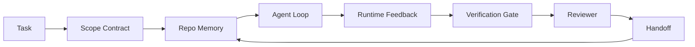

# 에이전트 워크벤치 엔지니어링: 유능한 모델이 여전히 실패하는 이유

> 유능한 모델(model)만으로는 충분하지 않다. 신뢰할 수 있는 에이전트(agent)에게는 워크벤치(workbench)가 필요하다: 지시(instructions), 상태(state), 범위(scope), 피드백(feedback), 검증(verification), 리뷰(review), 핸드오프(handoff). 이것들을 벗겨내면 프런티어(frontier) 모델조차 출하하기에 안전하지 않은 결과물을 내놓는다.

**Type:** Learn + Build
**Languages:** Python (stdlib)
**Prerequisites:** Phase 14 · 01 (Agent Loop), Phase 14 · 26 (Failure Modes)
**Time:** ~45분

## 학습 목표 (Learning Objectives)

- 모델의 능력(capability)과 실행 신뢰성(execution reliability)을 분리하기.
- 에이전트의 출하 여부를 결정하는 일곱 가지 워크벤치 표면(surface)의 이름을 대기.
- 작은 레포(repo) 작업에서 프롬프트 전용 실행을 워크벤치 안내 실행과 비교하기.
- 놓친 각 표면을 그것이 유발한 증상에 매핑하는 실패 모드(failure-mode) 리포트를 만들기.

## 문제 (The Problem)

당신은 프런티어 모델을 실제 레포에 떨어뜨려 놓고 입력 검증을 추가하라고 요청한다. 모델은 파일 네 개를 열고, 그럴듯한 코드를 작성하고, 성공을 선언하고, 멈춘다. 당신은 테스트를 실행한다. 두 개가 실패한다. 검증과 아무 상관 없던 세 번째 파일이 건드려져 있다. 에이전트가 무엇을 가정했는지, 처음에 무엇을 시도했는지, 무엇이 남았는지에 대한 기록이 전혀 없다.

모델은 Python에 대해 틀린 것이 아니었다. 작업(work)에 대해 틀렸던 것이다. 무엇이 완료로 간주되는지, 어디에 쓰는 것이 허용되는지, 어떤 테스트가 권위 있는지, 다음 세션이 어떻게 이어받아야 하는지에 대해 전혀 알지 못했다.

이것은 모델 버그가 아니다. 워크벤치 버그다. 에이전트를 둘러싼 표면에, 일회성 생성을 신뢰할 수 있고 재개 가능한 엔지니어링으로 바꾸는 부분이 빠져 있다.

## 개념 (The Concept)

워크벤치는 작업 중에 모델을 감싸는 운영 환경(operating environment)이다. 일곱 가지 표면이 있다:

| 표면 | 그것이 운반하는 것 | 빠졌을 때의 실패 |
|---------|-----------------|----------------------|
| 지시(Instructions) | 시작 규칙, 금지된 액션, 완료의 정의 | 에이전트가 출하의 의미를 추측한다 |
| 상태(State) | 현재 작업, 건드린 파일, 차단 요소, 다음 액션 | 각 세션이 0에서 다시 시작한다 |
| 범위(Scope) | 허용된 파일, 금지된 파일, 합격 기준 | 편집이 무관한 코드로 새어 나간다 |
| 피드백(Feedback) | 실제 명령 출력이 루프 안으로 포착됨 | 에이전트가 400에서 성공을 선언한다 |
| 검증(Verification) | 테스트, 린트(lint), 스모크 실행, 범위 확인 | "좋아 보임"이 main에 도달한다 |
| 리뷰(Review) | 다른 역할로 하는 두 번째 검토 | 빌더가 자기 숙제를 자기가 채점한다 |
| 핸드오프(Handoff) | 무엇이 바뀌었는지, 왜, 무엇이 남았는지 | 다음 세션이 모든 것을 다시 발견한다 |

워크벤치는 모델과 독립적이다. 모델을 교체하면서 표면을 유지할 수 있다. 표면을 교체하면서 신뢰성을 유지할 수는 없다.



루프는 채팅 히스토리가 아니라 상태 파일에서 닫힌다. 채팅은 휘발성이다. 레포가 기록의 시스템(system of record)이다.

### 워크벤치 vs 프롬프트 엔지니어링

프롬프팅은 이번 턴에 당신이 무엇을 원하는지 모델에게 말한다. 워크벤치는 턴을 가로질러, 세션을 가로질러 어떻게 작업할지를 모델에게 말한다. 대부분의 에이전트 실패 이야기는 프롬프트 엔지니어링의 옷을 입은 워크벤치 실패다.

### 워크벤치 vs 프레임워크

프레임워크는 런타임(runtime)을 준다(LangGraph, AutoGen, Agents SDK). 워크벤치는 그 런타임 안에서 에이전트가 작업할 장소를 준다. 둘 다 필요하다. 이 미니 트랙은 두 번째 것에 관한 것이다.

### 벤더 분류 체계가 아니라 원시 요소에서 추론하기

지금 "하니스(harness) 엔지니어링"에 대한 글이 많이 나온다. Addy Osmani, OpenAI, Anthropic, LangChain, Martin Fowler, MongoDB, HumanLayer, Augment Code, Thoughtworks, walkinglabs awesome 목록, 그리고 끊임없이 이어지는 Medium과 Hacker News 글들이 모두 이것을 다룬다. 이들은 하니스가 무엇인지의 경계, 무엇이 범위에 들어가는지, 어떤 어휘를 쓸지에 대해 의견이 갈린다. 우리는 한쪽 편을 들 필요가 없다. 일곱 가지 표면은 UX 계층이다. 모든 워크벤치 밑에는, 신뢰할 수 있는 어떤 백엔드든 떠받치는 것과 동일한 분산 시스템(distributed-systems) 원시 요소(primitive) 집합이 있다.

잠시 에이전트라는 라벨을 떼어내라. 에이전트 실행은 시간, 프로세스, 머신을 가로지르는 계산(computation)이다. 그것을 신뢰할 수 있게 만들려면 어떤 프로덕션(production) 시스템이든 필요로 하는 것과 동일한 원시 요소가 필요하다.

| 원시 요소 | 그것이 무엇인지 | 에이전트에게 운반하는 것 |
|-----------|------------|------------------------------|
| 함수(Function) | 타입이 지정된 핸들러. 가능한 한 순수함. 자신의 입력과 출력을 소유함. | 도구 호출, 규칙 확인, 검증 스텝, 모델 호출 |
| 워커(Worker) | 하나 이상의 함수와 라이프사이클(lifecycle)을 소유하는 장수 프로세스 | 빌더, 리뷰어, 검증자, MCP 서버 |
| 트리거(Trigger) | 함수를 호출하는 이벤트 소스 | 에이전트 루프 틱(tick), HTTP 요청, 큐 메시지, 크론, 파일 변경, 훅(hook) |
| 런타임(Runtime) | 무엇이 어디서, 어떤 타임아웃과 자원으로 실행될지 결정하는 경계 | Claude Code의 프로세스, LangGraph의 런타임, 워커 컨테이너 |
| HTTP / RPC | 호출자와 워커 사이의 선(wire) | 도구 호출 프로토콜, MCP 요청, 모델 API |
| 큐(Queue) | 트리거와 워커 사이의 지속적 버퍼; 백프레셔(back-pressure), 재시도, 멱등성(idempotency) | 작업 보드, 피드백 로그, 리뷰 인박스 |
| 세션 영속성(Session persistence) | 크래시, 재시작, 모델 교체에서 살아남는 상태 | `agent_state.json`, 체크포인트, KV 스토어, 레포 자체 |
| 인가 정책(Authorization policy) | 누가 어떤 범위로 어떤 함수를 호출할 수 있는지 | 허용/금지 파일, 승인 경계, MCP 능력 목록 |

이제 일곱 가지 워크벤치 표면을 그 원시 요소들에 매핑하라.

- **지시(Instructions)** — 정책 + 함수 메타데이터. 규칙은 확인(함수)이다. 라우터(`AGENTS.md`)는 런타임의 시작에 부착된 정책이다.
- **상태(State)** — 세션 영속성. 런타임이 매 스텝마다 읽는 키 기반(keyed) 스토어. 파일, KV, 또는 DB; 영속성 의미론(persistence semantics)이 중요하고, 저장 백엔드는 중요하지 않다.
- **범위(Scope)** — 작업별 인가 정책. 허용/금지 글롭(glob)은 ACL이다. 필요한 승인은 권한 격자(permission lattice)다.
- **피드백(Feedback)** — 큐에 기록되는 호출 로그. 모든 셸 호출은 하나의 기록으로, 지속적이고 재현 가능하다.
- **검증(Verification)** — 함수. 입력에 대해 결정론적이다. 작업 종료 시 트리거된다. 닫힘 방향으로 실패한다(fails closed).
- **리뷰(Review)** — 빌더 산출물에 대한 읽기 전용 인가(authz)와 리뷰 리포트에 대한 쓰기 전용 인가를 가진 별도의 워커.
- **핸드오프(Handoff)** — 세션 종료 트리거가 방출하는 지속적 기록. 다음 세션의 시작 트리거가 그것을 읽는다.

에이전트 루프 자체가 워커다. 이벤트(사용자 메시지, 도구 결과, 타이머 틱)를 소비하고, 함수(모델, 그다음 모델이 고른 도구)를 호출하고, 기록(상태, 피드백)을 쓰고, 트리거(검증, 리뷰, 핸드오프)를 방출한다. 신비할 것 없다. 작업 처리기(job processor)와 동일한 모양이다.

### 유통 중인 패턴을 원시 요소로 번역하기

모든 인기 있는 하니스 패턴은 여덟 가지 원시 요소로 환원된다. 번역표.

| 벤더 또는 커뮤니티 패턴 | 그것이 실제로 무엇인지 |
|------------------------------|--------------------|
| Ralph Loop (Claude Code, Codex, agentic_harness 책) — 에이전트가 일찍 멈추려 할 때 원래 의도를 신선한 컨텍스트 윈도우(context window)에 다시 주입 | 깨끗한 컨텍스트로 작업을 재큐잉하는 트리거; 세션 영속성이 목표를 앞으로 운반 |
| Plan / Execute / Verify (PEV) | 역할당 하나씩, 세 개의 워커가 상태와 단계 사이의 큐를 통해 통신 |
| Harness-compute separation (OpenAI Agents SDK, 2026년 4월) — 제어 평면(control plane)을 실행 평면(execution plane)에서 분리 | 제어 평면 / 데이터 평면을 다시 말한 것. 에이전트라는 라벨보다 수십 년 앞섬 |
| Open Agent Passport (OAP, 2026년 3월) — 실행 전에 선언적 정책에 대해 모든 도구 호출을 서명하고 감사 | 사전 액션 워커가 강제하는 인가 정책, 서명된 감사 큐 포함 |
| Guides and Sensors (Birgitta Böckeler / Thoughtworks) — 피드포워드 규칙 + 피드백 관찰 가능성 | 인가 정책 + 검증 함수 + 관찰 가능성 트레이스 |
| Progressive compaction, 5단계 (Claude Code 역공학, 2026년 4월) | 세션 영속성을 예산 안에 유지하기 위해 크론처럼 실행되는 상태 관리 워커 |
| Hooks / middleware (LangChain, Claude Code) — 모델과 도구 호출을 가로챔 | 런타임의 호출 경로를 감싼 트리거 + 함수 |
| Skills as Markdown with progressive disclosure (Anthropic, Flue) | 함수 메타데이터가 적시에(just-in-time) 컨텍스트로 로드되는 함수 레지스트리 |
| Sandbox agents (Codex, Sandcastle, Vercel Sandbox) | 컴퓨트 평면(compute plane): 격리된 파일 시스템, 네트워크, 라이프사이클을 가진 런타임 |
| MCP servers | 능력 목록을 인가로 삼아, 안정적인 RPC를 통해 함수를 노출하는 워커 |

그 표의 모든 항목은, 에이전트 커뮤니티가 분산 시스템에서 이미 이름이 있던 원시 요소에 도달하여 거기에 새 이름을 붙인 것이다. 마케팅에는 유용한 라벨이지만, 엔지니어링 어휘로는 유용하지 않다.

### 영수증이 실제로 말하는 것

하니스가 모델을 능가한다는 주장에는 이제 그 뒤를 받치는 숫자가 있다. 알아둘 가치가 있는데, 그것이 또한 "그냥 더 똑똑한 모델을 기다려라"에 맞서는 유일하게 정직한 논거이기 때문이다.

- Terminal Bench 2.0 — 동일한 모델에서, 하니스 변경만으로 코딩 에이전트가 상위 30위 바깥에서 5위로 이동했다(LangChain, *Anatomy of an Agent Harness*).
- Vercel — 에이전트 도구의 80%를 삭제했다; 성공률이 80%에서 100%로 뛰었다(MongoDB).
- Harvey — 하니스 최적화만으로 법률 에이전트의 정확도가 두 배 이상 올랐다(MongoDB).
- 엔터프라이즈 AI 에이전트 프로젝트의 88%가 프로덕션에 도달하지 못한다. 실패는 추론(reasoning)이 아니라 런타임 주위에 몰려 있다(preprints.org, *Harness Engineering for Language Agents*, 2026년 3월).
- 세 개의 인기 있는 오픈소스 프레임워크를 가로지른 2025년 벤치마크(benchmark) 연구는 ~50% 작업 완료율을 보고했다; 긴 컨텍스트(long-context) WebAgent는 긴 컨텍스트 조건에서 40-50%에서 10% 미만으로 무너졌으며, 대부분 무한 루프와 목표 상실(goal loss) 때문이었다(2026년 초 여러 글에서 폭넓게 다뤄짐).

요점은 "하니스가 영원히 이긴다"가 아니다. 모델은 시간이 지나면서 하니스 기법을 흡수한다. 요점은, 오늘날 하중을 지탱하는(load-bearing) 엔지니어링이 모델 안이 아니라 모델 주위에 있다는 것, 그리고 그 하중을 운반하는 원시 요소가 모든 프로덕션 시스템이 늘 필요로 해온 바로 그것이라는 점이다.

### 벤더 글들이 멈춰 서는 지점

이 부분에서는 예의를 차릴 필요가 없다.

- LangChain의 *Anatomy of an Agent Harness*는 열한 가지 구성 요소를 나열한다 — 프롬프트, 도구, 훅, 샌드박스, 오케스트레이션, 메모리, 스킬, 서브에이전트, 그리고 런타임의 "멍청한 루프(dumb loop)". 큐, 배포 단위로서의 워커, 트리거 의미론, 별도의 관심사로서의 세션 영속성, 또는 인가 정책을 이름 짓지 않는다. 하니스를 당신이 배포하는 시스템이 아니라 당신이 구성하는 객체로 취급한다.
- Addy Osmani의 *Agent Harness Engineering*은 `Agent = Model + Harness`라는 프레이밍과 래칫(ratchet) 패턴에 도달하지만, 하니스가 무엇으로 만들어지는지를 말하는 데까지는 이르지 못한다. 명세(spec)가 아니라 입장(stance)으로 읽힌다.
- Anthropic과 OpenAI는 표면에 대해 가장 깊이 들어가지만 자신들의 런타임 안에 머문다. 2026년 4월 Agents SDK의 "harness-compute separation" 발표는 제어 평면 / 데이터 평면 분리를 명시적으로 지지한 첫 벤더 글이다. 그것은 새로운 아이디어가 아니라 원시적인 아이디어다.
- agentic_harness 책은 하니스를 구성 객체(config object)로 취급하며(Jaymin West의 *Agentic Engineering*, 6장), 그 안에서 가장 강력한 문장은 "하니스는 에이전트 시스템에서 일차적인 보안 경계다"이다. 그것은 그저 인가 정책을 다시 말한 것이다.
- Hacker News 스레드들은 계속 같은 지점에 도달한다. 2026년 4월 스레드 *The agent harness belongs outside the sandbox*는 하니스가 "모든 것 바깥에 앉아 컨텍스트와 사용자에 기반해 접근을 인가하는 하이퍼바이저(hypervisor)에 더 가깝게" 위치해야 한다고 주장한다. 그것은 다시, 별도의 평면으로서의 인가 정책이다.

이 글들 어느 것과도 의견을 달리할 필요 없이 그 공백을 알아챌 수 있다. 그들은 이미 존재하는 시스템의 UX 설명을 쓰고 있다. 우리는 그 시스템을 쓰고 있다. 시스템이 올바르게 구축되면, 일곱 가지 표면이 원시 요소에서 자연히 떨어져 나온다. 잘못 구축되면, 아무리 `AGENTS.md`를 다듬어도 빠진 큐를 고치지 못한다.

그러니 다른 곳에서 "하니스 엔지니어링"이라는 말을 들으면, 원시 요소로 번역하라. 프롬프트와 규칙은 정책과 함수다. 스캐폴딩(scaffolding)은 런타임이다. 가드레일(guardrail)은 인가 + 검증이다. 훅은 트리거다. 메모리는 세션 영속성이다. Ralph Loop는 재큐(requeue)다. 서브에이전트는 워커다. 샌드박스는 컴퓨트 평면이다. 어휘는 바뀌지만 엔지니어링은 바뀌지 않는다. 워크벤치는 에이전트를 향한 UX다; 다음 벤더의 재프레이밍에서도 살아남는 의미의 하니스는, 올바르게 연결된 함수, 워커, 트리거, 런타임, 큐, 영속성, 정책이다.

## 직접 만들기 (Build It)

`code/main.py`는 작은 레포 작업을 두 번 실행한다. 먼저 프롬프트 전용으로, 그다음 일곱 가지 표면을 연결한 채로. 동일한 모델, 동일한 작업. 스크립트는 실패한 실행에서 어떤 표면이 빠졌는지 세고 실패 모드 리포트를 출력한다.

레포 작업은 의도적으로 작다: 한 파일짜리 FastAPI 스타일 핸들러에 입력 검증을 추가하고 통과하는 테스트를 작성하는 것.

실행:

```
python3 code/main.py
```

출력: 두 실행을 나란히 보여주는 로그, 프롬프트 전용 실행을 요약하는 `failure_modes.json`, 그리고 워크벤치 실행에 대한 한 줄 판정.

에이전트는 작은 규칙 기반 스텁(stub)이다; 핵심은 모델이 아니라 표면이다. 이 미니 트랙의 나머지에서 각 표면을 실제로 재사용 가능한 산출물로 다시 구축할 것이다.

## 라이브러리로 써보기 (Use It)

아무도 그렇게 부르지 않더라도, 워크벤치 표면이 이미 야생에 존재하는 세 곳:

- **Claude Code, Codex, Cursor.** `AGENTS.md`와 `CLAUDE.md`가 지시 표면이다. 슬래시 명령(slash command)이 범위다. 훅이 검증이다.
- **LangGraph, OpenAI Agents SDK.** 체크포인트와 세션 스토어가 상태 표면이다. 핸드오프가 핸드오프 표면이다.
- **실제 레포의 CI.** 테스트, 린트, 타입 검사가 검증이다. PR 템플릿이 핸드오프다. CODEOWNERS가 리뷰다.

워크벤치 엔지니어링은, 각 팀이 그것들을 다시 발견하도록 내버려 두는 대신, 그 표면들을 명시적이고 재사용 가능하게 만드는 분야(discipline)다.

## 산출물 (Ship It)

`outputs/skill-workbench-audit.md`는 기존 레포를 일곱 가지 워크벤치 표면에 대해 감사하고, 어떤 것이 빠졌고, 어떤 것이 부분적이며, 어떤 것이 건강한지 보고하는 이식 가능한(portable) 스킬이다. 어떤 에이전트 설정 옆에든 떨어뜨려라; 무엇을 먼저 고쳐야 할지 알려준다.

## 연습 문제 (Exercises)

1. 이미 에이전트를 실행하고 있는 레포를 골라라. 일곱 가지 표면을 0(빠짐)부터 2(건강함)까지 채점하라. 가장 약한 표면은 무엇인가?
2. 프롬프트 전용 실행도 가짜 "성공" 주장을 내놓도록 `main.py`를 확장하라. 검증 게이트가 그것을 잡아냈을지 검증하라.
3. 당신 제품을 위한 여덟 번째 표면을 추가하라. 그것이 기존 일곱 가지 중 하나로 무너지지 않는 이유를 정당화하라.
4. 추가 파일 쓰기를 환각하는 다른 스텁 에이전트로 스크립트를 다시 실행하라. 어떤 표면이 그것을 가장 먼저 잡아내는가?
5. Phase 14 · 26의 업계에서 반복되는 다섯 가지 실패 모드를 일곱 가지 표면에 매핑하라. 각 표면은 어떤 모드를 흡수하도록 설계되었는가?

## 핵심 용어 (Key Terms)

| 용어 | 사람들이 말하는 것 | 실제 의미 |
|------|----------------|------------------------|
| 워크벤치(Workbench) | "그 설정" | 작업을 신뢰할 수 있게 만드는, 모델 주위에 엔지니어링된 표면들 |
| 표면(Surface) | "문서" 또는 "스크립트" | 에이전트가 매 턴마다 읽거나 쓰는, 이름이 붙고 기계가 읽을 수 있는 입력 |
| 기록의 시스템(System of record) | "메모" | 채팅 히스토리가 사라졌을 때 에이전트가 진실로 취급하는 파일 |
| 완료의 정의(Definition of done) | "합격" | 에이전트가 위조할 수 없는, 객관적이고 파일로 뒷받침되는 체크리스트 |
| 워크벤치 감사(Workbench audit) | "레포 준비도 확인" | 작업 시작 전에 빠진 부분을 표시하는, 일곱 가지 표면에 대한 검토 |

## 더 읽을거리 (Further Reading)

이것들을 권위가 아니라 데이터 포인트로 읽어라. 각각은 부분적인 분류 체계다. 그것을 채택할지 결정하기 전에 모든 개념을 원시 요소(함수, 워커, 트리거, 런타임, HTTP/RPC, 큐, 영속성, 정책)로 되번역하라.

벤더 프레이밍:

- [Addy Osmani, Agent Harness Engineering](https://addyosmani.com/blog/agent-harness-engineering/) — `Agent = Model + Harness`와 래칫 패턴; 인프라에 대해서는 얄팍함
- [LangChain, The Anatomy of an Agent Harness](https://blog.langchain.com/the-anatomy-of-an-agent-harness/) — 열한 가지 구성 요소: 프롬프트, 도구, 훅, 오케스트레이션, 샌드박스, 메모리, 스킬, 서브에이전트, 런타임; 큐, 배포, 인가는 누락
- [OpenAI, Harness engineering: leveraging Codex in an agent-first world](https://openai.com/index/harness-engineering/) — 자신들의 런타임 주위 표면에 대한 Codex 팀의 견해
- [OpenAI, Unrolling the Codex agent loop](https://openai.com/index/unrolling-the-codex-agent-loop/) — 함수 호출에 대한 `while`로 환원된 에이전트 루프
- [Anthropic, Effective harnesses for long-running agents](https://www.anthropic.com/engineering/effective-harnesses-for-long-running-agents) — 특정 런타임 안의 장기 지평(long-horizon) 표면
- [Anthropic, Harness design for long-running application development](https://www.anthropic.com/engineering/harness-design-long-running-apps) — 적용된 설계 노트
- [LangChain Deep Agents harness capabilities](https://docs.langchain.com/oss/python/deepagents/harness) — 런타임 구성 표면

쓸 만한 세부가 있는 실무자 글:

- [Martin Fowler / Birgitta Böckeler, Harness engineering for coding agent users](https://martinfowler.com/articles/harness-engineering.html) — 가이드(피드포워드) + 센서(피드백); 가장 깔끔한 제어 이론(control-theory) 프레이밍
- [HumanLayer, Skill Issue: Harness Engineering for Coding Agents](https://www.humanlayer.dev/blog/skill-issue-harness-engineering-for-coding-agents) — "모델 문제가 아니라 구성 문제다"
- [MongoDB, The Agent Harness: Why the LLM Is the Smallest Part of Your Agent System](https://www.mongodb.com/company/blog/technical/agent-harness-why-llm-is-smallest-part-of-your-agent-system) — 영수증: Vercel 80%에서 100%, Harvey 2배 정확도, Terminal Bench 상위 30위에서 상위 5위
- [Augment Code, Harness Engineering for AI Coding Agents](https://www.augmentcode.com/guides/harness-engineering-ai-coding-agents) — 제약 우선(constraint-first) 워크스루
- [Sequoia podcast, Harrison Chase on Context Engineering Long-Horizon Agents](https://sequoiacap.com/podcast/context-engineering-our-way-to-long-horizon-agents-langchains-harrison-chase/) — 모델 관심사보다 런타임 관심사

책, 논문, 참조 구현:

- [Jaymin West, Agentic Engineering — Chapter 6: Harnesses](https://www.jayminwest.com/agentic-engineering-book/6-harnesses) — 책 분량의 다룸, 하니스를 일차적 보안 경계로 취급
- [preprints.org, Harness Engineering for Language Agents (March 2026)](https://www.preprints.org/manuscript/202603.1756) — 제어 / 행위성(agency) / 런타임으로서의 학술적 프레이밍
- [walkinglabs/awesome-harness-engineering](https://github.com/walkinglabs/awesome-harness-engineering) — 컨텍스트, 평가, 관찰 가능성, 오케스트레이션을 가로지르는 큐레이션된 읽기 목록
- [ai-boost/awesome-harness-engineering](https://github.com/ai-boost/awesome-harness-engineering) — 대체 큐레이션 목록(도구, 평가, 메모리, MCP, 권한)
- [andrewgarst/agentic_harness](https://github.com/andrewgarst/agentic_harness) — Redis 기반 메모리와 평가 스위트를 갖춘 프로덕션 준비 참조 구현
- [HKUDS/OpenHarness](https://github.com/HKUDS/OpenHarness) — 내장 개인 에이전트를 갖춘 오픈 에이전트 하니스

합의가 아니라 의견 차이 때문에 읽을 가치가 있는 Hacker News 스레드:

- [HN: Effective harnesses for long-running agents](https://news.ycombinator.com/item?id=46081704)
- [HN: Improving 15 LLMs at Coding in One Afternoon. Only the Harness Changed](https://news.ycombinator.com/item?id=46988596)
- [HN: The agent harness belongs outside the sandbox](https://news.ycombinator.com/item?id=47990675) — 별도 평면으로서의 인가를 주장

이 커리큘럼 내부의 상호 참조:

- Phase 14 · 23 — OpenTelemetry GenAI 관례: 센서 문헌이 가리키는 관찰 가능성 계층
- Phase 14 · 26 — 일곱 가지 표면이 흡수하도록 설계된 실패 모드를 목록화함
- Phase 14 · 27 — 인가 정책 원시 요소에 위치하는 프롬프트 인젝션(prompt injection) 방어
- Phase 14 · 29 — 프로덕션 런타임(큐, 이벤트, 크론): 이 레슨의 원시 요소가 배포에서 사는 곳
