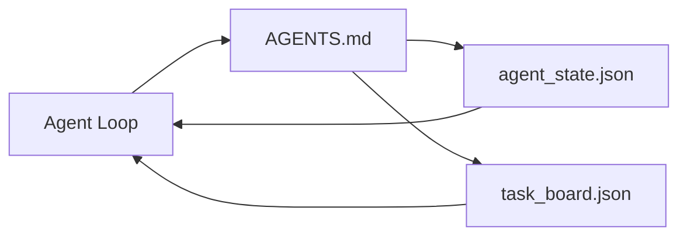

# 최소 에이전트 워크벤치

> 가장 작고 유용한 워크벤치(workbench)는 파일 세 개다: 루트 지시 라우터(root instructions router), 상태 파일(state file), 작업 보드(task board). 나머지는 모두 이 위에 층층이 쌓인다. 레포(repo)가 이 셋을 담아내지 못한다면, 어떤 모델(model)도 그 레포를 구하지 못한다.

**Type:** Build
**Languages:** Python (stdlib)
**Prerequisites:** Phase 14 · 31 (Why Capable Models Still Fail)
**Time:** ~45분

## 학습 목표 (Learning Objectives)

- 최소 실행 가능 워크벤치(minimum viable workbench)를 이루는 세 파일을 정의하기.
- 짧은 루트 라우터가 긴 단일체(monolithic) `AGENTS.md`보다 나은 이유를 설명하기.
- 에이전트(agent)가 매 턴마다 읽고 마지막에 쓰는 상태 파일을 만들기.
- 채팅 히스토리 없이 다중 세션(multi-session) 작업에서 살아남는 작업 보드를 만들기.

## 문제 (The Problem)

대부분의 팀은 3000줄짜리 `AGENTS.md`를 작성하고는 다 됐다고 여기는 식으로 워크벤치에 손을 댄다. 모델은 그 파일을 로드하고, 요약할 수 없는 부분은 무시하며, 늘 실패하던 바로 그 표면(surface)에서 여전히 실패한다.

필요한 건 정반대다. 관련이 있을 때만 에이전트를 더 깊은 파일로 라우팅하는 작은 루트 파일. 에이전트가 행동하기 전에 읽고 행동한 후에 쓰는 지속적(durable) 상태. 무엇이 진행 중이고, 무엇이 막혀 있고, 다음에 무엇이 올지를 말해주는 작업 보드.

파일 세 개. 각각 하나의 임무를 가진다. 각각 나중에 실제 시스템으로 진화할 만큼 충분히 기계가 읽을 수 있다.

## 개념 (The Concept)



### AGENTS.md는 매뉴얼이 아니라 라우터다

좋은 `AGENTS.md`는 짧다. 그것은 에이전트를 다음으로 가리킨다:

- 상태 파일(당신이 어디에 있는지).
- 작업 보드(무엇이 남았는지).
- 더 깊은 규칙(`docs/agent-rules.md` 아래).
- 검증 명령(verification command)(그것이 작동하는지 어떻게 아는지).

그보다 긴 것은 더 깊은 문서로 들어가, 필요할 때만 로드된다. 긴 매뉴얼은 무시당한다. 짧은 라우터는 따라진다.

### agent_state.json은 기록의 시스템이다

상태는 다음을 담는다: 활성 작업 id, 건드린 파일, 만든 가정(assumption), 차단 요소(blocker), 다음 액션. 에이전트는 매 턴마다 상태를 읽는다. 다음 세션은 채팅을 재생하는 대신 이 상태를 읽는다.

상태가 파일에 사는 이유는 채팅 히스토리가 신뢰할 수 없기 때문이다. 세션은 죽는다. 대화는 잘려 나간다. 파일은 그렇지 않다.

### task_board.json은 큐다

작업 보드는 `todo | in_progress | done | blocked` 상태를 가진 모든 작업을 담는다. 상태가 비었을 때 에이전트가 끌어오는 큐(queue)이자, 에이전트가 제대로 가고 있는지 알고 싶을 때 사람이 읽는 큐다.

보드 위의 작업은 id, 목표(goal), 소유자(`builder`, `reviewer`, `human`), 합격 기준(acceptance criteria)을 가진다. 보드는 의도적으로 작다: 한 화면을 넘어 커지면, 그건 보드 문제가 아니라 계획(planning) 문제다.

### 파일 세 개는 바닥이지 천장이 아니다

이후 레슨은 범위 계약(scope contract), 피드백 러너(feedback runner), 검증 게이트(verification gate), 리뷰어 체크리스트(reviewer checklist), 핸드오프 패킷(handoff packet)을 추가한다. 여기 세 파일은 그 모두가 전제하는 토대다.

## 직접 만들기 (Build It)

`code/main.py`는 빈 레포에 최소 워크벤치를 써 넣고, 다음을 수행하는 단일 에이전트 턴을 시연한다:

1. `agent_state.json`을 읽는다.
2. 상태가 비어 있으면 `task_board.json`에서 다음 작업을 끌어온다.
3. 범위 안의 단일 파일을 건드린다.
4. 갱신된 상태를 다시 쓴다.

실행:

```
python3 code/main.py
```

스크립트는 자신 옆에 `workdir/`을 생성하고, 세 파일을 깔고, 한 턴을 실행하고, diff를 출력한다. 다시 실행하면 두 번째 턴이 첫 번째가 멈춘 지점을 그대로 이어받는 모습이 보인다.

## 라이브러리로 써보기 (Use It)

프로덕션(production) 에이전트 제품 내부에서, 동일한 세 파일이 다른 이름으로 나타난다:

- **Claude Code:** 라우터에는 `AGENTS.md` 또는 `CLAUDE.md`, 상태에는 `.claude/state.json` 스타일 스토어, 보드에는 훅(hook).
- **Codex / Cursor:** 라우터에는 워크스페이스 규칙(workspace rules), 상태에는 세션 메모리, 보드에는 채팅 사이드바의 큐잉된 작업.
- **커스텀 Python 에이전트:** 당신이 방금 쓴 바로 그 파일들.

이름은 바뀐다. 모양은 바뀌지 않는다.

## 야생의 프로덕션 패턴

최소 워크벤치는, 그 위에 세 가지 패턴이 층층이 쌓일 때 실제 모노레포(monorepo)와의 접촉에서 살아남는다. 세 패턴은 서로 독립적이니, 레포에 정말 필요한 것만 골라라.

**가장 가까운 것이 이기는(nearest-wins) 우선순위를 가진 중첩 `AGENTS.md`.** OpenAI는 메인 레포 전반에 서브컴포넌트당 하나씩 88개의 `AGENTS.md` 파일을 출하한다. Codex, Cursor, Claude Code, Copilot은 모두 작업 중인 파일에서 레포 루트를 향해 걸어 올라가며, 도중에 찾은 모든 `AGENTS.md`를 연결한다. 하위 디렉터리 파일은 루트 파일을 확장한다. Codex는 확장하는 대신 대체하는 `AGENTS.override.md`를 추가한다; 이 오버라이드 메커니즘은 Codex 고유이므로 도구 간(cross-tool) 작업에서는 피하라. Augment Code의 측정이 중요한 문장이다: 최고의 `AGENTS.md` 파일은 Haiku에서 Opus로 업그레이드하는 것에 맞먹는 품질 도약을 준다; 최악의 것은 파일이 아예 없는 것보다 출력을 더 나쁘게 만든다.

**커버리지처럼 보일 때조차 거부해야 할 안티패턴(anti-pattern).** 충돌하는 지시는 조용히 에이전트를 상호작용(interactive) 모드에서 탐욕적(greedy) 모드로 떨어뜨린다(ICLR 2026 AMBIG-SWE: 해결률 48.8% → 28%). 우선순위를 평평하게 쌓는 대신 번호를 매겨라. 강제 명령이 없는 검증 불가능한 스타일 규칙("Google Python Style Guide를 따르라")은 에이전트가 준수를 지어내게 만든다. 모든 스타일 규칙을 정확한 린트(lint) 명령과 짝지어라. 명령 대신 스타일로 시작하면 검증 경로가 묻힌다. 명령을 먼저, 스타일을 마지막에 둔다. 에이전트가 아니라 인간을 위해 쓰면 컨텍스트 예산(context budget)을 낭비한다. 간결함(terseness)이 곧 기능이다.

**도구 간 심볼릭 링크.** 심볼릭 링크가 있는 단일 루트 파일(`ln -s AGENTS.md CLAUDE.md`, `ln -s AGENTS.md .github/copilot-instructions.md`, `ln -s AGENTS.md .cursorrules`)은 모든 코딩 에이전트를 동일한 진실의 출처(source of truth)에 둔다. Nx의 `nx ai-setup`은 단일 구성에서 Claude Code, Cursor, Copilot, Gemini, Codex, OpenCode 전반에 걸쳐 이것을 자동화한다.

## 산출물 (Ship It)

`outputs/skill-minimal-workbench.md`는 어떤 새 레포에 대해서든 세 파일 워크벤치를 생성한다: 프로젝트에 맞춰진 `AGENTS.md` 라우터, 올바른 키를 가진 `agent_state.json`, 그리고 현재 백로그(backlog)로 시드된 `task_board.json`.

## 연습 문제 (Exercises)

1. `agent_state.json`에 `last_run` 타임스탬프를 추가하라. 운영자(operator)가 확인하지 않는 한, 파일이 24시간보다 오래되었으면 실행을 거부하라.
2. 작업 보드에 `priority` 필드를 추가하고, 끌어오는 로직을 항상 가장 높은 우선순위의 `todo`를 고르도록 바꿔라.
3. `task_board.json`을 JSON Lines로 마이그레이션하여 각 작업이 한 줄이 되고 버전 관리에서 diff가 깔끔하도록 하라.
4. `AGENTS.md`가 80줄을 넘거나 존재하지 않는 파일을 참조하면 실패하는 `lint_workbench.py`를 작성하라.
5. 세 파일 중 어느 하나를 잃으면 가장 큰 타격을 받을지 결정하라. 그것을 변호하라.

## 핵심 용어 (Key Terms)

| 용어 | 사람들이 말하는 것 | 실제 의미 |
|------|----------------|------------------------|
| 라우터(Router) | `AGENTS.md` | 에이전트를 더 깊은 문서와 파일로 가리키는 짧은 루트 파일 |
| 상태 파일(State file) | "메모" | 에이전트가 어디에 있는지에 대한, 매 턴마다 쓰이는 기계가 읽을 수 있는 기록 |
| 작업 보드(Task board) | "백로그" | 상태, 소유자, 합격 기준을 가진 작업의 JSON 큐 |
| 기록의 시스템(System of record) | "진실의 출처" | 채팅이 사라졌을 때 워크벤치가 권위 있는 것으로 취급하는 파일 |

## 더 읽을거리 (Further Reading)

- [agents.md — the open spec](https://agents.md/) — Cursor, Codex, Claude Code, Copilot, Gemini, OpenCode가 채택
- [Augment Code, A good AGENTS.md is a model upgrade. A bad one is worse than no docs at all](https://www.augmentcode.com/blog/how-to-write-good-agents-dot-md-files) — 측정된 품질 도약
- [Blake Crosley, AGENTS.md Patterns: What Actually Changes Agent Behavior](https://blakecrosley.com/blog/agents-md-patterns) — 경험적으로 무엇이 작동하고 무엇이 안 되는지
- [Datadog Frontend, Steering AI Agents in Monorepos with AGENTS.md](https://dev.to/datadog-frontend-dev/steering-ai-agents-in-monorepos-with-agentsmd-13g0) — 실전에서의 중첩 우선순위
- [Nx Blog, Teach Your AI Agent How to Work in a Monorepo](https://nx.dev/blog/nx-ai-agent-skills) — 여섯 도구 전반의 단일 출처 생성
- [The Prompt Shelf, AGENTS.md Best Practices: Structure, Scope, and Real Examples](https://thepromptshelf.dev/blog/agents-md-best-practices/) — 리뷰에서 살아남는 섹션 순서
- [Anthropic, Claude Code subagents and session store](https://docs.anthropic.com/en/docs/agents-and-tools/claude-code/sub-agents)
- Phase 14 · 31 — 이 최소가 흡수하는 실패 모드
- Phase 14 · 34 — 이 레슨이 미리 보여주는 지속적 상태 스키마
