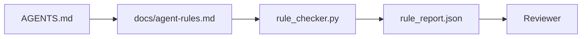

# 실행 가능한 제약으로서의 에이전트 지시

> 산문으로 쓰인 지시(instructions)는 소원이다. 제약(constraint)으로 쓰인 지시는 테스트다. 워크벤치(workbench)는 각 규칙을, 에이전트(agent)가 런타임(runtime)에 확인할 수 있고 리뷰어(reviewer)가 사후에 검증할 수 있는 무언가로 바꾼다.

**Type:** Build
**Languages:** Python (stdlib)
**Prerequisites:** Phase 14 · 32 (Minimal Workbench)
**Time:** ~50분

## 학습 목표 (Learning Objectives)

- 라우팅 산문을 운영 규칙(operational rule)에서 분리하기.
- 시작 규칙, 금지된 액션, 완료의 정의, 불확실성 처리, 승인 경계를 기계가 확인 가능한(machine-checkable) 제약으로 표현하기.
- 규칙 집합에 대해 실행을 채점하는 규칙 검사기(rule checker)를 구현하기.
- 규칙 집합을 diff 친화적으로 만들어 리뷰가 무엇이 바뀌었는지 볼 수 있게 하기.

## 문제 (The Problem)

전형적인 `AGENTS.md`는 온보딩 문서처럼 읽힌다. 에이전트에게 "조심하라"고, "철저히 테스트하라"고, "확실하지 않으면 물어보라"고 말한다. 사흘 후, 에이전트는 테스트 없이 변경을 출하하고, 금지된 디렉터리에 쓰며, 어디에 선이 있는지 전혀 몰랐기에 결코 묻지 않는다.

지시는 운영적(operational)일 때 강력하고 열망적(aspirational)일 때 약하다. 해결책은 워크벤치가 해석할 수 있고 리뷰어가 채점할 수 있는 규칙을 쓰는 것이다.

## 개념 (The Concept)

규칙은 짧은 루트 라우터에서 떨어진 `docs/agent-rules.md`에 속한다. 각 규칙은 이름, 카테고리, 그리고 확인(check)을 가진다.



### 대부분의 규칙을 포괄하는 다섯 가지 카테고리

| 카테고리 | 규칙이 답하는 질문 | 예시 |
|----------|---------------------------|---------|
| 시작(Startup) | 작업이 시작되기 전에 무엇이 참이어야 하는가? | "상태 파일이 존재하고 신선하다" |
| 금지(Forbidden) | 무엇이 결코 일어나서는 안 되는가? | "`scripts/release.sh`를 편집하지 말라" |
| 완료의 정의(Definition of done) | 무엇이 작업이 완료되었음을 증명하는가? | "pytest가 0으로 종료하고 합격 라인이 통과한다" |
| 불확실성(Uncertainty) | 확실하지 않을 때 에이전트는 무엇을 하는가? | "추측하는 대신 질문 노트를 연다" |
| 승인(Approval) | 무엇이 인간의 승인을 요구하는가? | "모든 새 의존성, 모든 프로덕션 쓰기" |

이 다섯 가지 중 하나에 들어맞지 않는 규칙은 대개 두 개의 규칙이 되고 싶어 한다. 분리를 강제하라.

### 규칙은 기계가 읽을 수 있다

각 규칙은 슬러그(slug), 카테고리, 한 줄 설명, 그리고 `rule_checker.py`의 함수를 이름 짓는 `check` 필드를 가진다. 규칙을 추가한다는 것은 확인을 추가한다는 뜻이고, 검사기는 워크벤치와 함께 자란다.

### 규칙은 diff 친화적이다

규칙은 단일 마크다운 파일에서 헤딩당 하나씩 산다. 이름 변경은 diff에서 보인다. 새 규칙은 자기 카테고리 맨 위에 앉는다. 오래된 규칙은 주석 처리가 아니라 삭제된다. 워크벤치가 진실의 출처(source of truth)이지, 지난 분기에 팀이 어떻게 느꼈는지의 채팅 로그가 아니기 때문이다.

### 규칙 vs 프레임워크 가드레일

프레임워크 가드레일(guardrail)(OpenAI Agents SDK 가드레일, LangGraph 인터럽트(interrupt))은 런타임 수준에서 규칙을 강제한다. 이 레슨의 규칙 집합은 그 가드레일이 구현하는, 인간이 읽을 수 있고 리뷰 가능한 계약이다. 둘 다 필요하다. 런타임은 턴 도중 위반을 잡고, 규칙 집합은 런타임이 올바른 일을 하고 있음을 증명한다.

## 직접 만들기 (Build It)

`code/main.py`는 다음을 출하한다:

- 규칙을 데이터클래스로 로드하는 `agent-rules.md` 파서.
- `check` 참조당 하나씩, `rule_checker.py` 스타일 검사기 함수.
- 두 규칙을 위반하는 데모 에이전트 실행과 그것을 잡아내는 검사 통과.

실행:

```
python3 code/main.py
```

출력: 파싱된 규칙 집합, 실행 트레이스, 규칙별 통과/실패, 그리고 스크립트 옆에 저장된 `rule_report.json`.

## 야생의 프로덕션 패턴

세 가지 패턴이, 한 분기를 가는 규칙 집합과 일주일 만에 썩는 것을 가른다.

**작성 시점 심각도 태깅(severity tagging).** 모든 규칙은 `severity`를 운반한다: `block`, `warn`, 또는 `info`. 검사기는 셋 모두를 보고하지만 런타임은 `block`에서만 거부한다. 대부분의 팀은 초기에 심각도를 과장하고는 마감 압박 아래 조용히 그 심각도를 약화시키는데, 작성 시점 태깅은 보정(calibration)을 미리 강제한다. `block` 규칙의 어떤 오버라이드든 `overrides.jsonl` 감사 로그에 서명하는 검증 게이트(Phase 14 · 38)와 짝지어라.

**강제 함수(forcing function)로서의 규칙 만료.** 모든 규칙은 `expires_at` 날짜(작성으로부터 기본 90일)를 운반한다. 검사기는 만료되지 않은 규칙이 60일 연속 위반이 0건일 때 경고를 방출한다. 다음 분기 리뷰는 그 규칙을 유지하는 것을 정당화하거나, `info`로 약화하거나, 삭제한다. Cloudflare의 프로덕션 AI 코드 리뷰 데이터(2026년 4월, 30일간 5,169개 레포 전반의 131,246회 리뷰 실행)는, 명시적 만료가 있는 규칙 집합이 레포당 30개 미만으로 유지됨을 보여줬다. 만료가 없는 집합은 80개 이상으로 자랐고 대부분이 결코 발동되지 않았다.

**마크다운을 소스로, JSON을 캐시로.** `agent-rules.md`는 작성된 파일이고, `agent-rules.lock.json`은 검사기가 핫 패스(hot path)에서 읽는 캐시다. 락(lock)은 pre-commit 훅으로 재생성된다. 마크다운 diff는 리뷰할 수 있고, JSON 파싱은 매 턴에서 빠진다. `package.json` / `package-lock.json` 및 `Cargo.toml` / `Cargo.lock`과 동일한 모양이다.

## 라이브러리로 써보기 (Use It)

프로덕션에서:

- Claude Code, Codex, Cursor는 세션 시작 시 규칙을 읽고 액션을 거부할 때 그 규칙을 인용한다. 검사기는 조용한 드리프트(drift)를 잡으려고 CI에서 다시 실행된다.
- OpenAI Agents SDK 가드레일은 동일한 확인을 입력 및 출력 가드레일로 등록한다. 마크다운은 문서 표면이고, SDK는 런타임 표면이다.
- LangGraph 인터럽트는 진행 중인 노드가 규칙을 위반할 때 발동한다. 인터럽트 핸들러는 규칙을 읽고, 인간에게 묻고, 재개한다.

규칙 집합은 그저 마크다운에 함수 이름을 더한 것이기에 셋 모두에 걸쳐 이식 가능하다.

## 산출물 (Ship It)

`outputs/skill-rule-set-builder.md`는 프로젝트 소유자를 인터뷰하고, 그들의 기존 산문 지시를 다섯 가지 카테고리로 분류하며, 버전이 매겨진 `agent-rules.md`와 검사기 스텁(stub)을 방출한다.

## 연습 문제 (Exercises)

1. 제품이 진정으로 필요로 한다면 여섯 번째 카테고리를 추가하라. 그 카테고리가 다섯 가지 중 하나로 무너지지 않는 이유를 변호하라.
2. 규칙이 심각도(`block`, `warn`, `info`)를 운반할 수 있고 리포트가 그에 따라 집계하도록 검사기를 확장하라.
3. 검사기를 CI에 연결하라: 최신 에이전트 실행에서 block 심각도 규칙이 실패하면 빌드를 실패시켜라.
4. 규칙당 "만료(expiry)" 필드를 추가하라. 확인 실패 없이 90일이 지나면 그 규칙은 리뷰 대상이다.
5. 실제 `AGENTS.md`를 찾아 다섯 가지 카테고리 규칙으로 다시 써라. 그 줄들 중 몇 개가 운영적이었는가? 몇 개가 열망적이었는가?

## 핵심 용어 (Key Terms)

| 용어 | 사람들이 말하는 것 | 실제 의미 |
|------|----------------|------------------------|
| 운영 규칙(Operational rule) | "진짜 지시" | 워크벤치가 런타임에 확인할 수 있는 규칙 |
| 열망적 규칙(Aspirational rule) | "조심하라" | 확인이 없는 규칙; 삭제하거나 업그레이드하라 |
| 완료의 정의(Definition of done) | "합격" | 작업이 완료되었다는 객관적이고 파일로 뒷받침되는 증명 |
| Block 심각도(Block severity) | "강한 규칙" | 위반이 실행을 중단시킴; 운영자 없이는 침묵시킬 수 없음 |
| 규칙 만료(Rule expiry) | "오래된 규칙 청소" | N일간 실패가 없는 규칙은 폐기 대상 |

## 더 읽을거리 (Further Reading)

- [OpenAI Agents SDK guardrails](https://platform.openai.com/docs/guides/agents-sdk/guardrails)
- [LangGraph interrupts](https://langchain-ai.github.io/langgraph/how-tos/human_in_the_loop/breakpoints/)
- [Anthropic, Building Effective Agents](https://www.anthropic.com/research/building-effective-agents)
- [Rick Hightower, Agent RuleZ: A Deterministic Policy Engine](https://medium.com/@richardhightower/agent-rulez-a-deterministic-policy-engine-for-ai-coding-agents-9489e0561edf) — 프로덕션에서의 block/warn/info 심각도
- [Cloudflare, Orchestrating AI Code Review at Scale](https://blog.cloudflare.com/ai-code-review/) — 13.1만 회 리뷰 실행, 규칙 구성 교훈
- [microservices.io, GenAI development platform — part 1: guardrails](https://microservices.io/post/architecture/2026/03/09/genai-development-platform-part-1-development-guardrails.html) — 규칙과 CI 사이의 심층 방어(defense in depth)
- [Type-Checked Compliance: Deterministic Guardrails (arXiv 2604.01483)](https://arxiv.org/pdf/2604.01483) — 규칙-확인의 상한선으로서의 Lean 4
- [logi-cmd/agent-guardrails](https://github.com/logi-cmd/agent-guardrails) — 병합 게이트(merge-gate) 구현: 범위, 변이 테스트(mutation testing), 위반 예산
- Phase 14 · 32 — 이 규칙 집합이 들어가는 최소 워크벤치
- Phase 14 · 38 — 규칙 리포트를 소비하는 검증 게이트
- Phase 14 · 39 — 규칙 준수를 채점하는 리뷰어 에이전트
