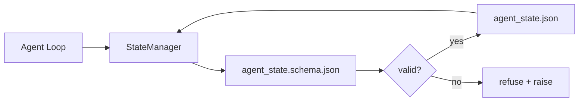

# 레포 메모리와 지속적 상태

> 채팅 히스토리는 휘발성이다. 레포(repo)는 지속적(durable)이다. 워크벤치(workbench)는 에이전트(agent) 상태(state)를 버전이 매겨진 파일에 저장하여, 다음 세션, 다음 에이전트, 다음 리뷰어(reviewer)가 모두 동일한 진실의 출처(source of truth)에서 읽도록 한다.

**Type:** Build
**Languages:** Python (stdlib + `jsonschema` optional)
**Prerequisites:** Phase 14 · 32 (Minimal Workbench)
**Time:** ~60분

## 학습 목표 (Learning Objectives)

- 레포 메모리(repo memory)에 무엇이 속하고 채팅 히스토리에 무엇이 속하는지 정의하기.
- `agent_state.json`과 `task_board.json`을 위한 JSON 스키마(JSON Schema)를 작성하기.
- 상태를 원자적으로(atomically) 로드, 검증, 변형, 영속화하는 상태 관리자(state manager)를 만들기.
- 스키마를 사용해, 잘못된 쓰기가 워크벤치를 손상시키기 전에 그것을 거부하기.

## 문제 (The Problem)

에이전트가 세션을 끝낸다. 채팅이 닫힌다. 다음 세션이 열리고 어디서 시작할지 묻는다. 모델(model)은 "파일을 확인하겠다"고 말하고, 오래된 노트를 읽고, 이미 완료된 작업을 다시 한다. 더 나쁘게는 그 파일이 완료되었다고 아무도 말해주지 않았기에 끝난 파일을 다시 쓴다.

워크벤치의 해결책은 레포 메모리다: 상태가 레포의 JSON 파일에 살고, 스키마 아래 쓰이며, 원자적으로 영속화되고, 코드 리뷰에서 diff 친화적이다. 채팅은 일시적인 피드(feed)이고, 레포는 기록의 시스템(system of record)이다.

## 개념 (The Concept)



### 레포 메모리에 속하는 것

| 속함 | 속하지 않음 |
|---------|-----------------|
| 활성 작업 id | 원시 채팅 트랜스크립트 |
| 이번 세션에 건드린 파일 | 토큰 수준의 추론 트레이스 |
| 에이전트가 만든 가정(assumption) | "사용자가 짜증나 보였다" |
| 열린 차단 요소(blocker) | 샘플링된 완성(completion) |
| 다음 액션 | 벤더 고유 모델 id |

판별 기준은 지속성이다: 지금으로부터 3개월 후 CI 재실행에서 이것이 유용할까? 그렇다면 레포. 아니라면 텔레메트리(telemetry).

### 스키마 우선(schema-first) 상태

JSON 스키마는 계약이다. 스키마가 없으면 모든 에이전트가 새 필드를 지어내고, 모든 리뷰어가 새 모양을 배우며, 모든 CI 스크립트가 과거 버전을 특수 처리해야 한다. 스키마가 있으면 잘못된 쓰기는 거부된 쓰기다.

스키마는 다음을 다룬다:

- 필수 키.
- 허용된 `status` 값.
- 금지된 값(예: 배열에 대한 `null`).
- 패턴 제약(작업 id는 `T-\d{3,}`와 일치).
- 마이그레이션(migration)을 위한 버전 필드.

### 원자적 쓰기

상태 쓰기는 부분 실패에서 살아남아야 한다: 임시 파일(tempfile)에 쓰고, fsync하고, 대상 위로 rename한다. 상태 파일은 진실의 출처이고, 절반만 쓰인 것은 파일이 아예 없는 것보다 나쁘다.

### 마이그레이션

스키마가 바뀌면, 스키마 범프(bump) 옆에 마이그레이션 스크립트를 출하하라. 상태 파일은 `schema_version` 필드를 운반한다; 관리자는 마이그레이션할 수 없는 버전의 파일은 로드하기를 거부한다.

## 직접 만들기 (Build It)

`code/main.py`는 다음을 구현한다:

- `agent_state.schema.json`과 `task_board.schema.json`.
- stdlib 전용 검증기(JSON 스키마의 부분 집합: required, type, enum, pattern, items).
- 원자적 temp-and-rename 쓰기를 가진 `StateManager.load`, `StateManager.update`, `StateManager.commit`.
- 상태를 변형하고, 영속화하고, 다시 로드하고, 왕복(round-trip)을 증명하는 데모.

실행:

```
python3 code/main.py
```

스크립트는 `workdir/agent_state.json`과 `workdir/task_board.json`을 쓰고, 두 턴에 걸쳐 그것들을 변형하며, 각 스텝에서 검증된 상태를 출력한다.

## 야생의 프로덕션 패턴

네 가지 패턴이 이 레슨의 최소를, 멀티 에이전트 모노레포(monorepo)가 살아남을 수 있는 무언가로 바꾼다.

**원자적 temp-and-rename은 선택 사항이 아니다.** 2026년 3월 Hive 프로젝트 버그 리포트에 그 실패 모드가 깔끔하게 적혀 있다: `state.json`이 `write_text()`로 쓰였고 예외가 잡혀서 침묵 처리되었다. 부분 쓰기 탓에 세션이 손상된 상태에서 아무 신호 없이 재개되었다. 해결책은 언제나 같다. 대상과 동일한 디렉터리에서 `tempfile.mkstemp`, 쓰기, `fsync`, `os.replace`(POSIX와 Windows에서 원자적 rename). 이 레슨의 `atomic_write`가 바로 그 일을 한다.

**모든 비멱등(non-idempotent) 도구 호출에 멱등성 키(idempotency key).** 에이전트가 도구를 호출한 후 결과를 체크포인트하기 전에 크래시하면, 복구가 도구 호출을 재시도한다. 읽기에는 안전하지만 이메일, DB 삽입, 파일 업로드에는 위험하다. 패턴: 실행 전 모든 도구 호출 ID를 `pending_calls.jsonl`에 로깅한다. 재시도 시 ID를 확인해, 존재하면 호출을 건너뛰고 캐시된 결과를 사용한다. Anthropic과 LangChain 모두 2026년 지침에서 이것을 지적한다; LangGraph의 체크포인터(checkpointer)도 같은 이유로 보류 중인 쓰기를 영속화한다.

**큰 산출물을 상태에서 분리하라.** CSV, 긴 트랜스크립트, 생성된 파일을 `agent_state.json`에 저장하지 말라. 산출물을 별도 파일로 저장하고(또는 객체 스토리지에 업로드하고) 상태에는 경로만 유지하라. 체크포인트는 작고 빠르게 유지된다; 산출물은 독립적으로 자란다.

**감사를 위한 이벤트 소싱(event sourcing), 재개를 위한 스냅샷.** 모든 변형마다 이벤트 로그(`state.events.jsonl`)에 추가하고; 주기적으로 `state.json`에 스냅샷한다. 재개는 스냅샷을 읽고, 그다음 스냅샷의 타임스탬프 이후의 이벤트를 재생한다. 디스크를 더 쓰지만 에이전트 결정을 그대로 재생할 수 있게 해주며, 장기 지평(long-horizon) 실행을 디버깅할 때 필수적이다. Postgres가 WAL을 위해 내부적으로 쓰는 것과 동일한 모양이다.

**스키마 마이그레이션 또는 로드 거부.** `schema_version` 정수가 계약이다. 관리자가 알 수 없는 버전의 파일을 로드하면, 읽기를 거부한다. 스키마 범프 옆에 마이그레이션 스크립트를 출하하라; `tools/migrate_state.py`는 매 시작 시 멱등적으로 실행된다.

## 라이브러리로 써보기 (Use It)

프로덕션에서:

- **LangGraph 체크포인터.** 같은 아이디어, 다른 저장소. 체크포인터는 그래프 상태를 SQLite, Postgres, 또는 커스텀 백엔드에 영속화한다. 이 레슨이 가르치는 스키마는 체크포인터가 죽고 상태를 손으로 읽어야 할 때 찾게 되는 바로 그것이다.
- **Letta 메모리 블록(memory blocks).** 구조화된 스키마를 가진 지속적 블록(Phase 14 · 08). 장기 실행 페르소나(persona)로 범위가 좁혀진 동일한 분야(discipline).
- **OpenAI Agents SDK 세션 스토어.** 플러그형(pluggable) 백엔드, 스키마 인식. 이 레슨의 상태 파일은 로컬 파일 백엔드다.

## 산출물 (Ship It)

`outputs/skill-state-schema.md`는 프로젝트 고유의 JSON 스키마 쌍(상태 + 보드), 원자적 쓰기에 연결된 Python `StateManager`, 그리고 다음 스키마 범프가 워크벤치를 깨지 않도록 하는 마이그레이션 스캐폴드(scaffold)를 생성한다.

## 연습 문제 (Exercises)

1. `last_human_touch` 타임스탬프를 추가하라. 인간 편집으로부터 5초 이내의 어떤 에이전트 쓰기든 거부하라.
2. 작업이 다른 필수 필드를 가진 빌드 작업이거나 리뷰 작업일 수 있도록 검증기가 `oneOf`를 지원하게 확장하라.
3. `schema_version` 필드를 추가하고 v1에서 v2로의 마이그레이션을 작성하라(`blockers`를 `risks`로 이름 변경).
4. 저장 백엔드를 로컬 파일에서 SQLite로 옮겨라. `StateManager` API는 동일하게 유지하라.
5. 50ms 쓰기 레이스(race)를 두고 두 에이전트를 동일한 상태 파일에 대해 실행하라. 무엇이 잘못되며 원자적 rename이 어떻게 이를 막아주는가?

## 핵심 용어 (Key Terms)

| 용어 | 사람들이 말하는 것 | 실제 의미 |
|------|----------------|------------------------|
| 레포 메모리(Repo memory) | "노트 파일" | 스키마 아래, 레포의 추적되는 파일에 저장된 상태 |
| 스키마 우선(Schema-first) | "입력 검증" | 작성자 전에 계약을 정의하고, 드리프트(drift)를 거부 |
| 원자적 쓰기(Atomic write) | "그냥 rename" | 임시에 쓰고, fsync하고, rename하여, 부분 실패가 손상시킬 수 없게 함 |
| 마이그레이션(Migration) | "스키마 범프" | vN 상태를 v(N+1) 상태로 바꾸는 스크립트 |
| 기록의 시스템(System of record) | "진실의 출처" | 워크벤치가 권위 있는 것으로 취급하는 산출물 |

## 더 읽을거리 (Further Reading)

- [JSON Schema specification](https://json-schema.org/specification.html)
- [LangGraph checkpointers](https://langchain-ai.github.io/langgraph/concepts/persistence/)
- [Letta memory blocks](https://docs.letta.com/concepts/memory)
- [Fast.io, AI Agent State Checkpointing: A Practical Guide](https://fast.io/resources/ai-agent-state-checkpointing/) — 멱등성을 가진 스키마 우선 체크포인팅
- [Fast.io, AI Agent Workflow State Persistence: Best Practices 2026](https://fast.io/resources/ai-agent-workflow-state-persistence/) — 동시성 제어, TTL, 이벤트 소싱
- [Hive Issue #6263 — non-atomic state.json writes silently ignored](https://github.com/aden-hive/hive/issues/6263) — 실제 프로젝트에서의 실패 모드
- [eunomia, Checkpoint/Restore Systems: Evolution, Techniques, Applications](https://eunomia.dev/blog/2025/05/11/checkpointrestore-systems-evolution-techniques-and-applications-in-ai-agents/) — OS 역사의 CR 원시 요소를 에이전트에 적용
- [Indium, 7 State Persistence Strategies for Long-Running AI Agents in 2026](https://www.indium.tech/blog/7-state-persistence-strategies-ai-agents-2026/)
- [Microsoft Agent Framework, Compaction](https://learn.microsoft.com/en-us/agent-framework/agents/conversations/compaction) — 벤더 체크포인트 관리자
- Phase 14 · 08 — 메모리 블록과 수면 시간 컴퓨트(sleep-time compute)
- Phase 14 · 32 — 이 레슨이 스키마화하는 세 파일 최소
- Phase 14 · 40 — 동일한 스키마에서 읽는 핸드오프 패킷(handoff packet)
