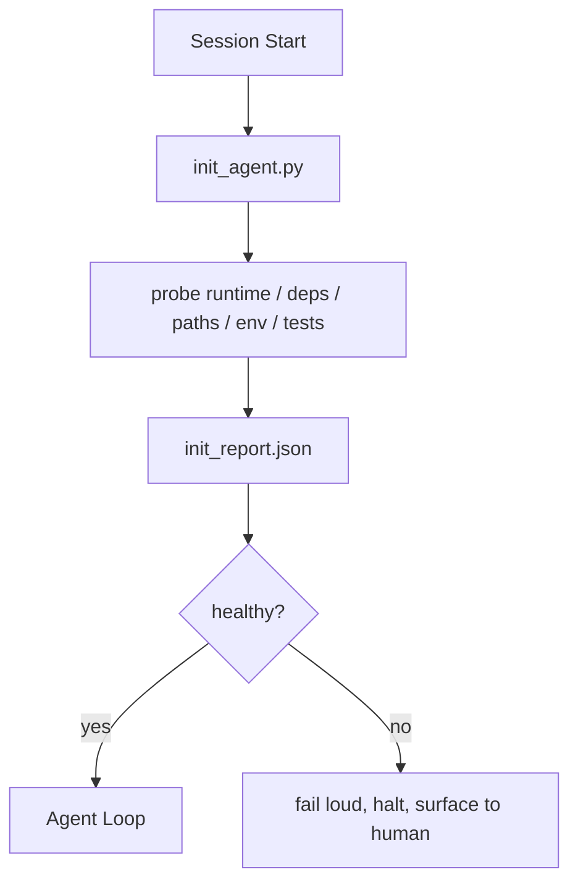

# 에이전트를 위한 초기화 스크립트

> 차갑게 시작하는(start cold) 모든 세션은 세금을 낸다. 에이전트(agent)는 같은 파일을 읽고, 같은 프로브(probe)를 재시도하고, 같은 경로를 다시 발견한다. 초기화 스크립트(init script)는 그 세금을 한 번 내고 답을 상태(state)에 써 넣는다.

**Type:** Build
**Languages:** Python (stdlib)
**Prerequisites:** Phase 14 · 32 (Minimal Workbench), Phase 14 · 34 (Repo Memory)
**Time:** ~45분

## 학습 목표 (Learning Objectives)

- 에이전트가 세션마다 결코 다시 해서는 안 되는 작업을 식별하기.
- 런타임(runtime), 의존성, 레포(repo) 건강 상태를 프로빙하는 결정론적(deterministic) 초기화 스크립트를 만들기.
- 에이전트가 확인을 다시 실행하는 대신 그것을 읽도록 프로브 결과를 영속화하기.
- 초기화가 실패할 때, 크게, 빠르게, 그리고 들여다볼 한 곳을 두고 실패하기.

## 문제 (The Problem)

세션을 연다. 에이전트가 Python 버전을 추측한다. 테스트 명령을 추측한다. 진입점(entry point)을 찾으려고 레포 루트를 다섯 번 나열한다. 설치되지 않은 패키지를 임포트하려 한다. 설정 파일이 어디 있는지 사용자에게 묻는다. 실제 편집을 하기까지, 단일 스크립트였어야 할 설정 작업에 만 토큰이 들어간다.

해결책은, 에이전트가 다른 무엇을 하기 전에 실행되어 에이전트가 시작 시 읽는 `init_report.json`을 쓰는 하나의 초기화 스크립트다.

## 개념 (The Concept)



### 초기화 스크립트가 프로빙하는 것

| 프로브 | 왜 중요한지 |
|-------|----------------|
| 런타임 버전 | 잘못된 Python 또는 Node 버전은 조용한 잘못된 버전 버그를 뜻한다 |
| 의존성 가용성 | 나중에 빠진 패키지는 지금 잡는 비용의 열 배가 든다 |
| 테스트 명령 | 에이전트는 검증하는 법을 알아야 한다; 명령이 빠지면 워크벤치(workbench)가 깨진 것이다 |
| 레포 경로 | 하드코딩된 경로는 드리프트(drift)한다; 한 번 해결하고 고정하라 |
| 환경 변수 | 빠진 `OPENAI_API_KEY`는 런타임의 수수께끼가 아니라 실패 표면(failure surface)이다 |
| 상태 + 보드 신선도 | 크래시된 세션의 오래된 상태는 발등 찍기(footgun)다 |
| 마지막으로 알려진 정상 커밋 | 세션 종료 시 핸드오프(handoff) diff의 앵커(anchor) |

### 크게 실패하고, 빠르게 실패하고, 한 곳에서 실패하라

프로브 실패는 중단하고 인간에게 드러냄을 뜻한다. "에이전트가 알아서 할 것이다"는 없다. 초기화의 핵심 전체는, 워크벤치가 깨졌을 때 시작하기를 거부하는 것이다.

### 멱등적(Idempotent)

연속으로 두 번 실행하라. 두 번째 실행은 신선한 타임스탬프를 제외하면 무연산(no-op)이어야 한다. 멱등성은 스크립트를 CI, 훅(hook), 또는 사전 작업 슬래시 명령(pre-task slash command)에 연결할 수 있게 하는 것이다.

### 초기화 vs 시작 규칙

규칙(Phase 14 · 33)은 행동하기 위해 무엇이 참이어야 하는지를 기술한다. 초기화는 그 규칙들이 확인될 수 있음을 확립하는 스크립트다. 초기화 없는 규칙은 "조심하라"가 된다. 규칙 없는 초기화는 잘 다듬어진 실패가 된다.

## 직접 만들기 (Build It)

`code/main.py`는 `init_agent.py`를 구현한다:

- 다섯 가지 프로브: Python 버전, `importlib.util.find_spec`를 통한 나열된 의존성, 테스트 명령 해결 가능성, 필수 환경 변수, 상태 파일 신선도.
- 각 프로브는 `(name, status, detail)`을 반환한다.
- 스크립트는 전체 프로브 집합을 가진 `init_report.json`을 쓰고, block 심각도 프로브가 하나라도 실패하면 0이 아닌 값으로 종료한다.

실행:

```
python3 code/main.py
```

스크립트는 프로브 표를 출력하고, `init_report.json`을 쓰며, 해피 패스(happy path)에서는 0으로, 실패한 프로브 목록과 함께 0이 아닌 값으로 종료한다.

## 야생의 프로덕션 패턴

세 가지 패턴이, 유용한 초기화 스크립트를 의례(ceremony)에서 갈라낸다.

**마지막으로 알려진 정상 커밋 앵커링.** 현재 커밋을, 마지막 성공적 병합에서 쓰인 `LKG` 파일에 대해 프로빙하라. diff가 예산(기본 50개 파일)을 초과하면, 시작하기를 거부하고 인간이 새 베이스라인(baseline)을 비준하도록 요구하라. 이것이 Cloudflare의 AI 코드 리뷰가 리뷰어 에이전트의 범위를 정하는 데 쓰는 것이다: 모든 리뷰 세션은 동일한 마지막으로 알려진 정상에 대해 앵커링하고 세션 간 드리프트를 결코 누적하지 않는다.

**TTL을 가진 락 파일(lock file).** 첫 성공적 프로브 통과 후 `prereqs.lock`을 쓴다. 이후 실행은 N시간(기본 24시간) 동안 락을 신뢰하고 비싼 프로브를 건너뛴다. 초기화 스크립트는 락을 먼저 읽는다; 신선하고 의존성 매니페스트(manifest) 해시가 일치하면, 단락(short-circuit)한다. 이것은 Docker가 레이어 캐시에 쓰는 것과 동일한 패턴이다: 멱등적 프로브 + 콘텐츠 해시 = 건너뛰기.

**핫 패스(hot path)에 네트워크 없음, LLM 없음, 놀라움 없음.** 초기화 프로브는 결정론적 배관(plumbing)이다. 실패를 분류하기 위해 LLM을 호출하거나 라이선스를 확인하기 위해 외부 서비스를 치는 프로브는 프로브가 아니다; 워크플로다. 드라이런(dry run)에서 프로브가 3초보다 오래 걸리면, 그것을 워크벤치 냄새(smell)로 취급하고 초기화 밖으로 옮기거나 그 결과를 캐시하라.

## 라이브러리로 써보기 (Use It)

프로덕션(production)에서:

- **Claude Code 훅.** `pre-task` 훅이 초기화 스크립트를 호출하고, 실패하면 에이전트 시작을 거부한다.
- **GitHub Actions.** `setup-agent` 작업이 초기화 스크립트를 실행한다; 에이전트 작업은 그것에 의존한다.
- **Docker 엔트리포인트(entrypoint).** 에이전트 컨테이너가 에이전트 런타임을 exec하기 전에 초기화 스크립트를 실행한다; 실패 시 로그가 드러난다.

초기화 스크립트는 특정 프레임워크에 어떤 호출도 하지 않기에 이식 가능하다. Bash, Make, 또는 tasks 파일이 모두 그것을 감쌀 수 있다.

## 산출물 (Ship It)

`outputs/skill-init-script.md`는 프로젝트를 인터뷰하고, 그 설정 작업을 프로브로 분류하며, 프로젝트 고유의 `init_agent.py`와 어떤 에이전트 스텝 전에든 그것을 실행하는 CI 워크플로를 방출한다.

## 연습 문제 (Exercises)

1. 현재 커밋을 마지막으로 알려진 정상 커밋에 대해 diff하고 50개 이상의 파일이 바뀌면 시작하기를 거부하는 프로브를 추가하라.
2. 스크립트가 `prereqs.lock` 파일을 쓰고 락이 7일보다 오래되면 시작하기를 거부하도록 연결하라.
3. 빠진 개발 의존성을 자동 설치하되 승인 없이는 런타임 의존성을 결코 수정하지 않는 `--fix` 플래그를 추가하라.
4. 프로브를 하드코딩된 함수에서 YAML 레지스트리로 옮겨라. 그 트레이드오프(trade-off)를 변호하라.
5. 프로브당 시간 예산을 추가하라. 3초보다 오래 실행되는 프로브는 워크벤치 냄새다.

## 핵심 용어 (Key Terms)

| 용어 | 사람들이 말하는 것 | 실제 의미 |
|------|----------------|------------------------|
| 프로브(Probe) | "확인" | `(name, status, detail)`을 반환하는 결정론적 함수 |
| 초기화 리포트(Init report) | "설정 출력" | 프로브 결과와 함께 상태 옆에 쓰인 JSON |
| 멱등적(Idempotent) | "다시 실행해도 안전함" | 연속 두 번의 실행이 타임스탬프를 제외하면 동일한 리포트를 생성 |
| 크게 실패하기(Fail loud) | "삼키지 말라" | 중단하고 인간에게 드러냄; 조용한 폴백(fallback) 없음 |
| 설정 세금(Setup tax) | "부트스트랩 비용" | 에이전트가 뻔한 것을 다시 발견하는 데 세션마다 쓰는 토큰 |

## 더 읽을거리 (Further Reading)

- [Anthropic, Effective harnesses for long-running agents](https://www.anthropic.com/engineering/effective-harnesses-for-long-running-agents)
- [GitHub Actions, composite actions for setup](https://docs.github.com/en/actions/sharing-automations/creating-actions/creating-a-composite-action)
- [microservices.io, GenAI dev platform: guardrails](https://microservices.io/post/architecture/2026/03/09/genai-development-platform-part-1-development-guardrails.html) — 초기화로서의 pre-commit + CI 확인
- [Augment Code, How to Build Your AGENTS.md (2026)](https://www.augmentcode.com/guides/how-to-build-agents-md) — 초기화 기대치
- [Codex Blog, Codex CLI Context Compaction](https://codex.danielvaughan.com/2026/03/31/codex-cli-context-compaction-architecture/) — 압축 인식(compaction-aware) 초기화로서의 세션 시작
- Phase 14 · 33 — 이 스크립트가 가능하게 하는 규칙 집합
- Phase 14 · 34 — 이 스크립트가 시드하는 상태 파일
- Phase 14 · 38 — 초기화 스크립트가 공급하는 검증 게이트
- Phase 14 · 40 — 초기화 리포트의 마지막으로 알려진 정상을 소비하는 핸드오프
