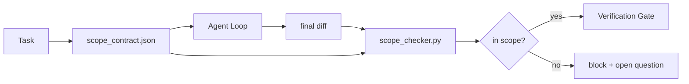

# 스코프 계약과 작업 경계 (Scope Contracts and Task Boundaries)

> 모델은 작업이 어디서 끝나는지 모른다. 스코프 계약(scope contract)은 작업이 어디서 시작하고, 어디서 끝나며, 작업이 경계를 넘쳤을 때 어떻게 되돌릴지를 명시하는 작업별(per-task) 파일이다. 계약은 "스코프를 벗어나지 마라"를 바람에서 검사로 바꾼다.

**Type:** Build
**Languages:** Python (stdlib)
**Prerequisites:** Phase 14 · 32 (Minimal Workbench), Phase 14 · 33 (Rules as Constraints)
**Time:** ~50분

## 학습 목표 (Learning Objectives)

- 에이전트(agent)가 작업 시작 시 읽고 검증기(verifier)가 작업 종료 시 읽는 스코프 계약을 작성하기.
- 허용 파일(allowed files), 금지 파일(forbidden files), 수용 기준(acceptance criteria), 롤백 계획(rollback plan), 승인 경계(approval boundary)를 명시하기.
- 디프(diff)를 계약과 비교하고 위반을 표시하는 스코프 검사기(scope checker) 구현하기.
- 스코프 크리프(scope creep)를 가시화하고, 자동화하고, 검토 가능하게 만들기.

## 문제 (The Problem)

에이전트는 경계를 넘쳐 흐른다. 작업은 "로그인 버그를 고쳐라"이다. 그런데 디프는 로그인 라우트, 이메일 헬퍼, 데이터베이스 드라이버, README, 릴리스 스크립트까지 건드린다. 각 변경에는 그 순간 그럴듯한 이유가 있었다. 하지만 다 합치면 검토받았던 변경과는 다른 변경이 된다.

스코프 크리프는 에이전트 작업에서 가장 덜 감시되는 실패 모드(failure mode)다. 에이전트가 각 단계를 선의로 서술하기 때문이다. 해결책은 더 엄격한 프롬프트(prompt)가 아니다. 해결책은 무엇을 약속했는지를 적은 디스크상의 계약과, 그 결과를 약속과 비교하는 검사다.

## 개념 (The Concept)



### 스코프 계약에 들어가는 것

| 필드 | 목적 |
|-------|---------|
| `task_id` | 보드(board)의 작업과 연결 |
| `goal` | 리뷰어가 검증할 수 있는 한 문장 |
| `allowed_files` | 에이전트가 쓸 수 있는 글롭(glob) |
| `forbidden_files` | 에이전트가 실수로라도 건드려서는 안 되는 글롭 |
| `acceptance_criteria` | 완료를 증명하는 테스트 명령 또는 단언(assertion) 라인 |
| `rollback_plan` | 중단이 필요할 때 운영자가 실행할 수 있는 한 문단 |
| `approvals_required` | 명시적 사람의 승인이 필요한 스코프 밖 동작 |

`forbidden_files`가 없는 계약은 불완전하다. 부정 공간(negative space)이 계약의 절반이다.

### 원시 경로가 아니라 글롭

실제 리포지터리는 파일을 이동시킨다. 계약을 글롭(`app/**/*.py`, `tests/test_signup*.py`)에 고정시켜, 세션 사이의 리팩터링이 계약을 무효화하지 않도록 하라.

### 롤백은 스코프의 일부다

어떻게 롤백할지를 나열하면 계약 작성자가 무엇이 잘못될 수 있는지를 생각하게 된다. 롤백할 수 없는 계약은 승인되어서는 안 되는 계약이다.

### 스코프 검사는 디프 검사다

에이전트는 디프를 작성한다. 검사기는 디프, 허용 글롭, 금지 글롭, 그리고 실행된 수용 명령(acceptance command)의 목록을 읽는다. 각 위반은 검증 게이트(verification gate)가 거부할 수 있는 태그된 발견 사항(tagged finding)이다.

## 직접 만들기 (Build It)

`code/main.py`는 다음을 구현한다:

- `scope_contract.json` 스키마(JSON Schema의 부분집합, 글롭 배열).
- 건드린 파일 목록과 실행 명령 목록을 `RunSummary`로 바꾸는 디프 파서.
- 계약에 대해 `(violations, in_scope, off_scope)`를 반환하는 `scope_check`.
- 두 가지 데모 실행: 하나는 스코프 안에 머물고, 하나는 경계를 넘친다. 검사기는 정확한 파일과 이유와 함께 경계 넘침을 표시한다.

실행하기:

```
python3 code/main.py
```

출력: 계약, 두 실행, 실행별 판정, 그리고 저장된 `scope_report.json`.

## 현장의 프로덕션 패턴 (Production patterns in the wild)

"specsmaxxing"(에이전트를 호출하기 전에 YAML로 작성하는 스코프 계약)을 운영하는 한 실무자는, 에이전트를 바꾸지 않고도 토끼굴(rabbit-hole)에 빠지는 비율이 3주 만에 52%에서 21%로 떨어졌다고 보고한다. 일을 한 것은 모델이 아니라 계약이었다. 세 가지 패턴이 그 이득을 지속시킨다.

**이진 실패가 아니라 위반 예산(violation budget).** `agent-guardrails`(Claude Code, Cursor, Windsurf, Codex가 MCP를 통해 사용하는 OSS 머지 게이트)는 작업별 `violationBudget`을 제공한다. 예산 안에 드는 사소한 스코프 일탈은 경고로 표면화되고, 예산을 초과할 때만 머지 게이트가 거부한다. `violationSeverity: "error" | "warning"`과 짝지어라. 예산이야말로, 끝까지 살아남는 게이트와 그것을 싫어하는 팀이 꺼버리는 게이트를 가르는 차이다.

**경로 계열별 심각도 비대칭(severity asymmetry).** `docs/**`에 대한 스코프 밖 쓰기는 보통 `warn`이고, `scripts/**`, `migrations/**`, `config/prod/**`에 대한 스코프 밖 쓰기는 항상 `block`이다. 이 비대칭은 런타임이 아니라 계약 안에 있어야 한다. 프로젝트마다 다르고 작업마다 바뀌기 때문이다.

**파일 예산 옆의 시간 예산과 네트워크 예산.** `time_budget_minutes` 필드는 벽시계 시간(wall clock)을 제한한다. 런타임은 재승인 없이 그 시간을 넘겨 계속하기를 거부한다. 호스트명별 `network_egress` 허용 목록은 에이전트가 작업과 무관한 외부 API를 조용히 호출하는 것을 막는다. 이런 항목들도 스코프의 한 차원(dimension)이다. 파일 글롭은 필요하지만 충분하지는 않다.

**다중 계약 머지 의미론(최소 권한).** 두 개의 스코프 계약이 적용될 때(예: 프로젝트 전체 계약과 작업별 계약), 머지는 다음과 같다: `allowed_files`는 **교집합**(두 계약 모두 경로를 허용해야 함), `forbidden_files`는 **합집합**(어느 쪽이든 금지 가능), `time_budget_minutes`는 가장 제한적인 값(최소), `approvals_required`는 누적된다. `network_egress`는 강제하지 않으면 `None`, 모두 거부면 `[]`, 허용 목록이면 `[...]`이다. 머지에서 `None`은 상대편을 따르고, 두 리스트는 교집합을 취하며, 모두 거부는 모두 거부로 남는다. 머지가 기계적이고 검토 가능하도록 이를 계약 스키마에 명시하라.

## 라이브러리로 써보기 (Use It)

프로덕션 패턴:

- **Claude Code 슬래시 명령(slash command).** `/scope` 명령은 계약을 작성하고 그것을 세션 컨텍스트로 고정한다. 서브에이전트(subagent)는 동작하기 전에 계약을 읽는다.
- **GitHub PR.** 계약을 PR 본문에 JSON 파일로 푸시하거나 체크인된 아티팩트로 푸시하라. CI는 머지 디프에 대해 스코프 검사기를 실행한다.
- **LangGraph 인터럽트(interrupt).** 스코프 위반은 인터럽트를 발동시킨다. 핸들러는 사람에게 계약을 키워야 하는지 아니면 에이전트가 물러서야 하는지를 묻는다.

계약은 작업과 함께 이동한다. 작업이 닫히면 계약은 `outputs/scope/closed/` 아래에 보관된다.

## 산출물 (Ship It)

`outputs/skill-scope-contract.md`는 작업 설명에 대한 스코프 계약과, 모든 에이전트 디프에 대해 CI에서 실행되는 글롭 인식(glob-aware) 검사기를 생성한다.

## 연습 문제 (Exercises)

1. 허용된 외부 호스트를 나열하는 `network_egress` 필드를 추가하라. 다른 호스트를 건드리는 실행을 거부하라.
2. 검사기를 확장하여 `docs/**`에는 소프트 실패(fail soft), `scripts/**`에는 하드 실패(fail hard)하도록 하라. 그 비대칭을 정당화하라.
3. 정적 규칙 집합(LLM 없이)을 사용해 계약이 `goal` 필드로부터 `allowed_files`를 도출하게 만들어라. 첫 번째 엣지 케이스(edge case)에서 무엇이 잘못되는가?
4. `time_budget_minutes`를 추가하고 벽시계 시간이 그것을 초과하면 계속하기를 거부하라.
5. 같은 디프에 대해 두 개의 계약을 실행하라. 둘 다 적용될 때 올바른 머지 의미론은 무엇인가?

## 핵심 용어 (Key Terms)

| 용어 | 흔히 하는 말 | 실제 의미 |
|------|----------------|------------------------|
| 스코프 계약 (Scope contract) | "작업 개요서" | 허용/금지 파일, 수용, 롤백을 나열하는 작업별 JSON |
| 스코프 크리프 (Scope creep) | "이것도 건드렸어요..." | 같은 작업에서 계약 밖의 파일이 변경된 것 |
| 롤백 계획 (Rollback plan) | "되돌릴 수 있어요" | 중단을 위한 한 문단짜리 운영자 런북(runbook) |
| 승인 경계 (Approval boundary) | "사인오프가 필요해요" | 명시적인 사람의 승인을 요구한다고 계약에 나열된 동작 |
| 디프 검사 (Diff check) | "경로 감사" | 건드린 파일을 계약 글롭과 비교하는 것 |

## 더 읽을거리 (Further Reading)

- [LangGraph human-in-the-loop interrupts](https://langchain-ai.github.io/langgraph/concepts/human_in_the_loop/)
- [OpenAI Agents SDK tool approval policies](https://platform.openai.com/docs/guides/agents-sdk)
- [logi-cmd/agent-guardrails — merge gates and scope validation](https://github.com/logi-cmd/agent-guardrails) — 위반 예산, 심각도 계층
- [Dev|Journal, Preventing AI Agent Configuration Drift with Agent Contract Testing](https://earezki.com/ai-news/2026-05-05-i-built-a-tiny-ci-tool-to-keep-ai-agent-configs-from-drifting-in-my-repo/) — 외부 의존성 없는 `--strict` 모드
- [Agentic Coding Is Not a Trap (production logs)](https://dev.to/jtorchia/agentic-coding-is-not-a-trap-i-answered-the-viral-hn-post-with-my-own-production-logs-33d9) — specsmaxxing 증거: 52% → 21%
- [OpenCode permission globs](https://opencode.ai/docs/agents/) — 권한별 세밀한 스코프
- [Knostic, AI Coding Agent Security: Threat Models and Protection Strategies](https://www.knostic.ai/blog/ai-coding-agent-security) — 최소 권한의 일부로서의 스코프
- [Augment Code, AI Spec Template](https://www.augmentcode.com/guides/ai-spec-template) — 3단계 경계 시스템(반드시/물어봄/절대 안 됨)
- Phase 14 · 27 — 스코프 잠금과 짝을 이루는 프롬프트 인젝션(prompt injection) 방어
- Phase 14 · 33 — 이 계약이 작업별로 특수화하는 규칙 집합
- Phase 14 · 38 — 검사기가 결과를 보고하는 검증 게이트
