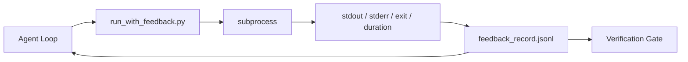

# 런타임 피드백 루프 (Runtime Feedback Loops)

> 실제 명령 출력을 보지 못하는 에이전트는 추측한다. 피드백 러너(feedback runner)는 stdout, stderr, 종료 코드(exit code), 그리고 타이밍을 다음 턴(turn)이 읽을 수 있는 구조화된 레코드에 담는다. 그러면 에이전트는 사실에 대한 자신의 예측이 아니라 사실에 반응한다.

**Type:** Build
**Languages:** Python (stdlib)
**Prerequisites:** Phase 14 · 32 (Minimal Workbench), Phase 14 · 35 (Init Script)
**Time:** ~50분

## 학습 목표 (Learning Objectives)

- 런타임 피드백(runtime feedback)을 관측성 텔레메트리(observability telemetry)와 구별하기.
- 셸 명령을 감싸고 구조화된 레코드를 지속시키는 피드백 러너 만들기.
- 루프가 토큰 예산(token budget) 안에 머물도록 큰 출력을 결정론적으로 잘라내기(truncate).
- 피드백이 없을 때 루프를 전진시키기를 거부하기.

## 문제 (The Problem)

에이전트는 "지금 테스트를 실행 중입니다"라고 말한다. 다음 메시지는 "모든 테스트가 통과했습니다"라고 말한다. 현실은 어떤 테스트도 실행되지 않았다는 것이다. 에이전트가 출력을 상상했거나, 명령을 실행했지만 결과를 읽지 않았거나, 결과를 읽었지만 실패 라인을 조용히 잘라냈다.

피드백 러너는 그 간극을 없앤다. 모든 명령은 러너를 거친다. 모든 레코드는 명령, 캡처된 stdout과 stderr, 종료 코드, 벽시계 지속 시간(wall-clock duration), 그리고 한 줄짜리 에이전트 노트(agent note)를 담는다. 에이전트는 다음 턴에서 레코드를 읽는다. 검증 게이트(verification gate)는 작업 종료 시 레코드들을 읽는다.

## 개념 (The Concept)



### 피드백 레코드에 들어가는 것

| 필드 | 왜 중요한가 |
|-------|----------------|
| `command` | 정확한 argv, 셸 확장(shell expansion)으로 인한 의외성 없음 |
| `stdout_tail` | 마지막 N줄, 결정론적 잘라내기 |
| `stderr_tail` | 마지막 N줄, stdout과 분리 |
| `exit_code` | 모호하지 않은 성공 신호 |
| `duration_ms` | 느린 탐침(probe)과 폭주하는 프로세스를 표면화 |
| `started_at` | 재생(replay)을 위한 타임스탬프 |
| `agent_note` | 에이전트가 무엇을 기대했는지에 대해 쓰는 한 줄 |

### 잘라내기는 결정론적이다

50 MB 로그는 루프를 파괴한다. 러너는 `...truncated N lines...` 마커와 함께 머리와 꼬리를 잘라낸다. 이는 결정론적이어서 같은 출력은 항상 같은 레코드를 만든다. 샘플링은 없다. 에이전트가 봐야 하는 부분(최종 에러, 최종 요약)은 꼬리에 있다.

### 피드백 대 텔레메트리

텔레메트리(Phase 14 · 23, OTel GenAI 규약)는 시간에 걸쳐 실행을 검토하는 사람 운영자를 위한 것이다. 피드백은 이번 실행의 다음 턴을 위한 것이다. 둘은 필드를 공유하지만, 서로 다른 보존 정책을 가진 서로 다른 파일에 산다.

### 피드백 없이는 전진을 거부한다

러너가 종료를 캡처하기 전에 에러를 내면, 레코드는 `exit_code: null`과 `error: <reason>`을 담는다. 에이전트 루프는 `null` 종료에 대해 성공을 주장하기를 거부해야 한다. 종료가 없으면 진전도 없다.

## 직접 만들기 (Build It)

`code/main.py`는 다음을 구현한다:

- `subprocess.run`을 감싸고, stdout/stderr/exit/duration을 캡처하고, 결정론적으로 잘라내고, `feedback_record.jsonl`에 추가하는 `run_with_feedback(command, agent_note)`.
- JSONL을 Python 리스트로 스트리밍하는 작은 로더.
- 세 가지 명령(성공, 실패, 느림)을 실행하고 명령별 마지막 레코드를 출력하는 데모.

실행하기:

```
python3 code/main.py
```

출력: `feedback_record.jsonl`에 추가된 세 개의 피드백 레코드, 각각의 마지막 것이 인라인으로 출력됨. 재실행에 걸쳐 파일을 tail하여 루프가 누적되는 것을 보라.

## 현장의 프로덕션 패턴 (Production patterns in the wild)

세 가지 패턴이 러너를 출시할 만큼 견고하게 만든다.

**읽을 때가 아니라 쓸 때 편집(redact)하라.** stdout이나 stderr를 건드리는 어떤 레코드든 비밀(secret)을 누출할 수 있다. 러너는 JSONL 추가 전에 편집 단계(redaction pass)를 거친다: `^Bearer `, `password=`, `api[_-]?key=`, `AKIA[0-9A-Z]{16}`(AWS), `xox[baprs]-`(Slack)에 매칭되는 라인을 제거한다. 읽을 때의 편집은 발등을 찍는 일(foot-gun)이다. 공격자가 도달하는 것은 디스크상의 파일이다. 편집 패턴을 분기별로 프로덕션 런타임이 관측한 비밀 형식에 대해 감사하라.

**단일 파일이 아니라 회전 정책(rotation policy).** `feedback_record.jsonl`을 파일당 1 MB로 제한하라. 넘치면 `.1`, `.2`로 회전시키고 `.5`는 버려라. 에이전트의 루프는 현재 파일만 읽으므로 런타임 비용이 제한된다. CI 아티팩트 저장소는 회전된 전체 집합을 받는다. 회전이 없으면 파일이 모든 로더 호출의 병목이 된다.

**재시도 체인을 위한 부모 명령 id.** 모든 레코드는 `command_id`를 받는다. 재시도는 이전 시도를 가리키는 `parent_command_id`를 담는다. 리뷰어의 "실패한 시도" 목록(Phase 14 · 40)과 검증 게이트의 감사 모두 그 체인을 따른다. 이 연결이 없으면 재시도가 독립적인 성공처럼 보이고 감사가 실패 이력을 숨긴다.

## 라이브러리로 써보기 (Use It)

프로덕션 패턴:

- **Claude Code Bash 도구.** 이 도구는 이미 stdout, stderr, exit, duration을 캡처한다. 이 레슨의 러너는 어떤 에이전트 제품에든 적용되는 프레임워크 무관(framework-agnostic) 등가물이다.
- **LangGraph 노드.** 모든 셸 노드를 러너로 감싸서 레코드가 그래프 상태(graph state) 밖에 지속되도록 하라.
- **CI 로그.** JSONL을 CI 아티팩트 저장소로 파이프하라. 리뷰어는 세션을 다시 실행하지 않고도 어떤 명령이든 재생할 수 있다.

러너는 레코드의 형태를 소유하기 때문에 모든 프레임워크 마이그레이션에서 살아남는 얇은 래퍼다.

## 산출물 (Ship It)

`outputs/skill-feedback-runner.md`는 올바른 잘라내기 예산을 가진 프로젝트별 `run_with_feedback.py`, 워크벤치(workbench)에 연결된 JSONL 라이터, 그리고 에이전트가 매 턴 읽는 로더를 생성한다.

## 연습 문제 (Exercises)

1. 레코드별 `cwd` 필드를 추가하여 서로 다른 디렉터리에서 실행된 같은 명령을 구별할 수 있게 하라.
2. `^Bearer ` 또는 `password=`에 매칭되는 라인을 제거하는 `redaction` 단계를 추가하라. 픽스처(fixture) 레코드에서 테스트하라.
3. `.1`, `.2` 파일로 회전시켜 전체 `feedback_record.jsonl` 크기를 1 MB로 제한하라. 회전 정책을 옹호하라.
4. `parent_command_id`를 추가하여 재시도 체인이 보이게 하라: 어떤 명령이 다음 명령이 소비한 입력을 만들어냈는가.
5. JSONL을 가장 최근의 0이 아닌 종료를 강조하는 작은 TUI로 파이프하라. TUI가 리뷰에서 유용하려면 보여줘야 하는 여덟 가지 핵심 기능.

## 핵심 용어 (Key Terms)

| 용어 | 흔히 하는 말 | 실제 의미 |
|------|----------------|------------------------|
| 피드백 레코드 (Feedback record) | "실행 로그" | 명령, 출력, 종료, 지속 시간을 담은 구조화된 JSONL 항목 |
| 꼬리 잘라내기 (Tail truncation) | "로그를 다듬는다" | 레코드가 토큰 예산에 맞도록 하는 결정론적 머리+꼬리 캡처 |
| null이면 거부 (Refuse-on-null) | "데이터 누락 시 차단" | `exit_code`가 null이면 루프가 전진해서는 안 됨 |
| 에이전트 노트 (Agent note) | "기대 태그" | 에이전트가 결과를 읽기 전에 쓰는 한 줄짜리 예측 |
| 텔레메트리 분리 (Telemetry split) | "두 개의 로그 파일" | 다음 턴을 위한 피드백, 운영자를 위한 텔레메트리 |

## 더 읽을거리 (Further Reading)

- [OpenTelemetry GenAI semantic conventions](https://opentelemetry.io/docs/specs/semconv/gen-ai/)
- [Anthropic, Effective harnesses for long-running agents](https://www.anthropic.com/engineering/effective-harnesses-for-long-running-agents)
- [Guardrails AI x MLflow — deterministic safety, PII, quality validators](https://guardrailsai.com/blog/guardrails-mlflow) — 회귀 테스트로서의 편집 패턴
- [Aport.io, Best AI Agent Guardrails 2026: Pre-Action Authorization Compared](https://aport.io/blog/best-ai-agent-guardrails-2026-pre-action-authorization-compared/) — 도구 전/후 캡처
- [Andrii Furmanets, AI Agents in 2026: Practical Architecture for Tools, Memory, Evals, Guardrails](https://andriifurmanets.com/blogs/ai-agents-2026-practical-architecture-tools-memory-evals-guardrails) — 관측성 표면
- Phase 14 · 23 — 텔레메트리 측면을 위한 OTel GenAI 규약
- Phase 14 · 24 — 에이전트 관측성 플랫폼(Langfuse, Phoenix, Opik)
- Phase 14 · 33 — 완료를 선언하기 전에 피드백을 요구하는 규칙
- Phase 14 · 38 — JSONL을 읽는 검증 게이트
