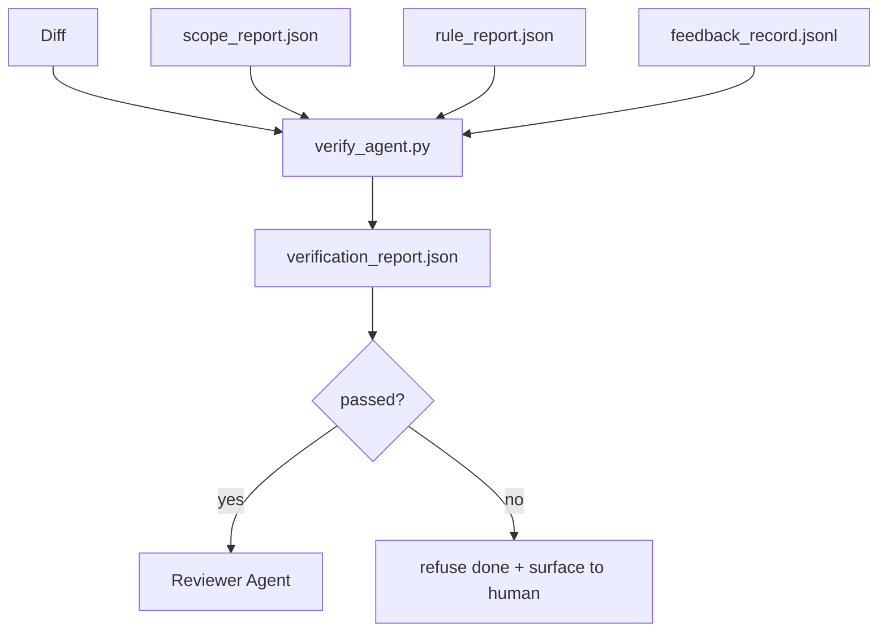

# 검증 게이트 (Verification Gates)

> 에이전트(agent)는 자신의 작업을 스스로 완료로 표시할 수 없다. 검증 게이트(verification gate)는 스코프 계약(scope contract), 피드백 로그(feedback log), 규칙 보고서(rule report), 그리고 디프(diff)를 읽고 단 하나의 질문에 답한다: 이 작업은 정말로 완료되었는가? 게이트가 아니라고 하면, 채팅이 무엇이라고 하든 그 작업은 완료되지 않은 것이다.

**Type:** Build
**Languages:** Python (stdlib)
**Prerequisites:** Phase 14 · 33 (Rules), Phase 14 · 36 (Scope), Phase 14 · 37 (Feedback)
**Time:** ~55분

## 학습 목표 (Learning Objectives)

- 검증 게이트를 워크벤치 아티팩트(workbench artifact)에 대한 결정론적 함수로 정의하기.
- 규칙 보고서, 스코프 보고서, 피드백 레코드, 디프를 단일 판정(verdict)으로 결합하기.
- 리뷰어 에이전트(reviewer agent)와 CI가 모두 읽을 수 있는 `verification_report.json` 내보내기.
- 어떤 차단 심각도(block-severity) 실패에 대해서도 예외 없이 작업 전진을 거부하기.

## 문제 (The Problem)

에이전트는 너무 쉽게 성공을 선언한다. 세 가지 실패 형태가 지배적이다:

- "괜찮아 보입니다." 모델이 자신의 디프를 읽고 그것이 올바르다고 판단했다.
- "테스트가 통과했습니다." 자신 있게 말한다. 테스트가 실제로 실행되었다는 기록은 없다.
- "수용 기준이 충족되었습니다." 수용 기준(acceptance criteria)이 "완료처럼 보이는 무엇이든"을 의미할 만큼 느슨하게 해석되었다.

워크벤치의 해결책은, 에이전트가 이미 만들어낸 아티팩트를 읽고 판단을 내리는 단일 검증 게이트다. 게이트는 결정론적이다. 게이트는 버전 관리(version control) 아래에 있다. 게이트는 CI에 연결되어 있다. 에이전트는 그것을 매수할 수 없다.

## 개념 (The Concept)



### 게이트가 검사하는 것

| 검사 | 출처 아티팩트 | 심각도 |
|-------|-----------------|----------|
| 모든 수용 명령이 실행됨 | `feedback_record.jsonl` | block |
| 모든 수용 명령이 0으로 종료됨 | `feedback_record.jsonl` | block |
| 스코프 검사에 금지된 쓰기가 없음 | `scope_report.json` | block |
| 스코프 검사에 스코프 밖 쓰기가 없음 | `scope_report.json` | block 또는 warn |
| 모든 차단 심각도 규칙이 통과 | `rule_report.json` | block |
| 피드백에 `null` 종료 코드가 없음 | `feedback_record.jsonl` | block |
| 건드린 파일이 `scope.allowed_files`와 일치 | 둘 다 | warn |

`warn` 발견 사항은 판정에 주석을 단다. `block` 발견 사항은 `passed: true`를 막는다.

### 확률론적이 아니라 결정론적

게이트는 같은 아티팩트 집합에 대해 매번 같은 판정을 내려야 한다. LLM 판정자는 없다. LLM 판정자는 목표가 상태(status)가 아니라 정성적 평가인 리뷰어 측(Phase 14 · 39)에 속한다.

### 하나의 보고서, 하나의 경로

게이트는 작업 종료마다 하나의 `verification_report.json`을 내보내며, `outputs/verification/<task_id>.json` 아래에 작성된다. CI는 같은 경로를 소비한다. 서로 다른 경로를 가진 여러 게이트는 진실의 원천(source of truth)을 갈라놓는다.

### 예외 없이 거부한다

차단 심각도 발견 사항은 에이전트가 무시할 수 없다. 오직 사람만이, 기록된 `override_reason`과 `overridden_by` 사용자 id와 함께 무시할 수 있다. 무시(override)는 에이전트의 결정이 아니라 서명된 변경이다.

## 직접 만들기 (Build It)

`code/main.py`는 다음을 구현한다:

- 각 입력 아티팩트를 위한 로더. 레슨이 자족적이도록 모두 로컬에서 스텁(stub) 처리됨.
- `verify(task_id, artifacts) -> VerdictReport` 순수 함수(pure function).
- 검사별 결과와 최종 통과/실패를 보여주는 프린터.
- 세 가지 작업 시나리오를 가진 데모: 깔끔한 통과, 스코프 크리프, 수용 누락.

실행하기:

```
python3 code/main.py
```

출력: 세 개의 판정 보고서, 각각 스크립트 옆에 저장됨.

## 현장의 프로덕션 패턴 (Production patterns in the wild)

네 가지 패턴이 게이트를 "또 하나의 린트 작업"에서 "결정적인 경계(deciding edge)"로 끌어올린다.

**단일 게이트가 아니라 심층 방어(defense-in-depth).** 프리커밋 훅(pre-commit hook) → CI 상태 검사 → 도구 전 인가 훅(pre-tool authz hook) → 머지 전 게이트(pre-merge gate). 각 계층은 결정론적이므로 한 계층의 실패는 다음 계층이 잡는다. microservices.io의 2026년 3월 플레이북은 명시적이다: 프리커밋 훅은 우회 불가능하다(non-bypassable). 왜냐하면 모델 측 스킬과 달리 에이전트가 지시를 따르는 데 의존하지 않기 때문이다. 검증 게이트는 CI / 머지 전 계층에 위치한다.

**결정론적 검사로 방어하고, 미묘함에 대해서만 모델 판정자.** Anthropic의 2026년 하이브리드 노름(Hybrid Norm) 짝짓기: 검증 가능한 보상(verifiable reward, 단위 테스트, 스키마 검사, 종료 코드)은 "코드가 문제를 풀었는가?"에 답하고, LLM 루브릭(rubric)은 "코드가 읽기 쉽고, 안전하고, 스타일에 맞는가?"에 답한다. 게이트는 첫 번째 부류를 실행하고, 리뷰어(Phase 14 · 39)는 두 번째 부류를 실행한다. 둘을 섞으면 신호가 무너진다.

**Slack 스레드가 아니라 서명된 무시 로그.** 모든 무시는 `outputs/verification/overrides.jsonl`에 행(row)을 내보낸다: 타임스탬프, 발견 코드, 이유, 서명 사용자, 현재 HEAD 커밋. 런타임은 서명이 없는 어떤 무시든 거부한다. 감사 추적(audit trail)은 git으로 추적된다. 이것이 무시 정책과 무시 연극(override theater) 사이의 경계다.

**일급 검사로서의 커버리지 하한(coverage floor).** `coverage_report.json`이 `coverage_floor`(기본값 80%) 검사를 공급한다. 게이트는 측정된 커버리지가 하한 아래로 떨어지거나 이전 머지의 하한보다 1퍼센트 포인트 넘게 떨어지면 실패한다. 이 검사가 없으면 에이전트는 실패하는 테스트를 조용히 삭제하고 검증 보고서는 초록색으로 유지된다.

**`--strict` 모드는 warn을 block으로 승격한다.** 릴리스 브랜치, 출시를 막는 PR, 사후 분류(post-incident triage)에 대해 `--strict`는 모든 경고를 하드 실패로 만든다. 이 플래그는 브랜치별로 옵트인(opt-in)이며, 전역 기본값이 아니다. 모든 것에 strict를 적용하면 일상적 흐름을 부식시키기 때문이다.

## 라이브러리로 써보기 (Use It)

프로덕션 패턴:

- **CI 단계.** `verify_agent` 작업이 에이전트의 최종 아티팩트에 대해 게이트를 실행한다. 머지 보호(merge protection)는 `passed: true` 없이는 거부한다.
- **핸드오프 전 훅.** 에이전트 런타임은 핸드오프 문서를 생성하기 전에 게이트를 호출한다. 초록 판정이 없으면 핸드오프도 없다.
- **수동 분류.** 에이전트가 성공을 주장하고 사람이 그것을 의심할 때 운영자가 보고서를 읽는다.

게이트는 워크벤치 흐름에서 결정적인 경계다. 다른 모든 표면은 그것의 상류(upstream)에 있다.

## 산출물 (Ship It)

`outputs/skill-verification-gate.md`는 게이트를 특정 프로젝트에 연결한다: 어떤 수용 명령이 그것을 공급하는지, 어떤 규칙이 차단 심각도인지, 어떤 스코프 밖 쓰기가 용인되는지, 무시 감사 로그가 어떻게 저장되는지.

## 연습 문제 (Exercises)

1. `coverage_floor` 검사를 추가하라: 테스트 명령은 최소 80%의 커버리지 보고서를 만들어야 한다. 어떤 아티팩트가 하한을 담을지 결정하라.
2. 모든 `warn`을 `block`으로 승격하는 `--strict` 모드를 지원하라. strict 모드가 올바른 기본값인 경우를 문서화하라.
3. 게이트가 JSON에 더해 Markdown 요약을 만들게 하라. 어떤 필드가 요약에 속하는지 옹호하라.
4. `time_since_last_human_touch` 검사를 추가하라: 사람의 키 입력 60초 이내에 편집된 어떤 파일이든 스코프 밖 표시에서 면제된다.
5. 당신의 제품에서 나온 실제 에이전트 디프에 대해 게이트를 실행하라. 발견 사항 중 몇 개가 진짜이고 몇 개가 잡음(noise)인가? 게이트는 어디서 커져야 하는가?

## 핵심 용어 (Key Terms)

| 용어 | 흔히 하는 말 | 실제 의미 |
|------|----------------|------------------------|
| 검증 게이트 (Verification gate) | "일을 멈추는 검사" | 통과/실패 판정을 만드는, 워크벤치 아티팩트에 대한 결정론적 함수 |
| 차단 심각도 (Block severity) | "하드 실패" | `passed: true`를 막고 서명된 무시를 요구하는 발견 사항 |
| 무시 로그 (Override log) | "왜 통과시켰는가" | 이유와 사용자 id를 가진 서명된 항목, 리뷰로 감사됨 |
| 수용 명령 (Acceptance command) | "증거" | 0 종료가 곧 `완료`의 의미인 셸 명령 |
| 하나의 보고서 경로 (One report path) | "진실의 원천" | `outputs/verification/<task_id>.json`, CI와 사람이 똑같이 소비함 |

## 더 읽을거리 (Further Reading)

- [Anthropic, Harness design for long-running application development](https://www.anthropic.com/engineering/harness-design-long-running-apps)
- [OpenAI Agents SDK guardrails](https://platform.openai.com/docs/guides/agents-sdk/guardrails)
- [microservices.io, GenAI dev platform: guardrails](https://microservices.io/post/architecture/2026/03/09/genai-development-platform-part-1-development-guardrails.html) — 프리커밋과 CI 사이의 심층 방어
- [ICMD, The 2026 Playbook for Agentic AI Ops](https://icmd.app/article/the-2026-playbook-for-agentic-ai-ops-guardrails-costs-and-reliability-at-scale-1776661990431) — 승인 게이트 사다리(초안 → 승인 → 임계값 아래 자동)
- [Type-Checked Compliance: Deterministic Guardrails (arXiv 2604.01483)](https://arxiv.org/pdf/2604.01483) — 결정론적 게이팅의 상한으로서의 Lean 4
- [logi-cmd/agent-guardrails — merge gate spec](https://github.com/logi-cmd/agent-guardrails) — 스코프 + 변이 테스트(mutation-testing) 게이트
- [Guardrails AI x MLflow](https://guardrailsai.com/blog/guardrails-mlflow) — CI 채점자로서의 결정론적 검증기
- [Akira, Real-Time Guardrails for Agentic Systems](https://www.akira.ai/blog/real-time-guardrails-agentic-systems) — 도구 전/후 게이트
- Phase 14 · 27 — 프롬프트 인젝션 방어(게이트의 적대적 짝)
- Phase 14 · 36 — 이 게이트가 강제하는 스코프 계약
- Phase 14 · 37 — 이 게이트가 채점하는 피드백 로그
- Phase 14 · 39 — 게이트가 넘겨주는 리뷰어 에이전트
