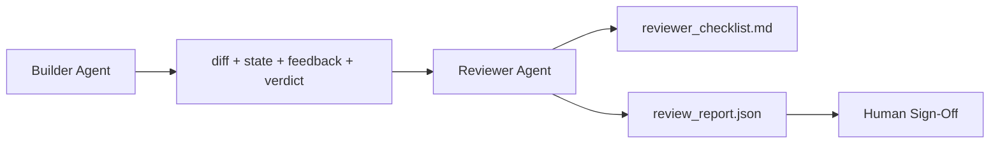

# 리뷰어 에이전트: 빌더와 채점자를 분리하라 (Reviewer Agent: Separate Builder from Marker)

> 코드를 작성한 에이전트(agent)는 그것을 채점할 수 없다. 리뷰어(reviewer)는 다른 시스템 프롬프트(system prompt), 다른 목표, 그리고 빌더(builder)가 만들어낸 모든 것에 대한 읽기 전용(read-only) 접근을 가진 두 번째 루프다. 빌더와 리뷰어 사이의 간극에 대부분의 신뢰성이 산다.

**Type:** Build
**Languages:** Python (stdlib)
**Prerequisites:** Phase 14 · 38 (Verification Gate)
**Time:** ~55분

## 학습 목표 (Learning Objectives)

- 같은 에이전트가 자신의 작업을 신뢰성 있게 검토할 수 없는 이유를 진술하기.
- 빌더 아티팩트(artifact)를 소비하고 구조화된 리뷰 보고서를 내보내는 리뷰어 에이전트 루프 만들기.
- 분위기(vibes)가 아니라 특정 차원(dimension)을 채점하는 리뷰어 루브릭(rubric) 작성하기.
- 사람 검토 단계가 실제 아티팩트에서 시작되도록 리뷰어를 워크벤치(workbench)에 연결하기.

## 문제 (The Problem)

당신은 에이전트에게 버그를 고치라고 요청한다. 에이전트는 네 개의 파일을 편집하고, 테스트를 실행하고, 완료를 보고한다. 검증 게이트(verification gate, Phase 14 · 38)는 수용(acceptance)이 실행되었고 스코프(scope)가 유지되었음을 확인한다. 게이트는 `passed: true`라고 말한다. 당신은 머지(merge)한다. 이틀 뒤 당신은 그 수정이 버그의 잘못된 절반을 해결했음을 발견한다.

수용은 필요하지만 충분하지는 않다. 리뷰어는 수용이 물을 수 없는 질문들을 묻는다: 이것이 올바른 문제를 해결했는가? 표시 없이 스코프를 확장했는가? 의심받았어야 할 가정(assumption)을 문서화했는가? 다음 세션이 이어받을 수 있는 상태로 워크벤치를 남겼는가?

## 개념 (The Concept)



### 리뷰어 루브릭

다섯 가지 차원, 각각 0에서 2까지 채점.

| 차원 | 질문 |
|-----------|----------|
| 문제 적합성 (Problem fit) | 변경이 가까운 작업이 아니라 명시된 그대로의 작업을 해결했는가? |
| 스코프 규율 (Scope discipline) | 편집이 계약에 한정되었는가, 아니면 계약이 의도적으로 커졌는가? |
| 가정 (Assumptions) | 모든 숨은 가정이 검토 가능한 어딘가에 적혀 있는가? |
| 검증 품질 (Verification quality) | 수용 명령이 실제로 목표를 증명하는가, 아니면 더 약한 버전을 증명했는가? |
| 핸드오프 준비도 (Handoff readiness) | 다음 세션이 현재 상태에서 깔끔하게 이어받을 수 있는가? |

총점 10점 만점. 7점 미만 실행은 소프트 실패(soft fail)이고, 5점 미만 실행은 하드 실패(hard fail)다.

### 리뷰어는 별도의 모델이 아니라 별도의 역할이다

리뷰어를 빌더와 같은 모델로 실행할 수 있다. 규율은 역할 분리(role separation)다: 다른 시스템 프롬프트, 다른 입력, 디프(diff)에 대한 쓰기 접근 없음. 자세(posture)의 변화가 곧 신호(signal)의 변화다.

### 리뷰어는 디프를 편집할 수 없다

리뷰어는 디프, 상태, 피드백, 판정(verdict)을 읽는다. 보고서를 쓴다. 디프를 패치하지 않는다. 보고서가 "이것을 고쳐라"라고 하면, 다음 빌더 턴이 수정을 한다. 리뷰어는 검토로 돌아간다. 역할을 섞으면 간극이 무너진다.

### 리뷰어 루브릭 대 검증 게이트

게이트(Phase 14 · 38)는 결정론적 사실을 검사한다: 수용이 실행되었는지, 규칙이 통과했는지, 스코프가 유지되었는지. 리뷰어는 정성적 판단을 내린다: 이것이 올바른 작업이었는지, 문서화되었는지, 핸드오프가 사용 가능한지. 둘 다 필요하다.

## 직접 만들기 (Build It)

`code/main.py`는 다음을 구현한다:

- 리뷰어가 읽는 아티팩트를 묶는 `ReviewerInputs` 데이터클래스(dataclass).
- 차원당 하나의 함수를 가진 루브릭 채점기. 각 함수는 결정론적이고 레슨을 위한 스텁 수준(stub-grade)이다. 실제 구현은 LLM을 호출할 것이다.
- 다섯 점수, 총점, 그리고 판정(`pass`, `soft_fail`, `hard_fail`)을 담은 `review_report.json` 라이터.
- 두 가지 데모 사례: 깔끔한 변경과 "올바른 테스트, 잘못된 문제" 변경.

실행하기:

```
python3 code/main.py
```

출력: 디스크에 작성된 두 개의 리뷰 보고서와 차원별 점수의 콘솔 테이블.

## 현장의 프로덕션 패턴 (Production patterns in the wild)

증거: Cloudflare의 2026년 4월 AI 코드 리뷰 시스템은 30일간 5,169개 리포지터리의 48,095개 머지 요청에 걸쳐 131,246회의 리뷰 실행을 돌렸다. 리뷰 완료 중앙값은 3분 39초였다. 최대 일곱 명의 전문 리뷰어(보안, 성능, 코드 품질, 문서, 릴리스 관리, 컴플라이언스, Engineering Codex)가 발견 사항을 중복 제거하고 심각도를 판단하는 리뷰 코디네이터(Review Coordinator) 아래에서 병렬로 실행되었다. 최상위 모델은 코디네이터 전용으로 예약되었고, 전문가들은 더 저렴한 티어(tier)에서 실행되었다.

네 가지 패턴이 이것을 규모에서 작동하게 만든다.

**하나의 큰 리뷰어가 아니라 전문가 풀(specialist pool).** 5차원 루브릭을 가진 한 명의 리뷰어는 단독(solo) 리포지터리에 적합하다. 일단 코드베이스가 보안 임계(security-critical), 성능 임계(performance-critical), 문서 표면을 갖게 되면, 더 작은 프롬프트를 가진 전문가들로 분할하라. 코디네이터가 중복 제거를 한다. 전문가들은 결코 전체 루브릭을 실행하지 않는다. 모델 티어 분리는 자연히 따라온다: 저렴한 전문가, 비싼 코디네이터.

**최적화가 아니라 설계 요구사항으로서의 편향 완화.** LLM 판정자는 네 가지 신뢰할 만한 편향을 보인다(Adnan Masood, 2026년 4월): 위치 편향(position bias, GPT-4는 (A,B) 대 (B,A) 순서에서 약 40% 비일관적), 장황함 편향(verbosity bias, 더 긴 출력에 약 15% 점수 부풀림), 자기 선호(self-preference, 판정자는 같은 모델 계열의 출력을 선호), 권위(authority, 판정자는 알려진 저자에 대한 참조를 과대평가). 완화책: 두 순서를 모두 평가하고 일관된 승리만 집계하라. 간결함을 명시적으로 보상하는 1-4 척도를 사용하라. 모델 계열에 걸쳐 판정자를 순환시켜라. 채점 전에 저자명을 제거하라.

**분위기가 아니라 보정 집합(calibration set).** 알려진 올바른 판정을 가진 10-20개 작업의 역사적 집합. 모든 프롬프트 변경 시 그 위에서 리뷰어를 실행하라. 역사적 기록과의 일치율이 80% 아래로 떨어지면, 리뷰어가 출시되기 전에 루브릭을 수정해야 한다. 이것은 모든 팀이 결국 재발견하는 것이다. 처음부터 그것으로 시작하는 편이 낫다.

**게이트와의 하이브리드 노름(hybrid norm).** 검증 게이트(Phase 14 · 38)는 결정론적 검사(수용이 실행되었는지, 테스트가 통과했는지, 스코프가 유지되었는지)를 처리한다. 리뷰어는 의미론적 검사(이것이 올바른 작업이었는지, 가정이 문서화되었는지, 핸드오프가 사용 가능한지)를 처리한다. Anthropic의 2026년 지침은 이 분리에 명시적이다: 게이트가 이미 증명한 것을 리뷰어에게 다시 하라고 요청하지 마라.

## 라이브러리로 써보기 (Use It)

프로덕션 패턴:

- **Claude Code 서브에이전트(subagent).** 빌더가 작업을 닫은 후 리뷰어 서브에이전트가 실행된다. 루브릭 점수와 함께 PR에 댓글을 단다.
- **OpenAI Agents SDK 핸드오프(handoff).** 빌더는 작업 완료 시 리뷰어에게 넘긴다. 리뷰어는 발견 사항 목록과 함께 되돌려주거나 사람에게 올릴 수 있다.
- **두 모델 짝짓기.** 빌더는 더 빠르고 저렴한 모델에서 실행된다. 리뷰어는 판단에 집중한, 더 작은 컨텍스트를 가진 더 강한 모델에서 실행된다.

리뷰어는 사람이 모든 검토를 스스로 할 수 없을 때 워크벤치가 키우는 두 번째 눈이다.

## 산출물 (Ship It)

`outputs/skill-reviewer-agent.md`는 프로젝트별 리뷰어 루브릭, 빌더의 아티팩트에 연결된 리뷰어 에이전트 스텁, 그리고 사람 검토가 빈 페이지 대신 작성된 보고서에서 시작되도록 하는 검증 게이트와의 통합을 생성한다.

## 연습 문제 (Exercises)

1. 당신의 제품 도메인에 특화된 여섯 번째 차원을 추가하라. 그것이 기존의 다섯 차원에 흡수되지 않는 이유를 옹호하라.
2. 두 가지 다른 시스템 프롬프트(간결, 장황)로 리뷰어를 실행하라. 어느 쪽이 사람이 읽을 가능성이 더 높은 보고서를 만드는가?
3. 차원별 `confidence` 필드를 추가하라. 가장 낮은 차원의 신뢰도가 0.6 미만일 때 보고서 출시를 거부하라.
4. 보정 집합을 만들어라: 알려진 올바른 판정을 가진 10개의 역사적 작업 종료. 그 위에서 리뷰어를 실행하라. 역사적 기록과 어디서 불일치하는가?
5. "더 많은 증거 요청" 어포던스(affordance)를 추가하라: 리뷰어는 채점 전에 빌더에게 특정 테스트 실행을 요청할 수 있다. 이것이 루프에 빠지지 않도록 하는 올바른 백오프(back-off)는 무엇인가?

## 핵심 용어 (Key Terms)

| 용어 | 흔히 하는 말 | 실제 의미 |
|------|----------------|------------------------|
| 리뷰어 루브릭 (Reviewer rubric) | "체크리스트" | 차원당 작성된 질문을 가진 5차원 0-2 채점 |
| 소프트 실패 (Soft fail) | "수정이 필요함" | 총점 7점 미만; 빌더가 처리할 발견 사항을 받음 |
| 하드 실패 (Hard fail) | "거부" | 총점 5점 미만 또는 어떤 차원이든 0점; 중단하고 사람에게 표면화 |
| 역할 분리 (Role separation) | "다른 프롬프트" | 같은 모델이 두 역할 모두 할 수 있음; 규율은 입력과 자세 |
| 신뢰도 하한 (Confidence floor) | "신호가 낮은 보고서를 출시하지 마라" | 루브릭이 불확실할 때 판정 내보내기를 거부 |

## 더 읽을거리 (Further Reading)

- [OpenAI Agents SDK handoffs](https://platform.openai.com/docs/guides/agents-sdk/handoffs)
- [Anthropic Claude Code subagents](https://docs.anthropic.com/en/docs/agents-and-tools/claude-code/sub-agents)
- [Cloudflare, Orchestrating AI Code Review at Scale](https://blog.cloudflare.com/ai-code-review/) — 7-전문가 + 코디네이터 아키텍처, 30일간 131k 실행
- [Agent-as-a-Judge: Evaluating Agents with Agents (OpenReview / ICLR)](https://openreview.net/forum?id=DeVm3YUnpj) — DevAI 벤치마크, 366개의 계층적 솔루션 요구사항
- [Adnan Masood, Rubric-Based Evaluations and LLM-as-a-Judge: Methodologies, Biases, Empirical Validation](https://medium.com/@adnanmasood/rubric-based-evals-llm-as-a-judge-methodologies-and-empirical-validation-in-domain-context-71936b989e80) — 네 가지 편향과 완화책
- [MLflow, LLM-as-a-Judge Evaluation](https://mlflow.org/llm-as-a-judge) — 분리된 빌더/평가자를 위한 프로덕션 도구
- [LangChain, How to Calibrate LLM-as-a-Judge with Human Corrections](https://www.langchain.com/articles/llm-as-a-judge) — 보정 집합 워크플로
- [Evidently AI, LLM-as-a-judge: a complete guide](https://www.evidentlyai.com/llm-guide/llm-as-a-judge)
- [Arize, LLM as a Judge — Primer and Pre-Built Evaluators](https://arize.com/llm-as-a-judge/)
- Phase 14 · 05 — Self-Refine와 CRITIC(단일 에이전트 자기 검토 베이스라인)
- Phase 14 · 30 — 평가 주도 에이전트 개발(보정 집합 생성기)
- Phase 14 · 38 — 리뷰어가 읽는 검증 게이트
- Phase 14 · 40 — 리뷰어 보고서가 공급하는 핸드오프 패킷
