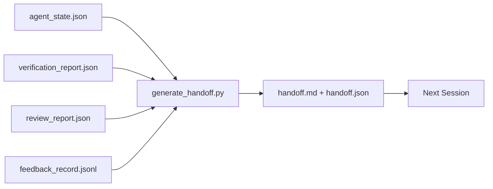

# 다중 세션 핸드오프 (Multi-Session Handoff)

> 세션은 끝날 것이다. 작업은 아니다. 핸드오프 패킷(handoff packet)은 "에이전트가 한 시간 동안 일했다"를 "다음 세션이 첫 1분 만에 생산적이다"로 바꾸는 아티팩트(artifact)다. 나중에 떠올릴 일이 아니라 처음부터 의도적으로 만들어라.

**Type:** Build
**Languages:** Python (stdlib)
**Prerequisites:** Phase 14 · 34 (Repo Memory), Phase 14 · 38 (Verification), Phase 14 · 39 (Reviewer)
**Time:** ~50분

## 학습 목표 (Learning Objectives)

- 모든 핸드오프 패킷이 필요로 하는 일곱 가지 필드를 식별하기.
- 산문을 손으로 쓰지 않고 워크벤치 아티팩트로부터 핸드오프를 생성하기.
- 큰 피드백 로그를 핸드오프 크기의 요약으로 잘라내기.
- 다음 세션의 첫 동작을 결정론적으로 만들기.

## 문제 (The Problem)

세션이 끝난다. 에이전트(agent)는 "좋아요, 우리는 진전을 이뤘습니다"라고 말한다. 다음 세션이 열린다. 다음 에이전트는 "우리가 어디서 멈췄죠?"라고 묻는다. 첫 번째 에이전트의 답은 사라졌다. 다음 에이전트는 재발견하고, 같은 명령을 다시 실행하고, 사람에게 같은 질문을 다시 묻고, 이전 세션의 마지막 30초를 복구하느라 30분을 허비한다.

나쁜 핸드오프의 비용은 작업의 수명 내내 매 세션 지불된다. 해결책은 세션 종료 시 자동으로 생성되는 패킷이다: 무엇이 바뀌었는지, 왜, 무엇을 시도했는지, 무엇이 실패했는지, 무엇이 남았는지, 다음에 먼저 무엇을 할지.

## 개념 (The Concept)



### 모든 핸드오프가 담는 일곱 가지 필드

| 필드 | 답하는 질문 |
|-------|---------------------|
| `summary` | 무엇을 했는지에 대한 한 문단 |
| `changed_files` | 한눈에 보는 디프(diff) |
| `commands_run` | 실제로 무엇이 실행되었는지 |
| `failed_attempts` | 무엇을 시도했고 왜 작동하지 않았는지 |
| `open_risks` | 다음 세션의 발목을 잡을 수 있는 것, 심각도와 함께 |
| `next_action` | 다음 세션이 취하는 첫 번째 구체적 단계 |
| `verdict_pointer` | 검증 + 리뷰 보고서로의 경로 |

`next_action` 필드가 하중을 지탱하는(load-bearing) 것이다. `next_action`만 빼고 모든 것을 가진 핸드오프는 핸드오프가 아니라 상태 보고서(status report)다.

### 핸드오프는 작성되는 것이 아니라 생성되는 것이다

손으로 작성한 핸드오프는 힘든 날에 건너뛰게 되는 핸드오프다. 생성기는 워크벤치 아티팩트를 읽고 패킷을 내보낸다. 에이전트의 일은 요약을 작성하는 것이 아니라, 생성기가 요약할 수 있는 상태로 워크벤치를 남기는 것이다.

### 두 가지 형태: 사람이 읽는 것과 기계가 읽는 것

`handoff.md`는 사람이 읽는 것이다. `handoff.json`은 다음 에이전트가 로드하는 것이다. 둘 다 같은 출처 아티팩트에서 나온다. 둘이 갈라지면 JSON이 이긴다.

### 피드백 로그 잘라내기

전체 `feedback_record.jsonl`은 수백 개의 항목일 수 있다. 핸드오프는 마지막 K개와 0이 아닌 종료를 가진 모든 항목만 담는다. 다음 세션은 필요하면 전체 로그를 로드하지만, 패킷은 작게 유지된다.

## 직접 만들기 (Build It)

`code/main.py`는 다음을 구현한다:

- 상태, 판정(verdict), 리뷰, 피드백을 단일 `WorkbenchSnapshot`으로 모으는 로더.
- `generate_handoff(snapshot) -> (markdown, payload)` 함수.
- 마지막 K개 피드백 항목과 0이 아닌 모든 종료를 고르는 필터.
- 스크립트 옆에 `handoff.md`와 `handoff.json`을 작성하는 데모 실행.

실행하기:

```
python3 code/main.py
```

출력: 출력된 핸드오프 본문과 디스크상의 두 파일.

## 현장의 프로덕션 패턴 (Production patterns in the wild)

Codex CLI, Claude Code, OpenCode는 각각 다른 압축(compaction) 이야기를 제공한다. 구조화된 핸드오프 패킷은 이 셋 모두의 위에서 동작한다.

**압축 전략은 다양하지만, 패킷 스키마는 그렇지 않다.** Codex CLI의 POST /v1/responses/compact는 서버 측 불투명 AES 블롭(blob)이다(OpenAI 모델을 위한 빠른 경로). 대비책(fallback)은 `_summary` 사용자 역할 메시지로 추가되는 로컬 "핸드오프 요약"이다. Claude Code는 컨텍스트의 95%에서 5단계 점진적 압축을 실행한다. OpenCode는 타임스탬프 기반 메시지 숨김과 5-헤딩 LLM 요약을 한다. 세 가지 다른 메커니즘, 같은 필요: 압축을 견디고 살아남는 것을 이식 가능한(portable) 아티팩트로 직렬화하기. 패킷이 그 아티팩트다.

**새 세션 핸드오프는 압축이 아니다.** 압축은 세션을 연장한다. 핸드오프는 하나를 깔끔하게 닫고 다음을 시작한다. Hermes Issue #20372 프레이밍(2026년 4월)이 옳다: 제자리 압축(in-place compression)이 저하되기 시작하면, 에이전트는 간결한 핸드오프를 작성하고, 세션을 종료하고, 새로운 컨텍스트에서 재개해야 한다. 패킷은 그 전환을 저렴하게 만드는 것이다. 실수는 품질이 무너질 때까지 계속 압축하는 것이다. 해결책은 이른, 깔끔한 핸드오프를 위한 예산을 잡는 것이다.

**브랜치와 주제당 하나의 활성 핸드오프.** 다중 에이전트 조정(coordination)은 나쁜 모델 출력보다 오래된(stale) 핸드오프에서 더 많이 무너진다. 항상 `branch`, `last_known_good_commit`, 그리고 `active | superseded | archived`의 `status`를 포함하라. 오래된 핸드오프는 보관된다. 오직 활성 핸드오프만 다음 세션을 구동한다. 이것이 메모로서의 핸드오프와 상태로서의 핸드오프 사이의 차이다.

**벽에서가 아니라 컨텍스트 50-75% 전에 마무리하라.** 손으로 작성하는 패턴 플레이북(CLAUDE.md + HANDOVER.md)은 세션이 95%가 아니라 컨텍스트 예산의 50-75%에서 끝날 때 최상의 결과를 보고한다. 패킷 생성기는 압축 아티팩트가 출처 상태를 오염시키기 전에 깔끔하게 실행된다. 컨텍스트가 온전할 때는 쓰기가 저렴하고, 모델이 이미 자기 자리를 잃고 있을 때는 비싸다.

## 라이브러리로 써보기 (Use It)

프로덕션 패턴:

- **세션 종료 훅(session-end hook).** 런타임은 사용자가 채팅을 닫을 때 생성기를 발동시킨다. 패킷은 `outputs/handoff/<session_id>/`로 들어간다.
- **PR 템플릿.** 생성기의 마크다운은 PR 본문이기도 하다. 리뷰어는 다른 다섯 개의 파일을 열지 않고도 그것을 읽는다.
- **크로스 에이전트 핸드오프.** 한 제품(Claude Code)으로 만들고, 다른 제품(Codex)으로 계속하라. 패킷은 공통어(lingua franca)다.

패킷은 작고, 규칙적이며, 생산하기에 저렴하다. 비용 절감은 매 세션마다 복리로 쌓인다.

## 산출물 (Ship It)

`outputs/skill-handoff-generator.md`는 프로젝트의 아티팩트 경로에 맞춰 조정된 생성기, 그것을 실행하는 세션 종료 훅, 그리고 다음 에이전트가 시작 시 읽는 `handoff.json` 스키마를 만든다.

## 연습 문제 (Exercises)

1. 빌더(builder)가 기록했지만 리뷰어(reviewer)가 1점 이상으로 채점하지 않은 모든 가정을 표면화하는 `assumptions_to_validate` 필드를 추가하라.
2. 실패한 실행과 통과한 실행에 대해 피드백 요약을 다르게 잘라내라. 그 비대칭을 옹호하라.
3. "사람을 위한 질문" 목록을 포함하라. 질문이 채팅 메시지가 아니라 패킷에 들어가는 임계값은 무엇인가?
4. 생성기를 멱등(idempotent)으로 만들어라: 두 번 실행해도 같은 패킷을 만든다. 그것이 성립하려면 무엇이 안정적이어야 하는가?
5. 다음 세션이 동작하기 전에 반드시 로드해야 하는 아티팩트를 정확히 나열하는 "다음 세션 전제조건(prereqs)" 섹션을 추가하라.

## 핵심 용어 (Key Terms)

| 용어 | 흔히 하는 말 | 실제 의미 |
|------|----------------|------------------------|
| 핸드오프 패킷 (Handoff packet) | "세션 요약" | 일곱 가지 필드를 담은 생성된 아티팩트, 마크다운과 JSON 둘 다 |
| 다음 동작 (Next action) | "먼저 무엇을 할지" | 다음 세션을 시작하는 하나의 구체적 단계 |
| 피드백 잘라내기 (Feedback trim) | "로그 요약" | 마지막 K개 레코드와 0이 아닌 모든 종료 |
| 상태 보고서 (Status report) | "우리가 한 것" | `next_action`이 빠진 문서; 유용하지만 핸드오프는 아님 |
| 판정 포인터 (Verdict pointer) | "영수증" | 추적성을 위한 검증 + 리뷰 보고서로의 경로 |

## 더 읽을거리 (Further Reading)

- [Anthropic, Effective harnesses for long-running agents](https://www.anthropic.com/engineering/effective-harnesses-for-long-running-agents)
- [OpenAI Agents SDK handoffs](https://platform.openai.com/docs/guides/agents-sdk/handoffs)
- [Codex Blog, Codex CLI Context Compaction: Architecture, Configuration, Managing Long Sessions](https://codex.danielvaughan.com/2026/03/31/codex-cli-context-compaction-architecture/) — POST /v1/responses/compact과 로컬 대비책
- [Justin3go, Shedding Heavy Memories: Context Compaction in Codex, Claude Code, OpenCode](https://justin3go.com/en/posts/2026/04/09-context-compaction-in-codex-claude-code-and-opencode) — 3개 벤더 압축 비교
- [JD Hodges, Claude Handoff Prompt: How to Keep Context Across Sessions (2026)](https://www.jdhodges.com/blog/ai-session-handoffs-keep-context-across-conversations/) — CLAUDE.md + HANDOVER.md, 50-75% 컨텍스트 예산
- [Mervin Praison, Managing Handoffs in Multi-Agent Coding Sessions: Fresh Context Without Losing Continuity](https://mer.vin/2026/04/managing-handoffs-in-multi-agent-coding-sessions-fresh-context-without-losing-continuity/) — 분산 시스템 프레이밍
- [Hermes Issue #20372 — automatic fresh-session handoff when compression becomes risky](https://github.com/NousResearch/hermes-agent/issues/20372)
- [Hermes Issue #499 — Context Compaction Quality Overhaul](https://github.com/NousResearch/hermes-agent/issues/499) — Codex CLI의 핸드오프 지향 프롬프트
- [Microsoft Agent Framework, Compaction](https://learn.microsoft.com/en-us/agent-framework/agents/conversations/compaction)
- [OpenCode, Context Management and Compaction](https://deepwiki.com/sst/opencode/2.4-context-management-and-compaction)
- [LangChain, Context Engineering for Agents](https://www.langchain.com/blog/context-engineering-for-agents)
- Phase 14 · 34 — 생성기가 읽는 상태 파일
- Phase 14 · 38 — 패킷이 가리키는 검증 판정
- Phase 14 · 39 — 패킷에 묶이는 리뷰어 보고서
