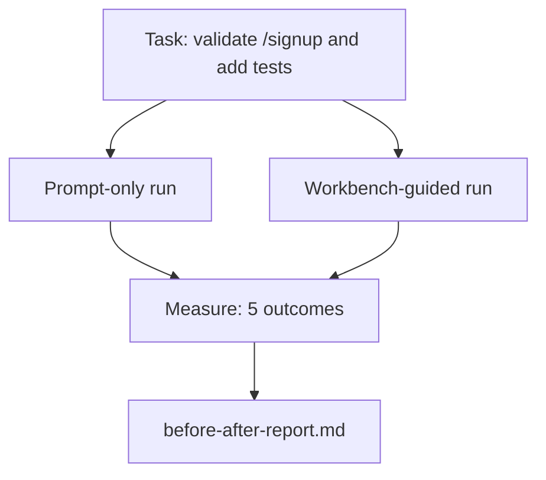

# 실제 리포지터리 위의 워크벤치 (The Workbench on a Real Repo)

> 열한 개 레슨 분량의 표면(surface)도 실제 코드베이스에 부딪혀 살아남지 못한다면 아무 가치가 없다. 이 레슨은 작은 샘플 앱에서 같은 작업을 두 번 실행한다: 프롬프트 전용(prompt-only) 대 워크벤치 안내(workbench-guided). 숫자로 말하겠다.

**Type:** Build
**Languages:** Python (stdlib)
**Prerequisites:** Phases 14 · 32 to 14 · 40
**Time:** ~60분

## 학습 목표 (Learning Objectives)

- 일곱 가지 워크벤치(workbench) 표면을 작은 애플리케이션에서 한데 모으기.
- 같은 작업을 두 번(프롬프트 전용과 워크벤치 안내) 실행하고 다섯 가지 결과를 측정하기.
- 전후(before/after) 보고서를 읽고 어떤 표면이 가장 큰 레버리지를 주었는지 결정하기.
- "하지만 내 모델은 충분히 좋은데"라는 반론에 맞서 워크벤치를 옹호하기.

## 문제 (The Problem)

장난감 작업으로 만든 데모는 아무도 설득하지 못한다. 워크벤치를 옹호하는 근거는, 실제처럼 느껴지는 리포지터리(repo)의 실제처럼 느껴지는 작업이 실패와 되돌림(revert)을 줄이고 다음 세션이 쓸 수 있는 패킷(packet)까지 남기며 프로덕션(production)에 안착할 때 비로소 생긴다.

이 레슨은 그 실제처럼 느껴지는 리포지터리를 제공하고 같은 작업을 두 파이프라인(pipeline) 모두에 통과시킨다. 결과는 회의론자에게 건넬 수 있는 전후 보고서다.

## 개념 (The Concept)



### 샘플 앱

`sample_app/`에 있는 최소 FastAPI 스타일 핸들러:

- `/signup`(아직 검증 없음)을 가진 `app.py`.
- 하나의 해피 패스(happy-path) 테스트를 가진 `test_app.py`.
- 금지 구역(forbidden-zone) 미끼로서의 `README.md`와 `scripts/release.sh`.

### 작업

> `/signup`에 입력 검증을 추가하라: 8자보다 짧은 비밀번호를 거부하고, 타입이 지정된 에러 봉투(typed error envelope)와 함께 422를 반환하라. 새 동작을 증명하는 테스트를 추가하라.

### 두 파이프라인

프롬프트 전용:

1. README를 읽는다.
2. `app.py`를 읽는다.
3. 파일을 편집한다.
4. 완료를 주장한다.

워크벤치 안내:

1. 초기화 스크립트(init script)를 실행한다(Lesson 35).
2. 스코프 계약(scope contract)을 읽는다(Lesson 36).
3. 상태(state)를 읽는다(Lesson 34).
4. 허용된 파일만 편집한다.
5. 피드백 러너(feedback runner)를 통해 수용 명령(acceptance command)을 실행한다(Lesson 37).
6. 검증 게이트(verification gate)를 실행한다(Lesson 38).
7. 리뷰어(reviewer)를 실행한다(Lesson 39).
8. 핸드오프(handoff)를 생성한다(Lesson 40).

### 측정하는 다섯 가지 결과

| 결과 | 왜 중요한가 |
|---------|----------------|
| `tests_actually_run` | 대부분의 "테스트 통과" 주장은 검증 불가능하다 |
| `acceptance_met` | 목표를 증명하는 테스트가 실행된 테스트여야 한다 |
| `files_outside_scope` | 스코프 크리프(scope creep)는 지배적인 조용한 실패다 |
| `handoff_quality` | 다음 세션이 이것에 대해 대가를 치르거나 이득을 본다 |
| `reviewer_total` | 게이트 위의 정성적 판단 |

## 직접 만들기 (Build It)

`code/main.py`는 같은 샘플 앱 픽스처(fixture)에 대해 두 파이프라인을 조율한다. 두 파이프라인 모두 스크립트화되어 있어(루프에 LLM 없음) 측정이 재현 가능하다. 스크립트는 비교를 `before-after-report.md`와 `comparison.json`에 작성한다.

실행하기:

```
python3 code/main.py
```

출력: 파이프라인별 결과의 콘솔 테이블, 스크립트 옆에 저장된 마크다운 보고서, 그리고 차트로 그리고 싶은 사람을 위한 JSON.

## 현장의 프로덕션 패턴 (Production patterns in the wild)

회의론자의 질문은 "워크벤치가 실제로 얼마나 도움이 되는가?"이다. 2026년의 숫자는 어떤 설명보다 많은 것을 보여준다.

**같은 모델에서 Terminal Bench Top-30에서 Top-5로.** LangChain의 *Anatomy of an Agent Harness*(2026년 4월): 한 코딩 에이전트가 하니스(harness)만 바꿔서 Terminal Bench 2.0에서 30위권 밖에서 5위로 뛰어올랐다. 같은 모델. 다른 표면. 25순위 차이.

**도구를 삭제해서 Vercel 80%에서 100%로.** Vercel은 에이전트 도구의 80%를 삭제하니 성공률이 80%에서 100%로 올라갔다고 보고했다. 더 작은 도구 표면, 더 날카로운 스코프, 실패할 방법의 감소. 부정 공간(negative space)이 이긴다.

**하니스만으로 Harvey 2배 정확도.** 법률 에이전트는 모델 변경 없이 하니스 최적화를 통해 정확도를 두 배 이상 높였다.

**기업 AI 에이전트 프로젝트의 88%가 프로덕션에 도달하지 못한다.** preprints.org *Harness Engineering for Language Agents* 논문(2026년 3월)은 그 실패를 추론(reasoning)이 아니라 런타임으로 추적한다: 오래된 상태(stale state), 깨지기 쉬운 재시도(brittle retries), 과도하게 자란 컨텍스트, 중간 실수에서의 부실한 복구.

**긴 컨텍스트 붕괴(long-context collapse).** WebAgent 베이스라인 40-50% 성공률이 긴 컨텍스트 조건에서 10% 미만으로 떨어지는데, 대부분 무한 루프와 목표 상실(goal loss)에서 비롯된다. Ralph 루프(Ralph Loop)와 핸드오프 패킷은 그것을 흡수하기 위해 존재한다.

**거짓 음성(false negative)도 여전히 존재한다.** 단일 단계 사실 작업, 한 줄짜리 린트, 포매터(formatter) 실행, 모델이 글자 그대로 외운 모든 것 — 이런 것들은 프롬프트 전용에서 더 빠르게 실행된다. 벤치마크는 이것들을 정직하게 열거하여 워크벤치가 과잉(overkill)으로 프레이밍되지 않도록 해야 한다.

요점은 "하니스가 영원히 이긴다"가 아니다. 모델은 시간이 지나면서 하니스 요령을 실제로 흡수한다. 요점은 오늘날 엔지니어링 부하가 일곱 가지 표면에 있고, 숫자가 그것을 증명한다는 것이다.

## 라이브러리로 써보기 (Use It)

이 레슨은 다음의 경우에 인용하는 사례 파일(case file)이다:

- 누군가가 왜 모든 PR이 `agent-rules.md`와 스코프 계약을 담는지 물을 때.
- 어떤 팀이 "이번 스프린트만" 검증 게이트를 빼고 싶어 할 때.
- 새 에이전트 제품이 출시되고 그것이 실제로 시간을 절약하는지에 대한 이식 가능한(portable) 벤치마크가 필요할 때.

설명보다 숫자가 더 멀리 간다.

## 산출물 (Ship It)

`outputs/skill-workbench-benchmark.md`는 어떤 에이전트 제품이든 프로젝트 자신의 샘플 앱에 대해 두 파이프라인을 통과시키고 다섯 가지 결과를 보고하는 이식 가능한 평가 하니스다.

## 연습 문제 (Exercises)

1. 여섯 번째 결과를 추가하라: 첫 의미 있는 편집까지의 시간(time-to-first-meaningful-edit). 그것을 어떻게 깔끔하게 측정하는가?
2. 자신의 코드베이스에서 실제 둘째 날 작업으로 비교를 실행하라. 워크벤치 숫자가 어디서 미끄러지는가?
3. "거짓 음성" 패스를 추가하라: 프롬프트 전용이 더 빨랐을 작업, 워크벤치 오버헤드가 실제 비용인 작업. 그럼에도 워크벤치를 유지하는 것을 옹호하라.
4. 스크립트화된 "에이전트"를 실제 LLM 호출로 교체하라. 어떤 결과가 더 잡음이 많아지는가?
5. 비엔지니어를 겨냥한 한 페이지 요약을 작성하라. 무엇이 잘려나가지 않고 살아남는가?

## 핵심 용어 (Key Terms)

| 용어 | 흔히 하는 말 | 실제 의미 |
|------|----------------|------------------------|
| 샘플 앱 (Sample app) | "장난감 리포지터리" | 작지만 일곱 표면 전부를 작동시킬 만큼 충분히 현실적 |
| 파이프라인 (Pipeline) | "워크플로" | 에이전트가 따르는 표면 읽기/쓰기의 순서화된 시퀀스 |
| 전후 보고서 (Before/after report) | "증거" | 회의론자에게 건네는 아티팩트 |
| 거짓 음성 (False negative) | "워크벤치 과잉" | 프롬프트 전용이 더 빠른 작업; 정직하게 열거하면 유용함 |
| 워크벤치 벤치마크 (Workbench benchmark) | "신뢰성 점수" | 자신의 코드베이스에서 비교를 실행하는 이식 가능한 하니스 |

## 더 읽을거리 (Further Reading)

- [LangChain, The Anatomy of an Agent Harness](https://blog.langchain.com/the-anatomy-of-an-agent-harness/) — Terminal Bench Top-30에서 Top-5로의 증거
- [MongoDB, The Agent Harness: Why the LLM Is the Smallest Part of Your Agent System](https://www.mongodb.com/company/blog/technical/agent-harness-why-llm-is-smallest-part-of-your-agent-system) — Vercel + Harvey 숫자
- [preprints.org, Harness Engineering for Language Agents](https://www.preprints.org/manuscript/202603.1756) — 88% 기업 실패율, 런타임 근본 원인
- [HN: Improving 15 LLMs at Coding in One Afternoon. Only the Harness Changed](https://news.ycombinator.com/item?id=46988596) — 15개 모델에 걸쳐 재현됨
- [Cloudflare, Orchestrating AI Code Review at Scale](https://blog.cloudflare.com/ai-code-review/) — 프로덕션에서 30일간 131k 리뷰 실행
- [Anthropic, Building Effective Agents](https://www.anthropic.com/research/building-effective-agents)
- Phases 14 · 32 to 14 · 40 — 이 레슨이 종단간(end-to-end)으로 작동시키는 표면들
- Phase 14 · 19 — 이 레슨이 보완하는 거시 벤치마크로서의 SWE-bench, GAIA, AgentBench
- Phase 14 · 30 — 같은 하니스가 꽂히는 평가 주도 에이전트 개발
