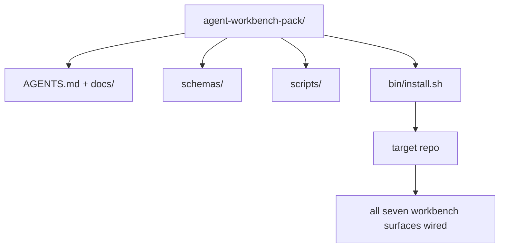

# 캡스톤: 재사용 가능한 에이전트 워크벤치 팩 출시하기 (Capstone: Ship a Reusable Agent Workbench Pack)

> 미니 트랙(mini-track)은 어떤 리포지터리(repo)에든 떨어뜨릴 수 있는 팩(pack)으로 끝난다. 열한 개 레슨 분량의 표면(surface)을 `cp -r`로 복사하면 다음 날 아침 에이전트(agent)가 신뢰성 있게 일하게 만드는 하나의 디렉터리로 압축한 것이다. 캡스톤(capstone)은 이 커리큘럼이 거래하는 아티팩트(artifact)다.

**Type:** Build
**Languages:** Python (stdlib)
**Prerequisites:** Phases 14 · 31 to 14 · 41
**Time:** ~75분

## 학습 목표 (Learning Objectives)

- 일곱 가지 워크벤치(workbench) 표면을 하나의 드롭인(drop-in) 디렉터리로 패키징하기.
- 새 리포지터리가 알려진-양호(known-good) 베이스라인을 얻도록 스키마, 스크립트, 템플릿을 고정하기.
- 팩을 멱등(idempotent)하게 깔아주는 단일 설치 스크립트 추가하기.
- 무엇이 팩 안에 남고 무엇이 밖에 남는지 결정하고, 각각의 취사선택을 옹호하기.

## 문제 (The Problem)

Google Doc 하나, 채팅 이력 하나, 그리고 반쯤 기억나는 스크립트 세 개에 사는 워크벤치는 매 분기 다시 만들어지는 워크벤치다. 치료법은 버전 관리된 팩이다: 표면, 스키마, 스크립트, 그리고 한 명령짜리 설치기(installer)를 가진 리포지터리 또는 디렉터리.

당신은 이 레슨을 디스크에 출시된 `outputs/agent-workbench-pack/`과, 그것을 어떤 대상 리포지터리에든 떨어뜨리는 `bin/install.sh`로 끝낼 것이다.

## 개념 (The Concept)



### 팩 레이아웃

```
outputs/agent-workbench-pack/
├── AGENTS.md
├── docs/
│   ├── agent-rules.md
│   ├── reliability-policy.md
│   ├── handoff-protocol.md
│   └── reviewer-rubric.md
├── schemas/
│   ├── agent_state.schema.json
│   ├── task_board.schema.json
│   └── scope_contract.schema.json
├── scripts/
│   ├── init_agent.py
│   ├── run_with_feedback.py
│   ├── verify_agent.py
│   └── generate_handoff.py
├── bin/
│   └── install.sh
└── README.md
```

### 무엇이 들어가고, 무엇이 빠지는가

들어감:

- 표면 스키마. 그것이 계약이다.
- 위의 네 스크립트. 그것이 런타임이다.
- 네 개의 문서. 그것이 규칙과 루브릭(rubric)이다.

빠짐:

- 프로젝트별 작업. 작업은 팩이 아니라 대상 리포지터리의 보드(board)에 속한다.
- 벤더 SDK 호출. 팩은 프레임워크 무관(framework-agnostic)하다.
- 온보딩 산문. 팩은 팀의 기존 온보딩 안이 아니라 그 옆에 산다.

### 설치기

짧은 `bin/install.sh`(또는 `bin/install.py`):

1. `--force` 없이 기존 팩 위에 설치하기를 거부한다.
2. 팩을 대상 리포지터리에 복사한다.
3. `.github/workflows/`가 존재하면 CI를 연결한다.
4. 다음 단계를 출력한다: 보드를 채우고, 수용 명령(acceptance command)을 설정하고, 초기화 스크립트(init script)를 실행하라.

### 버전 관리

팩은 `VERSION` 파일을 담는다. 마이그레이션(migration)을 요구하는 스키마 변경과 스크립트 변경은 메이저(major)를 올린다. 문서만 변경하는 것은 패치(patch)를 올린다. 대상 리포지터리의 `agent_state.json`은 자신이 어떤 팩 버전에 대해 초기화되었는지 기록한다.

## 직접 만들기 (Build It)

`code/main.py`는 이 미니 트랙의 이전 레슨들에서 나온 스키마와 스크립트, 그리고 당신이 이미 작성한 문서로 시드(seed)된 팩을, 레슨 옆의 `outputs/agent-workbench-pack/`으로 조립한다.

실행하기:

```
python3 code/main.py
```

스크립트는 표면을 복사하고 고정하며, README를 작성하고, 팩 트리(tree)를 출력하고, 0으로 종료한다. 재실행은 멱등하다.

## 현장의 프로덕션 패턴 (Production patterns in the wild)

팩은 포크(fork), 업데이트, 그리고 비우호적인 업스트림(upstream)에서 살아남아야만 가치가 있다. 네 가지 패턴이 그것을 작동하게 만든다.

**`VERSION`은 마케팅이 아니라 계약이다.** 메이저 올림은 상태 마이그레이션을 요구한다. 마이너(minor) 올림은 검사기 재실행을 요구한다. 패치 올림은 문서만이다. 설치기는 매 설치마다 대상 리포지터리에 `.workbench-version`을 작성한다. `lint_pack.py`는 대상의 잠금(lock)이 팩의 `VERSION`과 불일치하면 출시를 거부한다. 이것이 `npm`, `Cargo`, `pyproject.toml`이 10년의 변화에서 살아남는 방식이다. 에이전트에 관한 어떤 것도 규칙을 바꾸지 않는다.

**크로스 도구 배포를 위한 단일 출처.** Nx는 단일 설정으로부터 `AGENTS.md`, `CLAUDE.md`, `.cursor/rules/`, `.github/copilot-instructions.md`, 그리고 MCP 서버를 깔아주는 하나의 `nx ai-setup`을 제공한다. 팩도 같은 것을 해야 한다. 설치기는 심링크(`ln -s AGENTS.md CLAUDE.md`)를 내보내서 단일 진실의 원천(source of truth)이 모든 코딩 에이전트로 부채꼴로 퍼지게 한다. 한 도구를 다른 도구보다 지원하기 위해 팩을 포크하는 것은 실패 모드다.

**비자명한(non-trivial) 상태에서 거부하는 `uninstall.sh`.** 팩을 제거하는 것은 사용자의 `agent_state.json`, `task_board.json`, 또는 `outputs/`를 삭제해서는 안 된다. 제거기(uninstaller)는 스키마, 스크립트, 문서, 그리고 `AGENTS.md`를 제거하고(`--keep-agents-md` 옵트아웃 가능), 상태 파일에 커밋되지 않은 변경이 있으면 진행을 거부한다. 상태는 사용자의 것이다. 팩은 그것을 소유하지 않는다.

**출판 가능한 스킬. SkillKit 스타일 배포.** 팩은 SkillKit 스킬로 출시된다: `skillkit install agent-workbench-pack`은 단일 출처로부터 32개의 AI 에이전트에 걸쳐 그것을 깔아준다. 팩 리포지터리가 진실의 원천이다. SkillKit은 배포 채널이다. 벤더 종속(vendor lock-in)이 무너진다. 일곱 가지 표면은 그대로 유지된다.

## 라이브러리로 써보기 (Use It)

팩이 출시되는 세 곳:

- **리포지터리에 떨어뜨리는 디렉터리로서.** `cp -r outputs/agent-workbench-pack /path/to/repo`.
- **공개 템플릿 리포지터리로서.** 포크 후 커스터마이즈, `VERSION`이 드리프트(drift)를 제어함.
- **SkillKit 스킬로서.** 단일 명령이 그것을 깔도록 당신의 에이전트 제품에 연결됨.

팩은 레시피다. 각 설치는 한 그릇 분량이다.

## 산출물 (Ship It)

`outputs/skill-workbench-pack.md`는 프로젝트에 맞춰 조정된 팩을 생성한다: 팀의 이력에 맞게 날카로워진 규칙, 리포지터리에 맞춰진 스코프 글롭(glob), 도메인 특화 항목 하나로 확장된 루브릭 차원.

## 연습 문제 (Exercises)

1. 어떤 선택적 다섯 번째 문서가 정식(canonical) 팩으로 승격될 자격이 있는지 결정하라. 그 취사선택을 옹호하라.
2. 설치기를 `--dry-run` 플래그를 가진 Python으로 다시 작성하라. bash와의 사용성(ergonomics)을 비교하라.
3. 팩을 안전하게 제거하고 상태 파일에 비자명한 이력이 있으면 거부하는 `bin/uninstall.sh`를 추가하라. 무엇이 비자명한 것으로 간주되는가?
4. 팩이 `VERSION`에서 드리프트할 때 실패하는 `lint_pack.py`를 추가하라. 팩 자신의 리포지터리를 위한 CI에 연결하라.
5. 손으로 만든 워크벤치에서 이 팩으로의 마이그레이션 런북(runbook)을 작성하라. 다운타임을 최소화하는 작업 순서는 무엇인가?

## 핵심 용어 (Key Terms)

| 용어 | 흔히 하는 말 | 실제 의미 |
|------|----------------|------------------------|
| 워크벤치 팩 (Workbench pack) | "스타터 키트" | 일곱 표면 전부를 담은 버전 관리된 디렉터리 |
| 설치기 (Installer) | "설정 스크립트" | 팩을 멱등하게 깔아주는 `bin/install.sh` |
| 팩 버전 (Pack version) | "VERSION" | 스키마/스크립트 변경은 메이저 올림, 문서만은 패치 |
| 드롭인 팩 (Drop-in pack) | "cp -r 하고 끝" | 첫날부터 리포지터리별 커스터마이즈 없이 작동하는 팩 |
| 포크 가능한 템플릿 (Forkable template) | "GitHub 템플릿" | GitHub의 "Use this template"이 복제할 수 있는 공개 리포지터리 |

## 더 읽을거리 (Further Reading)

- Phases 14 · 31 to 14 · 41 — 이 팩이 묶는 모든 표면
- [SkillKit](https://github.com/rohitg00/skillkit) — 32개의 AI 에이전트에 걸쳐 이 스킬 설치
- [Nx Blog, Teach Your AI Agent How to Work in a Monorepo](https://nx.dev/blog/nx-ai-agent-skills) — 여섯 도구에 걸친 단일 출처 생성기
- [agents.md — the open spec](https://agents.md/) — 당신 팩의 라우터(router)가 구현해야 하는 것
- [HKUDS/OpenHarness](https://github.com/HKUDS/OpenHarness) — 팩 등가물의 참조 구현
- [andrewgarst/agentic_harness](https://github.com/andrewgarst/agentic_harness) — 평가 스위트를 가진 Redis 기반 참조
- [Augment Code, A good AGENTS.md is a model upgrade](https://www.augmentcode.com/blog/how-to-write-good-agents-dot-md-files) — 팩 문서 품질 기준
- [Anthropic, Effective harnesses for long-running agents](https://www.anthropic.com/engineering/effective-harnesses-for-long-running-agents)
- [Anthropic, Harness design for long-running application development](https://www.anthropic.com/engineering/harness-design-long-running-apps)
- Phase 14 · 30 — 팩의 검증 게이트를 소비하는 평가 주도 에이전트 개발
- Phase 14 · 41 — 이 팩이 개선하는 전후 벤치마크
