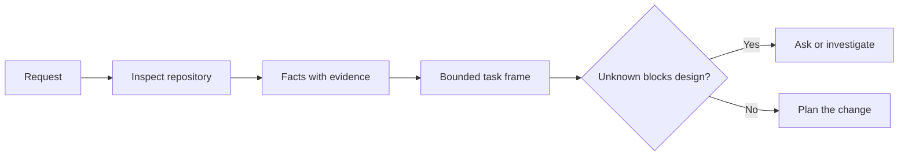

# 에이전트가 코드를 쓰기 전에 과제를 규정하라 (Frame the Task Before the Agent Writes Code)

> 코딩 에이전트는 분명한 과제를 빠르게 구현한다. 그런데 불분명한 과제도 똑같이 빠르게 구현한다. 속도는 같지만 치르는 대가는 다르다.

**Type:** Learn + Build
**Languages:** Python (stdlib)
**Prerequisites:** Phase 14 lessons 31 and 36
**Time:** ~60 minutes

## 학습 목표 (Learning Objectives)

- 요청을 코드 수정에 들어가기 전에 경계가 정해진 과제 규정으로 바꾼다.
- 저장소에서 확인한 사실과 추측, 아직 답이 없는 질문을 구분한다.
- 건드려도 되는 경로와 건드리면 안 되는 경로, 그리고 완료를 증명할 근거를 정한다.
- 사전 조사를 어디까지 했을 때 작업을 시작해도 되는지 판단한다.

## 값비싼 실패 (The Expensive Failure)

"중복 이메일을 막아 달라"는 말은 구체적으로 들린다. 그러나 구체적이지 않다. 유일성 검사를 API에서 할 것인가, 도메인 서비스에서 할 것인가, 데이터베이스에서 할 것인가? 대소문자를 구분해서 비교하는가? 이미 공개되어 있는 오류 형식은 무엇인가? 마이그레이션을 해도 되는가? 어떤 테스트가 그 동작을 증명하는가?

역량 있는 에이전트는 그 빈칸을 그럴듯한 선택으로 채운다. 바로 그래서 위험하다. 구현이 깔끔하고 테스트까지 붙어 있으면서도 시스템과 맞지 않을 수 있기 때문이다.

그러므로 코딩 에이전트가 수행하는 작업의 첫 단위는 코드 수정이 아니다. 저장소에서 확인한 근거로 뒷받침된 과제 규정이다.

## 과제 규정 (The Task Frame)

쓸모 있는 규정에는 여섯 개의 항목이 있다.

| 항목 | 물어야 할 것 |
|---|---|
| 목표 | 겉으로 드러나는 어떤 동작이 바뀌어야 하는가? |
| 저장소에서 확인한 사실 | 코드와 테스트, 설정, 이력에서 무엇을 직접 확인했는가? |
| 허용 경로 | 변경이 어디에 들어가도 되는가? |
| 금지 경로 | 무엇을 그대로 두어야 하는가? |
| 완료 증거 | 어떤 명령이나 관찰이 목표 달성을 증명하는가? |
| 미해결 사항 | 어떤 결정에 아직 근거나 사람의 판단이 필요한가? |

사실에는 영수증이 있어야 한다. "이 API는 중복에 409를 쓴다"는 말은, 기존 테스트나 핸들러를 짚어 보일 수 있을 때까지는 사실이 아니다. 파일 경로와 줄 번호면 충분하다. 동작 자체가 중요한 경우라면 명령 실행 결과가 더 낫다.



## 사전 조사는 제약을 찾는 일이다 (Reconnaissance Is a Search for Constraints)

저장소 전체를 읽지 마라. 이번 변경을 제약하는 지점만 찾아라.

1. 현재 동작과 그것을 호출하는 쪽.
2. 가장 가까운 기존 테스트.
3. 공개된 계약이나 직렬화 형식.
4. 그 경로를 규율하는 프로젝트 지침.
5. 빌드 명령과 검증 명령.
6. 비슷하게 끝난 변경 이력. 그 저장소의 관행이 드러난다.

계획한 모든 결정이 근거로 뒷받침되거나, 명시적으로 위임되었거나, 미해결 사항으로 적혀 있다면 거기에서 멈춰라. 그 지점을 지나서까지 계속 읽는 것은 대체로 착수를 미루는 행동이다.

## 미해결 사항은 실패가 아니다 (Unknowns Are Not Failures)

미해결 사항은 통제되고 있는 빈칸이다. 추측은 그 빈칸에 통제 없이 채워 넣은 답이다.

미해결 사항은 다음처럼 분류하라.

- **확인 가능:** 저장소나 실행 중인 시스템이 답해 줄 수 있다.
- **결정 가능:** 과제 계약이 에이전트에게 고를 권한을 이미 주었다.
- **사람 판단:** 그 선택이 제품 동작이나 비용, 위험, 공개 호환성을 바꾼다.
- **보류:** 그 선택은 이번 범위 밖이며 비목표에 적어 두어야 한다.

에이전트는 확인 가능한 사항과 위임받은 사항은 그대로 진행해도 된다. 다만 사람 판단이 필요한 사항은 그 선택이 코드 속에 묻히기 전에 멈춰서 물어야 한다.

## 구현보다 완료 조건이 먼저다 (Acceptance Before Implementation)

패치를 쓰기 전에 증명 방법을 먼저 써라. 증명은 다음 가운데 하나일 수 있다.

- 범위를 좁힌 단위 테스트나 통합 테스트 명령.
- 화면 크기와 기대 상태를 명시한 브라우저 시나리오.
- 실제로 주고받는 요청과 정확한 응답 계약.
- 기준값이 붙은 성능 측정.
- 관련 없는 파일이 바뀌지 않았음을 확인하는 범위 검사.

"테스트가 통과한다"는 말은 증명 계획이 아니다. 어떤 테스트가 기준이 되는지, 그리고 그 테스트가 무엇을 뒷받침하는지 이름을 대라.

## 직접 만들기 (Build It)

실습에서는 `TaskFrame`을 만들고, 그 경계와 근거를 검증하고, `outputs/task-frame.md`를 쓴다.

이 레슨 디렉터리에서 실행한다.

```bash
python3 code/main.py
python3 -m unittest discover code/tests -v
```

예제를 네 가지 방식으로 망가뜨려 보라. 목표를 지우고, 사실의 영수증을 지우고, 허용 경로와 금지 경로가 겹치게 하고, 완료 증거 명령을 지워 보라. 검증기는 각각 다른 이유로 그 규정을 물리쳐야 한다.

## 실제 저장소에서 써 보기 (Use It in a Real Repository)

에이전트에게 수정을 맡기기 전에 다음을 하라.

1. 목표를 파일 변경이 아니라 동작으로 적어라.
2. 정확한 근거와 함께 사실을 두세 개 기록하라.
3. 허용 경로를 가장 좁게 잡아 이름을 대라.
4. 건드리면 안 되는 영역을 명시적으로 적어라.
5. 과제를 끝맺는 명령이나 관찰을 적어라.
6. 아직 근거를 얻지 못한 결정을 나열하라.

규정은 화면 하나에 들어와야 한다. 들어오지 않는다면, 그 과제에는 각각 따로 검증할 수 있는 여러 변경이 섞여 있을 가능성이 크다.

## 연습 문제 (Exercises)

1. 자기 저장소에 있는 실제 결함 하나를, 해결책을 제안하지 않고 규정만 하라.
2. 그 규정에서 사실인 척하지만 실제로는 추측인 문장 하나를 찾아라. 그것을 근거로 바꿔라.
3. 답에 따라 공개 계약이 바뀌는, 사람 판단이 필요한 미해결 사항을 하나 추가하라.
4. 넓게 잡은 허용 경로 하나를 가장 좁고 안전한 집합으로 쪼개라.
5. 완료 증거에 범위 검사 결과를 추가하라.

## 더 읽을거리 (Further Reading)

- [Nuseibeh and Easterbrook, Requirements Engineering: A Roadmap](https://www.cs.toronto.edu/~sme/papers/2000/ICSE2000.pdf). 구현을 현실의 목표와 변해 가는 제약에 붙들어 매는 방법을 다룬다.
- [Yang et al., SWE-agent: Agent-Computer Interfaces Enable Automated Software Engineering](https://arxiv.org/abs/2405.15793). 코딩 에이전트를 둘러싼 인터페이스가 그 성능을 바꾼다는 근거를 제시한다.

## 남겨 둘 것 (What You Keep)

`outputs/task-frame.md`를 남겨 두라. 다음 레슨의 입력이 되며, 거기에서 이 규정이 근거로 뒷받침되는 실행 계획으로 바뀐다.
