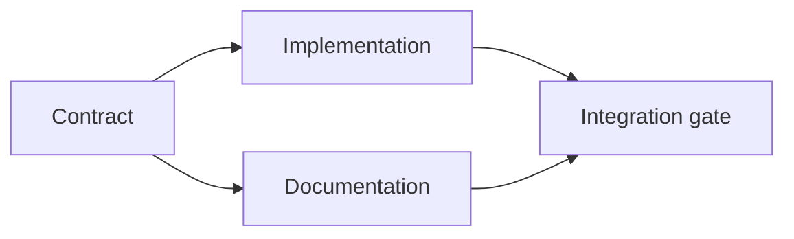

# 근거로 뒷받침되는 실행 계획을 세워라 (Build an Evidence-Backed Execution Plan)

> 계획은 더 예쁘게 꾸민 할 일 목록이 아니다. 모든 변경에 이유가 있고 모든 마지막 노드에 증명이 붙은 의존 관계 그래프다.

**Type:** Learn + Build
**Languages:** Python (stdlib)
**Prerequisites:** Phase 14 lesson 43
**Time:** ~65 minutes

## 학습 목표 (Learning Objectives)

- 과제 규정을, 근거와 증명이 붙은 작업 항목으로 옮긴다.
- 순서를 문장으로 늘어놓는 대신 의존 관계로 나타낸다.
- 코드를 고치기 전에 빠진 사실과 존재하지 않는 의존 대상, 순환 참조를 잡아낸다.
- 함께 진행해도 되는 단계와 기다려야 하는 단계를 구분한다.

## 에이전트의 계획이 실패하는 이유 (Why Agent Plans Fail)

허술한 계획은 요청을 미래 시제로 되풀이할 뿐이다.

1. API를 고친다.
2. 테스트를 추가한다.
3. 문서를 갱신한다.

이 목록에는 무엇을 확인했는지, 왜 그 파일이 맞는지, 어떤 계약을 먼저 바꿔야 하는지, 무엇을 동시에 진행해도 되는지가 하나도 없다. 에이전트가 이 단계를 모두 따르고도 일을 다시 하게 될 수 있다.

좋은 계획은 작업 항목마다 다섯 가지를 약속한다.

| 약속 | 목적 |
|---|---|
| 식별자 | 의존 관계를 가리키고 작업을 인계할 때 쓰는 안정된 참조 |
| 변경 | 가장 작은 단위의 동작 변경이나 계약 변경 |
| 근거 | 그 변경을 정당화하는, 저장소에서 확인한 사실 |
| 의존 관계 | 먼저 성립해야 하는 작업 |
| 증명 | 그 항목을 끝맺는 정확한 검사 |

## 구현보다 계약을 먼저 계획하라 (Plan the Contract Before Its Implementations)

여러 지점이 같은 동작에 기대고 있다면, 그 동작을 먼저 정의하라. 그러면 테스트와 구현, 문서, 통합이 계약 하나를 함께 쓰게 된다. 그렇지 않으면 각자 네 가지 판본을 지어내게 된다.



그래프는 안전하게 동시에 진행할 수 있는 구간을 드러낸다. 계약이 확정되고 나면 구현과 문서는 함께 진행해도 된다. 통합은 그 둘을 기다린다.

## 근거는 계획을 바꾼다 (Evidence Changes the Plan)

저장소에서 확인한 근거는 장식이 아니다. 그것은 작업 내용을 실제로 바꿀 수 있어야 한다.

- 이미 있는 보조 함수 하나 때문에 새로 만들려던 추상화가 필요 없어진다.
- 호환성 테스트 하나 때문에 마이그레이션 단계가 반드시 들어간다.
- 배포 제약 하나 때문에 스키마 변경이 다른 과제로 옮겨 간다.
- 공개된 응답 타입 때문에 구현과 문서의 순서가 뒤바뀐다.

어떤 근거가 계획을 바꿀 수 없다면, 그것은 그 결정에 대한 근거가 아닐 가능성이 크다.

## 중단될 것을 전제로 설계하라 (Design for Interruption)

코딩 에이전트의 세션은 예고 없이 끝난다. 이어서 할 수 있는 계획이라면, 작업 항목이 충분히 작아서 다음 세션이 다음을 판단할 수 있어야 한다.

- 어떤 항목이 끝났는지.
- 어떤 증명이 실제로 실행되었는지.
- 어떤 산출물이 바뀌었는지.
- 어떤 의존 관계가 이제 풀렸는지.
- 다음에 안전하게 할 수 있는 항목이 무엇인지.

상태를 대화 안의 체크박스에만 담아 두지 마라. 계획은 작업 결과 옆에 저장하라.

## 계획 검증 (Plan Validation)

다음에 해당하면 실행하기 전에 계획을 물리쳐라.

- 식별자가 중복된다.
- 근거가 없는 작업 항목이 있다.
- 증명이 없는 작업 항목이 있다.
- 존재하지 않는 항목을 의존 대상으로 가리킨다.
- 그래프에 순환이 있다.
- 관련된 불확실성이 해소되기 전에 되돌릴 수 없는 행동이 먼저 일어난다.

앞의 다섯 가지는 기계적으로 확인할 수 있다. 마지막 한 가지는 판단이 필요하므로 명시적으로 짚고 넘어가야 한다.

## 직접 만들기 (Build It)

`code/main.py`는 작업 항목을 모델링하고, 각 항목의 근거를 검증하고, 위상 정렬로 실행 단계를 계산하고, `outputs/evidence-plan.json`을 쓴다.

다음을 실행한다.

```bash
python3 code/main.py
python3 -m unittest discover code/tests -v
```

예제는 세 단계를 만들어 낸다. 계약 정의가 먼저 실행된다. 구현과 문서는 함께 실행된다. 통합 관문이 마지막에 실행된다.

## 코딩 에이전트와 함께 써 보기 (Use It with a Coding Agent)

파일을 고치기 전에 에이전트에게 계획을 먼저 내놓게 하라. 그리고 계획을 다음 세 가지 기준으로 검토하라.

1. 경로와 동작에 대한 모든 주장에 저장소의 영수증이 붙어 있는가.
2. 항목마다 완료를 판정하는 증명이 하나씩 분명히 있는가.
3. 비용이 크거나 되돌릴 수 없는 작업을, 그것이 기대고 있는 불확실성이 풀릴 때까지 뒤로 미루고 있는가.

조심하겠다는 막연한 약속이 아니라 계획 자체를 승인하라.

## 연습 문제 (Exercises)

1. 사람의 명시적인 승인이 필요한 마이그레이션 항목을 추가하라.
2. 순환을 하나 만들고, 그 뒤에 숨어 있는 제품상의 의견 충돌이 무엇인지 설명하라.
3. 증명 명령이 두 개인 항목 하나를 쪼개라.
4. 기존의 두 갈래 어느 쪽도 건드리지 않으면서 두 번째 단계에서 실행할 수 있는 작업 항목을 추가하라.
5. JSON을 정본으로 유지한 채, 계획을 Markdown으로도 출력하라.

## 더 읽을거리 (Further Reading)

- [Nuseibeh and Easterbrook, Requirements Engineering: A Roadmap](https://www.cs.toronto.edu/~sme/papers/2000/ICSE2000.pdf). 목표와 명세, 합의, 변화가 서로 되먹임하는 관계를 다룬다.
- [Barry Boehm, A Spiral Model of Software Development and Enhancement](https://dl.acm.org/doi/10.1145/12944.12948). 정해진 직선 순서가 아니라 위험을 해소하는 순서로 개발을 배치하는 방법을 다룬다.

## 남겨 둘 것 (What You Keep)

`outputs/evidence-plan.json`을 남겨 두라. 다음 레슨에서 위임 계약이 된다.
