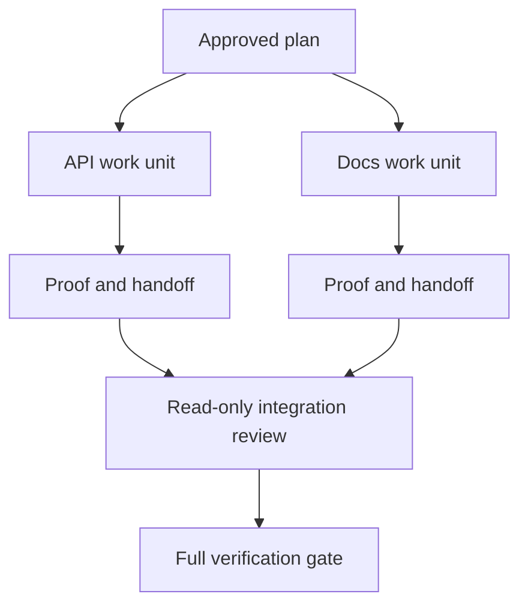

# 격리와 병합 계약을 갖춘 채로 에이전트에게 위임하라 (Delegate Agent Work with Isolation and Merge Contracts)

> 에이전트를 여럿 돌려 시간을 아낄 수 있는 경우는 작업이 실제로 서로 독립일 때뿐이다. 그렇지 않으면 분명하던 과제 하나가, 실패가 더 잦은 조율 문제로 바뀐다.

**Type:** Learn + Build
**Languages:** Python (stdlib)
**Prerequisites:** Phase 14 lessons 39 and 44
**Time:** ~70 minutes

## 학습 목표 (Learning Objectives)

- 위임이 실제 독립성으로 정당화되는지 판단한다.
- 작업자마다 파일 소유권을 배타적으로 주고 증명 방법을 명시한다.
- 의존 관계에서 실행 단계를 계산한다.
- 에이전트들의 작업을 안전하게 합치는 병합 계약을 설계한다.

## 병렬 처리 판단 기준 (The Parallelism Test)

에이전트를 더 쓸 수 있다는 이유만으로 위임하지 마라. 다음 가운데 적어도 하나가 성립할 때 위임하라.

- 서로 다른 미해결 사항을 각각 독립적으로 조사할 수 있다.
- 두 구현이 겹치지 않는 파일과 계약을 소유한다.
- 검토자가 완성된 산출물을 고치지 않고 살펴볼 수 있다.
- 느린 외부 검사가 도는 동안 로컬 작업을 계속할 수 있다.

에이전트들이 같은 파일이나 아직 정하지 않은 같은 결정, 같은 가변 환경을 필요로 한다면 작업을 순차로 두라.

## 작업 단위는 계약이다 (A Work Unit Is a Contract)

위임하는 단위마다 다음이 필요하다.

| 항목 | 뜻 |
|---|---|
| 목표 | 겉으로 확인할 수 있는 결과 하나 |
| 소유자 | 책임지는 작업자 한 명 |
| 경로 | 배타적인 쓰기 소유권 |
| 의존 관계 | 시작하기 전에 끝나 있어야 하는 단위 |
| 증명 | 통합 담당자에게 돌려주는 정확한 근거 |
| 인계 내용 | 바뀐 파일, 내린 결정, 남은 위험 |

"백엔드를 맡아 달라"는 말은 작업 단위가 아니다. "`app/accounts.py`에 중복 검사를 구현하고, 범위를 좁힌 계정 테스트로 그것을 증명하라"가 작업 단위다.

## 격리에는 세 계층이 있다 (Isolation Has Three Layers)

1. **파일 시스템 격리:** 워크트리나 샌드박스를 따로 두어, 같은 파일을 실수로 함께 고치는 일을 막는다.
2. **소유권 격리:** 계약을 두어, 두 작업자가 같은 경로를 의도적으로 고치는 일을 막는다.
3. **상태 격리:** 로그와 출력을 따로 두어, 한 작업자가 다른 작업자의 근거를 덮어쓰는 일을 막는다.

파일 시스템 격리가 소유권 문제까지 풀어 주지는 않는다. 깨끗한 워크트리 두 개에서도 서로 충돌하는 설계가 나올 수 있다. 그래서 공유되는 인터페이스는 작업을 시작하기 전에 병합 계약으로 정리해 두어야 한다.



## 통합 담당자는 작업을 다시 만들지 않는다 (The Integrator Does Not Rebuild the Work)

통합 담당자가 할 일은 다음과 같다.

1. 인계 내용이 각자에게 배정된 범위와 맞는지 확인한다.
2. 작업자의 요약만 읽지 말고 증명의 실제 출력을 읽는다.
3. 의존 관계 순서대로 변경을 합친다.
4. 단위를 가로지르는 전체 검증 관문을 돌린다.
5. 몰래 넓어진 범위는 물리친다.
6. 충돌은 조용히 고치지 말고 새로운 결정 사항으로 기록한다.

통합하면서 한 작업자의 결과를 대부분 다시 써야 한다면, 애초에 작업을 잘못 쪼갠 것이다.

## 사람과 에이전트의 역할 (Human and Agent Roles)

위임한다고 해서 사람의 판단이 사라지지는 않는다. 공개된 동작이나 위험, 권한, 되돌릴 수 없는 비용을 바꾸는 선택은 여전히 사람의 몫이다. 에이전트는 범위가 정해진 조사와 구현, 검증, 검토를 맡을 수 있다.

이것이 눈금이 매겨진 자율성이다. 근거가 탄탄하고 되돌리기 쉬운 곳에서는 자유를 넓게 주고, 결과가 무거운 곳에서는 검문 지점을 요구한다.

## 직접 만들기 (Build It)

실습에서는 경로가 겹치는지 검사하고, 의존 관계를 검증하고, 안전한 실행 단계를 계산하고, `outputs/delegation-plan.json`을 쓴다.

다음을 실행한다.

```bash
python3 code/main.py
python3 -m unittest discover code/tests -v
```

문서 작업 단위가 `app/`을 소유하도록 바꿔 보라. 그 상위 경로가 API 작업 단위와 겹치므로 계획이 막혀야 한다.

## 연습 문제 (Exercises)

1. 실제 변경 하나를 서로 독립인 작업 단위 두 개와 통합 담당자 한 명으로 쪼개라.
2. 겉으로만 독립처럼 보이는 병렬 분할 제안을 하나 찾아라. 그리고 그 둘이 공유하는 결정이 무엇인지 밝혀라.
3. 읽기만 하는 조사 담당 작업자를 추가하고, 그 결과물을 사실 표로 내놓게 하라.
4. 최종적으로 바뀐 파일 목록을 모든 작업 단위 계약과 대조하는 병합 관문을 추가하라.
5. 의존 대상이 무효가 된 작업자를 중단시키는 규칙을 정의하라.

## 더 읽을거리 (Further Reading)

- [Reid Smith, The Contract Net Protocol](https://doi.org/10.1109/TC.1980.1675516). 분산된 작업 배정과 결과 보고를 형식을 갖춰 다룬 초기 연구다.
- [Eric Horvitz, Principles of Mixed-Initiative User Interfaces](https://dl.acm.org/doi/10.1145/302979.303030). 자동화가 스스로 행동해야 할 때와 사람에게 통제를 돌려주어야 할 때를 가르는 기준을 다룬다.

## 남겨 둘 것 (What You Keep)

`outputs/delegation-plan.json`을 남겨 두라. 왜 이 분할이 안전한지, 각 경로를 누가 소유하는지, 통합 단계가 어떤 증명을 받아야 하는지가 거기에 기록된다.
