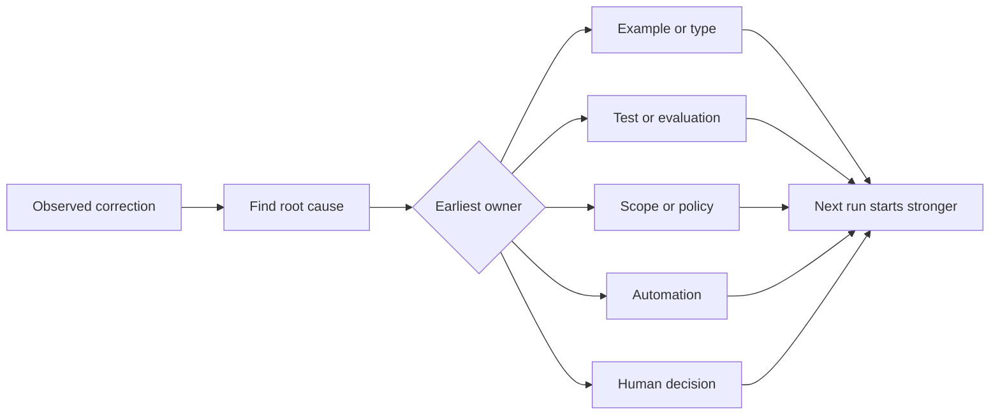

# 에이전트에게 한 모든 교정을 시스템 개선으로 바꿔라 (Turn Every Agent Correction into a System Improvement)

> 대화 안에만 남는 교정은 그 실행 한 번을 고칠 뿐이다. 테스트나 경계, 예시, 도구로 승격된 교정은 이후의 모든 실행을 개선한다.

**Type:** Learn + Build
**Languages:** Python (stdlib)
**Prerequisites:** Phase 14 lessons 37 to 41
**Time:** ~65 minutes

## 학습 목표 (Learning Objectives)

- 에이전트에게 한 교정을 오래 남는 통제 수단으로 바꾼다.
- 재발을 막을 수 있는 가장 이른 계층에 각 통제 수단을 둔다.
- 안정된 지문 값으로 같은 교훈이 중복되지 않게 정리한다.
- 더 이상 실제 위험을 막지 못하는 통제 수단은 걷어낸다.

## 교정은 근거다 (Corrections Are Evidence)

에이전트에게 "그 파일은 고치지 마라"라고 말했다면, 그것은 범위 경계가 실행 가능한 형태로 되어 있지 않았다는 사실을 알게 된 것이다. "이 출력 형식이 틀렸다"라고 말했다면, 예시나 테스트가 빠져 있었다는 사실을 알게 된 것이다. 환경 구성이 또 실패했다면, 환경에 대한 지식이 자동화에 들어가 있어야 한다는 사실을 알게 된 것이다.

교정을 프롬프트를 잘못 썼다는 증거가 아니라, 작업 시스템에 대한 관찰로 다뤄라.

## 효과가 있는 가장 이른 계층으로 승격하라 (Promote to the Earliest Effective Layer)

다음 순서를 따르라.

| 되풀이되는 실패 | 오래 남을 자리 |
|---|---|
| 결과가 틀렸거나 성능이 되돌아감 | 테스트나 평가 |
| 범위를 벗어났거나 위험한 행동 | 범위 정책이나 권한 정책 |
| 환경 구성이나 명령을 거듭 틀림 | 자동화나 도구 |
| 출력 형식을 거듭 틀림 | 정본 예시와 검증기 |
| 그 저장소의 관례가 모호함 | 상황 검사가 붙은 지침 |
| 제품에 대한 의견 충돌 | 사람이 내린 결정 기록 |

앞쪽에 놓인 통제 수단일수록 값이 싸다. 잘못된 상태를 애초에 만들 수 없게 하는 타입이, 나중에 그것을 잡아내는 리뷰 코멘트보다 강하다. 범위를 좁힌 테스트가, 에이전트에게 기억해 달라고 부탁하는 문단보다 강하다.



## 래칫 기록 (The Ratchet Record)

다음을 남겨라.

- 증상.
- 근본 원인.
- 그로 인한 결과.
- 재발 횟수.
- 선택한 통제 수단.
- 그 통제 수단이 동작하는지 확인하는 방법.
- 담당자.
- 다시 검토하거나 걷어낼 날짜.

한 번뿐인 취향까지 전부 승격하지는 마라. 재발 빈도나 결과의 무게가 영구적인 복잡성을 정당화할 때만 승격하라.

## 원인과 증상을 구분하라 (Separate Cause from Symptom)

"에이전트가 README를 고쳤다"는 것은 증상이다. 원인은 다음 가운데 하나일 수 있다.

- 과제가 저장소 최상위 경로를 허용했다.
- 문서는 암묵적으로 안전하다고 여겨졌다.
- 계획이 구현과 문서를 한 덩어리로 묶었다.
- 두 작업자의 소유 범위가 겹쳤다.

원인마다 들어가야 할 통제 수단이 다르다. 증상을 그대로 되풀이하는 규칙은 조금만 다른 다음 사례에서 곧바로 무너진다.

## 통제 수단도 낡는다 (Controls Also Decay)

오래된 통제 수단은 서로 충돌하고, 맥락을 불리고, 이제는 존재하지 않는 시스템을 기술하게 된다. 승격한 규칙마다 걷어낼 시점을 확인하는 절차가 필요하다. 다음에 해당하면 없애거나 다시 써라.

- 바탕이 되는 구조가 바뀌었다.
- 더 강한, 실행 가능한 통제 수단이 그 자리를 대신했다.
- 의미 있는 기간 동안 그 실패가 다시 일어나지 않았다.
- 그 통제 수단이 막아 주는 위험보다 더 큰 불편을 만들어 낸다.

목표는 가장 긴 지침 파일을 갖는 것이 아니다. 어렵게 얻은 판단을 지켜 주는 가장 작은 시스템을 갖는 것이다.

## 직접 만들기 (Build It)

실습에서는 교정을 분류하고, 통제 수단으로 승격하고, 중복을 지문 값으로 묶고, `outputs/feedback-ratchet.json`을 쓴다.

다음을 실행한다.

```bash
python3 code/main.py
python3 -m unittest discover code/tests -v
```

원인은 같은데 표현만 다른 교정 두 개를 추가해 보라. 그리고 관련 없는 실패까지 한데 묶이지는 않으면서 그 둘이 하나의 통제 수단으로 합쳐질 때까지 정규화를 다듬어라.

## 연습 문제 (Exercises)

1. 최근 코딩 세션에서 나온 교정 다섯 개를 골라, 각각 실제로 어느 계층이 맡아야 하는지 분류하라.
2. 문장으로 된 규칙 하나를 실행 가능한 테스트로 바꿔라.
3. 결과의 무게를 반영하는 가중치를 넣어서, 처음 한 번이어도 심각한 경우는 곧바로 승격할 수 있게 하라.
4. 실습 출력에 담당자와 걷어낼 날짜를 추가하라.
5. 기존 에이전트 지침 하나를 검토하되, 더 강한 통제 수단이 있다는 것을 증명한 뒤에만 지워라.

## 더 읽을거리 (Further Reading)

- [Basili, Caldiera, and Rombach, The Goal Question Metric Approach](https://www.cs.toronto.edu/~sme/CSC444F/handouts/GQM-paper.pdf). 목표를 질문으로, 다시 실제로 측정할 수 있는 값으로 옮기는 방법을 다룬다.
- [Shinn et al., Reflexion](https://arxiv.org/abs/2303.11366). 모델 가중치를 바꾸지 않고 피드백 기록만으로 이후 판단을 개선하는 방법을 다룬다.
- [Madaan et al., Self-Refine](https://arxiv.org/abs/2303.17651). 하나의 과제 루프 안에서 피드백과 수정을 되풀이하는 방법을 다룬다.

## 남겨 둘 것 (What You Keep)

`outputs/feedback-ratchet.json`을 남겨 두라. 에이전트 협업 엔지니어링 경로의 마지막 산출물이자, 앞으로 워크벤치를 고칠 때의 입력이 된다.
