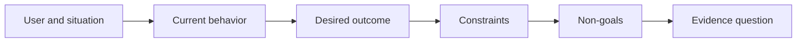

# 산출물을 고르기 전에 성과를 정의하라 (Define the Outcome Before You Choose the Output)

> 구현이 빨라질수록 문제를 잘못 골랐을 때 치르는 대가도 커진다. 그러니 성과부터 다듬어서, 그 속도가 옳은 방향을 가리키게 하라.

**Type:** Learn + Build
**Languages:** Python (stdlib)
**Prerequisites:** None
**Time:** ~60 minutes

## 학습 목표 (Learning Objectives)

- 해결책을 지목하지 않고 성과 규정을 작성한다.
- 사용자와 상황, 현재 동작, 바뀌어야 할 것을 짚어 낸다.
- 제약 조건과 비목표를 명시한다.
- 해결책이 성과 문장에 새어 들어와 범위로 굳기 전에 잡아낸다.

## 산출물은 성과가 아니다 (Output Is Not Outcome)

"장애 대응 어시스턴트를 만들자"는 말은 산출물을 지목한다. 누가 그것을 필요로 하는지, 무엇이 나아지는지, 무엇을 안전하게 지켜야 하는지는 말해 주지 않는다.

성과 규정은 이렇게 말한다.

> 운영 환경에서 경보가 들어오면, 당직 엔지니어가 2분 안에 문제가 생긴 서비스와 안전한 다음 조치를 짚어 낸다. 그동안 진단 과정은 읽기 전용으로 유지되고 감사 기록이 남는다.

이 문장은 소프트웨어로도, 런북으로도, 데이터 정정으로도, 더 작은 인터페이스 변경으로도 충족될 수 있다. 팀을 누군가 처음 떠올린 산출물이 아니라 결과에 붙들어 매 준다.

## 여섯 부분으로 이루어진 규정 (The Six-Part Frame)

| 부분 | 물어야 할 것 |
|---|---|
| 사용자 | 이 문제를 직접 겪는 사람은 누구인가? |
| 상황 | 언제 어디에서 일어나는가? |
| 현재 동작 | 지금은 어떻게 되고 있는가? 우회해서 쓰는 방법까지 포함해서. |
| 바라는 성과 | 겉으로 확인할 수 있는 어떤 상태가 나아져야 하는가? |
| 제약 조건 | 안전이나 정책, 비용, 호환성 가운데 고정된 한계는 무엇인가? |
| 비목표 | 손대고 싶지만 이번에는 제외하는 인접 작업은 무엇인가? |



## 해결책이 새어 든 곳을 찾아라 (Find Solution Leakage)

성과 문장에 근거 없이 제품 형태나 인터페이스, 모델 선택, 프레임워크, 구조가 들어가 있다면 해결책이 새어 든 것이다.

- "사용자가 주간 AI 요약을 받는다"에는 요약이라는 형태와 주간이라는 주기가 새어 들었다.
- "사용자가 승인하기 전에 계정 변경 내용을 이해한다"는 결과를 말한다.
- "벡터 데이터베이스를 배포한다"에는 인프라가 새어 들었다.
- "검토하는 동안 관련 정책 근거를 볼 수 있다"는 역량을 말한다.

호환성 때문에 정말로 기술이 고정되어 있다면 제약 조건에는 기술 이름을 적어도 된다. 다만 왜 고정되어 있는지를 함께 기록하라.

## 제약 조건은 성과를 지킨다 (Constraints Protect the Outcome)

제약 조건은 구현 세부 사항이 아니다. 현실의 목표를 이루는 일부다.

- 진단하는 동안 운영 환경에 쓰기를 하지 않는다.
- 장애 대응 시간 예산 안에 응답한다.
- 기존 감사 이벤트가 계속 정본으로 남는다.
- 새로운 런타임 의존성을 들이지 않는다.
- 접근성 동작이 그대로 유지된다.

제약 조건을 어기면서 성과에 도달했다면, 그것은 성과에 도달한 것이 아니다.

## 비목표가 경계를 만든다 (Non-Goals Create a Boundary)

비목표는 쓸모 있는 작은 조각 하나가 플랫폼으로 부풀어 오르는 것을 막는다. 좋은 비목표는 어떤 작업을 물리칠 수 있을 만큼 구체적이다.

- 자동 복구는 하지 않는다.
- 새로운 경보 라우팅 시스템은 만들지 않는다.
- 장애 대응 지휘자를 대체하지 않는다.
- 이번 조각에서는 과거 데이터 분석을 다루지 않는다.

## 직접 만들기 (Build It)

실습에서는 `OutcomeFrame`을 검증하고 `outputs/outcome-frame.json`을 쓴다.

```bash
python3 code/main.py
python3 -m unittest discover code/tests -v
```

바라는 성과를 "장애 대응 어시스턴트를 쓴다"로 바꿔 보라. 검증기는 제안하려던 산출물이 성과 문장에 새어 들었다고 표시해야 한다.

## 연습 문제 (Exercises)

1. 밀린 목록에 있는 기능 요청 하나를 성과 규정으로 다시 써라.
2. 어떤 해결책이 가능한지를 실제로 바꾸는 제약 조건 하나를 추가하라.
3. 첫 조각을 작게 유지해 주는 비목표 두 개를 추가하라.
4. 바라는 성과가 틀렸음을 가장 먼저 드러낼 관찰이 무엇인지 짚어라.
5. 같은 성과를 충족할 수 있는 서로 다른 산출물 세 가지를 적어라.

## 더 읽을거리 (Further Reading)

- [Nuseibeh and Easterbrook, Requirements Engineering: A Roadmap](https://www.cs.toronto.edu/~sme/papers/2000/ICSE2000.pdf). 현실의 목표를 소프트웨어 작업의 기준점으로 삼는 방법을 다룬다.
- [Dardenne, van Lamsweerde, and Fickas, Goal-Directed Requirements Acquisition](https://doi.org/10.1016/0167-6423(93)90021-G). 높은 수준의 목표를 제약 조건과 실행 가능한 요구 사항으로 다듬어 가는 방법을 다룬다.

## 남겨 둘 것 (What You Keep)

`outputs/outcome-frame.json`을 남겨 두라. 다음 레슨에서 사람들이 실제로 수행하는 업무 흐름과 견주어 검증한다.
