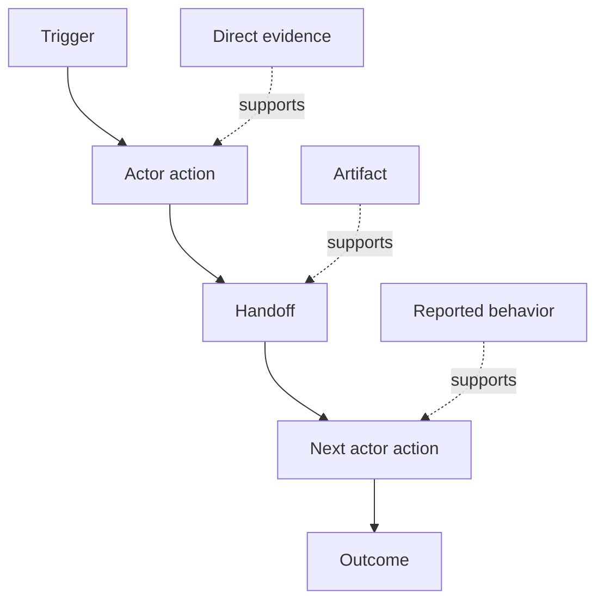

# 사람들이 실제로 수행하는 업무 흐름을 찾아내라 (Discover the Workflow People Actually Perform)

> 요구 사항은 회의실에서 수집되기를 기다리고 있지 않다. 행동과 우회 방법, 기록, 그리고 서로 엇갈리는 의견에 흩어져 있다.

**Type:** Learn + Build
**Languages:** Python (stdlib)
**Prerequisites:** Phase 14 lesson 47
**Time:** ~70 minutes

## 학습 목표 (Learning Objectives)

- 현재 업무 흐름을 근거가 붙은 순서 있는 행동으로 모델링한다.
- 직접 관찰한 것과 전해 들은 것, 추론한 것을 구분한다.
- 마찰과 인계 지점, 권한, 드러나지 않는 상태를 찾아낸다.
- 확실하지 않은 주장을 요구 사항으로 바꾸지 말고 그대로 드러내 둔다.

## 지금의 시스템에서 시작하라 (Start with the Current System)

어떤 기능을 원하는지 묻는 것으로 시작하지 마라. 지금 실제로 무슨 일이 일어나는지 재구성하는 것으로 시작하라.

각 단계마다 다음을 기록하라.

| 항목 | 예 |
|---|---|
| 행위자 | 당직 엔지니어 |
| 촉발 계기 | 운영 환경 경보가 들어온다 |
| 행동 | 경보를 열고, 대시보드를 뒤진다 |
| 입력 | 경보 내용과 배포 기록 |
| 출력 | 후보 서비스와 담당자 |
| 마찰 | 도구 세 개를 오가며 맥락을 갈아탄다 |
| 권한 | 장애 대응 지휘자가 쓰기 작업을 승인한다 |
| 근거 | 화면 녹화, 장애 기록, 런북 |

업무 흐름은 화면 안에만 있지 않다. 기다리는 시간과 복사해서 붙여넣는 동작, 별도의 연락 경로, 승인, 오류 복구, 그리고 사람들이 더 이상 의식하지 않게 된 단계까지 모두 포함한다.

## 근거에는 세기가 있다 (Evidence Has Strength)

단순한 근거 등급을 쓰라.

1. **직접 행동:** 관찰, 트레이스, 녹화, 또는 시스템 이벤트.
2. **산출물:** 티켓, 런북, 로그, 서식, 또는 완성된 결과물.
3. **전해 들은 행동:** 어떤 사람이 자기가 하는 일을 설명한 것.
4. **추론:** 팀이 아마 이럴 것이라고 결론 내린 것.

네 가지 모두 쓸모가 있다. 다만 현재 동작을 직접 증명하는 것은 앞의 두 가지뿐이다. 나머지에는 표시를 붙여서, 확신이 슬며시 부풀지 않게 하라.



## 네 가지를 찾아라 (Search for Four Things)

- **마찰:** 되풀이되는 수고, 지연, 다시 입력하는 일, 복구 작업.
- **드러나지 않는 상태:** 머릿속이나 채팅, 개인 메모에만 담겨 있는 사실.
- **권한:** 결과가 중대한 변경을 할 수 있는 사람이나 시스템.
- **예외:** 평소의 업무 흐름이 더 이상 평소대로 흐르지 않는 경우.

AI 기능은 인계 지점과 예외에서 자주 실패한다. 정상 경로만 다듬어 놓았기 때문이다.

## 엇갈리는 의견을 평균 내지 마라 (Do Not Average Away Disagreement)

두 사용자가 서로 다른 업무 흐름을 따르는 데에는 그럴 만한 이유가 있을 수 있다. 그 차이가 다음 가운데 무엇인지 이해할 때까지는 변형을 그대로 보존하라.

- 역할이 다르다.
- 위험 수준이 다르다.
- 예전 절차와 지금 절차가 섞여 있다.
- 숙련도가 다르다.
- 정책에 대한 실제 의견 충돌이 있다.

평균을 낸 업무 흐름은 아무도 설명하지 못하는 것이 될 수 있다.

## 직접 만들기 (Build It)

실습에서는 업무 흐름의 각 단계에 근거를 붙여 저장하고, 순서와 확신 수준을 검증하고, 직접 근거의 비율을 계산하고, `outputs/workflow-evidence.json`을 쓴다.

```bash
python3 code/main.py
python3 -m unittest discover code/tests -v
```

배포 기록이 없는 예외 경로를 추가해 보라. 본래 순서는 그대로 두고, 어디에서 갈래가 생기는지 기록하라.

## 연습 문제 (Exercises)

1. 아무에게도 묻지 말고 로그만 보고 업무 흐름 하나를 재구성하라.
2. 사용자를 인터뷰한 다음, 아직 직접 근거가 없는 주장에 모두 표시하라.
3. 권한 경계 하나와 실패 복구 단계 하나를 추가하라.
4. 업무 흐름 변형 두 가지를 합치지 말고 그대로 모델링하라.
5. 눈에 보이는 단계 하나를 없애 주지만 보이지 않는 작업은 그대로 남기는 기능 제안을 하나 찾아내라.

## 더 읽을거리 (Further Reading)

- [Nuseibeh and Easterbrook, Requirements Engineering: A Roadmap](https://www.cs.toronto.edu/~sme/papers/2000/ICSE2000.pdf). 특히 요구 사항 도출을 단순한 수집이 아니라 해석과 모델링, 검증으로 다루는 부분을 보라.
- [Gotel and Finkelstein, An Analysis of the Requirements Traceability Problem](https://doi.org/10.1109/ICRE.1994.292398). 요구 사항과 그 출처 사이의 관계를 유지하기가 왜 어려운지를 다룬다.

## 남겨 둘 것 (What You Keep)

`outputs/workflow-evidence.json`을 남겨 두라. 다음 레슨에서 관찰한 마찰과 불확실성을 전제 지도로 바꾼다.
