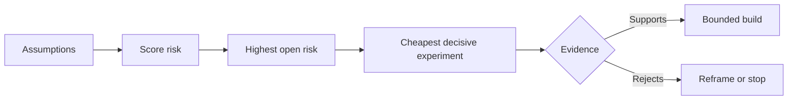

# 전제를 지도로 그리고 가장 위험한 것부터 해소하라 (Map Assumptions and Resolve the Riskiest One First)

> 로드맵은 불확실성을 기능 안에 숨긴다. 전제 지도는 그 기능이 존재할 자격을 갖추려면 무엇이 참이어야 하는지를 드러낸다.

**Type:** Learn + Build
**Languages:** Python (stdlib)
**Prerequisites:** Phase 14 lesson 48
**Time:** ~65 minutes

## 학습 목표 (Learning Objectives)

- 하려는 작업을 명시적인 전제로 바꾼다.
- 영향과 불확실성, 되돌릴 수 없는 정도를 각각 따로 점수 매긴다.
- 다음 실험을 의욕이 아니라 위험을 기준으로 고른다.
- 검증이 끝난 전제를 근거와 결정으로 바꿔 놓는다.

## 모든 구현에는 걸고 있는 판돈이 있다 (Every Build Contains Bets)

장애 대응 도구 하나는 다음이 모두 참이어야만 성립할 수 있다.

- 경보에 담긴 맥락만으로 어떤 서비스인지 짚어 낼 수 있다.
- 엔지니어가 자기 손으로 도출하지 않은 추천을 믿는다.
- 목표로 삼은 응답 시간이 운영에서 실제로 의미가 있다.
- 필요한 데이터를 위험한 권한 없이 가져올 수 있다.
- 그 업무 흐름이 유지 보수 비용을 정당화할 만큼 자주 일어난다.

이것들은 구현 과제가 아니다. 그 구현이 값어치 있고, 쓸 수 있고, 실현 가능하고, 안전하기 위한 조건이다.

## 전제의 갈래 (Assumption Classes)

| 갈래 | 물어야 할 것 |
|---|---|
| 가치 | 그 성과가 충분히 중요한가? |
| 사용성 | 사용자가 그것을 이해하고 행동으로 옮길 수 있는가? |
| 실현 가능성 | 가진 데이터와 제약 안에서 시스템이 그것을 만들어 낼 수 있는가? |
| 존속 가능성 | 조직이 비용과 책임, 운영을 감당할 수 있는가? |
| 안전성 | 실패하더라도 받아들일 수 없는 결과로 이어지지 않는가? |

전제는 반증할 수 있는 문장으로 써라. "이 기능은 쓸모 있다"는 시험할 수 없다. "당직 엔지니어 열 명 가운데 여덟 명이 읽기 전용 결과를 받았을 때 맞는 서비스를 더 빨리 짚어 낸다"는 시험할 수 있다.

## 위험은 하나의 숫자가 아니다 (Risk Is Not One Number)

실습에서는 1에서 5까지의 세 가지 축을 쓴다.

- **영향:** 그 전제가 거짓일 때 생기는 피해.
- **불확실성:** 지금 가진 근거가 얼마나 약한지.
- **되돌릴 수 없는 정도:** 이미 밀어붙인 뒤에 알게 되었을 때 치르는 비용.

예제의 점수는 영향과 불확실성을 곱한 다음 되돌릴 수 없는 정도를 더한다. 이 수식이 어디에나 통하는 것은 아니다. 이 수식의 목적은, 왜 이 미해결 사항을 저것보다 먼저 풀어야 하는지를 팀이 말로 설명하게 만드는 데 있다.



## 확인 의식이 아니라 실험을 설계하라 (Design an Experiment, Not a Confirmation Ritual)

쓸모 있는 시험에는 다음이 있다.

- 거짓일 수도 있는 주장.
- 대상 집단이나 현실적인 표본.
- 겉으로 확인할 수 있는 결과.
- 결과를 보기 전에 정해 둔 기준값.
- 통과와 실패, 그리고 판단이 애매한 경우에 각각 무엇을 할지 정해 둔 다음 결정.

팀이 그 아이디어를 만들 수 있다는 사실만 보여 주는 시험은 피하라.

## 되돌릴 수 있는지가 순서를 바꾼다 (Reversibility Changes Order)

결과가 무겁고 되돌릴 수 없는 선택일수록 근거를 더 일찍 확보해야 한다. 운영 환경에 붙이기 전에 읽기 전용으로 다시 돌려 보는 단계를 둘 수 있다. 데이터 마이그레이션 전에 임시 어댑터를 둘 수 있다. 자동 실행 전에 사람이 승인하는 추천 단계를 둘 수 있다.

구현의 모양은 불확실성의 모양을 따라가야 한다.

## 직접 만들기 (Build It)

실습에서는 전제의 순위를 매기고, 검증이 끝난 주장과 아직 열려 있는 주장을 가르고, 가장 위험한 미해결 전제를 고르고, `outputs/assumption-map.json`을 쓴다.

```bash
python3 code/main.py
python3 -m unittest discover code/tests -v
```

가장 위험한 전제의 근거를 바꿔 보고, 다음 실험이 어떻게 달라지는지 살펴보라.

## 연습 문제 (Exercises)

1. 만들고 싶은 기능에 대해 전제 다섯 개를 써라.
2. 기능 목록에서 빠뜨렸던 안전성 전제 하나를 추가하라.
3. 그 값을 보면 구현을 멈추게 될 기준값을 정하라.
4. 큰 실험 하나를 더 값싸면서도 결론을 내려 주는 시험으로 바꿔라.
5. 위험 순위와 로드맵의 우선순위를 견주어 보고, 왜 어긋나는지 설명하라.

## 더 읽을거리 (Further Reading)

- [Barry Boehm, A Spiral Model of Software Development and Enhancement](https://dl.acm.org/doi/10.1145/12944.12948). 더 깊이 밀어붙이기 전에 불확실성을 먼저 해소하는, 위험 중심의 개발 주기를 다룬다.
- [Dardenne, van Lamsweerde, and Fickas, Goal-Directed Requirements Acquisition](https://doi.org/10.1016/0167-6423(93)90021-G). 목표를 다듬으면서 걸림돌과 제약을 함께 드러내는 방법을 다룬다.

## 남겨 둘 것 (What You Keep)

`outputs/assumption-map.json`을 남겨 두라. 다음 레슨에서 결론을 내려 줄 근거를 만들어 낼 가장 작은 조각을 고르는 데 쓴다.
