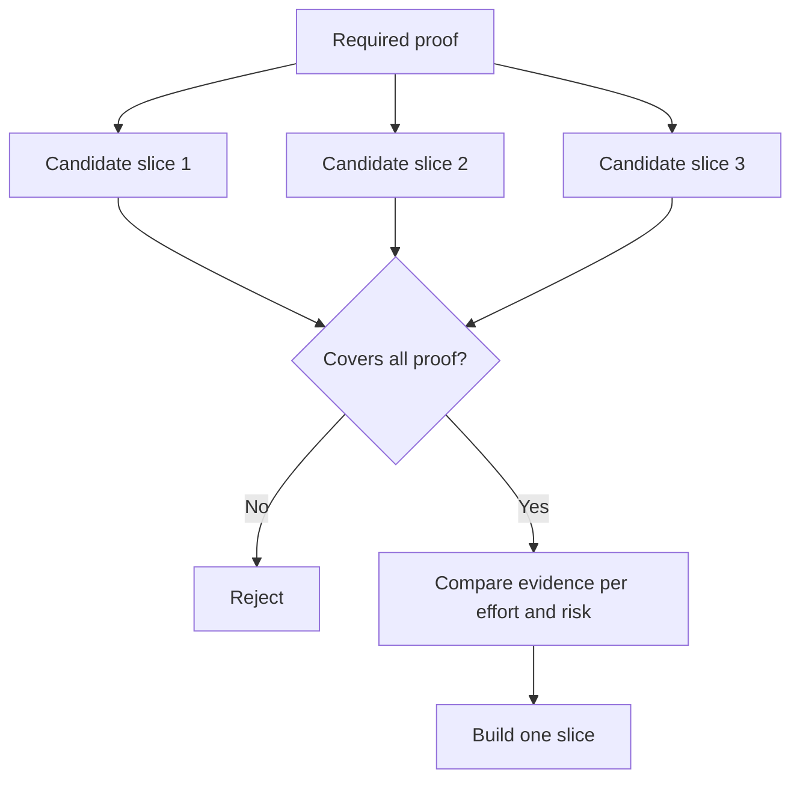

# 결정을 바꿀 수 있는 가장 작은 조각을 골라라 (Choose the Smallest Slice That Can Change the Decision)

> 작다는 것은 중요한 무언가를 증명할 때에만 쓸모가 있다. 다음 결정을 바꾸지 못하는 작은 구현은 그저 덜 만든 것일 뿐이다.

**Type:** Learn + Build
**Languages:** Python (stdlib)
**Prerequisites:** Phase 14 lesson 49
**Time:** ~65 minutes

## 학습 목표 (Learning Objectives)

- 조각을 그것이 증명하는 전제로 정의한다.
- 성과의 값어치와 줄어드는 불확실성, 들어가는 노력, 실패했을 때의 결과를 함께 저울질한다.
- 성급하게 운영 환경에 밀어 넣기보다 되돌릴 수 있는 근거를 먼저 택한다.
- 업무 흐름에서 위험한 부분을 빼 버린 조각은 물리친다.

## 세로로 자른다는 것은 전 구간의 근거를 뜻한다 (Vertical Means Evidence End to End)

쓸모 있는 조각은 성과를 관찰하는 데 필요한 최소한의 실제 업무 흐름을 가로지른다. 사용자 수와 데이터, 기간, 기능 범위는 좁아도 된다. 다만 정작 시험해야 할 불확실성을 빼내면서 좁혀서는 안 된다.

예를 들면 이렇다.

- 실제 장애 열 건을 읽기 전용으로 다시 돌려 보면, 서비스를 짚어 내는 능력과 운영자의 신뢰를 함께 시험할 수 있다.
- 합성 데이터 위에 잘 다듬은 대시보드는 이해도는 시험할 수 있어도 데이터가 실제로 있는지는 시험하지 못한다.
- 운영 환경에서 자동으로 복구하는 기능은 모든 것을 한꺼번에 시험하지만, 그 결과를 받아들일 수 없다.

## 필요한 증명을 먼저 정하라 (Define Required Proof First)

가장 위험하면서 아직 열려 있는 전제들을 골라, 반드시 증명해야 할 집합으로 바꿔라. 후보 조각은 그 집합을 모두 덮을 때에만 자격을 갖는다.

그다음에 자격을 갖춘 조각들을 다음 기준으로 비교하라.

| 기준 | 방향 |
|---|---|
| 성과의 값어치 | 클수록 좋다 |
| 줄어드는 불확실성 | 클수록 좋다 |
| 들어가는 노력 | 적을수록 좋다 |
| 실패했을 때의 결과 | 가벼울수록 좋다 |
| 되돌릴 수 있는 정도 | 클수록 좋다 |

실습의 점수 계산은 일부러 단순하게 두었다. 산술보다 자격 심사 관문이 더 중요하다.



## 흔히 속는 가짜 최소 구현 (Common False Minimums)

- **화면만 만든 최소 구현:** 데이터와 운영에서 오는 불확실성을 걷어내 버린다.
- **인프라만 만든 최소 구현:** 기술적으로 가능하다는 것만 증명하고 사용자 가치는 증명하지 못한다.
- **정상 경로만 만든 최소 구현:** 위험을 가장 많이 만드는 예외를 빼 버린다.
- **데모용 최소 구현:** 설득력 있는 결과물은 나오지만 되풀이해서 잴 수 있는 측정값은 나오지 않는다.
- **플랫폼부터 만든 최소 구현:** 업무 흐름 하나가 아직 그것을 정당화하지도 않았는데 재사용 기반부터 만든다.

## 멈출 규칙을 정해 두라 (Add a Stop Rule)

구현에 들어가기 전에, 이 조각이 실패하면 무엇을 할지 적어 두라.

- 그 성과 자체를 포기한다.
- 대상 사용자나 상황을 바꾼다.
- 다른 방법을 시험한다.
- 더 나은 근거를 모은다.
- 권한을 더 좁힌다.

어떤 결과가 나오든 결론이 "계속 만든다"라면, 그 조각은 실험이 아니다.

## 직접 만들기 (Build It)

실습에서는 후보를 필요한 증명 기준으로 거르고, 자격을 갖춘 조각에 점수를 매기고, `outputs/slice-decision.json`을 쓴다.

```bash
python3 code/main.py
python3 -m unittest discover code/tests -v
```

필요한 전제 가운데 하나만 증명하는, 더 값싼 후보를 추가해 보라. 점수가 높게 나오더라도 자격을 얻지 못해야 한다.

## 연습 문제 (Exercises)

1. 같은 성과에 대해 실패했을 때의 무게가 서로 다른 조각 세 가지를 설계하라.
2. 점수를 매기기 전에 반드시 증명해야 할 집합을 먼저 적어라.
3. 결론을 내려 주는 근거는 지키면서 기능 하나를 덜어 내라.
4. 시험 운영이 실패했을 때 멈출 규칙을 추가하라.
5. 이 조각이 끝난 뒤로 미뤄야 할 재사용 가능한 플랫폼 구성 요소를 하나 짚어 내라.

## 더 읽을거리 (Further Reading)

- [Barry Boehm, A Spiral Model of Software Development and Enhancement](https://dl.acm.org/doi/10.1145/12944.12948). 개발 주기마다 그때 해소해야 할 위험을 맞춰 두는 방법을 다룬다.
- [Lenarduzzi and Taibi, MVP Explained: A Systematic Mapping Study on the Definitions of Minimal Viable Product](https://arxiv.org/abs/1609.07592). 소프트웨어 제품 실무에서 "최소"와 "실행 가능"이라는 말이 얼마나 모호하게 쓰이는지를 다룬다.

## 남겨 둘 것 (What You Keep)

`outputs/slice-decision.json`을 남겨 두라. 왜 이 조각이 결정을 바꿀 수 있는 가장 작은 조각인지가 거기에 기록된다.
