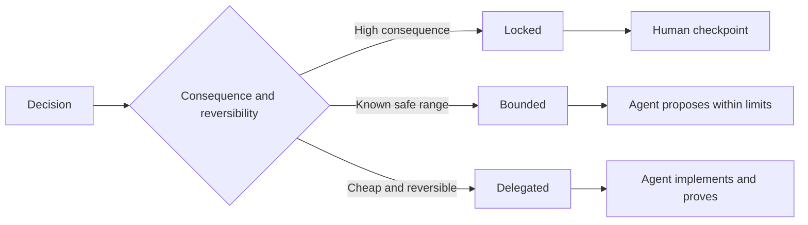

# 판단의 여지를 남기는 명세를 써라 (Write Specifications That Preserve Judgment)

> 쓸모 있는 명세는 불변 조건과 증명 방법을 못 박고, 되돌릴 수 있는 구현 선택은 열어 둔다. 명세는 결정의 경계이지 대본이 아니다.

**Type:** Learn + Build
**Languages:** Python (stdlib)
**Prerequisites:** Phase 14 lesson 50
**Time:** ~75 minutes

## 학습 목표 (Learning Objectives)

- 성과와 불변 조건, 예시, 비목표, 증명을 구분해서 적는다.
- 각 결정을 잠금, 범위 제한, 위임 가운데 하나로 표시한다.
- 선택이 값싸고 되돌릴 수 있는 곳에서는 에이전트의 판단을 남겨 둔다.
- 결과가 무겁거나 공개된 동작이 바뀌는 곳에는 사람의 검문 지점을 둔다.

## 양쪽 극단은 모두 나쁘다 (Two Bad Extremes)

명세가 부족한 과제는 에이전트에게 시스템을 짐작하라고 시키는 것과 같다. 명세가 지나친 과제는 이미 틀렸을 수도 있는 설계를 그대로 받아 적으라고 시키는 것과 같다.

쓸모 있는 중간은 실행 가능한 계약이다.

| 항목 | 목적 |
|---|---|
| 성과 | 겉으로 확인할 수 있는 결과 |
| 불변 조건 | 언제나 참으로 유지되어야 하는 조건 |
| 예시 | 의도를 드러내는 구체적인 사례 |
| 비목표 | 일부러 제외한 인접 동작 |
| 결정 정책 | 어떤 선택이 잠겨 있고, 범위가 정해져 있고, 위임되었는지 |
| 증명 | 완료를 인정하기 전에 필요한 근거 |

## 결정에는 세 가지 모드가 있다 (Three Decision Modes)

- **잠금:** 에이전트가 골라서는 안 된다. 공개 호환성과 권한, 안전, 되돌릴 수 없는 비용, 제품상의 약속에 쓴다.
- **범위 제한:** 에이전트가 명시된 한계 안에서 고를 수 있다. 탐색 예산과 재시도 횟수, 허용되는 의존성, 이미 정해진 인터페이스 계열에 쓴다.
- **위임:** 에이전트가 그 선택을 소유하되 이유를 설명해야 한다. 지역적인 구조와 이름, 되돌릴 수 있는 리팩터링, 구현 세부 사항에 쓴다.



## 동작은 예시로 명세하라 (Specify Behavior Through Examples)

예시는 형용사보다 의도를 훨씬 압축해서 전달한다. "도움이 되는", "견고한", "운영에 쓸 만한" 같은 말은 실행할 수 없다. 정상 사례와 경계 사례, 실패 사례, 금지 사례를 조금씩 모아 두면 만드는 쪽과 검증하는 쪽 모두 붙잡을 것이 생긴다.

예시가 불변 조건을 대신하지는 못한다. 통과한 사례 하나가 보편적인 안전 규칙을 증명해 주지는 않는다.

## 증명은 주장과 층위가 맞아야 한다 (Proof Must Match the Claim)

- 단위 테스트는 함수 하나의 지역적인 계약을 증명한다.
- 실제 요청을 주고받는 테스트는 직렬화와 전송 동작을 증명한다.
- 브라우저 시나리오는 인터페이스 경로를 증명한다.
- 재현 데이터 집합은 대표적인 사례 전반에서의 동작을 증명한다.
- 감사 로그는 권한 경계가 지켜졌음을 증명한다.

아래 층위의 증명을 위층의 주장에 대한 증명으로 받아들이지 마라.

## 미해결 사항을 의도적으로 남겨라 (Preserve Unknowns Deliberately)

명세에 "시간 예산 안에 응답하는 읽기 전용 원본이라면 구현이 무엇을 골라도 된다"라고 쓸 수 있다. 이것은 모호한 것이 아니다. 경계와 증명 방법이 붙은, 의도적으로 위임한 결정이다.

명세는 근거가 달라지면 함께 바뀌어야 한다. 잠금이나 범위 제한을 건 이유를 함께 남겨 두어야, 나중에 다른 사람이 유물을 발굴하듯 뒤지지 않고도 그 결정을 고칠 수 있다.

## 직접 만들기 (Build It)

실습에서는 계약의 모든 항목을 검증하고, 결정 모드를 확인하고, `outputs/executable-specification.json`을 쓴다.

```bash
python3 code/main.py
python3 -m unittest discover code/tests -v
```

운영 환경 쓰기에 대한 결정을 잠금에서 위임으로 옮겨 보라. 스키마는 그 값을 받아들이지만 제품상의 위험은 그것을 허용하지 않는 이유를 설명하라.

## 연습 문제 (Exercises)

1. 밀린 목록의 티켓 하나를 여섯 가지 명세 항목으로 옮겨 써라.
2. 구현 지시 세 개를 불변 조건 하나와 예시 두 개로 바꿔라.
3. 모든 결정에 모드를 표시하고, 잠금과 범위 제한을 건 이유를 각각 밝혀라.
4. 불변 조건마다 증명의 영수증을 붙여라.
5. 근거도 없고 위험 근거도 없는 제약 조건 하나를 걷어내라.

## 더 읽을거리 (Further Reading)

- [Nuseibeh and Easterbrook, Requirements Engineering: A Roadmap](https://www.cs.toronto.edu/~sme/papers/2000/ICSE2000.pdf). 목표와 정확한 명세, 검증, 합의, 변화가 서로 어떻게 맞물리는지를 다룬다.
- [Zave and Jackson, Four Dark Corners of Requirements Engineering](https://doi.org/10.1145/267895.267896). 환경에 대한 전제와 요구 사항, 명세를 구분하는 방법을 다룬다.
- [Gotel and Finkelstein, An Analysis of the Requirements Traceability Problem](https://doi.org/10.1109/ICRE.1994.292398). 어떤 요구 사항이 왜 생겼고 어디에서 왔는지를 보존하는 문제를 다룬다.

## 남겨 둘 것 (What You Keep)

`outputs/executable-specification.json`을 남겨 두라. 코딩 에이전트와 사람 검토자가 함께 보는 계약이 된다.
