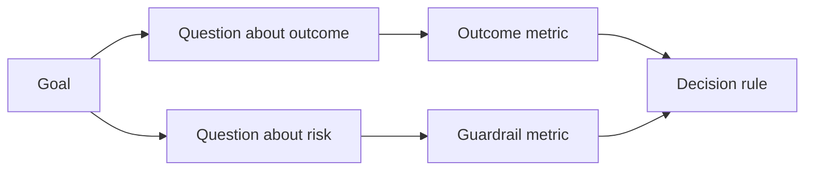

# 결과가 나오기 전에 성공 지표를 설계하라 (Design Success Metrics Before the Result Exists)

> 측정은 대시보드를 장식하는 일이 아니라 결정에 답하는 일이어야 한다. 목표에서 출발해 질문을 끌어내고, 그 질문에 답하는 가장 작은 지표를 골라라.

**Type:** Learn + Build
**Languages:** Python (stdlib)
**Prerequisites:** Phase 14 lessons 47 and 51
**Time:** ~70 minutes

## 학습 목표 (Learning Objectives)

- 성과 목표에서 질문과 지표를 끌어낸다.
- 결과를 보기 전에 기준값과 측정 기간, 데이터 출처, 방향을 정의한다.
- 성과 지표에 보호 지표와 역지표를 함께 둔다.
- 그 구현이 뒷받침해야 하는 결정에 맞춰 평가 근거를 고른다.

## 목표, 질문, 지표 (Goal, Question, Metric)

목표에서 출발한다.

> 안전하지 않은 조치를 늘리지 않으면서, 영향을 받은 서비스를 짚어 내는 시간을 줄인다.

여기에서 질문을 끌어낸다.

- 맞는 서비스를 얼마나 빨리 짚어 내는가?
- 짚어 낸 서비스가 실제로 맞는 경우가 얼마나 되는가?
- 진단 과정이 읽기 전용으로 유지되는가?
- 이 업무 흐름 때문에 경보를 그냥 닫아 버리는 일이나 운영자의 일거리가 늘어나는가?

그다음에 그 질문을 실제로 잴 수 있게 만들어 주는 지표를 고른다.



## 지표에는 계약이 필요하다 (A Metric Needs a Contract)

지표마다 다음이 있어야 한다.

| 항목 | 예 |
|---|---|
| 이름 | `median_identification_seconds` |
| 방향 | 이하 |
| 기준값 | 120 |
| 측정 기간 | 장애 재현 열 건 |
| 출처 | 재현 이벤트 로그 |
| 대상 집단 | 시험 운영에 참여한 당직 엔지니어 |
| 종류 | 성과 지표인지 보호 지표인지 |

출처와 측정 기간이 없으면 그 숫자를 재현할 수 없다. 기준값이 없으면 그 숫자로 결정을 내릴 수 없다.

## 성과 지표, 보호 지표, 역지표 (Outcome, Guardrail, and Counter-Metric)

- **성과 지표:** 바라던 상태가 실제로 나아졌는가?
- **보호 지표:** 고정해 둔 제약이 그대로 지켜졌는가?
- **역지표:** 여기에서 좋아진 대신 비용이나 피해가 다른 곳으로 옮겨 가지는 않았는가?

장애 대응 업무 흐름에서는 속도만으로 부족하다. 정확성과 운영 환경 쓰기 여부, 운영자의 일거리, 놓친 경보를 함께 봐야 빠르지만 안전하지 않은 결과를 걸러 낼 수 있다.

## 오프라인 근거와 실사용 근거 (Offline and Online Evidence)

오프라인 재현은 같은 조건으로 되풀이하고 경계 사례를 두루 덮는 데 좋다. 범위를 제한한 시험 운영은 실제 행동과 신뢰, 업무 흐름에 미치는 영향을 보는 데 좋다. 어느 쪽도 다른 쪽을 대신하지 못한다.

지금의 결정에 답할 수 있는 가장 값싼 근거를 써라. 구현이 다 되었다는 이유만으로 실제 사용자를 노출하지 마라.

## 재기 전에 결정하라 (Decide Before You Measure)

결과를 보기 전에 통과와 실패, 판단이 애매한 경우에 각각 무엇을 할지 적어 두라. 그러지 않으면 팀은 자기가 만든 것을 지키려고 기준값을 옮기게 된다.

예를 들면 이렇다.

- 통과: 맞는 서비스를 짚어 낸 비율이 0.9 이상이고 시간의 중앙값이 120초 이하다.
- 실패: 운영 환경에 쓰기가 한 번이라도 일어났거나, 정답 비율이 0.75 미만이다.
- 애매: 조금 나아졌지만 편차가 커서, 더 큰 재현 집합이 필요하다.

## 직접 만들기 (Build It)

실습에서는 측정 계획을 검증하고, 경계값을 포함하는 기준으로 판정하고, 빠진 값을 기록하고, `outputs/measurement-report.json`을 쓴다.

```bash
python3 code/main.py
python3 -m unittest discover code/tests -v
```

보호 지표를 지워 보라. 성과 지표가 그대로 남아 있는데도 왜 그 계획이 무효가 되는지 살펴보라.

## 연습 문제 (Exercises)

1. 성과 목표 하나에서 질문 세 개를 끌어내라.
2. 비용이 다른 역할에게 떠넘겨지는 것을 잡아내는 역지표를 추가하라.
3. 모든 지표에 출처와 대상 집단, 측정 기간을 정의하라.
4. 값을 만들어 내기 전에 통과와 실패, 애매한 경우의 결정을 먼저 적어라.
5. 모으기는 쉽지만 결정을 바꾸지는 못하는 지표 하나를 짚어 내고, 그것을 걷어내라.

## 더 읽을거리 (Further Reading)

- [Basili, Software Modeling and Measurement: The Goal/Question/Metric Paradigm](https://drum.lib.umd.edu/items/8119803a-362b-42ec-b6ce-2311713e7236). 명시적인 목표에서 실제로 잴 수 있는 값을 끌어내는 방법을 다룬다.
- [Basili, Caldiera, and Rombach, The Goal Question Metric Approach](https://www.cs.toronto.edu/~sme/CSC444F/handouts/GQM-paper.pdf). 이 방법을 피드백과 개선의 체계로 쓰는 방법을 다룬다.

## 남겨 둘 것 (What You Keep)

`outputs/measurement-report.json`을 남겨 두라. 시제품 단계와 시험 운영 단계, 운영 단계로 넘어갈 때의 근거 관문을 정의한다.
