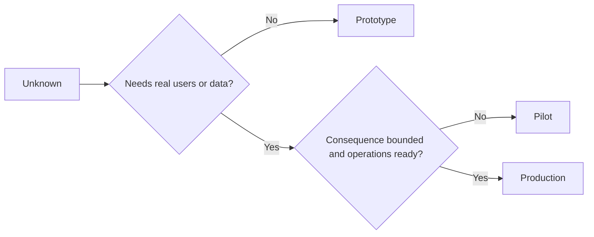

# 시제품, 시험 운영, 운영 가운데 무엇인지 의식적으로 골라라 (Choose Prototype, Pilot, or Production Deliberately)

> 이 셋은 완성도의 단계가 아니라 서로 다른 학습 환경이다. 지금의 미해결 사항에 답하면서 불필요한 결과를 가장 적게 치르는 단계를 골라라.

**Type:** Learn + Build
**Languages:** Python (stdlib)
**Prerequisites:** Phase 14 lessons 50 to 52
**Time:** ~70 minutes

## 학습 목표 (Learning Objectives)

- 미해결 사항과 대상 사용자, 데이터, 결과의 무게, 운영 준비 상태를 보고 단계를 고른다.
- 단계마다 필요한 통제 수단과 빠져나갈 기준을 정의한다.
- 시제품이 슬그머니 운영 시스템이 되는 것을 막는다.
- 근거와 운영 체계가 뒷받침되기 전까지 실제 권한을 주지 않는다.

## 세 단계는 서로 다른 질문에 답한다 (Three Different Questions)

| 단계 | 답하려는 질문 |
|---|---|
| 시제품 | 이 방식으로 그 근거를 만들어 낼 수 있기는 한가? |
| 시험 운영 | 범위를 제한한 실제 사용자와 실제 조건에서 안전하게 동작하는가? |
| 운영 | 약속한 신뢰성과 위험 수준으로 이것을 계속 책임질 수 있는가? |

시제품은 기술적으로 완성되었더라도 버릴 수 있어야 한다. 시험 운영은 운영 데이터를 쓰면서도 대상 사용자와 권한은 제한된 상태를 유지할 수 있다. 운영은 조직이 계속되는 책임을 받아들이는 순간부터 시작된다.

## 시제품 (Prototype)

미해결 사항을 푸는 데 실제 사용자나 실제 데이터가 필요하지 않을 때 시제품을 쓴다. 다음을 지켜라.

- 버릴 수 있게 만든다.
- 다른 것과 격리한다.
- 동작 범위를 좁게 둔다.
- 무엇을 알아내려는지 명시한다.
- 운영에 대한 거짓 보장을 붙이지 않는다.

그 방식이 다음 단계로 갈 자격을 얻기 전에 구조부터 다듬지 마라.

## 시험 운영 (Pilot)

미해결 사항을 푸는 데 실제 행동이나 현실적인 데이터, 실제 업무 흐름이 필요하지만, 결과의 무게나 운영 준비 상태가 아직 전면 공개와 맞지 않을 때 시험 운영을 쓴다.

시험 운영에는 다음이 필요하다.

- 이름을 댈 수 있는 대상 사용자.
- 사람 담당자.
- 제한된 기간과 권한.
- 감사 기록과 되돌리기.
- 성과 지표와 보호 지표의 기준값.
- 확대할지 고칠지 멈출지를 가르는 빠져나갈 기준.

## 운영 (Production)

운영은 배포보다 많은 것을 요구한다.

- 서비스 수준 목표.
- 당직 체계와 장애 대응 책임.
- 보안과 개인정보 검토.
- 비용과 용량 통제.
- 되돌리기와 복구.
- 지속적인 감시.
- 언젠가 걷어낼 경로.



## 단계가 슬그머니 넘어가는 일 (Stage Drift)

시제품 코드는 책임 체계 없이 사용자와 데이터, 권한만 얻게 될 때 위험해진다. 시제품과 시험 운영의 경계를 설정 파일과 접근 통제, 텔레메트리, 문서에 표시하라. 경고 배너 하나로는 부족하다.

지금이 어느 단계인지가 시스템 자체에서 드러나야 한다.

## 직접 만들기 (Build It)

실습에서는 결정 상황을 보고 단계를 고르고, 그 단계에 필요한 통제 수단을 돌려주고, `outputs/stage-decisions.json`을 쓴다.

```bash
python3 code/main.py
python3 -m unittest discover code/tests -v
```

시험 운영 예제를 결과가 가볍고 운영 준비도 끝난 상태로 바꿔 보라. 그리고 운영 단계로 넘어가려면 어떤 근거가 더 있어야 하는지 설명하라.

## 연습 문제 (Exercises)

1. 지금 진행 중인 프로젝트 세 개를, 배포 여부가 아니라 학습 단계로 분류하라.
2. 멈추는 결정까지 담은 시험 운영 종료 기준을 써라.
3. 시제품이 운영 데이터에 닿지 못하게 막는 기술적 통제 수단을 추가하라.
4. 어떤 운영 책임을 지는 순간부터 그 구현이 운영 단계가 되는지 짚어 내라.
5. 범위를 제한한 시험 운영을 위한 되돌리기 확인 절차를 설계하라.

## 더 읽을거리 (Further Reading)

- [Barry Boehm, A Spiral Model of Software Development and Enhancement](https://dl.acm.org/doi/10.1145/12944.12948). 각 반복 주기에서 감수하는 약속을, 그때까지 해소한 위험에 맞추는 방법을 다룬다.
- [Fagerholm et al., Building Blocks for Continuous Experimentation](https://doi.org/10.1145/2601248.2601276). 실험을 계속 돌리기 위해 조직과 기술에 필요한 조건을 다룬다.

## 남겨 둘 것 (What You Keep)

`outputs/stage-decisions.json`을 남겨 두라. 각 단계가 왜 정당한지, 다음 단계로 가기 전에 어떤 통제 수단이 있어야 하는지가 거기에 기록된다.
