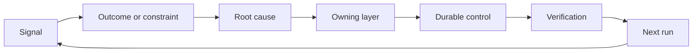

# 책임자와 폐기 조건을 갖춘 피드백 래칫을 만들어라 (Build a Feedback Ratchet with Ownership and Retirement)

> 배포는 구현 루프 하나를 닫고 학습 루프를 연다. 근거가 시스템을 바꾸지 못하면, 그것은 아무도 책임지지 않는 계측값으로 남는다.

**Type:** Learn + Build
**Languages:** Python (stdlib)
**Prerequisites:** Phase 14 lessons 46 and 53
**Time:** ~75 minutes

## 학습 목표 (Learning Objectives)

- 장애와 평가, 사용자 행동, 교정을 담당자가 있는 조치로 바꾼다.
- 각 신호를 맥락, 평가, 정책, 실행 환경, 밀린 목록 가운데 알맞은 곳으로 보낸다.
- 심각도와 빈도를 함께 보고 재발 사항의 우선순위를 매긴다.
- 모든 통제 수단에 걷어낼 조건을 붙인다.

## 피드백은 기반 시설이다 (Feedback Is Infrastructure)

팀은 트레이스와 평가 결과, 지원 티켓, 장애 기록을 잔뜩 모으고도 아무것도 배우지 못할 수 있다. 빠져 있는 장치는 승격이다. 관찰에서 출발해, 담당자와 증명이 붙은 오래 남는 변경까지 이어지는 정해진 경로다.

그 루프는 이렇다.

1. 구체적인 신호를 관찰한다.
2. 그것을 성과나 제약 조건, 전제와 이어 붙인다.
3. 그 원인을 맡아야 할 가장 이른 시스템 계층을 짚어 낸다.
4. 범위가 정해진 변경을 만든다.
5. 재발 가능성이 실제로 줄었는지 확인한다.
6. 그 통제 수단을 계속 둘지 다시 검토한다.

## 맡아야 할 계층으로 보내라 (Route to the Owning Layer)

| 신호 | 보낼 곳 |
|---|---|
| 거짓 양성, 성능 퇴보, 틀린 결과 | 평가나 테스트 |
| 빠진 맥락, 중복된 작업, 낡은 사실 | 맥락 원본이나 검색 경로 |
| 안전하지 않은 행동, 권한의 빈틈 | 정책이나 권한 경계 |
| 타임아웃, 재시도 폭주, 쓸 수 없는 의존 서비스 | 실행 환경 통제 |
| 새로운 제품 요구, 아직 정하지 못한 맞바꿈 | 다듬어 둔 밀린 작업 항목 |

효과가 있는 가장 이른 계층에서 원인을 고쳐라. 테스트나 권한 설정으로 그 실패를 애초에 불가능하게 만들 수 있다면, 프롬프트에 문단을 하나 더 붙이지 마라.



## 책임자도 통제 수단의 일부다 (Ownership Is Part of the Control)

래칫 조치마다 다음이 있어야 한다.

- 담당자 한 명.
- 결과의 무게와 재발 빈도로 정한 우선순위.
- 바꿔야 할 산출물.
- 그 변경을 증명하는 검증 방법.
- 다시 검토하거나 만료되는 기간.
- 걷어낼 조건.

담당자가 없는 개선안은 서식만 잘 갖춘 관찰 기록일 뿐이다.

## 낡은 통제 수단을 걷어내라 (Retire Stale Controls)

피드백 체계에는 정책이 쌓인다. 그 정책은 서로 모순되고 비용을 키울 수 있다. 다음의 경우에 통제 수단을 다시 검토하라.

- 구조나 업무 흐름이 바뀌었다.
- 더 낮은 계층의 불변 조건이 상위 계층의 지침을 대신하게 되었다.
- 정해 둔 기간 동안 그 통제 수단이 막던 실패가 나타나지 않았다.
- 그 통제 수단이 막아 주는 피해보다, 정당한 작업을 가로막는 일이 더 잦다.

걷어낼 때에도 근거가 필요하다. 오래되어 보인다는 이유로 통제 수단을 지우지 마라.

## 제품 피드백과 코딩 에이전트 피드백을 잇는다 (Connect Build and Coding-Agent Feedback)

같은 래칫이 두 갈래를 모두 감당한다.

- 제품에서 나온 근거는 성과 규정과 전제, 조각, 측정 계획을 바꾼다.
- 코딩 에이전트에게 한 교정은 테스트와 맥락, 범위, 자동화, 인계 방식을 바꾼다.
- 장애는 제품의 경계와 에이전트 워크벤치를 함께 바꿀 수 있다.

그래서 구현을 다듬는 일은 코딩을 시작하기 전에 끝나는 단계가 아니다. 받아들이는 변경 하나하나를 거치며 계속 이어진다.

## 직접 만들기 (Build It)

실습에서는 신호를 분류하고, 담당자가 붙은 래칫 조치를 만들고, 우선순위를 매기고, `outputs/feedback-backlog.json`을 쓴다.

```bash
python3 code/main.py
python3 -m unittest discover code/tests -v
```

실행 환경 타임아웃 신호를 추가하고, 그것이 일반 밀린 목록이 아니라 실행 환경으로 보내지는지 확인하라.

## 연습 문제 (Exercises)

1. 장애 하나와 사용자 불만 하나를 각각 래칫 조치로 바꿔라.
2. 각 재발을 막을 수 있는 가장 이른 계층의 이름을 대라.
3. 실습 출력에 검증 명령이나 관찰 항목을 추가하라.
4. 정책 규칙 하나에 걷어낼 조건을 정의하라.
5. 받아들인 교정 하나가 다음 과제 규정으로 어떻게 이어지는지 따라가 보라.

## 더 읽을거리 (Further Reading)

- [Basili, Caldiera, and Rombach, The Goal Question Metric Approach](https://www.cs.toronto.edu/~sme/CSC444F/handouts/GQM-paper.pdf). 목표 중심의 측정을 통해 조직이 배우는 방법을 다룬다.
- [Fagerholm et al., Building Blocks for Continuous Experimentation](https://doi.org/10.1145/2601248.2601276). 근거를 이후의 제품 개발로 잇는 기술적·조직적 루프를 다룬다.
- [Nuseibeh and Easterbrook, Requirements Engineering: A Roadmap](https://www.cs.toronto.edu/~sme/papers/2000/ICSE2000.pdf). 요구 사항을 시스템 수명 주기 내내 변해 가는 것으로 다룬다.

## 남겨 둘 것 (What You Keep)

`outputs/feedback-backlog.json`을 남겨 두라. 제품 판단과 전달 경로의 마지막 산출물이자, 다음 성과 규정의 입력이 된다.
