# 통신 프로토콜 (Communication Protocols)

> 같은 언어를 말할 수 없는 에이전트(agent)들은 팀이 아니다. 그들은 허공에 대고 소리치는 낯선 이들이다.

**Type:** Build
**Languages:** TypeScript
**Prerequisites:** Phase 14 (Agent Engineering), Lesson 16.01 (Why Multi-Agent)
**Time:** ~120분

## 학습 목표 (Learning Objectives)

- 에이전트가 외부 서버가 노출한 도구를 쓸 수 있도록 MCP 도구 발견(discovery)과 호출을 구현하기
- 한 에이전트가 HTTP를 통해 다른 에이전트에게 작업을 위임할 수 있게 하는 A2A 에이전트 카드(agent card)와 작업 엔드포인트를 만들기
- MCP(도구 접근), A2A(에이전트 간), ACP(엔터프라이즈 감사), ANP(탈중앙 신뢰)를 비교하고 어떤 프로토콜이 어떤 문제를 푸는지 설명하기
- 에이전트가 MCP로 도구를 발견하고 A2A로 작업을 위임하는 단일 시스템에서 여러 프로토콜을 함께 엮기

## 문제 (The Problem)

시스템을 여러 에이전트로 쪼갰다고 하자. 연구자, 코더, 리뷰어. 각자의 일에는 뛰어나다. 하지만 이제 이들이 실제로 서로 대화하게 만들어야 한다.

첫 시도는 뻔하다. 문자열을 주고받는다. 연구자가 텍스트 덩어리를 반환하면 코더가 어떻게든 파싱한다. 코더가 연구 요약을 잘못 해석하거나, 두 에이전트가 서로를 기다리며 교착(deadlock)하거나, 서로 다른 팀이 만든 에이전트들이 협업해야 하기 전까지는 동작한다. 그러다 갑자기 "그냥 문자열을 주고받기"가 무너진다.

이것이 통신 프로토콜(communication protocol) 문제다. 에이전트가 정보를 교환하는 방식에 대한 공유 계약이 없으면, 멀티 에이전트(multi-agent) 시스템은 취약하고 감사할 수 없으며, 직접 작성한 소수의 에이전트를 넘어서는 확장이 불가능하다.

AI 생태계는 네 개의 프로토콜로 응답했고, 각각은 문제의 다른 조각을 푼다.

- **MCP** 도구 접근을 위한 것
- **A2A** 에이전트 간 협업을 위한 것
- **ACP** 엔터프라이즈 감사 가능성을 위한 것
- **ANP** 탈중앙 신원과 신뢰를 위한 것

이 레슨은 깊이 들어간다. 각 명세에서 실제 와이어 포맷(wire format)을 읽고, 동작하는 구현을 만들고, 넷 모두를 통합 시스템으로 연결한다.

## 개념 (The Concept)

### 프로토콜 지형 (The Protocol Landscape)

이 네 프로토콜을 각각 다른 질문을 다루는 계층(layer)으로 생각하라.

```mermaid
block-beta
  columns 1
  block:ANP["ANP — How do agents trust strangers?\nDecentralized identity (DID), E2EE, meta-protocol"]
  end
  block:A2A["A2A — How do agents collaborate on goals?\nAgent Cards, task lifecycle, streaming, negotiation"]
  end
  block:ACP["ACP — How do agents talk in auditable systems?\nRuns, trajectory metadata, session continuity"]
  end
  block:MCP["MCP — How does an agent use a tool?\nTool discovery, execution, context sharing"]
  end

  style ANP fill:#f3e8ff,stroke:#7c3aed
  style A2A fill:#dbeafe,stroke:#2563eb
  style ACP fill:#fef3c7,stroke:#d97706
  style MCP fill:#d1fae5,stroke:#059669
```

이들은 경쟁자가 아니다. 서로 다른 수준에서 서로 다른 문제를 푼다.

### MCP (복습)

MCP는 Phase 13에서 깊이 다룬다. 빠른 복습: MCP는 LLM이 외부 도구와 데이터 소스에 연결하는 방식을 표준화한다. 이는 에이전트(클라이언트)가 서버가 노출한 도구를 발견하고 호출하는 **클라이언트-서버** 프로토콜이다.

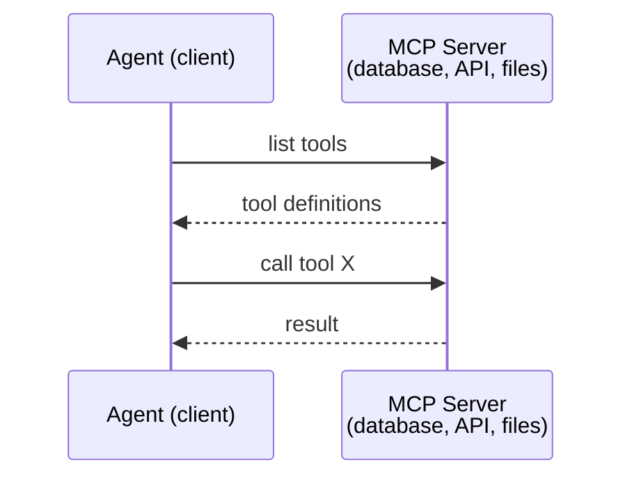

MCP는 **에이전트-도구** 통신이다. 에이전트끼리 대화하는 것을 돕지는 않는다.

### A2A (Agent2Agent Protocol)

**만든 곳:** Google (현재 Linux Foundation 산하 `lf.a2a.v1`)
**명세 버전:** 1.0.0
**문제:** 자율 에이전트들이 어떻게 서로 협업하고, 협상하고, 작업을 위임하는가?

A2A는 **피어 투 피어(peer-to-peer) 에이전트 협업**을 위한 프로토콜이다. MCP가 에이전트를 도구에 연결한다면, A2A는 에이전트를 다른 에이전트에 연결한다. 각 에이전트는 잘 알려진 URL에 **에이전트 카드(Agent Card)**를 게시하고, 다른 에이전트들이 이를 발견해 협상하고 작업을 위임한다.

#### A2A의 동작 방식

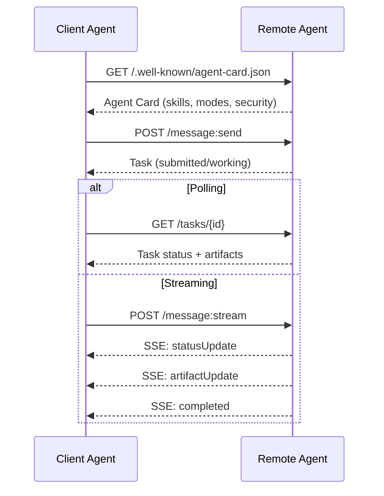

#### 실제 에이전트 카드

이것이 실제 환경에서 A2A 에이전트 카드가 보이는 모습이다. `GET /.well-known/agent-card.json`에서 제공된다.

```json
{
  "name": "Research Agent",
  "description": "Searches documentation and summarizes findings",
  "version": "1.0.0",
  "supportedInterfaces": [
    {
      "url": "https://research-agent.example.com/a2a/v1",
      "protocolBinding": "JSONRPC",
      "protocolVersion": "1.0"
    },
    {
      "url": "https://research-agent.example.com/a2a/rest",
      "protocolBinding": "HTTP+JSON",
      "protocolVersion": "1.0"
    }
  ],
  "provider": {
    "organization": "Your Company",
    "url": "https://example.com"
  },
  "capabilities": {
    "streaming": true,
    "pushNotifications": false
  },
  "defaultInputModes": ["text/plain", "application/json"],
  "defaultOutputModes": ["text/plain", "application/json"],
  "skills": [
    {
      "id": "web-research",
      "name": "Web Research",
      "description": "Searches the web and synthesizes findings",
      "tags": ["research", "search", "summarization"],
      "examples": ["Research the latest changes in React 19"]
    },
    {
      "id": "doc-analysis",
      "name": "Documentation Analysis",
      "description": "Reads and analyzes technical documentation",
      "tags": ["docs", "analysis"],
      "inputModes": ["text/plain", "application/pdf"],
      "outputModes": ["application/json"]
    }
  ],
  "securitySchemes": {
    "bearer": {
      "httpAuthSecurityScheme": {
        "scheme": "Bearer",
        "bearerFormat": "JWT"
      }
    }
  },
  "security": [{ "bearer": [] }]
}
```

주목할 핵심:
- **Skills**는 에이전트가 할 수 있는 일이다. 각각은 ID, 태그, 지원하는 입력/출력 MIME 타입을 갖는다. 클라이언트 에이전트는 이를 보고 이 원격 에이전트가 자신의 요청을 처리할 수 있는지 판단한다.
- **supportedInterfaces**는 여러 프로토콜 바인딩을 나열한다. 단일 에이전트가 JSON-RPC, REST, gRPC를 동시에 말한다.
- **Security**는 카드에 내장되어 있다. 클라이언트는 요청을 한 번 보내기 전에 어떤 인증이 필요한지 안다.

#### 작업 생명주기 (Task Lifecycle)

작업(Task)은 A2A에서 작업의 핵심 단위다. 정의된 상태들을 거쳐 이동한다.

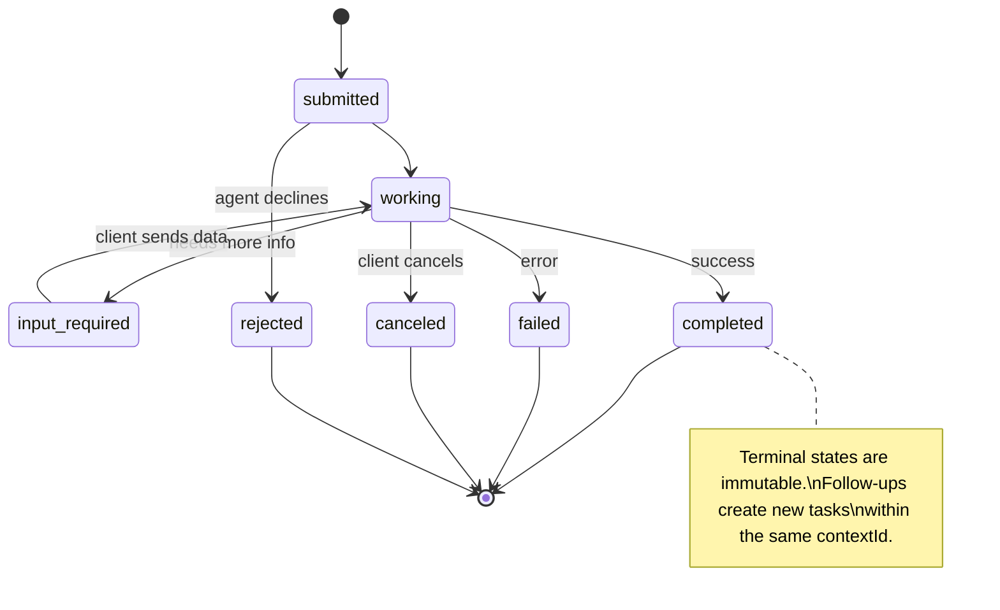

8개 상태 전부 (명세는 센티넬로 `UNSPECIFIED`도 정의하나 여기서는 생략):

| 상태 | 종단(Terminal)? | 의미 |
|---|---|---|
| `TASK_STATE_SUBMITTED` | 아니오 | 접수됨, 아직 처리 안 함 |
| `TASK_STATE_WORKING` | 아니오 | 활발히 처리 중 |
| `TASK_STATE_INPUT_REQUIRED` | 아니오 | 에이전트가 클라이언트로부터 더 많은 정보 필요 |
| `TASK_STATE_AUTH_REQUIRED` | 아니오 | 인증 필요 |
| `TASK_STATE_COMPLETED` | 예 | 성공적으로 완료됨 |
| `TASK_STATE_FAILED` | 예 | 오류로 완료됨 |
| `TASK_STATE_CANCELED` | 예 | 완료 전 취소됨 |
| `TASK_STATE_REJECTED` | 예 | 에이전트가 작업을 거절함 |

작업이 종단 상태에 도달하면, 불변(immutable)이 된다. 더 이상의 메시지는 없다. 후속 작업은 동일한 `contextId` 안에서 새 작업을 만든다.

#### 와이어 포맷 (Wire Format)

A2A는 JSON-RPC 2.0을 사용한다. 실제 메시지 교환이 어떻게 보이는지 보자.

**클라이언트가 작업을 보낸다:**
```json
{
  "jsonrpc": "2.0",
  "id": 1,
  "method": "SendMessage",
  "params": {
    "message": {
      "messageId": "msg-001",
      "role": "ROLE_USER",
      "parts": [{ "text": "Research React 19 compiler features" }]
    },
    "configuration": {
      "acceptedOutputModes": ["text/plain", "application/json"],
      "historyLength": 10
    }
  }
}
```

**에이전트가 작업으로 응답한다:**
```json
{
  "jsonrpc": "2.0",
  "id": 1,
  "result": {
    "task": {
      "id": "task-abc-123",
      "contextId": "ctx-xyz-789",
      "status": {
        "state": "TASK_STATE_COMPLETED",
        "timestamp": "2026-03-27T10:30:00Z"
      },
      "artifacts": [
        {
          "artifactId": "art-001",
          "name": "research-results",
          "parts": [{
            "data": {
              "findings": [
                "React 19 compiler auto-memoizes components",
                "No more manual useMemo/useCallback needed",
                "Compiler runs at build time, not runtime"
              ]
            },
            "mediaType": "application/json"
          }]
        }
      ]
    }
  }
}
```

**SSE를 통한 스트리밍:**
```text
POST /message:stream HTTP/1.1
Content-Type: application/json
A2A-Version: 1.0

data: {"task":{"id":"task-123","status":{"state":"TASK_STATE_WORKING"}}}

data: {"statusUpdate":{"taskId":"task-123","status":{"state":"TASK_STATE_WORKING","message":{"role":"ROLE_AGENT","parts":[{"text":"Searching documentation..."}]}}}}

data: {"artifactUpdate":{"taskId":"task-123","artifact":{"artifactId":"art-1","parts":[{"text":"partial findings..."}]},"append":true,"lastChunk":false}}

data: {"statusUpdate":{"taskId":"task-123","status":{"state":"TASK_STATE_COMPLETED"}}}
```

### ACP (Agent Communication Protocol)

**만든 곳:** IBM / BeeAI
**명세 버전:** 0.2.0 (OpenAPI 3.1.1)
**상태:** Linux Foundation 산하에서 A2A로 통합 중
**문제:** 에이전트들이 어떻게 완전한 감사 가능성, 세션 연속성, 궤적(trajectory) 추적과 함께 통신하는가?

ACP는 **엔터프라이즈 프로토콜**이다. 많은 요약이 주장하는 것과 달리, ACP는 JSON-LD를 사용하지 **않는다**. 이는 OpenAPI로 정의된 단순한 REST/JSON API다. 이를 특별하게 만드는 것은 **TrajectoryMetadata**다: 모든 에이전트 응답은 그것을 생성한 추론 단계와 도구 호출의 상세 로그를 운반할 수 있다.

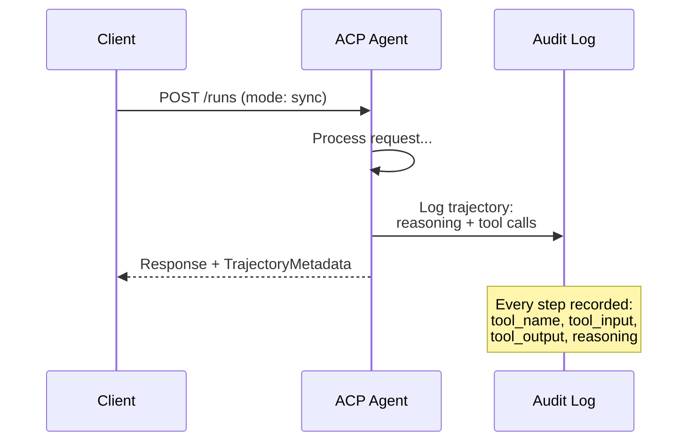

#### ACP에서의 에이전트 발견

ACP는 네 가지 발견 방법을 정의한다.

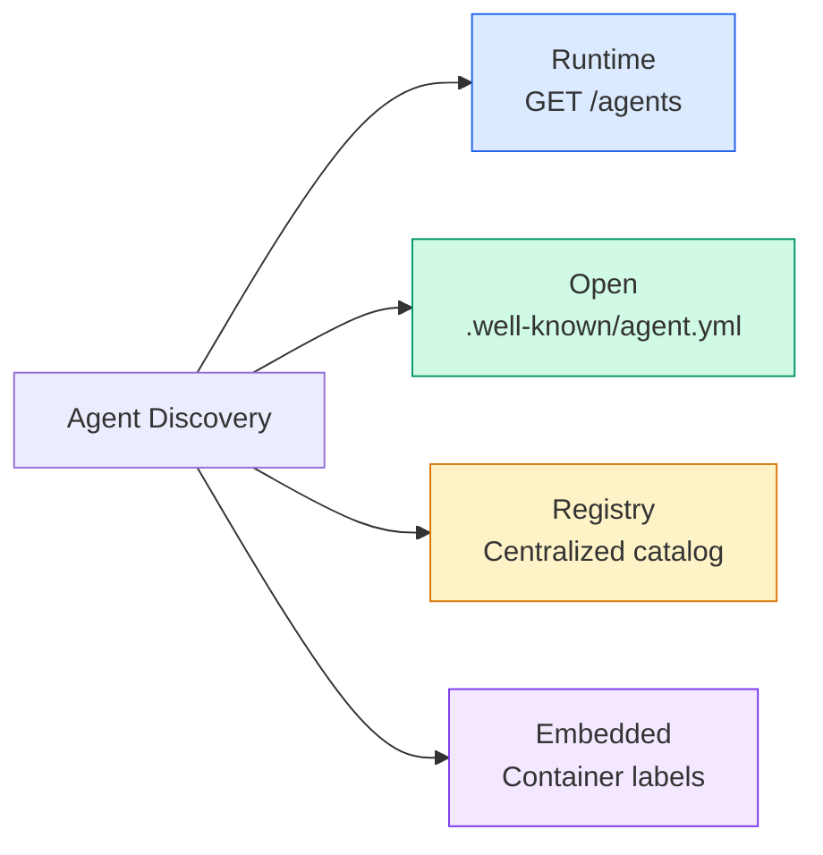

**AgentManifest**는 A2A의 에이전트 카드보다 단순하다.

```json
{
  "name": "summarizer",
  "description": "Summarizes documents with source citations",
  "input_content_types": ["text/plain", "application/pdf"],
  "output_content_types": ["text/plain", "application/json"],
  "metadata": {
    "tags": ["summarization", "RAG"],
    "framework": "BeeAI",
    "capabilities": [
      {
        "name": "Document Summarization",
        "description": "Condenses long documents into key points"
      }
    ],
    "recommended_models": ["llama3.3:70b-instruct-fp16"],
    "license": "Apache-2.0",
    "programming_language": "Python"
  }
}
```

#### 실행 생명주기 (Run Lifecycle)

ACP는 "Task" 대신 "Run"을 사용한다. Run은 세 가지 모드를 가진 에이전트 실행이다.

| 모드 | 동작 |
|---|---|
| `sync` | 블로킹. 응답이 완전한 결과를 담는다. |
| `async` | 즉시 202를 반환. 상태를 위해 `GET /runs/{id}`를 폴링한다. |
| `stream` | SSE 스트림. 에이전트가 작업하는 동안 이벤트가 발생한다. |

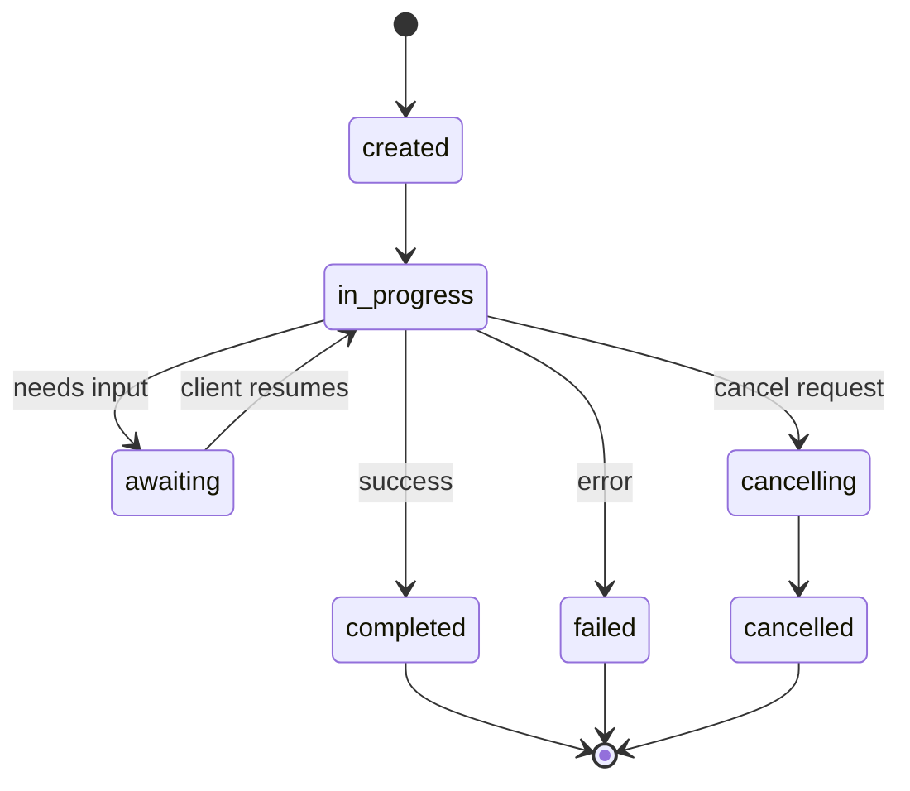

#### TrajectoryMetadata (감사 추적)

이것이 ACP의 핵심 차별점이다. 모든 메시지 파트는 에이전트가 정확히 무엇을 했는지 보여주는 메타데이터를 포함할 수 있다.

```json
{
  "role": "agent/researcher",
  "parts": [
    {
      "content_type": "text/plain",
      "content": "The weather in San Francisco is 72F and sunny.",
      "metadata": {
        "kind": "trajectory",
        "message": "I need to check the weather for this location",
        "tool_name": "weather_api",
        "tool_input": { "location": "San Francisco, CA" },
        "tool_output": { "temperature": 72, "condition": "sunny" }
      }
    }
  ]
}
```

규제 산업에서 이것은 금광이다. 모든 답변에는 증명 가능한 추론 사슬이 따라온다. 어떤 도구가 호출되었고, 어떤 입력이 쓰였고, 어떤 출력을 받았는지가 다 남는다. 블랙박스가 없다.

ACP는 출처 표시를 위한 **CitationMetadata**도 지원한다.

```json
{
  "kind": "citation",
  "start_index": 0,
  "end_index": 47,
  "url": "https://weather.gov/sf",
  "title": "NWS San Francisco Forecast"
}
```

### ANP (Agent Network Protocol)

**만든 곳:** 오픈소스 커뮤니티 (GaoWei Chang이 설립)
**저장소:** [github.com/agent-network-protocol/AgentNetworkProtocol](https://github.com/agent-network-protocol/AgentNetworkProtocol)
**문제:** 서로 다른 조직의 에이전트들이 중앙 권위 없이 어떻게 서로를 신뢰하는가?

ANP는 **탈중앙 신원 프로토콜**이다. W3C 탈중앙 식별자(Decentralized Identifiers, DID)와 종단 간 암호화(end-to-end encryption)로 신뢰를 구축한다. 알려진 엔드포인트로 에이전트를 발견하는 A2A와 달리, ANP는 에이전트가 자신의 신원을 암호학적으로 증명하게 한다.

ANP는 세 계층을 갖는다.

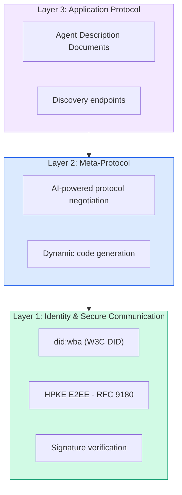

#### DID 문서 (실제 구조)

ANP는 `did:wba`(Web-Based Agent)라는 커스텀 DID 메서드를 사용한다. DID `did:wba:example.com:user:alice`는 `https://example.com/user/alice/did.json`으로 해석된다.

```json
{
  "@context": [
    "https://www.w3.org/ns/did/v1",
    "https://w3id.org/security/suites/jws-2020/v1",
    "https://w3id.org/security/suites/secp256k1-2019/v1"
  ],
  "id": "did:wba:example.com:user:alice",
  "verificationMethod": [
    {
      "id": "did:wba:example.com:user:alice#key-1",
      "type": "EcdsaSecp256k1VerificationKey2019",
      "controller": "did:wba:example.com:user:alice",
      "publicKeyJwk": {
        "crv": "secp256k1",
        "x": "NtngWpJUr-rlNNbs0u-Aa8e16OwSJu6UiFf0Rdo1oJ4",
        "y": "qN1jKupJlFsPFc1UkWinqljv4YE0mq_Ickwnjgasvmo",
        "kty": "EC"
      }
    },
    {
      "id": "did:wba:example.com:user:alice#key-x25519-1",
      "type": "X25519KeyAgreementKey2019",
      "controller": "did:wba:example.com:user:alice",
      "publicKeyMultibase": "z9hFgmPVfmBZwRvFEyniQDBkz9LmV7gDEqytWyGZLmDXE"
    }
  ],
  "authentication": [
    "did:wba:example.com:user:alice#key-1"
  ],
  "keyAgreement": [
    "did:wba:example.com:user:alice#key-x25519-1"
  ],
  "humanAuthorization": [
    "did:wba:example.com:user:alice#key-1"
  ],
  "service": [
    {
      "id": "did:wba:example.com:user:alice#agent-description",
      "type": "AgentDescription",
      "serviceEndpoint": "https://example.com/agents/alice/ad.json"
    }
  ]
}
```

주목할 핵심:
- **키 분리**가 강제된다. 서명 키(secp256k1)는 암호화 키(X25519)와 분리된다.
- **`humanAuthorization`**은 ANP에 고유하다. 이 키들은 쓰기 전에 명시적 인간 승인(생체 인증, 비밀번호, HSM)을 요구한다. 자금 이체 같은 고위험 작업이 이 경로를 거친다.
- **`keyAgreement`** 키는 HPKE 종단 간 암호화(RFC 9180)에 쓰인다.
- **service** 섹션은 Agent Description 문서로 링크된다.

#### ANP에서 신뢰가 동작하는 방식

ANP는 신뢰망(web-of-trust)이나 보증 그래프를 사용하지 **않는다**. 신뢰는 양자 간(bilateral)이며 상호작용마다 검증된다.

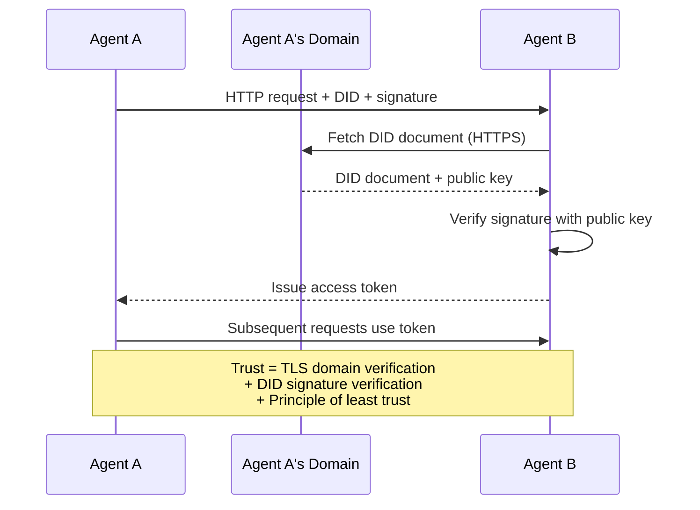

신뢰는 세 출처에서 온다.
1. **도메인 수준 TLS**가 DID 문서 호스트를 검증한다
2. **DID 암호 서명**이 에이전트의 신원을 검증한다
3. **최소 신뢰 원칙(principle of least trust)**이 최소 권한만 부여한다

가십(gossip) 기반 신뢰 전파나 PageRank 점수화는 없다. 각 에이전트를 그 DID를 통해 직접 검증한다.

#### 메타 프로토콜 협상

이것이 ANP의 가장 새로운 기능이다. 서로 다른 생태계의 두 에이전트가 만날 때, 사전에 합의된 데이터 포맷이 필요하지 않다. 자연어로 협상한다.

```json
{
  "action": "protocolNegotiation",
  "sequenceId": 0,
  "candidateProtocols": "I can communicate using:\n1. JSON-RPC with hotel booking schema\n2. REST with OpenAPI 3.1 spec\n3. Natural language over HTTP",
  "modificationSummary": "Initial proposal",
  "status": "negotiating"
}
```

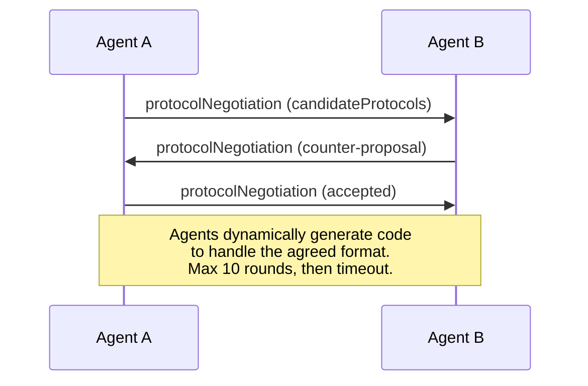

에이전트들은 포맷에 합의할 때까지 오가며(최대 10라운드) 협상하고, 그다음 이를 처리할 코드를 동적으로 생성한다. 상태 값은 `negotiating`, `rejected`, `accepted`, `timeout`이다.

서로를 한 번도 본 적 없는 두 에이전트가, 누구도 공유 스키마를 사전 정의하지 않고도 어떻게 통신할지 알아낸다는 뜻이다.

### 비교 (정정됨)

| | MCP | A2A | ACP | ANP |
|---|---|---|---|---|
| **만든 곳** | Anthropic | Google / Linux Foundation | IBM / BeeAI | 커뮤니티 |
| **명세 형식** | JSON-RPC | JSON-RPC / REST / gRPC | OpenAPI 3.1 (REST) | JSON-RPC |
| **주 용도** | 에이전트 to 도구 | 에이전트 to 에이전트 | 에이전트 to 에이전트 | 에이전트 to 에이전트 |
| **발견** | 도구 목록 | `/.well-known/agent-card.json` | `GET /agents`, `/.well-known/agent.yml` | `/.well-known/agent-descriptions`, DID 서비스 엔드포인트 |
| **신원** | 암묵적(로컬) | 보안 스킴(OAuth, mTLS) | 서버 수준 | W3C DID (`did:wba`) + E2EE |
| **감사 추적** | 해당 없음 | 기본(작업 이력) | TrajectoryMetadata(도구 호출, 추론) | 형식적으로 명세 안 됨 |
| **상태 기계** | 해당 없음 | 9개 작업 상태 | 7개 실행 상태 | 해당 없음 |
| **스트리밍** | 해당 없음 | SSE | SSE | 전송 비종속 |
| **고유 기능** | 도구 스키마 | 에이전트 카드 + 스킬 | 궤적 감사 추적 | 메타 프로토콜 협상 |
| **최적 용도** | 도구 & 데이터 | 동적 협업 | 규제 산업 | 조직 간 신뢰 |
| **상태** | 안정 | 안정(v1.0) | A2A로 통합 중 | 활발한 개발 중 |

### 함께 동작하는 방식

이 프로토콜들은 상호 배타적이지 않다. 현실적인 엔터프라이즈 시스템은 여러 개를 사용한다.

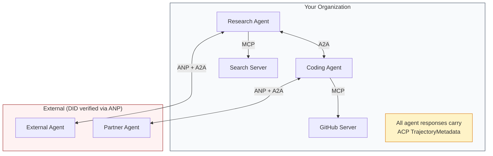

- **MCP**는 각 에이전트를 그 도구에 연결한다
- **A2A**는 에이전트 간 협업(내부 및 외부)을 처리한다
- **ACP**는 감사 가능성을 위해 응답을 궤적 메타데이터로 감싼다
- **ANP**는 직접 통제하지 않는 에이전트에 대한 신원 검증을 제공한다

## 직접 만들기 (Build It)

### 1단계: 핵심 메시지 타입

모든 멀티 에이전트 시스템은 메시지 포맷에서 시작한다. 실제 프로토콜이 사용하는 것에 매핑되는 타입을 정의한다.

```typescript
import crypto from "node:crypto";

type MessageRole = "user" | "agent";

type MessagePart =
  | { kind: "text"; text: string }
  | { kind: "data"; data: unknown; mediaType: string }
  | { kind: "file"; name: string; url: string; mediaType: string };

type TrajectoryEntry = {
  reasoning: string;
  toolName?: string;
  toolInput?: unknown;
  toolOutput?: unknown;
  timestamp: number;
};

type AgentMessage = {
  id: string;
  role: MessageRole;
  parts: MessagePart[];
  trajectory?: TrajectoryEntry[];
  replyTo?: string;
  timestamp: number;
};

function createMessage(
  role: MessageRole,
  parts: MessagePart[],
  replyTo?: string
): AgentMessage {
  return {
    id: crypto.randomUUID(),
    role,
    parts,
    replyTo,
    timestamp: Date.now(),
  };
}

function textMessage(role: MessageRole, text: string): AgentMessage {
  return createMessage(role, [{ kind: "text", text }]);
}
```

주목하라: `MessagePart`는 실제 A2A와 ACP 명세처럼 멀티모달(텍스트, 구조화된 데이터, 파일)이다. `TrajectoryEntry`는 ACP의 TrajectoryMetadata에 맞춰 추론 사슬을 포착한다.

### 2단계: A2A 에이전트 카드와 레지스트리

실제 A2A 명세에 맞는 에이전트 발견을 만든다.

```typescript
type Skill = {
  id: string;
  name: string;
  description: string;
  tags: string[];
  inputModes: string[];
  outputModes: string[];
};

type AgentCard = {
  name: string;
  description: string;
  version: string;
  url: string;
  capabilities: {
    streaming: boolean;
    pushNotifications: boolean;
  };
  defaultInputModes: string[];
  defaultOutputModes: string[];
  skills: Skill[];
};

class AgentRegistry {
  private cards: Map<string, AgentCard> = new Map();

  register(card: AgentCard) {
    this.cards.set(card.name, card);
  }

  discoverBySkillTag(tag: string): AgentCard[] {
    return [...this.cards.values()].filter((card) =>
      card.skills.some((skill) => skill.tags.includes(tag))
    );
  }

  discoverByInputMode(mimeType: string): AgentCard[] {
    return [...this.cards.values()].filter(
      (card) =>
        card.defaultInputModes.includes(mimeType) ||
        card.skills.some((skill) => skill.inputModes.includes(mimeType))
    );
  }

  resolve(name: string): AgentCard | undefined {
    return this.cards.get(name);
  }

  listAll(): AgentCard[] {
    return [...this.cards.values()];
  }
}
```

이는 단순한 이름-역량 맵보다 상당히 풍부하다. 실제 A2A 명세가 지원하는 것처럼, 스킬 태그로, 입력 MIME 타입으로, 또는 이름으로 에이전트를 발견할 수 있다.

### 3단계: A2A 작업 생명주기

전체 작업 상태 기계를 만든다.

```typescript
type TaskState =
  | "submitted"
  | "working"
  | "input-required"
  | "auth-required"
  | "completed"
  | "failed"
  | "canceled"
  | "rejected";

const TERMINAL_STATES: TaskState[] = [
  "completed",
  "failed",
  "canceled",
  "rejected",
];

type TaskStatus = {
  state: TaskState;
  message?: AgentMessage;
  timestamp: number;
};

type Artifact = {
  id: string;
  name: string;
  parts: MessagePart[];
};

type Task = {
  id: string;
  contextId: string;
  status: TaskStatus;
  artifacts: Artifact[];
  history: AgentMessage[];
};

type TaskEvent =
  | { kind: "statusUpdate"; taskId: string; status: TaskStatus }
  | {
      kind: "artifactUpdate";
      taskId: string;
      artifact: Artifact;
      append: boolean;
      lastChunk: boolean;
    };

type TaskHandler = (
  task: Task,
  message: AgentMessage
) => AsyncGenerator<TaskEvent>;

class TaskManager {
  private tasks: Map<string, Task> = new Map();
  private handlers: Map<string, TaskHandler> = new Map();
  private listeners: Map<string, ((event: TaskEvent) => void)[]> = new Map();

  registerHandler(agentName: string, handler: TaskHandler) {
    this.handlers.set(agentName, handler);
  }

  subscribe(taskId: string, listener: (event: TaskEvent) => void) {
    const existing = this.listeners.get(taskId) ?? [];
    existing.push(listener);
    this.listeners.set(taskId, existing);
  }

  async sendMessage(
    agentName: string,
    message: AgentMessage,
    contextId?: string
  ): Promise<Task> {
    const handler = this.handlers.get(agentName);
    if (!handler) {
      const task = this.createTask(contextId);
      task.status = {
        state: "rejected",
        timestamp: Date.now(),
        message: textMessage("agent", `No handler for ${agentName}`),
      };
      return task;
    }

    const task = this.createTask(contextId);
    task.history.push(message);
    task.status = { state: "submitted", timestamp: Date.now() };

    this.processTask(task, handler, message).catch((err) => {
      task.status = {
        state: "failed",
        timestamp: Date.now(),
        message: textMessage("agent", String(err)),
      };
    });
    return task;
  }

  getTask(taskId: string): Task | undefined {
    return this.tasks.get(taskId);
  }

  cancelTask(taskId: string): boolean {
    const task = this.tasks.get(taskId);
    if (!task || TERMINAL_STATES.includes(task.status.state)) return false;
    task.status = { state: "canceled", timestamp: Date.now() };
    this.emit(taskId, {
      kind: "statusUpdate",
      taskId,
      status: task.status,
    });
    return true;
  }

  private createTask(contextId?: string): Task {
    const task: Task = {
      id: crypto.randomUUID(),
      contextId: contextId ?? crypto.randomUUID(),
      status: { state: "submitted", timestamp: Date.now() },
      artifacts: [],
      history: [],
    };
    this.tasks.set(task.id, task);
    return task;
  }

  private async processTask(
    task: Task,
    handler: TaskHandler,
    message: AgentMessage
  ) {
    task.status = { state: "working", timestamp: Date.now() };
    this.emit(task.id, {
      kind: "statusUpdate",
      taskId: task.id,
      status: task.status,
    });

    try {
      for await (const event of handler(task, message)) {
        if (TERMINAL_STATES.includes(task.status.state)) break;

        if (event.kind === "statusUpdate") {
          task.status = event.status;
        }
        if (event.kind === "artifactUpdate") {
          const existing = task.artifacts.find(
            (a) => a.id === event.artifact.id
          );
          if (existing && event.append) {
            existing.parts.push(...event.artifact.parts);
          } else {
            task.artifacts.push(event.artifact);
          }
        }
        this.emit(task.id, event);
      }
    } catch (err) {
      task.status = {
        state: "failed",
        timestamp: Date.now(),
        message: textMessage("agent", String(err)),
      };
      this.emit(task.id, {
        kind: "statusUpdate",
        taskId: task.id,
        status: task.status,
      });
    }
  }

  private emit(taskId: string, event: TaskEvent) {
    for (const listener of this.listeners.get(taskId) ?? []) {
      listener(event);
    }
  }
}
```

이는 실제 A2A 작업 생명주기를 구현한다: submitted, working, input-required, 종단 상태들. 핸들러는 SSE 스트리밍 모델에 맞춰 이벤트(상태 갱신과 아티팩트 청크)를 산출하는 비동기 제너레이터다.

### 4단계: ACP 스타일 감사 추적

통신을 궤적 추적으로 감싼다.

```typescript
type AuditEntry = {
  runId: string;
  agentName: string;
  input: AgentMessage[];
  output: AgentMessage[];
  trajectory: TrajectoryEntry[];
  status: "created" | "in-progress" | "completed" | "failed" | "awaiting";
  startedAt: number;
  completedAt?: number;
  sessionId?: string;
};

class AuditableRunner {
  private log: AuditEntry[] = [];
  private handlers: Map<
    string,
    (input: AgentMessage[]) => Promise<{
      output: AgentMessage[];
      trajectory: TrajectoryEntry[];
    }>
  > = new Map();

  registerAgent(
    name: string,
    handler: (input: AgentMessage[]) => Promise<{
      output: AgentMessage[];
      trajectory: TrajectoryEntry[];
    }>
  ) {
    this.handlers.set(name, handler);
  }

  async run(
    agentName: string,
    input: AgentMessage[],
    sessionId?: string
  ): Promise<AuditEntry> {
    const entry: AuditEntry = {
      runId: crypto.randomUUID(),
      agentName,
      input: structuredClone(input),
      output: [],
      trajectory: [],
      status: "created",
      startedAt: Date.now(),
      sessionId,
    };
    this.log.push(entry);

    const handler = this.handlers.get(agentName);
    if (!handler) {
      entry.status = "failed";
      return entry;
    }

    entry.status = "in-progress";
    try {
      const result = await handler(input);
      entry.output = structuredClone(result.output);
      entry.trajectory = structuredClone(result.trajectory);
      entry.status = "completed";
      entry.completedAt = Date.now();
    } catch (err) {
      entry.status = "failed";
      entry.trajectory.push({
        reasoning: `Error: ${String(err)}`,
        timestamp: Date.now(),
      });
      entry.completedAt = Date.now();
    }
    return entry;
  }

  getFullAuditLog(): AuditEntry[] {
    return structuredClone(this.log);
  }

  getAuditLogForAgent(agentName: string): AuditEntry[] {
    return structuredClone(
      this.log.filter((e) => e.agentName === agentName)
    );
  }

  getAuditLogForSession(sessionId: string): AuditEntry[] {
    return structuredClone(
      this.log.filter((e) => e.sessionId === sessionId)
    );
  }

  getTrajectoryForRun(runId: string): TrajectoryEntry[] {
    const entry = this.log.find((e) => e.runId === runId);
    return entry ? structuredClone(entry.trajectory) : [];
  }
}
```

모든 에이전트 실행은 완전한 감사 항목을 생성한다: 무엇이 들어갔고, 무엇이 나왔고, 그 사이의 도구 호출과 추론 단계의 완전한 궤적. 에이전트별로, 세션별로, 또는 개별 실행별로 질의할 수 있다.

### 5단계: ANP 스타일 신원 검증

DID 기반 신원과 검증을 만든다.

```typescript
type VerificationMethod = {
  id: string;
  type: string;
  controller: string;
  publicKeyDer: string;
};

type DIDDocument = {
  id: string;
  verificationMethod: VerificationMethod[];
  authentication: string[];
  keyAgreement: string[];
  humanAuthorization: string[];
  service: { id: string; type: string; serviceEndpoint: string }[];
};

type AgentIdentity = {
  did: string;
  document: DIDDocument;
  privateKey: crypto.KeyObject;
  publicKey: crypto.KeyObject;
};

class IdentityRegistry {
  private documents: Map<string, DIDDocument> = new Map();

  publish(doc: DIDDocument) {
    this.documents.set(doc.id, doc);
  }

  resolve(did: string): DIDDocument | undefined {
    return this.documents.get(did);
  }

  verify(did: string, signature: string, payload: string): boolean {
    const doc = this.documents.get(did);
    if (!doc) return false;

    const authKeyIds = doc.authentication;
    const authKeys = doc.verificationMethod.filter((vm) =>
      authKeyIds.includes(vm.id)
    );

    for (const key of authKeys) {
      const publicKey = crypto.createPublicKey({
        key: Buffer.from(key.publicKeyDer, "base64"),
        format: "der",
        type: "spki",
      });
      const isValid = crypto.verify(
        null,
        Buffer.from(payload),
        publicKey,
        Buffer.from(signature, "hex")
      );
      if (isValid) return true;
    }
    return false;
  }

  requiresHumanAuth(did: string, operationKeyId: string): boolean {
    const doc = this.documents.get(did);
    if (!doc) return false;
    return doc.humanAuthorization.includes(operationKeyId);
  }
}

function createIdentity(domain: string, agentName: string): AgentIdentity {
  const did = `did:wba:${domain}:agent:${agentName}`;
  const { publicKey, privateKey } = crypto.generateKeyPairSync("ed25519");

  const publicKeyDer = publicKey
    .export({ format: "der", type: "spki" })
    .toString("base64");

  const keyId = `${did}#key-1`;
  const encKeyId = `${did}#key-x25519-1`;

  const document: DIDDocument = {
    id: did,
    verificationMethod: [
      {
        id: keyId,
        type: "Ed25519VerificationKey2020",
        controller: did,
        publicKeyDer,
      },
      {
        id: encKeyId,
        type: "X25519KeyAgreementKey2019",
        controller: did,
        publicKeyDer,
      },
    ],
    authentication: [keyId],
    keyAgreement: [encKeyId],
    humanAuthorization: [],
    service: [
      {
        id: `${did}#agent-description`,
        type: "AgentDescription",
        serviceEndpoint: `https://${domain}/agents/${agentName}/ad.json`,
      },
    ],
  };

  return { did, document, privateKey, publicKey };
}

function signPayload(identity: AgentIdentity, payload: string): string {
  return crypto
    .sign(null, Buffer.from(payload), identity.privateKey)
    .toString("hex");
}
```

이는 실제 ANP 신원 모델을 반영한다: 에이전트는 별도의 인증, 키 합의, 인간 승인 키를 가진 DID 문서를 갖는다. `IdentityRegistry`는 DID 해석을 시뮬레이션한다(프로덕션에서는 에이전트의 도메인에 대한 HTTP 페치가 될 것이다).

### 6단계: 프로토콜 게이트웨이

네 프로토콜 모두를 통합 시스템으로 연결한다.

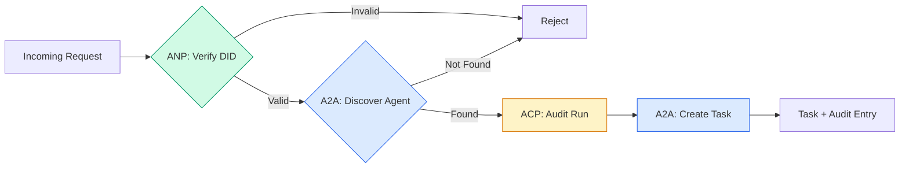

```typescript
class ProtocolGateway {
  private registry: AgentRegistry;
  private taskManager: TaskManager;
  private auditRunner: AuditableRunner;
  private identityRegistry: IdentityRegistry;

  constructor(
    registry: AgentRegistry,
    taskManager: TaskManager,
    auditRunner: AuditableRunner,
    identityRegistry: IdentityRegistry
  ) {
    this.registry = registry;
    this.taskManager = taskManager;
    this.auditRunner = auditRunner;
    this.identityRegistry = identityRegistry;
  }

  async delegateTask(
    fromDid: string,
    signature: string,
    targetAgent: string,
    message: AgentMessage,
    sessionId?: string
  ): Promise<{ task: Task; audit: AuditEntry } | { error: string }> {
    if (!this.identityRegistry.verify(fromDid, signature, message.id)) {
      return { error: "Identity verification failed" };
    }

    const card = this.registry.resolve(targetAgent);
    if (!card) {
      return { error: `Agent ${targetAgent} not found in registry` };
    }

    const audit = await this.auditRunner.run(
      targetAgent,
      [message],
      sessionId
    );
    const task = await this.taskManager.sendMessage(targetAgent, message);

    return { task, audit };
  }

  discoverAndDelegate(
    fromDid: string,
    signature: string,
    skillTag: string,
    message: AgentMessage
  ): Promise<{ task: Task; audit: AuditEntry } | { error: string }> {
    const candidates = this.registry.discoverBySkillTag(skillTag);
    if (candidates.length === 0) {
      return Promise.resolve({
        error: `No agents found with skill tag: ${skillTag}`,
      });
    }
    return this.delegateTask(
      fromDid,
      signature,
      candidates[0].name,
      message
    );
  }
}
```

게이트웨이는 한 번의 호출로 네 가지 일을 한다.
1. **ANP**: DID 서명으로 호출자의 신원을 검증한다
2. **A2A**: 대상 에이전트를 발견하고 역량을 확인한다
3. **ACP**: 실행을 궤적이 있는 감사 추적으로 감싼다
4. **A2A**: 전체 생명주기 추적과 함께 작업을 생성한다

### 7단계: 모두 엮기

```typescript
async function protocolDemo() {
  const registry = new AgentRegistry();
  registry.register({
    name: "researcher",
    description: "Searches and summarizes findings",
    version: "1.0.0",
    url: "https://researcher.local/a2a/v1",
    capabilities: { streaming: true, pushNotifications: false },
    defaultInputModes: ["text/plain"],
    defaultOutputModes: ["text/plain", "application/json"],
    skills: [
      {
        id: "web-research",
        name: "Web Research",
        description: "Searches the web",
        tags: ["research", "search", "summarization"],
        inputModes: ["text/plain"],
        outputModes: ["application/json"],
      },
    ],
  });
  registry.register({
    name: "coder",
    description: "Writes code from specs",
    version: "1.0.0",
    url: "https://coder.local/a2a/v1",
    capabilities: { streaming: false, pushNotifications: false },
    defaultInputModes: ["text/plain", "application/json"],
    defaultOutputModes: ["text/plain"],
    skills: [
      {
        id: "code-gen",
        name: "Code Generation",
        description: "Generates code",
        tags: ["coding", "generation"],
        inputModes: ["text/plain", "application/json"],
        outputModes: ["text/plain"],
      },
    ],
  });

  const taskManager = new TaskManager();
  const auditRunner = new AuditableRunner();

  const researchTrajectory: TrajectoryEntry[] = [];

  taskManager.registerHandler(
    "researcher",
    async function* (task, message) {
      yield {
        kind: "statusUpdate" as const,
        taskId: task.id,
        status: { state: "working" as const, timestamp: Date.now() },
      };

      researchTrajectory.push({
        reasoning: "Searching for React 19 documentation",
        toolName: "web_search",
        toolInput: { query: "React 19 compiler features" },
        toolOutput: {
          results: ["react.dev/blog/react-19", "github.com/react/react"],
        },
        timestamp: Date.now(),
      });

      researchTrajectory.push({
        reasoning: "Extracting key findings from search results",
        toolName: "doc_analysis",
        toolInput: { url: "react.dev/blog/react-19" },
        toolOutput: {
          summary:
            "React 19 compiler auto-memoizes, no manual useMemo needed",
        },
        timestamp: Date.now(),
      });

      yield {
        kind: "artifactUpdate" as const,
        taskId: task.id,
        artifact: {
          id: crypto.randomUUID(),
          name: "research-results",
          parts: [
            {
              kind: "data" as const,
              data: {
                findings: [
                  "React 19 compiler auto-memoizes components",
                  "No more manual useMemo/useCallback needed",
                  "Compiler runs at build time, not runtime",
                ],
                sources: ["react.dev/blog/react-19"],
              },
              mediaType: "application/json",
            },
          ],
        },
        append: false,
        lastChunk: true,
      };

      yield {
        kind: "statusUpdate" as const,
        taskId: task.id,
        status: { state: "completed" as const, timestamp: Date.now() },
      };
    }
  );

  auditRunner.registerAgent("researcher", async () => ({
    output: [
      textMessage("agent", "React 19 compiler auto-memoizes components"),
    ],
    trajectory: researchTrajectory,
  }));

  const identityRegistry = new IdentityRegistry();

  const coderIdentity = createIdentity("coder.local", "coder");
  const researcherIdentity = createIdentity("researcher.local", "researcher");

  identityRegistry.publish(coderIdentity.document);
  identityRegistry.publish(researcherIdentity.document);

  const gateway = new ProtocolGateway(
    registry,
    taskManager,
    auditRunner,
    identityRegistry
  );

  console.log("=== Protocol Demo ===\n");

  console.log("1. Agent Discovery (A2A)");
  const researchAgents = registry.discoverBySkillTag("research");
  console.log(
    `   Found ${researchAgents.length} agent(s):`,
    researchAgents.map((a) => a.name)
  );

  console.log("\n2. Identity Verification (ANP)");
  const message = textMessage("user", "Research React 19 compiler features");
  const signature = signPayload(coderIdentity, message.id);
  const verified = identityRegistry.verify(
    coderIdentity.did,
    signature,
    message.id
  );
  console.log(`   Coder DID: ${coderIdentity.did}`);
  console.log(`   Signature verified: ${verified}`);

  console.log("\n3. Task Delegation (A2A + ACP + ANP)");
  const result = await gateway.delegateTask(
    coderIdentity.did,
    signature,
    "researcher",
    message,
    "session-001"
  );

  if ("error" in result) {
    console.log(`   Error: ${result.error}`);
    return;
  }

  console.log(`   Task ID: ${result.task.id}`);
  console.log(`   Task state: ${result.task.status.state}`);
  console.log(`   Artifacts: ${result.task.artifacts.length}`);

  console.log("\n4. Audit Trail (ACP)");
  console.log(`   Run ID: ${result.audit.runId}`);
  console.log(`   Status: ${result.audit.status}`);
  console.log(`   Trajectory steps: ${result.audit.trajectory.length}`);
  for (const step of result.audit.trajectory) {
    console.log(`     - ${step.reasoning}`);
    if (step.toolName) {
      console.log(`       Tool: ${step.toolName}`);
    }
  }

  console.log("\n5. Full Audit Log");
  const fullLog = auditRunner.getFullAuditLog();
  console.log(`   Total runs: ${fullLog.length}`);
  for (const entry of fullLog) {
    const duration = entry.completedAt
      ? `${entry.completedAt - entry.startedAt}ms`
      : "in-progress";
    console.log(`   ${entry.agentName}: ${entry.status} (${duration})`);
  }
}

protocolDemo().catch((err) => {
  console.error("Protocol demo failed:", err);
  process.exitCode = 1;
});
```

## 무엇이 잘못되는가 (What Goes Wrong)

프로토콜은 정상 경로(happy path)를 해결한다. 프로덕션에서 무엇이 깨지는지 보자.

**스키마 표류(schema drift).** 에이전트 A가 `application/json` 출력을 광고하는 에이전트 카드를 게시한다. 그러나 JSON 스키마가 버전 간에 바뀐다. 에이전트 B는 옛 포맷을 파싱하여 쓰레기를 얻는다. 해결책은 스킬과 출력 스키마에 버전을 매기는 것이다. A2A 명세가 에이전트 카드에 `version`을 지원하는 이유가 바로 이것이다.

**상태 기계 위반.** 에이전트 핸들러가 `completed` 이벤트를 산출한 뒤 더 많은 아티팩트를 산출하려 한다. 작업은 불변이다. 그러면 코드는 조용히 갱신을 버리거나 예외를 던진다. 해결책은 산출 전에 종단 상태를 확인하는 것이다. 앞의 `TaskManager`는 종단 상태 뒤의 `break`로 이를 강제한다.

**신뢰 해석 실패.** 에이전트 A가 에이전트 B의 DID를 검증하려 하지만, 에이전트 B의 도메인이 다운됐다. DID 문서를 페치할 수 없다. 검증되지 않은 에이전트를 받아들이는 페일 오픈(fail open)인가, 아니면 모든 것을 거부하는 페일 클로즈(fail closed)인가? ANP는 최소 신뢰 원칙과 함께 페일 클로즈를 권장한다.

**궤적 비대화(trajectory bloat).** ACP 궤적 로깅은 강력하지만 비싸다. 실행당 200번의 도구 호출을 하는 복잡한 에이전트는 거대한 감사 항목을 생성한다. 해결책은 설정 가능한 상세도 수준에서 궤적을 로깅하는 것이다. 컴플라이언스를 위해 도구 이름과 IO를 기록하되, 비규제 워크로드에서는 추론 단계를 건너뛴다.

**발견 천둥 떼(thundering herd).** 50개 에이전트가 시작 시 동시에 `GET /agents`를 질의한다. 해결책은 TTL과 함께 에이전트 카드를 캐시하고, 발견 간격에 시차를 두거나, 폴링 대신 푸시 기반 등록을 쓰는 것이다.

## 라이브러리로 써보기 (Use It)

### 실제 구현들

**A2A**가 가장 성숙하다. Google의 [공식 명세](https://github.com/google/A2A)는 Linux Foundation 산하 오픈소스다. Python과 TypeScript SDK가 있다. 에이전트에 동적 발견과 협업이 필요하다면 여기서 시작하라.

**ACP**는 A2A로 통합 중이다. IBM의 [BeeAI 프로젝트](https://github.com/i-am-bee/acp)는 REST 우선 대안으로 ACP를 만들었지만, 궤적 메타데이터 개념은 A2A 생태계로 흡수되고 있다. A2A를 전송으로 쓰더라도 ACP 패턴(궤적 로깅, 실행 생명주기)을 사용하라.

**ANP**가 가장 실험적이다. [커뮤니티 저장소](https://github.com/agent-network-protocol/AgentNetworkProtocol)에는 Python SDK(AgentConnect)가 있다. 메타 프로토콜 협상 개념은 진정으로 새롭다. 조직 간 에이전트 배포(deployment)에서 주목할 가치가 있다.

**MCP**는 Phase 13에서 이미 다룬다. 에이전트가 도구를 쓰길 원한다면, MCP가 표준이다.

### 올바른 프로토콜 고르기

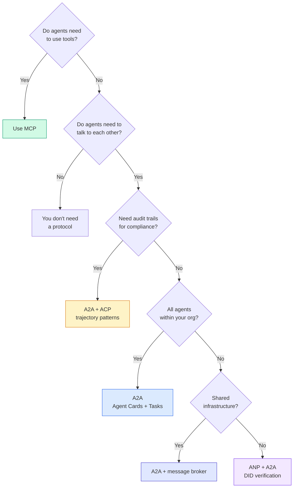

## 산출물 (Ship It)

이 레슨이 만들어내는 것:
- `code/main.ts` -- 네 프로토콜 패턴 모두의 완전한 구현
- `outputs/prompt-protocol-selector.md` -- 자신의 시스템에 맞는 프로토콜을 고르도록 돕는 프롬프트

## 연습 문제 (Exercises)

1. **다중 홉 작업 위임.** 에이전트 핸들러가 다른 에이전트에게 하위 작업을 위임할 수 있도록 `TaskManager`를 확장하라. 연구자가 작업을 받아 "검색"과 "요약" 하위 작업을 두 전문가 에이전트에게 위임하고, 둘 다 완료될 때까지 기다린 다음, 결과를 자신의 아티팩트로 병합한다.

2. **스트리밍 감사 추적.** `AuditableRunner`를 스트리밍 모드를 지원하도록 수정하라. 전체 결과를 기다리는 대신, 궤적 항목이 추가될 때 실시간으로 `AuditEntry` 갱신을 산출하라. 감사 스냅샷을 생성하는 비동기 제너레이터를 사용하라.

3. **DID 회전.** `IdentityRegistry`에 키 회전을 추가하라. 에이전트는 `previousDid` 참조를 유지하면서 갱신된 키로 새 DID 문서를 게시할 수 있어야 한다. 검증자는 유예 기간 동안 현재 키와 이전 키 모두로부터의 서명을 받아들여야 한다.

4. **프로토콜 협상.** ANP의 메타 프로토콜 개념을 구현하라. 두 에이전트가 후보 포맷(예: "나는 JSON-RPC를 말할 수 있다" vs "나는 REST를 선호한다")과 함께 `protocolNegotiation` 메시지를 교환한다. 최대 3라운드 후, 그들은 포맷에 합의하거나 타임아웃된다. 합의된 포맷이 어떤 `TaskManager`나 `AuditableRunner`를 쓸지 결정한다.

5. **속도 제한 발견.** 설정 가능한 TTL로 에이전트 카드 조회를 캐시하고 에이전트당 초당 발견 질의를 제한하는 `RateLimitedRegistry` 래퍼를 추가하라. 시작 시 서로를 발견하는 100개 에이전트의 천둥 떼를 시뮬레이션하고 차이를 측정하라.

## 핵심 용어 (Key Terms)

| 용어 | 흔히 하는 말 | 실제 의미 |
|------|----------------|----------------------|
| MCP | "AI 도구를 위한 프로토콜" | 에이전트가 도구를 발견하고 사용하기 위한 클라이언트-서버 프로토콜. 에이전트-도구이지 에이전트-에이전트가 아니다. |
| A2A | "Google의 에이전트 프로토콜" | Linux Foundation 산하 에이전트 협업을 위한 피어 투 피어 프로토콜. 에이전트 카드를 통한 발견, 9개 상태 작업 생명주기, SSE를 통한 스트리밍. JSON-RPC, REST, gRPC 바인딩을 지원한다. |
| ACP | "엔터프라이즈 에이전트 메시징" | TrajectoryMetadata를 가진 에이전트 실행을 위한 IBM/BeeAI의 REST API: 모든 응답이 추론과 도구 호출의 완전한 사슬을 운반한다. A2A로 통합 중. |
| ANP | "탈중앙 에이전트 신원" | 암호 신원을 위한 `did:wba`(DID), E2EE를 위한 HPKE, 서로를 본 적 없는 에이전트를 위한 AI 기반 메타 프로토콜 협상을 사용하는 커뮤니티 프로토콜. |
| 에이전트 카드 (Agent Card) | "에이전트의 명함" | 스킬, 지원 MIME 타입, 보안 스킴, 프로토콜 바인딩을 기술하는 `/.well-known/agent-card.json`의 JSON 문서. |
| DID | "탈중앙 ID" | 에이전트 자신의 도메인에 호스팅된 암호학적으로 검증 가능한 신원을 위한 W3C 표준. ANP는 `did:wba` 메서드를 쓴다. |
| TrajectoryMetadata | "감사 영수증" | 모든 에이전트 응답에 추론 단계, 도구 호출, 그 입력/출력을 첨부하는 ACP의 메커니즘. |
| 메타 프로토콜 (Meta-protocol) | "어떻게 대화할지 협상하는 에이전트들" | 에이전트가 자연어를 써서 데이터 포맷에 동적으로 합의하고, 그다음 이를 처리할 코드를 생성하는 ANP의 접근법. |
| 작업 (Task) | "작업의 단위" | 제출부터 완료까지 작업을 추적하는 A2A의 상태 보존 객체. 종단에 이르면 불변. |

## 더 읽을거리 (Further Reading)

- [Google A2A specification](https://github.com/google/A2A) -- 공식 명세와 SDK (v1.0.0, Linux Foundation)
- [IBM/BeeAI ACP specification](https://github.com/i-am-bee/acp) -- 에이전트 실행과 궤적 메타데이터를 위한 OpenAPI 3.1 명세
- [Agent Network Protocol](https://github.com/agent-network-protocol/AgentNetworkProtocol) -- DID 기반 신원, E2EE, 메타 프로토콜 협상
- [Model Context Protocol docs](https://modelcontextprotocol.io/) -- Anthropic의 MCP 명세 (Phase 13에서 다룸)
- [W3C Decentralized Identifiers](https://www.w3.org/TR/did-core/) -- ANP를 떠받치는 신원 표준
- [RFC 9180 (HPKE)](https://www.rfc-editor.org/rfc/rfc9180) -- ANP가 E2EE에 쓰는 암호화 스킴
- [FIPA Agent Communication Language](http://www.fipa.org/specs/fipa00061/SC00061G.html) -- 현대 에이전트 프로토콜의 학술적 선구자
