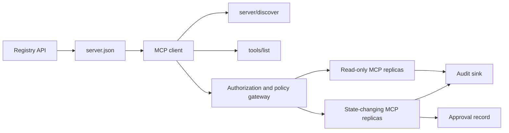

# 캡스톤 13: 레지스트리와 거버넌스를 갖춘 무상태 MCP 서버 (Capstone 13: Stateless MCP Server with Registry and Governance)

> 실제 운영되는 MCP는 서버 프로세스 하나가 아니다. 게시할 수 있는 메타데이터, 살아 있는 탐색, 무상태 요청 봉투, 인가, 정책, 감사, 배포 증거로 이어지는 계약의 사슬이다.

**Type:** Capstone
**Languages:** Python and TypeScript reference models; any production language
**Prerequisites:** Phase 11, Phase 13, Phase 14, Phase 17, and Phase 18
**Required MCP deep dives:** [레슨 28: 도구 계약](../../../13-tools-and-protocols/28-mcp-tool-contracts-and-content/docs/ko.md), [레슨 29: 신뢰성](../../../13-tools-and-protocols/29-mcp-reliability-cancellation-and-flow-control/docs/ko.md), [레슨 30: 레지스트리 공급망](../../../13-tools-and-protocols/30-mcp-registry-supply-chain-and-drift/docs/ko.md), [레슨 31: 적합성 운영](../../../13-tools-and-protocols/31-mcp-conformance-versioning-and-operations/docs/ko.md)
**Protocol target:** MCP `2026-07-28`
**Time:** ~25 hours

## 학습 목표 (Learning Objectives)

- 무상태 MCP 요청과 결과 봉투를 구현한다.
- 레지스트리 메타데이터를 살아 있는 프로토콜 탐색과 분리해 둔다.
- 결정적이고 캐시를 아는 도구 탐색을 만든다.
- 도구 호출마다 발급자, 대상, 스코프, 승인 정책을 강제한다.
- 세션 고정 없이 Streamable HTTP를 배포한다.
- 전선, 인가, 정책, 레지스트리, 감사 경계에서 동작을 증명한다.

## 반드시 거쳐야 할 MCP 선수 과정 (Required MCP Prerequisite Path)

이 캡스톤을 운영 가능한 것으로 다루기 전에, 연결된 페이즈 13 레슨 네 개를 순서대로 마치라.

1. [레슨 28](../../../13-tools-and-protocols/28-mcp-tool-contracts-and-content/docs/ko.md)은 이 서버가 내놓아야 할 도구, 스키마, 내용, 페이지 나누기, 완성, 라우팅, 오류 계약을 정의한다.
2. [레슨 29](../../../13-tools-and-protocols/29-mcp-reliability-cancellation-and-flow-control/docs/ko.md)는 취소 경합, 기한, 멱등성, 배압, 재시도, 재연결 동작을 정의한다.
3. [레슨 30](../../../13-tools-and-protocols/30-mcp-registry-supply-chain-and-drift/docs/ko.md)은 이름 공간, 출처, 승인 고정, 레지스트리 상태, 표류, 장부, 롤백 증거를 정의한다.
4. [레슨 31](../../../13-tools-and-protocols/31-mcp-conformance-versioning-and-operations/docs/ko.md)은 모범 기록과 부정 기록, 엄격한 버전 시대, SDK 차이 검사, 프록시 증명, 가리기, 건강 상태, 릴리스 관문을 정의한다.

캡스톤은 그 산출물들을 통합한다. 행복한 경로만 도는 SDK 테스트 하나로 그것들을 대체하지 않는다.

## 문제 (The Problem)

어느 내부 플랫폼에 읽기 전용 데이터 도구와 상태를 바꾸는 도구 몇 개가 필요하다. 개발자는 서버를 찾아내고, 어떻게 연결하는지 이해하고, 그 서버가 지금 지원하는 역량을 들여다보고, 자신이 쓸 권한을 가진 작업만 호출할 수 있어야 한다.

어려운 부분은 함수를 등록하는 일이 아니다. 어려운 부분은 서로 다른 여섯 가지 진실을 어긋나지 않게 맞춰 두는 일이다.

1. `server.json`은 서버를 어디에 설치하거나 어디로 닿을 수 있는지 말한다.
2. `server/discover`는 살아 있는 프로세스가 지금 무엇을 지원하는지 말한다.
3. 모든 요청은 어떤 프로토콜 개정판과 클라이언트 역량을 쓰는지 말한다.
4. 인가는 호출자를 올바른 발급자, 리소스, 스코프에 묶는다.
5. 정책은 바로 이 동작을 돌려도 되는지 판단한다.
6. 감사 증거는 비밀 값이나 민감한 내용을 흘리지 않고 무엇이 경계를 넘었는지 기록한다.

이 중 하나라도 어긋나면, 플랫폼이 닿을 수 없는 서버를 목록에 올리거나, 호환되지 않는 클라이언트를 연결하거나, 다른 리소스를 위해 찍힌 토큰을 받아들이거나, 예상된 검토 없이 파괴적인 동작을 내놓을 수 있다.

## 두 겹의 탐색 (The Two Discovery Layers)

레지스트리와 살아 있는 MCP 서버는 서로 다른 질문에 답한다.

| 계층 | 계약 | 답하는 질문 |
|---|---|---|
| Publication | `server.json`과 레지스트리 API | 이 서버는 무엇이고, 그 패키지나 원격 엔드포인트는 어디에 있으며, 어떻게 설정하는가? |
| Runtime | `server/discover` | 이 프로세스가 지원하는 프로토콜 버전, 역량, 확장, 서버 신원은 무엇인가? |

공식 레지스트리는 버전이 매겨진 `server.json` 스키마를 쓴다. 원격 항목은 Streamable HTTP URL을 지목할 수 있다.

```json
{
  "$schema": "https://static.modelcontextprotocol.io/schemas/2025-12-11/server.schema.json",
  "name": "com.example/internal-readonly",
  "title": "Internal Read-Only Tools",
  "description": "Read-only incident and data lookup tools.",
  "version": "1.0.0",
  "remotes": [
    {
      "type": "streamable-http",
      "url": "https://mcp.internal.example.com/readonly"
    }
  ]
}
```

레지스트리 스키마 버전과 MCP 프로토콜 개정판은 서로 독립적이다. 한쪽 날짜를 다른 쪽에 맞추려고 고쳐 쓰지 마라. 문서마다 자기 계약에 맞춰 검증하라.

스키마가 유효하다고 이름 공간 소유권이 증명되는 것은 아니다. `example.com`에 대해 검증된 발행자는 역방향 DNS 이름 공간 `com.example/*`나 그 하위 이름 공간을 쓴다. 레지스트리 인증 흐름이 그 소유권을 증명한다. 도메인 레이블을 평소 순서 그대로 두면 다른 이름 공간을 가리키게 된다.

표준 라이브러리 모형의 `validate_registry_document` 함수는 의도적으로 원격 프로필만 부분적으로 검증한다. 공식 필수 필드인 `name`, `description`, `version`과 선택적인 `title`, 게시 이름과 길이 제약, 구체적 버전의 모양, 그리고 `streamable-http`나 `sse` 원격의 HTTP(S) URL 모양을 확인한다. 이 캡스톤은 언제나 원격을 살아 있는 상태로 탐지하므로 비어 있지 않은 `remotes` 목록도 추가로 요구한다. `validate_publisher_namespace`는 이름을 검증된 발행자 도메인과 따로 대조하고, `validate_runtime_alignment`는 게시 이름과 버전을 살아 있는 `serverInfo`와 비교한다. 공식 스키마는 패키지만 담은 기록과 더 많은 원격 필드도 지원한다. 게시하기 전에 고정된 공식 JSON 스키마나 `mcp-publisher`로 문서 전체를 검증하라. 의존성 없는 이 부분집합을 스키마 검증 전체인 양 내세우지 마라.

서버는 `server/discover`를 반드시 구현해야 하고, 클라이언트는 다른 메서드보다 먼저 그것을 부를 수 있다. 이 캡스톤의 클라이언트는 엔드포인트를 알아낸 뒤에 그것을 부르고, 현행 프로토콜 개정판과 살아 있는 역량을 받는다.

```json
{
  "resultType": "complete",
  "supportedVersions": ["2026-07-28"],
  "capabilities": {
    "tools": {
      "listChanged": false
    }
  },
  "_meta": {
    "io.modelcontextprotocol/serverInfo": {
      "name": "com.example/internal-readonly",
      "version": "1.0.0"
    }
  },
  "ttlMs": 3600000,
  "cacheScope": "public"
}
```

사설 카탈로그는 소유권, 검토, 생애주기 데이터를 더 담아 둘 수 있지만, 그것을 MCP 전선 필드나 `server.json` 최상위 필드로 지어내서는 안 된다. 조직 정책은 게시된 기록 옆에 두라. 공개된 사용자 정의 메타데이터가 꼭 필요하다면 레지스트리의 `_meta.io.modelcontextprotocol.registry/publisher-provided` 확장을 쓰고 4 KB 한도 안에 머물라.

## 무상태 MCP 코어 (Stateless MCP Core)

MCP 개정판 `2026-07-28`은 프로토콜 세션과 `initialize` / `notifications/initialized` 악수를 걷어냈다. `Mcp-Session-Id`도 없앴다.

모든 요청이 프로토콜 맥락을 `params._meta`에 싣는다.

```json
{
  "io.modelcontextprotocol/protocolVersion": "2026-07-28",
  "io.modelcontextprotocol/clientCapabilities": {},
  "io.modelcontextprotocol/clientInfo": {
    "name": "internal-platform-client",
    "version": "1.0.0"
  }
}
```

버전과 역량은 연결의 사실이 아니라 요청의 사실이다. 어느 복제본이든 메시지 자체만으로 요청을 검증할 수 있으므로, 부하 분산기가 연달아 오는 요청을 서로 다른 건강한 복제본에 보내도 된다.

평범한 결과에는 `resultType: "complete"`가 들어간다. 서버는 결과마다 `_meta.io.modelcontextprotocol/serverInfo`에 자기 신원을 담는 것이 좋다. 프로토콜 버전이 없거나 문자열이 아니면 잘못된 매개변수 `-32602`다. 오류 `-32022`는 제공된 문자열이 지원되지 않을 때만 쓰며, 데이터는 정확히 `{"supported": ["2026-07-28"], "requested": "..."}`다.

### 캐시 가능한 탐색 (Cacheable discovery)

`tools/list`는 실질적으로 같은 도구 집합에 대해 결정적이어야 한다. 결과에는 이런 것이 들어간다.

- 클라이언트를 위한 신선도 힌트인 `ttlMs`,
- `public` 또는 `private`인 `cacheScope`,
- 같은 목록이면 프롬프트 캐시를 다시 쓸 수 있도록 안정적인 도구 순서,
- `resultType: "complete"`와 서버 신원 메타데이터.

사용자별 인가는 보통 `cacheScope: "private"`로 이어져야 한다. 사용자마다 다른 도구 가시성을 공유 공개 캐시 뒤에 두지 마라.

## Streamable HTTP

네트워크 서버는 POST를 받는 MCP 엔드포인트 하나를 내놓는다. JSON-RPC 요청이나 알림마다 자기 POST를 갖는다.

요청에 대해 서버는 JSON 객체 하나를 돌려주거나 그 요청 범위로 한정된 SSE 스트림을 돌려준다. 오래 유지되는 `subscriptions/listen` 요청은 신청한 변경 알림을 실어 나른다. 현행 전송에는 독립 GET 스트림도, 세션 DELETE도, 세션 헤더도, `Last-Event-ID` 재생도 없다.

요청마다 이런 것이 들어간다.

- 본문 메타데이터와 맞는 `MCP-Protocol-Version`,
- JSON-RPC 메서드와 맞는 `Mcp-Method`,
- `tools/call`, `resources/read`, `prompts/get`에 쓰는 `Mcp-Name`,
- `Accept: application/json, text/event-stream`.

복제 헤더가 어긋나면 명세가 정한 `-32020` 오류로 거부하라. `Origin`을 검증하고, 지역 개발 서버는 루프백에 바인딩하고, 원격 클라이언트를 인증하고, 요청 범위 SSE 응답이 닫히면 취소로 다루라.



```figure
cf-mcp-gate
```

## 인가와 정책 (Authorization and Policy)

전송 메타데이터는 인가가 아니다. 호출마다 인가를 검증하라.

원격 서버라면 이렇게 한다.

1. 보호된 리소스 메타데이터를 찾아낸다.
2. 그 리소스를 위한 인가 서버를 고른다.
3. 클라이언트 등록에는 Client ID Metadata Document를 먼저 쓴다. 동적 클라이언트 등록은 호환 지원으로 다룬다.
4. 인가 과정에서 리소스 지시자를 보낸다.
5. 돌아온 `iss` 값을 그 흐름에 기록해 둔 인가 서버와 대조해 검증한다.
6. 클라이언트 자격 증명을 발급자별로 저장한다. 등록 데이터를 발급자를 넘나들며 재사용하지 않는다.
7. MCP 서버에서 토큰의 발급자, 대상 또는 리소스, 만료, 스코프를 검증한다.
8. 구체적인 도구와 인자에 대해 두 번째 정책 판단을 적용한다.

`readOnlyHint`나 `destructiveHint` 같은 도구 주석은 클라이언트가 위험을 보여 주는 데 도움이 된다. 신뢰할 수 있는 인가 통제는 아니다.

### 승인은 기록이지 마법 스코프가 아니다 (Approval is a record, not a magic scope)

상태를 바꾸는 호출에는 행위자, 도구, 정규화된 인자 또는 그 요약값, 대상 환경, 만료, 일회성인지 반복 사용인지에 대한 정책에 묶인 승인 기록이 필요하다. 대화 메시지 하나는 승인의 증거가 아니다.

파이썬 모형은 키를 정렬한 정식 JSON을 해시한 다음, 그 요약값을 토큰 주체, 도구 이름, 서버 URL, 만료와 묶는다. 인자를 하나라도 바꾼 뒤 그 기록을 재생하면 처리기가 돌기 전에 실패한다. 승인은 접근 토큰에 붙인 스코프가 아니라 별도의 증거다.

위험이 큰 도구는 폭발 반경을 실질적으로 줄일 수 있을 때 따로 검토 가능한 표면에 두라. 자격 증명, 정책, 배포 신원, 감사 통제까지 함께 분리될 때만 그 분리가 쓸모 있다.

## 만들어 보기 (Build It)

### 1. 게시 메타데이터를 모형화한다 (1. Model publication metadata)

`server.json`을 만들고 스키마로 검증하라. 발행자에게 인증된 이름 공간 안의 안정적인 이름과 함께, 버전, 설명, 해당한다면 공식 `repository`나 `packages` 메타데이터, 그리고 원격이나 stdio 전송을 담으라. 비밀 값은 문자 그대로 적지 말고 선언된 환경 변수 입력으로 두라.

### 2. 살아 있는 탐색을 구현한다 (2. Implement live discovery)

기능 RPC보다 먼저 `server/discover`를 구현하라. 지원하는 프로토콜 버전, 역량, 확장, 서버 신원을 알리라. `-32022`를 쓰는 버전 거부 사례를 추가하라.

### 3. 무상태 봉투를 구현한다 (3. Implement the stateless envelope)

요청마다 프로토콜 버전과 클라이언트 역량을 요구하라. 결과마다 `resultType`과 서버 신원을 돌려주라. 초기화 상태, 연결 범위 역량 캐시, 세션 식별자를 없애라.

### 4. 도구 표면을 만든다 (4. Build the tool surface)

읽기 전용 도구 둘과 상태를 바꾸는 도구 하나로 시작하라. 각각에 범위가 한정된 JSON 스키마, 정확한 설명, 결정적인 결과 모양, 정직한 주석을 주라. 클라이언트가 구조화된 결과에 기댄다면 출력 스키마를 더하라.

### 5. 캐시를 아는 목록을 더한다 (5. Add cache-aware listing)

`ttlMs`와 `cacheScope`를 담아 안정적인 순서로 도구를 돌려주라. 캐시 만료와 목록 변경 알림 동작은 따로 돌려 보라.

### 6. 인가와 정책을 더한다 (6. Add authorization and policy)

발급자, 대상, 만료, 스코프를 검증하라. 도구 호출마다 정책 판단을 돌리라. 승인을 위험이 큰 정확한 동작에 묶으라. 승인이 없거나 낡았으면 처리기를 돌리기 전에 거부하라.

### 7. 레지스트리 검증과 실행 시점 검증을 분리한다 (7. Separate registry and runtime validation)

정적인 `server.json` 기록을 검증한 다음, 원격 엔드포인트를 `server/discover`로 탐지하라. 게시된 원격, 신원, 버전, 필요한 역량이 살아 있는 프로세스와 어긋나면 표류로 보고하라.

### 8. 감사 증거를 더한다 (8. Add audit evidence)

행위자, 발급자, 리소스, 도구, 정책 판단, 요청 식별자, 추적 맥락, 지연 시간, 결과를 기록하라. 저장하기 전에 민감한 인자와 결과는 가리거나 요약값으로 바꾸라. 감사 저장소는 모델이 보는 맥락 바깥에 두라.

### 9. 수평 확장을 돌려 본다 (9. Exercise horizontal scaling)

무상태 복제본 두 개를 부하 분산기 뒤에 두라. 적어도 100개의 동시 요청을 보내라. 정확성이 고정 배정에 기대지 않음을 보여라. 호출을 넘나드는 상태가 필요한 도구가 있다면 명시적인 불투명 핸들을 발급해 공유 지속 시스템에 저장하라.

### 10. 진짜 전선을 건넌다 (10. Cross the real wire)

실제 서버 바이너리를 상대로 적합성 검사를 돌리라. SDK 객체만이 아니라 요청 헤더와 JSON 본문을 붙잡으라. 잘못된 버전, 헤더 불일치, 스코프 누락, 대상 불일치, 형식이 어긋난 인자, 처리기 실패, 취소, 캐시 만료를 모두 돌려 보라.

## 제출해야 할 증거 묶음 (Required Evidence Pack)

증거 다섯 종류를 모두 담기 전까지 제출물은 미완성이다.

| 증거 | 최소한의 증명 | 출처 레슨 |
|---|---|---|
| Wire | 모범 사례와 부정 사례에 대한, 가린 날것의 헤더와 JSON-RPC 본문. 메타데이터 타입 실패, 헤더 불일치, 지원하지 않는 버전, `resultType` 누락이나 미상, 알림 무응답, 응답 ID 일치를 포함한다 | [레슨 31](../../../13-tools-and-protocols/31-mcp-conformance-versioning-and-operations/docs/ko.md) |
| Proxy | 안정적인 같은 사례를 직접 돌린 것과 배포된 중간 구성 요소를 거쳐 돌린 것, 그리고 진입, 원본, 나가는 쪽의 상태와 본문 요약값. 프로토콜 오류가 일반 500 응답으로 뭉개지지 않고 스트리밍이 버퍼링되지 않음을 증명한다 | [레슨 29](../../../13-tools-and-protocols/29-mcp-reliability-cancellation-and-flow-control/docs/ko.md)와 [31](../../../13-tools-and-protocols/31-mcp-conformance-versioning-and-operations/docs/ko.md) |
| Admission | 검증된 발행자 이름 공간, 불변 레지스트리 기록 요약값, 산출물이나 원격의 출처, 살아 있는 `server/discover` 신원과 역량 관측, 서술자 고정, 현재 레지스트리 상태, 승인 장부 항목 | [레슨 30](../../../13-tools-and-protocols/30-mcp-registry-supply-chain-and-drift/docs/ko.md) |
| Retry | 취소와 완료의 경합, 명시적 타임아웃, 안전한 읽기 재시도, 변경 멱등성 키, 재연결 후 다시 가져오기, 그리고 요청 취소가 지속되는 태스크 취소로 조용히 바뀌지 않는다는 증명 | [레슨 29](../../../13-tools-and-protocols/29-mcp-reliability-cancellation-and-flow-control/docs/ko.md) |
| Rollback | 정확한 이전 버전, 승인과 산출물 요약값, 서술자 고정, 활성 레지스트리 상태, 현재 건강 구간, 경로 복구 결과, 가린 판단 증거 | [레슨 30](../../../13-tools-and-protocols/30-mcp-registry-supply-chain-and-drift/docs/ko.md)과 [31](../../../13-tools-and-protocols/31-mcp-conformance-versioning-and-operations/docs/ko.md) |

가린 묶음의 요약값을 릴리스와 함께 저장하라. 한 종류라도 빠지면 릴리스를 멈추라. 프로세스 안의 디스패처를 보고 프록시 동작을 짐작하거나, 레지스트리에 있다고 승인된 것으로 여기거나, 새 JSON-RPC id가 있다고 재시도가 안전하다고 보거나, "직전 배포"만으로 롤백 준비가 됐다고 추론하지 마라.

## 지역 참조 모형 (Local Reference Models)

파이썬 모형은 네트워크 소켓을 열지 않고도 레지스트리 메타데이터, 역방향 DNS 발행자 이름 공간 검증, 게시와 실행 시점 신원 대조, 살아 있는 탐색, 결정적인 도구 목록, 요청별 메타데이터, 신뢰하는 발급자와 대상과 만료와 스코프 검사, 동작에 묶인 승인, 문서로 밝힌 부분적 레지스트리 검증기, 정책, 감사를 보여 준다.

```bash
cd phases/19-capstone-projects/13-mcp-server-with-registry
python3 code/main.py
python3 -m unittest discover -s code/tests -v
```

타입스크립트 프로젝트는 MCP SDK 없이 stdio 위로 무상태 JSON-RPC 모양을 내놓는다. 그 `tools/call` 경로는 `tools/list`가 알린 것과 같은, 범위가 한정된 입력 스키마를 강제한다. 알려진 도구에 대해 인자가 유효하지 않으면 실행기를 부르지 않고 `isError: true`인 complete 결과를 돌려준다.

```bash
cd phases/19-capstone-projects/13-mcp-server-with-registry/code/ts
npm install
npm run typecheck
npm test
npm run demo
```

이 모형들은 지역 계약 로직을 증명한다. HTTP 헤더, OAuth 교환, 레지스트리 게시, OPA 통합, 부하 분산, 수집기 수신을 증명하지는 않는다.

## 전선 예시 (Wire Example)

```http
POST /mcp HTTP/1.1
Host: mcp.internal.example.com
Content-Type: application/json
Accept: application/json, text/event-stream
MCP-Protocol-Version: 2026-07-28
Mcp-Method: tools/call
Mcp-Name: postgres.readonly
Authorization: Bearer REDACTED

{
  "jsonrpc": "2.0",
  "id": 42,
  "method": "tools/call",
  "params": {
    "name": "postgres.readonly",
    "arguments": {"sql": "SELECT 1"},
    "_meta": {
      "io.modelcontextprotocol/protocolVersion": "2026-07-28",
      "io.modelcontextprotocol/clientCapabilities": {},
      "io.modelcontextprotocol/clientInfo": {
        "name": "internal-platform-client",
        "version": "1.0.0"
      }
    }
  }
}
```

## 결과물 (Ship It)

다음을 담은 저장소를 내놓으라.

- 스키마가 유효한 `server.json`,
- 읽기 전용 서버 표면과 상태를 바꾸는 서버 표면,
- `server/discover`, 결정적인 `tools/list`, 정책으로 걸러지는 `tools/call`,
- 서로 바꿔 쓸 수 있는 복제본 두 개를 둔 Streamable HTTP 배포,
- 인가와 승인 통합,
- 레지스트리 발행자 또는 사설 레지스트리 API 어댑터,
- 정책 정의와 동작에 묶인 승인 기록,
- 가린 감사 출력과 추적 전파,
- 전선과 프록시의 실패 증거,
- 승인, 재시도, 건강 상태, 롤백 증거와 가린 묶음의 요약값.

| 배점 | 기준 | 증거 |
|---:|---|---|
| 25 | 프로토콜 정확성 | 무상태 요청 메타데이터, 탐색, 결과, 헤더, 부정 사례 |
| 20 | 인가 | 발급자, 대상, 만료, 스코프, 동작에 묶인 승인 사례 |
| 15 | 레지스트리 무결성 | 유효한 `server.json`, 게시 기록, 살아 있는 탐색 탐지, 표류 보고서 |
| 15 | 정책과 안전 | 허용, 거부, 형식 오류, 낡은 승인, 민감 데이터 사례 |
| 15 | 규모와 신뢰성 | 복제본 둘, 고정 배정 비의존, 취소, 타임아웃, 복구 |
| 10 | 감사 가능성 | 가린 수신 쪽 감사와 추적 증거 |

## 연습 문제 (Exercises)

1. 살아 있는 서버는 그대로 두고 게시된 원격 URL만 바꿔라. 레지스트리 검증이 그 표류를 정확히 보고하게 하라.
2. 같은 입력으로 `tools/list`를 두 번 보내고 도구 순서가 바이트 단위로 안정적임을 증명하라. 그다음 `ttlMs`를 만료시키고 새로 고치라.
3. 유효한 본문에 다른 `MCP-Protocol-Version` 헤더를 실어 보내라. `-32020`을 돌려주고 정책도 도구도 부르지 마라.
4. 읽기 전용 서버를 위해 토큰을 찍어 상태를 바꾸는 서버에 내밀어 보라. 처리기가 돌기 전에 대상 검증이 실패함을 증명하라.
5. 승인을 정규화된 인자 요약값 하나에 묶어라. 필드를 하나 바꾸고 그 승인을 재생할 수 없음을 증명하라.
6. 연달아 오는 호출을 복제본에 번갈아 보내라. 작업 흐름에 영속성이 필요한 곳마다 감춰진 프로세스 메모리를 명시적인 공유 핸들로 바꾸라.
7. 요청 범위 SSE 연결을 끊고 새 JSON-RPC 요청 ID로 재시도하라. `Last-Event-ID` 복구 경로가 쓰이지 않는지 확인하라.

## 핵심 용어 (Key Terms)

| 용어 | 사람들이 하는 말 | 실제로 뜻하는 것 |
|---|---|---|
| Stateless MCP | "어디에도 상태가 없다" | 프로토콜 세션이 없다는 뜻이며, 호출을 넘나드는 상태는 명시적이고 서버가 관리한다 |
| `server.json` | "도구 목록 파일" | 이름, 꾸리기, 설정, 전송을 위한 레지스트리 메타데이터 |
| `server/discover` | "악수" | 세션 초기화가 아니라 살아 있는 버전과 역량을 묻는 평범한 필수 RPC |
| Cache scope | "캐시해도 되나?" | 캐시 가능한 결과를 공유해도 되는지 비공개로 써야 하는지 |
| Policy decision | "토큰이 허락한다" | 행위자, 도구, 대상, 인자, 맥락을 두고 내리는 별도 판단 |
| Approval record | "사람이 예를 눌렀다" | 만료 정책 아래에서 행위자 하나와 결과가 무거운 동작 하나에 묶인 증거 |
| Explicit handle | "세션 ID" | 프로토콜 연결 상태가 아니라, 이름이 붙고 서버가 관리하는 상태를 가리키는 평범한 애플리케이션 데이터 |

## 더 읽을거리 (Further Reading)

- [MCP 2026-07-28 key changes](https://modelcontextprotocol.io/specification/2026-07-28/changelog)
- [Streamable HTTP](https://modelcontextprotocol.io/specification/2026-07-28/basic/transports/streamable-http)
- [Server discovery](https://modelcontextprotocol.io/specification/2026-07-28/server/discover)
- [MCP authorization](https://modelcontextprotocol.io/specification/2026-07-28/basic/authorization)
- [Official Registry server.json requirements](https://github.com/modelcontextprotocol/registry/blob/main/docs/reference/server-json/official-registry-requirements.md)
- [Official Registry OpenAPI contract](https://registry.modelcontextprotocol.io/openapi.yaml)
