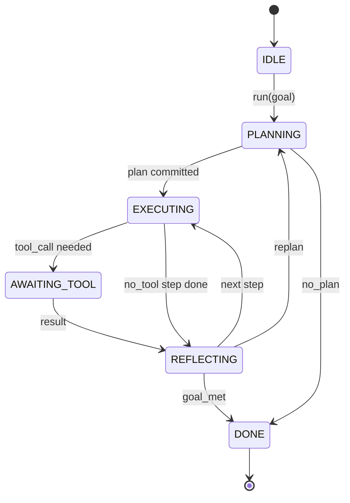

# 에이전트 하네스 루프 계약 (Agent Harness Loop Contract)

> 하네스(harness)가 곧 에이전트(agent)다. 모델은 코프로세서(coprocessor)다. 이 레슨은 어떤 모델이든 연결할 수 있는 루프 계약(loop contract)을 고정한다.

**Type:** Build
**Languages:** Python
**Prerequisites:** Phase 13 lessons 01-07, Phase 14 lesson 01
**Time:** ~90분

## 학습 목표 (Learning Objectives)
- 에이전트 하네스 루프를 명시적 전이(transition)를 갖는 결정론적 상태 기계(state machine)로 명세하기.
- 운영자가 정책, 텔레메트리(telemetry), 가드레일(guardrail)을 연결하는 열 개의 생명주기 훅(hook) 토픽 구현하기.
- 루프가 호출자에게 제어를 양보하고 새 입력으로 재개하는 두 개의 풀 포인트(pull point) 정의하기.
- 초과 시 부분 상태를 누출하지 않으면서 세션별 예산(턴, 도구 호출, 실시간) 시행하기.
- 다운스트림 UI와 추적기가 루프를 직접 검사하지 않고도 구독할 수 있도록 열한 가지 이벤트 타입의 타입화된 스트림 방출하기.

## 프레임 (The frame)

마흔 턴 동안 무인으로 실행되는 코딩 에이전트는 채팅 루프가 아니다. 운영자가 노드를 가로채고 간선을 감사할 수 있는 상태 기계다. 계약을 적어두는 순간, 모델·도구·정책을 교체하는 일은 더 이상 리팩터(refactor)가 아니라 등록(registration) 호출이 된다.

이 레슨은 그 계약을 만든다. 여섯 개의 상태, 열 개의 훅 토픽, 두 개의 풀 포인트, 열한 가지 이벤트 타입, 그리고 예산 봉투(budget envelope)에 이름을 붙인다. 하네스의 다른 모든 것(도구 레지스트리, JSON-RPC 전송, 디스패처, 플래너)은 이 형태에 꽂힌다.

## 상태 (The states)

루프에는 여섯 개의 상태가 있다. 다섯은 활성(active)이다. 하나는 종료(terminal)다.



`IDLE`은 유일하게 합법적인 진입점이다. `DONE`은 유일하게 합법적인 출구다. `AWAITING_TOOL`은 풀 포인트를 양보하는 유일한 상태다. 다른 모든 전이는 내부적이다.

상태 기계는 결정론적이다. 동일한 이벤트 로그가 주어지면, 하네스는 동일한 상태로 다시 진입한다. 이 속성 덕분에 모델을 다시 호출하지 않고도 디버깅용으로 세션을 재생(replay)할 수 있다.

## 훅 토픽 (The hook topics)

훅은 루프로 들어가는 운영자의 이음매(seam)다. 하네스는 열 개의 토픽을 발사한다. 각 토픽은 임의 수의 구독자(subscriber)를 받는다. 구독자는 등록 순서로 발사된다. 구독자는 페이로드를 변형하거나, 예외를 일으켜 턴을 중단하거나, 센티넬(sentinel)을 반환해 다음 스텝을 건너뛸 수 있다.

```text
before_plan         after_plan
before_tool_call    after_tool_call
before_step         after_step
on_error
on_pause
on_budget_exceeded
on_complete
```

이 형태는 Claude Code, Cursor, OpenCode가 2025년 중반까지 수렴한 것을 반영한다. 이름은 기능적이며 브랜드가 아니다. `rm -rf`를 차단하는 훅은 `before_tool_call`에 산다. OpenTelemetry 스팬을 보내는 훅은 `after_step`에 산다. 일시 정지된 세션에서 재개하는 훅은 `on_pause`에 산다.

## 풀 포인트 (The pull points)

루프는 제어를 두 번 양보한다. 첫째는 도구 결과 없이 진척할 수 없을 때 `AWAITING_TOOL`에서. 둘째는 예산이 소진되거나 훅이 명시적으로 사람 검토를 요청할 때 `on_pause`에서.

풀 포인트는 예외가 아니라 반환(return)이다. 호출자는 하네스 상태를 검사하고, 하네스가 요청한 것을 가져온 뒤, `resume(payload)`를 호출한다. 하네스는 멈춘 곳에서 다시 시작한다. 이것은 Python 제너레이터(generator)와 동일한 형태다. 풀 포인트 너머의 전송은 구현하기 나름이다. TUI에서는 키 입력이다. MCP에서는 `tools/call`이다. 큐에서는 작업 폴(job poll)이다.

## 이벤트 스트림 (The event stream)

루프는 계약의 특정 지점에서 타입화된 스트림에 이벤트를 추가한다. 스트림은 추가 전용(append-only)이며 구독자는 어떤 오프셋(offset)에서든 재생할 수 있다. 구현된 열한 가지 이벤트 타입은 다음과 같다:

- `session.start` — `run(goal)`이 호출될 때 한 번 방출됨
- `plan.draft` — 플래너가 초안 계획을 반환할 때 방출됨
- `plan.commit` — 초안이 활성 계획으로 커밋된 후 방출됨
- `step.start` — 각 실행 스텝의 시작에서 방출됨
- `step.end` — 각 실행 스텝의 끝에서 방출됨
- `tool.call` — 도구가 필요한 스텝이 호출자에게 제어를 양보할 때 방출됨
- `tool.result` — 도구 결과와 함께 재개할 때 방출됨
- `tool.error` — 오류와 함께 재개할 때 또는 훅이 호출을 중단할 때 방출됨
- `budget.warn` — 예산 한도에 도달할 때 방출됨
- `session.pause` — 루프가 일시 정지(예산 또는 훅)에서 양보할 때 방출됨
- `session.complete` — 루프가 `DONE`에 도달할 때 한 번 방출됨

이벤트는 훅 페이로드를 중복하지 않는다. 훅은 명령적(imperative)이다(변형, 중단). 이벤트는 관찰적(observational)이다(기록, 전송). 둘을 직교(orthogonal)하는 것으로 다룬다.

## 예산 봉투 (The budget envelope)

세션은 세 가지 한도를 지닌다. 턴 수, 도구 호출 수, 실시간 초(wall-clock seconds). 각 턴은 턴을 1 증가시킨다. 각 도구 호출은 도구 호출을 1 증가시킨다. 실시간은 모든 상태 전이에서 확인된다. 어떤 한도든 도달하면, 루프는 `on_budget_exceeded`를 발사하고, `budget.warn`을 방출한 뒤, 다음 풀 포인트에서 예산 초과(budget-exceeded) 사유와 함께 `IDLE`로 전이한다.

예산은 킬 스위치(kill switch)가 아니라 양보(yield)다. 호출자가 예산을 연장하고 재개할지, 아니면 세션을 닫을지 결정한다.

## 이 레슨이 하지 않는 것 (What this lesson does not do)

모델을 호출하지 않는다. 실제 도구를 등록하지 않는다. 전송을 구현하지 않는다. 그것들은 다음 네 개의 레슨이다. 이 레슨은 다음 네 개가 다시 작성하지 않고 꽂힐 수 있도록 계약을 못 박는다.

`main.py`의 결정론적 플래너는 대역(stand-in)이다. 세 스텝의 하드코딩된 계획을 반환하며, 그중 둘은 도구 결과를 요구한다. 핵심은 계획이 아니라 루프다.

## 코드를 읽는 법 (How to read the code)

`HarnessLoop`이 주 클래스다. 상태를 보유하고, 훅을 발사하며, 이벤트를 방출한다. `Budget`은 한도를 추적한다. `Event`는 스트림 위의 타입화된 봉투다. `HookRegistry`는 디스패치 테이블(dispatch table)이다. `_transition`은 상태를 바꾸는 유일한 함수이므로, 상태 기계 불변식(invariant)이 한 곳에 산다.

`main.py`를 위에서 아래로 읽어라. 그다음 `code/tests/test_loop.py`를 읽어라. 테스트는 모든 전이와 모든 훅 발사 순서를 고정한다.

## 더 나아가기 (Going further)

프로덕션에서 하네스를 만들 때 가장 어려운 부분은 상태 기계가 아니라 계약을 시행 가능하게 만드는 일이다. 계약은 플래너의 핫 리로드(hot reload)에서 살아남아야 한다. 잘못된 형식의 JSON을 반환하는 도구에서 살아남아야 한다. 마흔 턴 세션의 3분의 2 지점에서 `before_tool_call`에서 예외를 일으키는 훅에서 살아남아야 한다. 이 레슨의 테스트는 그 실패 모드들을 동작시킨다. 실행하라. 깨뜨려라. 케이스를 추가하라.

다음 레슨은 도구 레지스트리를 추가한다. 그다음은 JSON-RPC 전송. 그다음은 디스패처. 24번 레슨에 이르면, 이 파일의 루프는 실제 예산이 시행되는 상태에서 실제 도구에 대해 실제 계획을 실행하고 있을 것이다.
