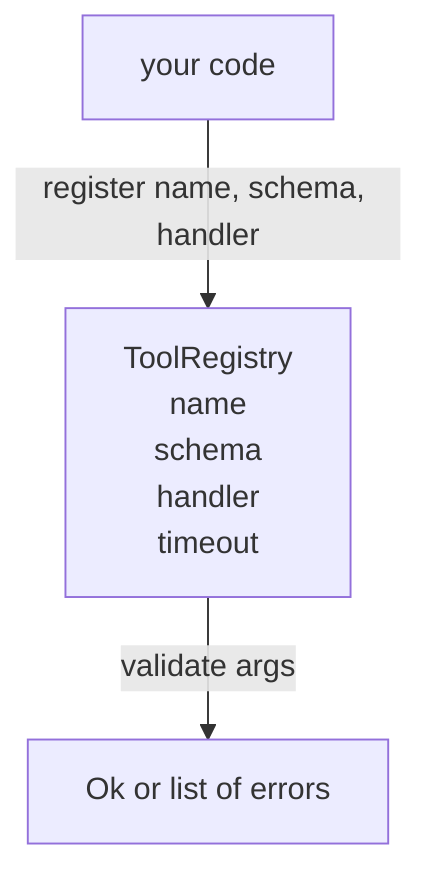

# 스키마 검증을 갖춘 도구 레지스트리 (Tool Registry with Schema Validation)

> 에이전트가 검증할 수 없는 도구는 에이전트가 호출할 수 없는 도구다. 도구를 만들기 전에 레지스트리(registry)와 스키마 검사기(schema checker)를 만들어라.

**Type:** Build
**Languages:** Python
**Prerequisites:** Phase 13 lessons 01-07, Phase 14 lesson 01
**Time:** ~90분

## 학습 목표 (Learning Objectives)
- 디스패처(dispatcher)가 한 번 묻고 이후 신뢰할 수 있는, 도구 이름 → 스키마 → 핸들러(handler)의 타입화된 레지스트리 보유하기.
- 도구 호출의 90%가 실제로 사용하는 키워드를 다루는 JSON Schema 2020-12 부분집합 구현하기.
- 모델이 한 번의 왕복(round trip)으로 자가 교정(self-correct)할 수 있도록 정밀하고 json-pointer 형태의 오류 경로 반환하기.
- 조용한 덮어쓰기(silent overwrite)가 프로덕션(production) 도구 카탈로그가 드리프트(drift)하는 방식이므로, 명시적 재정의(override) 없는 재등록 거부하기.
- 재생 로그(replay log)에서 다시 실행할 수 있도록 검증기(validator)를 순수(pure)하게(I/O 없음, 시간 없음, 전역 없음) 유지하기.

## 왜 레지스트리가 도구보다 먼저인가 (Why the registry comes before the tool)

2026년의 코딩 에이전트는 모델이 단일 컨텍스트 윈도우(context window)에 담을 수 있는 것보다 더 많은 등록된 도구를 가진다. 사소하지 않은 하네스(harness)는 200개의 도구를 등록하고 주어진 어떤 턴에서든 10~40개를 노출한다. 레지스트리는 "어떤 도구가 존재하는가", "그 인자(argument)는 어떤 형태인가", "어떤 핸들러를 호출하는가"에 대한 진실의 원천(source of truth)이다. 그 세 답이 고정되면, 하네스의 나머지는 추측을 멈출 수 있다.

우리가 피하는 실수는 스키마 없이 핸들러를 출하하거나, 검증 없이 스키마를 출하하는 것이다. 둘 다 흔하다. 그리고 둘 다 다음 계층(23번 레슨의 디스패처)을 추측 게임으로 만든다. 이때 유일한 실패 모드는 핸들러에서 나온 스택 트레이스(stack trace)뿐이다.

## 도구 레코드는 어떻게 생겼나 (What a tool record looks like)

```text
ToolRecord
  name        : str          (unique, lowercase alphanumeric and underscore segments separated by dots, e.g., snake_case.segment.case)
  description : str          (one line, shown to the model)
  schema      : dict         (JSON Schema 2020-12 subset)
  handler     : Callable     (async or sync, returns Any)
  idempotent  : bool         (dispatcher uses this for retry decisions)
  timeout_ms  : int          (override per-tool dispatcher default)
```

스키마는 검증기가 건드리는 유일한 필드다. 핸들러는 검증기에게 불투명(opaque)하다. 우리는 이 둘을 의도적으로 분리한다. 스키마는 데이터고, 핸들러는 코드다. 둘을 섞으면 검증 로직을 핸들러 안에 넣고 싶은 유혹이 생기는데, 그것이 바로 우리가 막는 버그다.

## JSON Schema 2020-12 부분집합 (The JSON Schema 2020-12 subset)

전체 2020-12 명세는 논문 한 편이다. 우리에게는 여덟 개의 키워드가 필요하다.

```text
type           string / number / integer / boolean / object / array / null
properties     map of property name -> schema
required       list of property names
enum           list of allowed primitive values
minLength      integer, applies to strings
maxLength      integer, applies to strings
pattern        ECMA-262-compatible regex, applies to strings
items          schema applied to every array element
```

그것으로 도구 API가 실제로 필요로 하는 것을 다루기에 충분하다. 우리가 추가하지 않는 키워드(oneOf, anyOf, allOf, $ref, 조건문)는 프로덕션 스키마에서 유효하지만, 검증기를 순환(cycle)을 다루는 트리 워커(tree walker)로 만들어 버린다. 우리는 레지스트리를 만드는 것이지 JSON Schema 엔진을 만드는 것이 아니다.

## Json pointer 오류 경로 (Json pointer error paths)

검증이 실패하면 검증기는 오류 목록을 반환한다. 각 오류는 입력으로 들어가는 json-pointer 경로를 지닌다. 포인터는 슬래시를 앞에 붙인 프로퍼티 이름과 배열 인덱스를 순서대로 나열한 것이다.

```text
{"a": {"b": [1, 2, "x"]}}
                    ^
                    /a/b/2
```

모델은 문장보다 오류 경로를 더 잘 읽는다. 스키마가 `args.user.email`을 요구하는데 모델이 정수를 전달했다면, 오류는 `expected_type: string`과 함께 `/user/email`이어야 한다. 모델은 자연어 한 차례 없이 다음 호출에서 그것을 고친다.

## 등록과 재정의 (Registration and override)

`register(name, schema, handler, **opts)`는 기본적으로 재등록을 거부한다. 호출자는 교체하려면 `override=True`를 전달해야 한다. 이것은 운영 위생(operational hygiene)이다. 코드베이스의 두 부분이 같은 도구 이름을 조용히 등록하는 것은 프로덕션에서 찾는 데 일주일이 걸리는 종류의 버그다.

레지스트리는 세 개의 읽기 메서드를 노출한다. `get(name)`은 레코드를 반환하거나 예외를 일으킨다. `validate(name, args)`는 `Ok` 또는 오류 목록을 반환한다. `names()`는 등록 순서로 도구 이름을 반환한다.

## 검증기는 무엇이고 무엇이 아닌가 (What the validator is and is not)

검증기는 스키마 트리를 한 번에 훑는 재귀 패스다. 또한 순수하다. 핸들러를 호출하지 않는다. 타입을 강제 변환(coerce)하지 않는다(문자열 `"42"`는 number 스키마를 통과하지 못한다). 조용히 잘라내지(truncate) 않는다.

검증기는 보안 경계(security boundary)가 아니다. 악의적 핸들러는 검증이 통과한 후에도 여전히 오작동할 수 있다. 23번 레슨의 디스패처가 타임아웃(timeout)과 샌드박스(sandbox) 계층을 추가한다. 레지스트리는 형태를 추가한다.

## 형태 (Shape)



## 코드를 읽는 법 (How to read the code)

`code/main.py`는 `ToolRegistry`, `ToolRecord`, `ValidationError`, 그리고 여덟 개의 검증기 함수를 정의한다. 검증기는 `schema["type"]`에 따라 디스패치한다(또는 `enum`을 가진 스키마를 타입 없는 enum 검사로 다룬다). 각 타입 검증기는 빈 목록 또는 `ValidationError` 목록을 반환한다. 최상위 워커는 오류를 연결하고 내려가면서 경로 세그먼트를 앞에 붙인다.

`code/tests/test_registry.py`는 등록, 재정의, 검증 성공, 경로를 갖는 검증 실패, 그리고 부분집합의 모든 키워드를 다룬다.

## 더 나아가기 (Going further)

이 레슨이 안착하면 곧 원하게 될 두 확장이 있다. 로컬 정의 블록(definitions block)에 대한 `$ref` 해소(resolution), 그리고 엄격한 형태를 위한 `additionalProperties: false`다. 둘 다 작다. 둘 다 도구 카탈로그가 50개 도구를 넘어 성장할 때 추가하기에 흔하다. 우리는 파일을 한 번의 읽기 분량 아래로 유지하기 위해 레슨에서 그것들을 뺐다.

다음 레슨(22번)은 이 레지스트리를 모델 클라이언트에 노출하는 JSON-RPC stdio 전송을 만든다. 그다음 레슨(23번)은 타임아웃과 재시도를 갖는 디스패처 뒤에 둘 다를 감싼다.
