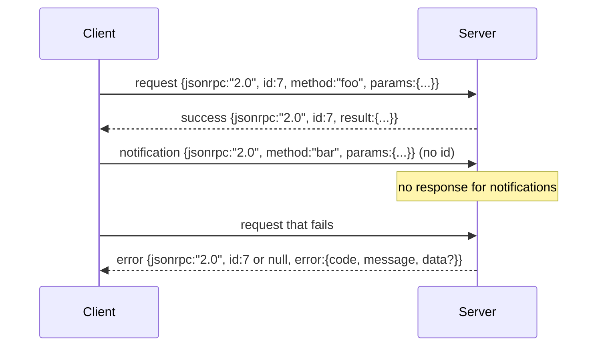

# 줄바꿈 구분 Stdio 위의 JSON-RPC 2.0 (JSON-RPC 2.0 Over Newline-Delimited Stdio)

> 모델 클라이언트와 도구 서버 사이의 전송(transport)은 stdio 위의 JSON-RPC다. 한 번 직접 손으로 만들어 보면 모든 프레이밍(framing) 계층이 무엇을 위해 비용을 치르는지 배우게 된다.

**Type:** Build
**Languages:** Python
**Prerequisites:** Phase 13 lessons 01-07, Phase 14 lesson 01
**Time:** ~90분

## 학습 목표 (Learning Objectives)
- stdin과 stdout 위에서 줄바꿈 구분(newline-delimited) JSON으로 프레이밍된 JSON-RPC 2.0 구사하기.
- 다섯 가지 표준 오류 코드(-32700, -32600, -32601, -32602, -32603)를 매핑하고 올바른 의미론으로 노출하기.
- 새로운 봉투(envelope) 키를 발명하지 않고 요청(request), 응답(response), 알림(notification), 배치(batch) 구별하기.
- 스트림의 나머지를 오염시키지 않으면서 줄당 하나의 파싱 오류 처리하기.
- 레슨이 자식 프로세스를 스폰(spawn)하지 않고 실행되도록 io.BytesIO를 사용해 자가 종료(self-terminating) 데모 만들기.

## 왜 JSON-RPC가 링구아 프랑카로 남는가 (Why JSON-RPC stays the lingua franca)

2026년의 코딩 에이전트(agent)는 단일 세션에서 아마 열두 개의 도구 서버와 대화한다. 각 서버는 별도 프로세스이거나 원격 엔드포인트다. 와이어 포맷(wire format)은 2013년 이래 동일하다. JSON-RPC 2.0은 두 페이지짜리 명세다. 대안들(gRPC, 호출별 HTTP, 커스텀 바이너리)이 모두 JSON-RPC가 부과하지 않는 트레이드오프(trade-off)를 부과하기 때문에 살아남는다: 이들은 스트리밍, 배칭, 전송 결합 중 하나를 택한다. JSON-RPC는 stdio, 소켓, 웹소켓, HTTP에 걸쳐 대칭적(symmetric)이며, 양쪽이 명세를 지키면 클라이언트는 한 번도 본 적 없는 서버를 구동할 수 있다.

이 레슨은 stdio 변형을 만든다. 줄바꿈 구분 JSON. 각 요청은 한 줄이다. 각 응답은 한 줄이다. 전송 경계는 `\n`이다.

## 와이어 형태 (The wire shape)

네 가지 봉투 형태가 존재한다. 둘은 클라이언트가 말한다. 둘은 서버가 말한다.



알림에는 `id`가 없다. 서버는 그것에 응답해서는 안 된다. 서버가 알림에 응답을 반환하면 클라이언트는 그 응답을 호출 지점(call site)에 붙일 방법이 없다. 그 단 하나의 규칙이 프레이밍 산술을 단순하게 유지한다.

배치는 요청 또는 알림의 JSON 배열이다. 서버는 응답의 배열로 답하며, 순서는 임의이고, 알림이 아닌 항목당 하나씩이다. 배치의 모든 항목이 알림이면, 서버는 아무것도 돌려보내지 않는다.

## 다섯 가지 오류 코드 (The five error codes)

```text
-32700  Parse error      JSON could not be parsed
-32600  Invalid Request  Envelope shape is wrong
-32601  Method not found
-32602  Invalid params
-32603  Internal error
```

-32000에서 -32099 사이의 코드는 서버 정의 오류용으로 예약되어 있다. 그 밖의 모든 것은 애플리케이션 정의다. 레슨은 다섯 개를 고수한다. 핸들러(handler)가 예외를 일으키면 전송은 그 예외를 `data.exception`에 예외 클래스 이름과 함께 -32603으로 감싼다.

파싱 오류에는 특별한 규칙이 있다. 응답의 `id`는 `null`인데, 요청이 id를 추출할 만큼 파싱된 적이 없기 때문이다.

## 줄바꿈 프레이밍과 BytesIO 데모 (Newline framing and the BytesIO demo)

전송은 한 번에 한 줄씩 읽는다. 한 줄은 `\n`까지 포함한 바이트다. 한 줄이 파싱될 수 없으면 전송은 `id: null`과 함께 -32700 응답을 쓰고 계속한다. 스트림은 오염되지 않는다. 다음 줄은 새로 파싱된다.

레슨에서는 `io.BytesIO` 쌍을 stdin과 stdout으로 감싼다. 서버는 EOF까지 요청을 읽고, 각각에 대해 응답을 쓰고, 반환한다. 클라이언트는 응답을 도로 읽는다. 프로세스 스폰 없음. 타임아웃 없음. Python의 `io` 인터페이스가 동일한 `.readline()`과 `.write()` 계약을 제시하기 때문에 전송 동작은 실제 서브프로세스 파이프(pipe)와 동일하다.

## 메서드 디스패치 (Method dispatch)

전송은 어떤 메서드가 존재하는지 모른다. 하네스(harness)가 제공하는 호출 가능 객체 `handler(method, params)`에 넘긴다. 핸들러는 결과를 반환하거나 예외를 일으킨다. 세 개의 예외 클래스가 특정 코드를 노출한다.

```text
MethodNotFound -> -32601
InvalidParams  -> -32602
Anything else  -> -32603 with exception name in data
```

전송은 도구 레지스트리(registry)를 결코 보지 않는다. 레지스트리는 핸들러 뒤에 자리한다. 이것이 우리가 원하는 계층화다. 전송은 JSON-RPC를 말한다. 레지스트리는 도구 형태를 말한다. 디스패처(23번 레슨)가 그것들을 함께 꿰맨다.

## 오류 시 스트림 동작 (Stream behavior on errors)

```text
client writes              server reads             server writes
---------------            -----------              -------------
{...valid request...}      parses ok                {...response, id matches...}
{...broken json...         parse fails              {id:null, error: -32700}
{...valid request...}      parses ok                {...response, id matches...}
{...missing method...}     invalid envelope         {id:X, error: -32600}
```

깨진 JSON 줄은 루프를 멈추지 않는다. 누락된 `method` 필드는 루프를 멈추지 않는다. 핸들러 예외는 루프를 멈추지 않는다. 전송은 EOF까지 계속 읽는다.

## 알림과 비대칭 흐름 (Notifications and asymmetric flows)

알림은 발사 후 망각(fire-and-forget)이다. 하네스는 진행 이벤트, 취소 신호, 로그 줄에 알림을 사용한다. 알림은 장시간 실행되는 도구가 각각에 대해 왕복하지 않고 상태 갱신을 스트리밍할 수 있는 방법이다.

레슨은 하나의 아웃바운드 알림 헬퍼 `write_notification`을 구현한다. 서버는 요청이 진행 중일 때 진행 상황을 방출하기 위해 그것을 사용한다. 데모는 패턴을 보여준다: 요청이 들어오고, 핸들러가 두 개의 진행 알림을 방출한 뒤, 최종 응답을 쓴다.

## 코드를 읽는 법 (How to read the code)

`code/main.py`는 `StdioTransport`, 파싱 헬퍼(`parse_request`), 세 개의 쓰기 헬퍼(`write_response`, `write_error`, `write_notification`), 그리고 디스패치 루프 `serve`를 정의한다. 오류 코드 상수는 모듈 스코프에 산다.

`code/tests/test_transport.py`는 다섯 가지 오류 코드, 알림(응답이 쓰이지 않음), 배치(배열 입력, 배열 출력, 알림 건너뜀), 깨진 JSON(파싱 오류 후 계속), 그리고 핸들러가 호출 도중 알림을 쓰는 비대칭 흐름을 다룬다.

## 더 나아가기 (Going further)

이 전송은 뒤따르는 레슨들에 충분하다. 프로덕션 전송은 세 가지를 추가한다. 포워딩(forwarding)에서 살아남는 상관관계 id 필드(여기서 쓰는 `id`가 이미 이것이지만, 메시(mesh)에서는 외부 트레이스 id도 필요하다). 취소 채널(진행 중 호출의 id를 갖는 `$/cancelRequest` 같은 알림). 그리고 동일한 소켓이 JSON-RPC와 Streamable HTTP를 말할 수 있도록 하는 콘텐츠 타입 협상 핸드셰이크(handshake). 그중 어느 것도 와이어를 바꾸지 않는다. 모두 메타데이터를 추가할 뿐이다.
