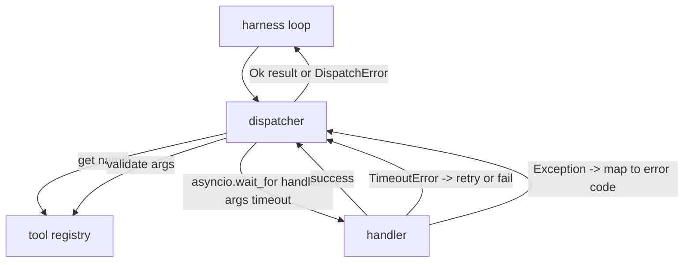
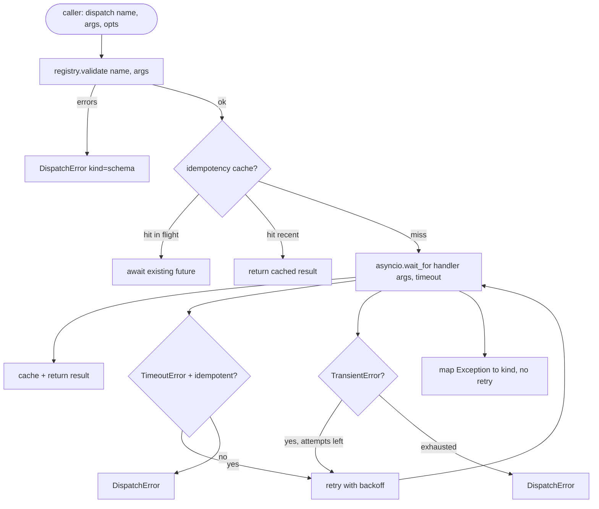

# 함수 호출 디스패처 (Function Call Dispatcher)

> 디스패처(dispatcher)는 하네스(harness)가 스키마(schema)가 한 모든 약속의 비용을 치르는 곳이다. 타임아웃(timeout), 재시도(retry), 중복 제거(dedupe), 오류 매핑. 모두 하나의 이음매(seam) 위에서.

**Type:** Build
**Languages:** Python
**Prerequisites:** Phase 13 lessons 01-07, Phase 14 lesson 01
**Time:** ~90분

## 학습 목표 (Learning Objectives)
- 루프를 멈추게 하는 대신 타입화된 오류를 반환하는 호출별 타임아웃으로 도구 핸들러(handler) 감싸기.
- 지터(jitter)와 최대 시도 횟수를 갖는 지수 백오프(exponential backoff) 재시도 적용하기.
- 느린 원본과 경합(race)하는 재시도가 두 번 실행되지 않도록 멱등성 키(idempotency key)로 재시도 중복 제거하기.
- 핸들러 예외와 전송 결함을 하네스 루프가 이미 이해하는 단일 오류 봉투(error envelope)로 매핑하기.
- 마흔 개의 도구 호출 팬아웃(fan-out)이 이벤트 루프를 소진하지 않도록 동시성 한도(concurrency limit)로 병렬 디스패치 제한하기.

## 디스패처가 자리하는 곳 (Where the dispatcher sits)

하네스 루프(20번 레슨)와 도구 레지스트리(21번 레슨) 사이다. 전송(22번 레슨)은 루프에 공급한다. 루프는 도구 호출을 디스패처에 넘긴다. 디스패처는 레지스트리를 호출하고 핸들러를 실행하며, 결과 또는 JSON-RPC 형태의 오류 봉투를 반환한다.



디스패처는 타이머, 재시도, 멱등성을 아는 유일한 계층이다. 루프는 모른다. 레지스트리는 모른다. 핸들러는 모른다. 그 격리(isolation)가 핵심이다.

## 타임아웃 (Timeouts)

각 도구는 기본 타임아웃을 가진다. 레지스트리 레코드는 `timeout_ms`를 지닌다. 디스패처는 하네스가 호출별 재정의(override)를 전달하면 그것으로 덮어쓴다. 우리는 `asyncio.wait_for`를 사용한다. 타임아웃 시, 핸들러 태스크는 취소되고 디스패처는 `DispatchError(kind="timeout")`을 반환한다.

타임아웃은 비멱등(non-idempotent) 도구에서는 기본적으로 재시도 가능한 오류가 아니다. 타임아웃된 `db.write`는 커밋되었을 수도 아닐 수도 있다. 재시도는 쓰기를 중복시킨다. 디스패처는 레지스트리 레코드의 `idempotent` 플래그를 존중한다. 멱등 도구는 재시도한다. 비멱등 도구는 재시도하지 않는다.

## 지수 백오프를 갖는 재시도 (Retries with exponential backoff)

재시도 정책은 최대 세 번 시도다. 백오프는 지터를 갖는 지수다.

```text
attempt 1  -> delay 0
attempt 2  -> delay 0.1s * (1 + random[0..0.5])
attempt 3  -> delay 0.4s * (1 + random[0..0.5])
```

`timeout`과 `transient` 오류만 재시도한다. `schema` 오류, `not_found`, 또는 `internal` 오류는 재시도하지 않는다. 스키마 오류는 결정론적이다. 재시도는 결과를 바꾸지 않고 예산을 태운다.

재시도 루프는 하네스의 예산을 존중한다. 호출자의 예산에 남은 도구 호출이 0이면, 디스패처는 첫 시도에서 빠르게 실패하고 `kind="budget_exceeded"`를 반환한다.

## 멱등성 키 중복 제거 (Idempotency key dedupe)

원본이 아직 진행 중일 때 발사되는 재시도는 실제 프로덕션 버그다. 첫 호출이 4.9초(타임아웃 바로 아래)에 멈춘다. 재시도가 5초에 발사된다. 이제 두 요청이 같은 백엔드에 대해 경합한다. 도구가 `payments.charge`라면 두 번 청구된다.

디스패처는 선택적 `idempotency_key`를 받는다. 호출이 도착할 때 같은 키가 진행 중이면, 디스패처는 진행 중 퓨처(future)를 기다려 그 결과를 반환한다. 캐시는 늦은 재시도를 흡수하기 위해 완료 후 60초 동안 키를 보유한다.

키는 호출자의 책임이다. 하네스는 플래너(planner)에서 그것을 유도한다: `f"{step_id}:{tool_name}:{hash(args)}"`. 인자만으로 키를 유도하면 의미가 다른 두 호출이 같아 보이기 때문에, 디스패처는 키를 만들어내지 않는다.

## 오류 봉투 (Error envelope)

실패한 디스패치는 단일 형태를 반환한다.

```text
DispatchError
  kind        : "timeout" | "transient" | "schema" | "not_found" | "internal" | "budget_exceeded"
  message     : str
  attempts    : int
  jsonrpc_code: int   (one of -32601, -32602, -32603)
```

하네스 루프는 `kind`를 다음 상태로 매핑한다. `schema`와 `not_found`는 `on_error`로 가서 재계획(replan)을 촉발한다. `timeout`과 `transient`는 `on_error`로 가며 시도 횟수에 따라 재계획할 수도 아닐 수도 있다. `budget_exceeded`는 `on_budget_exceeded`를 촉발한다.

## 팬아웃에 대한 동시성 한도 (Concurrency limit on fan-out)

`gather(*calls)`는 모든 코루틴(coroutine)을 동시에 실행한다. 마흔 개의 도구 호출이면 마흔 개의 열린 소켓 또는 마흔 개의 서브프로세스 파이프다. 대부분의 백엔드는 한 클라이언트로부터의 마흔 개 병렬 연결을 좋아하지 않는다.

디스패처는 `gather`를 세마포어(semaphore)로 감싼다. 기본 동시성 한도는 8이다. 각 호출은 디스패치 전에 세마포어를 획득하고 완료 시 해제한다. 호출자는 `gather` 형태의 출력을 보지만 실제 스케줄링은 제한되어 있다.

## 한 호출의 흐름 (Flow for one call)



## 코드를 읽는 법 (How to read the code)

`code/main.py`는 `Dispatcher`, `DispatchError`, `TransientError`를 정의한다. 디스패처는 생성 시 레지스트리를 받는다. 비동기 `dispatch(name, args, ...)`가 유일한 진입점이다. 시도별 타임아웃은 `asyncio.wait_for`를 사용해 `_run_with_retries` 안에서 인라인으로 적용된다. `gather_bounded(calls)`는 동시성 한도로 여러 디스패치를 실행한다.

`code/tests/test_dispatcher.py`는 타임아웃 발생, transient에 대한 재시도, 스키마 오류에 대한 무재시도, 멱등성 중복 제거(같은 키를 갖는 두 동시 호출이 하나의 핸들러 호출로 붕괴함), 그리고 동시성 제한(세마포어의 동작)을 다룬다.

테스트는 `asyncio.sleep(0)`과 결정론적 `Counter` 기반 핸들러를 사용하므로, 밀리초 안에 끝나고 실시간 타이밍에 의존하지 않는다.

## 더 나아가기 (Going further)

프로덕션 디스패처가 추가하는 두 확장. 첫째, 모든 전이에서의 구조화된 로깅(이것은 루프의 이벤트 스트림이 이미 제공하지만, 디스패처도 `dispatch.attempt`와 `dispatch.retry` 이벤트를 방출해야 한다). 둘째, 서킷 브레이커(circuit breaker): 윈도우 내 N회 실패 후, 도구는 디스패치가 핸들러를 시도하는 대신 즉시 `kind="circuit_open"`을 반환하는 냉각(cool-down) 기간을 갖는다. 둘 다 계약을 바꾸지 않고 이 디스패처 위에 그대로 얹힌다.

24번 레슨은 디스패처를 계획-실행(plan-and-execute) 에이전트에 붙여, 네 조각 모두가 움직이는 것을 보게 한다.
