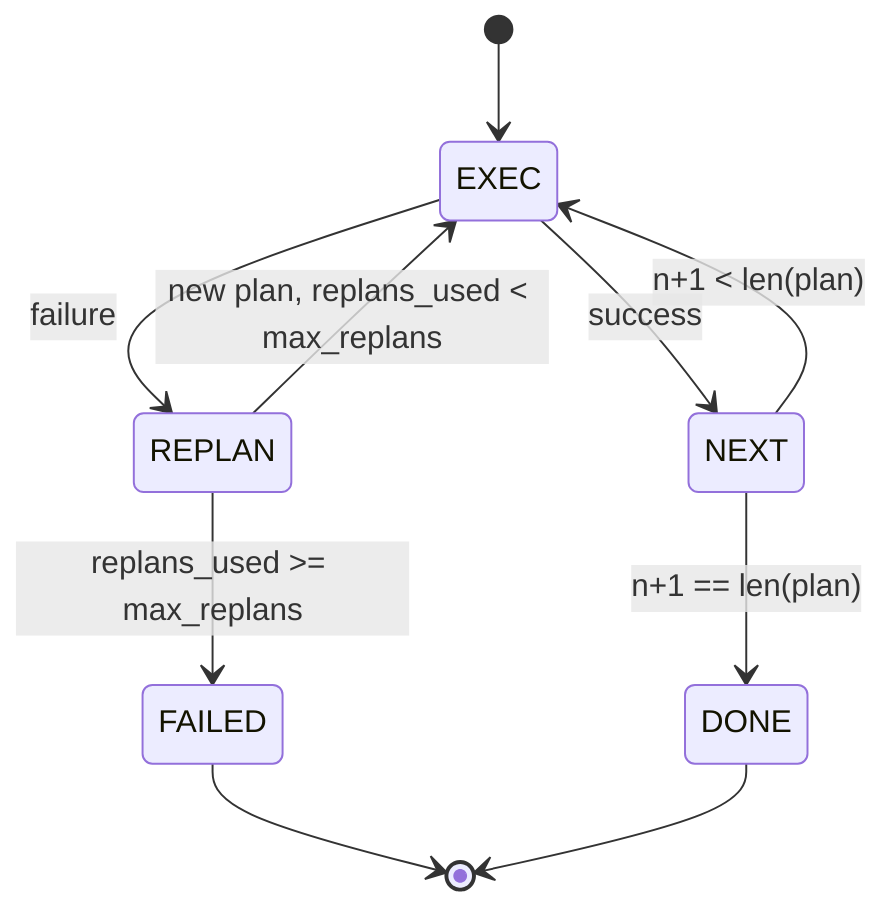

# 계획-실행 제어 흐름 (Plan-Execute Control Flow)

> 실패에서 살아남을 수 없는 계획은 스크립트(script)다. 재계획(replan)할 수 있는 스크립트는 에이전트(agent)다. 재계획기(replanner)를 먼저 만들어라.

**Type:** Build
**Languages:** Python
**Prerequisites:** Phase 13 lessons 01-07, Phase 14 lesson 01
**Time:** ~90분

## 학습 목표 (Learning Objectives)
- 실행기(executor)가 진척과 결과에 대해 추론할 수 있도록 계획을 타입화된 스텝(step)의 정렬된 목록으로 표현하기.
- 플래너(planner)로 되돌리는 통제된 실패 인계(failure handoff)와 함께 스텝을 순차적으로 실행하기.
- 다음 계획이 정보에 입각하도록 직전 오류를 컨텍스트에 담아 현재 커서(cursor)에서 재계획하기.
- 다운스트림 추적기나 UI가 계획이 왜 바뀌었는지 보여줄 수 있도록 각 개정(revision)에서 계획 차이(plan diff) 방출하기.
- 두 가지 예산 시행하기: 하드 스텝 상한과 하드 재계획 상한.

## 사고 연쇄가 아니라 계획-실행 (Plan and execute, not chain-of-thought)

사고 연쇄(chain-of-thought) 에이전트는 토큰을 방출하고 루프가 도구 호출이 어디서 끝나는지 추측하게 둔다. 계획-실행(plan-and-execute) 에이전트는 먼저 구조화된 계획을 방출한 뒤, 각 스텝을 결정론적으로 실행한다. 계획은 하네스(harness)가 내성(introspect)할 수 있는 데이터다. 실행은 하네스가 그 데이터를 디스패처(dispatcher)로 돌리는 단계다.

두 조각. 계획을 생산하는 플래너. 계획을 실행하는 실행기. 흥미로운 작업은 실행기가 실패에 부딪칠 때 일어나는 일이다. 세 가지 옵션:

```text
1. Abort         (return failed, surface the error)
2. Skip          (mark step failed, continue with the rest)
3. Replan        (hand the error to the planner, get a new plan from the cursor)
```

재계획은 스크립트를 에이전트로 바꾸는 것이다.

## Step 형태 (The Step shape)

```text
Step
  id              : int           (monotonic within a plan revision)
  tool_name       : str
  args            : dict
  expected_outcome: str           (planner's stated success condition)
  result          : Any | None
  error           : str | None
```

`expected_outcome`은 플래너가 스텝과 함께 방출하는 짧은 문장이다. 실행기가 강제하지는 않는다. 두 가지 쓰임이 있다. 하나는 재계획기가 계획을 개정할 때 이 문장을 읽는다는 것이고, 다른 하나는 이벤트 스트림이 이를 방출해 추적기가 "이 스텝은 X를 하기로 되어 있었다"를 보여줄 수 있다는 것이다.

## 플래너 형태 (The planner shape)

```python
def planner(goal: str, history: list[Step], last_error: str | None) -> list[Step]:
    ...
```

순수 함수다. `goal`은 사용자 목표다. `history`는 이미 실행된 스텝들이다(결과와 오류가 채워진 채). `last_error`는 첫 호출에서는 None이고 이후 모든 호출에서는 가장 최근의 실패 메시지다. 플래너는 커서에서 시작하는 다음 계획을 반환한다.

플래너는 실행기에 대해 모른다. 재시도에 대해 모른다. 타임아웃에 대해 모른다. 계획을 생산한다. 그게 전부다.

## 실행기 (The executor)

실행기는 작은 상태 기계(state machine)다. 각 스텝은 디스패처를 통해 실행된다. 결과는 세 가지 중 하나다: 성공, 실패-재계획 가능, 실패-치명적. 재계획 가능한 실패는 플래너로 되돌린다. 치명적 실패(예산 초과나 재계획 상한 도달)는 `FAILED` 세션 결과를 반환한다.



## 개정 시 계획 차이 (Plan diffs on revision)

플래너가 실패 후 새 계획을 반환하면, 실행기는 세 필드를 갖는 `plan.diff` 이벤트를 방출한다.

```text
removed: list of step ids that were in the old plan and are not in the new
added  : list of step ids in the new plan that were not in the old
revised: list of step ids whose tool_name or args changed
```

추적기나 UI는 이것을 제거된 스텝에 대한 취소선과 추가된 스텝에 대한 강조로 렌더링할 수 있다. 핵심은 차이 형식이 아니다. 핵심은 개정이 조용한 재작성이 아니라 가시적 이벤트라는 점이다.

## 두 예산, 둘 다 하드 (Two budgets, both hard)

`max_steps`는 재계획을 포함해 세션 전체에 걸친 총 스텝 실행을 제한한다. 기본은 열둘이다. 두 번 재계획하고 매번 세 스텝을 추가하는 선형 다섯 스텝 계획은 열여섯 실행에 도달하여 예산을 초과한다. 실행기는 재계획을 거부하고 FAILED를 반환한다.

`max_replans`는 첫 계획 이후 플래너가 호출되는 횟수를 제한한다. 기본은 다섯이다. 이것이 더 중요한 한도다. 같은 깨진 계획을 연속 다섯 번 반환하는 플래너는 그렇지 않으면 스텝 예산이 잡을 때까지 루프할 것이다. 재계획을 제한하면 실패가 더 빨라지고 이유가 더 명확해진다.

## 이 레슨의 결정론적 플래너 (The deterministic planner in this lesson)

이 레슨에서 우리는 모델을 호출하지 않는다. 레슨은 `last_error`를 기반으로 계획을 고르는 결정론적 플래너를 출하한다.

```text
last_error is None    -> emit a four-step plan
last_error matches X  -> emit a three-step plan that routes around X
last_error matches Y  -> emit a two-step plan that gives up gracefully
otherwise             -> return [] (signals nothing to replan)
```

이것으로 실행기의 동작을 모든 전이 경로에서 테스트하기에 충분하다: 성공, 한 번 재계획, 두 번 재계획, 재계획 소진, 그리고 스텝 예산 소진.

## 결과 형태 (Result shape)

```text
SessionResult
  status      : "completed" | "failed"
  reason      : str     ("goal_met" | "step_budget" | "replan_budget" | "no_plan")
  history     : list[Step]
  revisions   : list[PlanDiff]
  events      : list[Event]
```

20번 레슨의 하네스 루프는 이것을 직접 읽을 수 있다. 23번 레슨의 디스패처가 각 스텝을 실행한다. 21번 레슨의 레지스트리가 각 스텝의 인자를 검증한다. 22번 레슨의 전송이 이 전체 흐름을 JSON-RPC로 모델 클라이언트에 노출한다.

## 코드를 읽는 법 (How to read the code)

`code/main.py`는 `PlanExecuteAgent`, `Step`, `PlanDiff`, `SessionResult`, 그리고 결정론적 플래너를 정의한다. 실행기는 `SessionResult`를 반환하는 단일 `run(goal)` 메서드다. 계획 차이는 스텝 id와 `(tool_name, args)` 튜플을 비교해 계산된다.

`code/tests/test_agent.py`는 선형 성공, 한 번 재계획하는 계획 중간 실패, `failed:replan_budget`을 반환하는 재계획 소진, 스텝 예산 소진, 그리고 계획 차이 이벤트 형식을 다룬다.

## 더 나아가기 (Going further)

이것을 실제 모델에 연결하면 곧 아쉬워질 두 확장이 있다. 첫째, 부분 계획 캐싱(partial-plan caching)이다. 여섯 스텝 중 처음 셋이 성공한 뒤 실패하면, 처음 셋을 다시 실행할 이유가 없다. 실행기는 이미 history를 유지한다. 플래너는 그것을 읽기만 하면 된다. 둘째, 병렬 분기(parallel branch)다. 현재 실행기는 엄격히 순차적이다. 독립 분기(`next_step` 대신 `gather_step`)를 방출하는 플래너는 디스패처를 통해 두 도구 호출을 동시에 실행할 수 있다.

둘 다 실제 복잡성을 더한다. 둘 다 선형 실행기가 고정된 후에 추가하기가 더 쉽다. 그것이 이 레슨이 하는 일이다.
