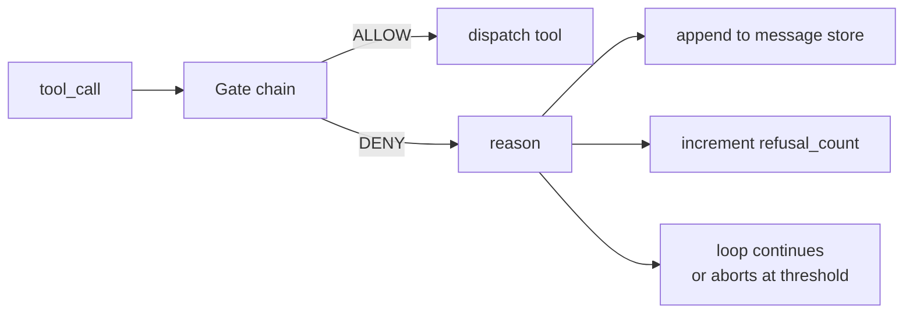
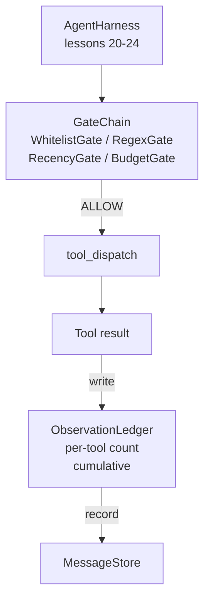

# 캡스톤 레슨 25: 검증 게이트와 관찰 예산 (Verification Gates and the Observation Budget)

> 검증 계층이 없는 에이전트 하네스(agent harness)는 트렌치코트를 입은 소망일 뿐이다. 이 레슨은 도구 호출이 발사되도록 허용되는지, 그 출력의 얼마만큼을 에이전트가 보도록 허용되는지, 그리고 에이전트가 너무 많이 읽었기 때문에 루프가 언제 멈춰야 하는지를 결정하는 결정론적 게이트 체인(gate chain)을 만든다. 이 체인은 작고 명명된 게이트들의 함수에, 모델에게 보여진 모든 토큰을 추적하는 관찰 원장(observation ledger)을 더한 것이다.

**Type:** Build
**Languages:** Python (stdlib)
**Prerequisites:** Phase 19 · 20-24 (Track A1: agent loop, tool registry, message store, prompt builder, model router), Phase 14 · 33 (instructions as constraints), Phase 14 · 36 (scope contracts), Phase 14 · 38 (verification gates)
**Time:** ~90분

## 학습 목표 (Learning Objectives)

- 결정론적 `evaluate(call)` 메서드를 갖는 `VerificationGate` 프로토콜 만들기.
- 단락(short-circuit) 의미론과 함께 예산, 최근성(recency), 화이트리스트(whitelist), 정규식(regex) 게이트를 체인으로 조합하기.
- 도구와 턴(turn)으로 키가 지정된 `ObservationLedger`를 통해 모든 관찰 추적하기.
- 누적 관찰 예산이 초과될 때 도구 호출 거부하기.
- 다운스트림 관측성이 수집할 수 있는 구조화된 `GateDecision` 레코드 노출하기.

## 문제 (The Problem)

에이전트 하네스가 모델이 도구를 자유롭게 호출하도록 두면, 실제 사용 첫 한 시간 안에 세 부류의 버그가 나타난다.

첫째는 제한 없는 관찰(unbounded observation)이다. 20만 줄 레포에 걸친 grep이 50만 토큰의 출력을 다음 턴에 쏟아붓는다. 모델은 킬로바이트당 하나의 매치를 보고 나머지 컨텍스트는 낭비된다. 토큰 청구액은 크고 에이전트는 이제 작업에서 더 나아진 게 아니라 더 나빠졌다.

둘째는 오래된 최근성(stale recency)이다. 장시간 실행되는 작업이 쉰 개의 도구 호출을 누적한다. 모델은 3번 턴의 첫 read_file을 마치 실시간 상태인 양 다시 읽는다. 47번 턴에서 한 편집은 결코 나타나지 않는데, 프롬프트 빌더(prompt builder)가 가장 이른 관찰을 먼저 직렬화했기 때문이다.

셋째는 권한 확대(privilege creep)다. 연구 작업이 `web_search`를 호출하며 시작하지만, 어쩌다 `shell`을 실행하는 것으로 끝난다. 모델이 도구 이름을 발명했고 하네스가 관대함(permissive)으로 기본 설정되었기 때문이다. 누군가 트레이스를 읽을 즈음에는, 정크 파일이 /tmp에 있고 curl이 비공개 API에 대해 실행된 상태다.

검증 게이트(verification gate)는 "아니오"라고 말하는 하네스 구성 요소다. 그것은 모델이 아니다. 판정자(judge)가 아니다. 그것은 `(call, history, ledger)`의 결정론적 함수로, ALLOW 또는 DENY를 이유와 함께 반환한다. 이유는 로깅된다. 모델에게 알려진다. 루프는 계속되거나 중단된다.

## 개념 (The Concept)



게이트는 `evaluate(call, ctx) -> GateDecision` 메서드를 가진 무엇이든이다. 체인은 정렬된 목록이다. 평가는 첫 거부에서 단락된다. 순서가 중요하다: 값싼 구조적 게이트가 비싼 토큰 계수 게이트보다 먼저 실행된다.

이 레슨은 네 개의 게이트를 출하한다:

- `WhitelistGate`. 허용된 도구 이름은 명시적 집합이다. 그 밖의 모든 것은 거부된다. 이것이 가장 값싼 게이트이며 먼저 실행된다.
- `RegexGate`. 도구 인자가 정규식에 대해 매칭된다. `rm -rf`를 담은 셸 호출이나 내부 IP에 대한 HTTP 호출을 거부하는 데 유용하다. 호출 페이로드에 대해 순수하다.
- `RecencyGate`. 모델은 마지막 N개 턴의 관찰만 본다. 더 오래된 관찰은 마스킹된다. 게이트는 결과가 이미 오래되어 사라진 관찰 윈도우를 확장할 도구 호출을 거부한다.
- `BudgetGate`. 세션에 걸쳐 모델이 읽은 누적 토큰에는 상한이 있다. 원장이 상한에 도달했다고 말하면, 이후 모든 도구 호출은 거부된다.

관찰 원장은 부기(bookkeeping)다. 성공한 모든 도구 호출은 한 행을 쓴다: 도구 이름, 턴, 방출된 토큰, 누적. 원장은 두 질문에 답한다: 모델이 총 얼마나 봤는가, 그리고 도구 X를 얼마나 봤는가. 예산 게이트는 첫째를 읽는다. 연습으로 작성할 도구별 예산 게이트는 둘째를 읽는다.

## 아키텍처 (Architecture)



하네스는 체인에게 묻는다. 체인은 끄덕이거나 거부한다. 끄덕이면, 도구가 실행되고, 원장이 똑딱이며, 결과가 메시지 저장소(message store)에 추가된다. 거부하면, 모델에게 거부가 시스템 메시지로 건네지고 루프는 재시도할지 중단할지 결정한다.

## 무엇을 만들 것인가 (What you will build)

구현은 단일 `main.py`에 테스트를 더한 것이다.

1. `Observation`과 `ToolCall` 데이터클래스가 와이어 형태(wire shape)를 정의한다.
2. `ObservationLedger`는 `(turn, tool, tokens)` 행을 기록하고 `cumulative()`와 `per_tool(name)`에 답한다.
3. `GateDecision`은 `(allow, reason, gate_name)`을 지닌다.
4. `VerificationGate`는 프로토콜이다. 각 게이트는 `evaluate(call, ctx)`를 구현한다.
5. `GateChain`은 정렬된 목록을 감싼다. 각 게이트를 호출하고, 첫 거부를 반환하거나, 모든 게이트가 통과하면 허용을 반환한다.
6. 데모는 아주 작은 합성 에이전트 루프를 실행한다. 세 턴. 세 번째 턴이 예산 게이트를 건드리고 루프는 0이 아닌 거부 수와 함께 깔끔한 거부를 보고한다.

토큰 계수기는 의도적으로 멍청한 `len(text) // 4` 휴리스틱이다. 이 레슨의 핵심은 토크나이저(tokenizer)가 아니라 게이트 배관(plumbing)이다. 프로덕션에서는 실제 토크나이저를 끼워 넣어라.

## 왜 체인 순서가 중요한가 (Why the chain order matters)

거부는 허용보다 값싸다. `WhitelistGate`는 O(1) 해시 조회로 실행된다. `RegexGate`는 O(pattern * argv)로 실행된다. `RecencyGate`는 메시지 저장소의 작은 슬라이스를 읽는다. `BudgetGate`는 전체 원장을 읽는다. 거부된 호출이 비싼 작업을 하기 전에 단락되도록 비용 오름차순으로 정렬한다.

또한 폭발 반경(blast radius)으로 정렬한다. 화이트리스트는 가장 강한 주장이다: 이 도구는 계약에 없다. 정규식 게이트가 다음이다: 이 인자는 계약에 없다. 최근성이 그다음이다: 하네스는 여전히 신경 쓰지만 호출은 구조적으로 합법이다. 예산이 마지막인데, 정의상 다른 모든 것이 통과했을 때만 발사되기 때문이다.

## 이것이 Track A의 나머지와 어떻게 조합되는가 (How this composes with the rest of Track A)

이전 레슨들은 루프, 도구 레지스트리, 메시지 저장소, 프롬프트 빌더, 모델 라우터(model router)를 주었다. 이 레슨은 모델과 도구 사이의 계층을 추가한다. 26번 레슨은 게이트 체인이 ALLOW라고 말하면 디스패처가 도구 호출을 넘기는 샌드박스(sandbox)를 출하한다. 27번 레슨은 거부 수를 품질 신호로 기록하는 평가 하네스(eval harness)를 출하한다. 28번 레슨은 게이트 결정을 OpenTelemetry 스팬(span)에 연결한다. 29번 레슨은 그 전부를 작동하는 코딩 에이전트로 꿰맨다.

## 실행하기 (Running it)

```bash
cd phases/19-capstone-projects/25-verification-gates-observation-budget
python3 code/main.py
python3 -m pytest code/tests/ -v
```

데모는 모든 게이트 결정을 포함한 턴별 트레이스를 출력하고 0으로 종료한다. 테스트는 원장, 격리된 각 게이트, 체인 단락, 그리고 합성 루프를 종단 간으로 다룬다.
