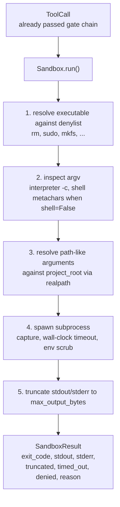
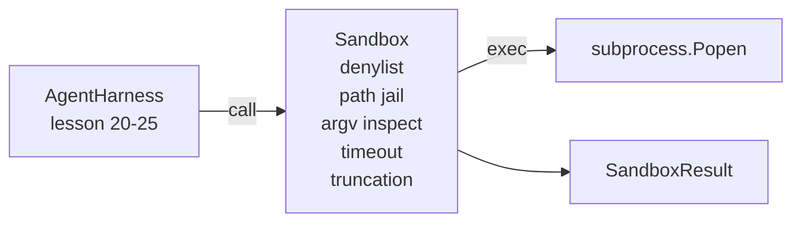

# Capstone Lesson 26: 거부 목록(Denylist)과 경로 감옥(Path Jail)을 갖춘 샌드박스 러너

> 검증 게이트(verification gate)는 어떤 도구 호출(tool call)을 실행할지를 결정한다. 샌드박스(sandbox)는 실행될 때 무슨 일이 벌어지는지를 결정한다. 이 레슨은 위험한 실행 파일을 거부하고, 위험한 argv 형태를 거부하며, 모든 파일 경로를 프로젝트 루트(project root)에 가두고, 과도하게 큰 출력을 잘라내며, 벽시계 시간 초과(wall-clock timeout)에 폭주하는 프로세스를 죽이는 서브프로세스 러너를 산출한다. 이것은 모델과 운영체제 사이에 놓이는 두 계층 중 두 번째다.

**Type:** Build
**Languages:** Python (stdlib)
**Prerequisites:** Phase 19 · 25 (verification gates and observation budget), Phase 14 · 33 (instructions as constraints), Phase 14 · 38 (verification gates)
**Time:** ~90분

## 학습 목표 (Learning Objectives)

- 시간 초과, 캡처, 절단(truncation) 기능을 갖춰 `subprocess.run`을 감싸는 `Sandbox` 클래스를 만든다.
- 거부 목록(denylist)에 따라 이름으로, argv 검사기에 따라 구조로 명령을 거부한다.
- 선언된 프로젝트 루트(project root) 밖으로 해석(resolve)되는 모든 경로 인자를 거부한다.
- 셸 모드(shell mode)가 꺼져 있을 때 셸 메타문자(shell metacharacter)를 거부한다.
- 하위(downstream) 관측성(observability)과 평가 하니스(eval harness)가 받아들일 수 있는 구조화된 `SandboxResult`를 반환한다.

## 문제 (The Problem)

셸로 빠져나갈 수 있는 코딩 에이전트(coding agent)는 단 한 번의 턴(turn)에 백도어를 설치하고, 키를 탈취하고, 개발자 노트북을 벽돌로 만들고, 클라우드 청구서를 쌓아 올릴 수 있다. 가장 비용이 적게 드는 방어는 애초에 셸을 주지 않는 것이다. 두 번째로 비용이 적게 드는 방어는 정확한 패턴 목록에 대해 거부하는 샌드박스다.

에이전트 트레이스(trace)에는 세 가지 부류의 실패가 반복적으로 나타난다.

첫 번째는 위험한 실행 파일이다. 경로 문제를 고치라는 압박을 받은 모델은 `sudo`, `chmod -R 777`, `rm -rf`, `mkfs`, `dd`를 시도할 것이다. 이들 중 어느 것도 에이전트 실행에 들어와서는 안 된다. 거부 목록은 이들을 이름과 별칭(alias)으로 잡아낸다.

두 번째는 argv 속임수다. 셸이 없다고 통보받은 모델은 인터프리터를 통해 공격을 흘려보낸다. `python3 -c "import os; os.system('rm -rf /')"`, `bash -c '...'`, `node -e '...'`, `perl -e '...'`. 샌드박스는 `-c` 같은 플래그로 실행되는 어떤 인터프리터든 그저 단계가 추가된 셸 호출일 뿐임을 알아야 한다.

세 번째는 경로 탈출(path escape)이다. 모델은 `./src/main.py`를 읽으라는 지시를 받고 대신 `../../etc/passwd`를 읽는다. 샌드박스는 모든 경로 인자를 `os.path.realpath`로 해석하고 접두사를 단언(assert)하여 가둔다.

샌드박스는 운영체제적 의미에서의 보안 경계(security boundary)가 아니다. 코드 실행 권한을 가진 단호한 공격자는 여전히 탈출할 수 있다. 샌드박스는 개발 시점의 가드레일(guardrail)이다. 흔한 실패 모드를 시끄럽게 만들고, 에이전트가 순전한 무능으로 인해 피해를 입히는 것을 막는다.

## 개념 (The Concept)



샌드박스에는 네 가지 거부 축(axis)이 있다. 이름, argv, 경로, 구조. 각 축은 호출의 순수 함수(pure function)이며, 아직 서브프로세스는 없다. 서브프로세스는 모든 축을 통과한 뒤에야 생성된다.

`SandboxResult`의 종료 코드(exit code)는 관습적인 것들이다. 0은 성공, 0이 아닌 값은 실패이고, 여기에 denied(-100), timed_out(-101)를 위한 세 가지 센티넬 코드(sentinel code)와 truncated(종료 코드는 실제 값이고 플래그가 설정됨)가 더해진다. 하위 레슨들은 stderr를 파싱하는 대신 이 구조화된 결과를 읽는다.

## 아키텍처 (Architecture)



거부 목록은 실행 파일 기본 이름(basename)의 frozenset이다. 별칭(`/bin/rm`, `/usr/bin/rm`)은 모두 같은 기본 이름으로 해석된다. argv 검사기는 인터프리터 형태를 안다. argv[0]이 인터프리터이고 이후 어떤 인자든 `-c`나 `-e`로 시작하는 argv는 거부된다. 셸 메타문자(`;`, `|`, `&`, `>`, `<`, 백틱, `$()`)는 호출이 명시적으로 셸을 요청하지 않았을 때 거부를 유발한다.

경로 감옥(path jail)은 가장 미묘한 부분이다. 샌드박스는 생성 시점에 `project_root`를 받는다. 경로처럼 보이는(`/`를 포함하거나 기존 파일과 일치하는) 모든 인자는 `os.path.realpath`로 정규화된 뒤, 프로젝트 루트의 realpath와 대조하여 검사된다. 해석된 대상이 루트 아래에 있지 않으면 거부된다. 심볼릭 링크 탈출 시도(프로젝트 루트 안에서 바깥을 가리키는 심볼릭 링크)는 문자 그대로의 경로가 아니라 realpath를 검사함으로써 차단된다.

## 무엇을 만들 것인가 (What you will build)

구현은 `main.py` 더하기 tests 디렉터리다.

1. `SandboxResult` 데이터클래스(dataclass): exit_code, stdout, stderr, truncated, timed_out, denied, reason, duration_ms.
2. `SandboxConfig` 데이터클래스: project_root, max_output_bytes, timeout_seconds, denylist, interpreter_block.
3. `Sandbox` 클래스: `run(argv, *, shell=False, cwd=None)`은 `SandboxResult`를 반환한다.
4. 내부 거부 도우미(helper): `_check_executable_denylist`, `_check_argv_interpreter`, `_check_shell_metachars`, `_check_path_jail`.
5. 명확한 `truncated` 플래그와 캡처된 스트림 안의 마커(marker) 줄을 갖는 출력 절단.
6. 맨 아래의 데모: 정당한 호출과 적대적(adversarial) 호출의 시퀀스. 각각은 그 결과와 함께 표시된다.

샌드박스는 기본적으로 `shell=False`와 `capture_output=True`로 `subprocess.run`을 사용한다. 벽시계 시간 초과는 `timeout` 인자를 사용한다. `TimeoutExpired`가 발생하면 샌드박스는 프로세스 그룹을 죽이고 SandboxResult를 합성한다.

## 이것이 진짜 샌드박스가 아닌 이유 (Why this is not a real sandbox)

레슨 샌드박스는 네임스페이스(namespace), cgroup, seccomp, gVisor, Firecracker, 또는 어떤 커널 수준 격리(isolation)도 사용하지 않는다. 서브프로세스가 할 수 있는 일은 무엇이든 샌드박스도 할 수 있다. 보호는 구조적이다. 에이전트는 가장 흔한 위험한 호출을 거부당하고, 시끄러운 거부는 조용히 실행되는 대신 관측성으로 들어간다.

프로덕션(production) 에이전트의 경우 그 위에 여러 겹을 쌓는다. 권한 없는 Docker 컨테이너 안에서 실행하고, 마이크로VM(microVM) 안에서 실행하며, 능력(capability)을 떨어뜨리고, 프로젝트 루트는 읽기 전용으로 스크래치(scratch) 디렉터리는 읽기-쓰기로 마운트하며, 메모리와 CPU에 ulimit을 설정하고, 환경을 알려진 안전 화이트리스트(whitelist)로 닦아낸다. 레슨 29가 이 중 일부를 한다. 운영체제 격리는 이 레슨의 범위 밖이다.

## 실행하기 (Running it)

```bash
cd phases/19-capstone-projects/26-sandbox-runner-denylist
python3 code/main.py
python3 -m pytest code/tests/ -v
```

데모는 임시 디렉터리를 만들고, 그 안에 깨끗한 파일을 떨어뜨린 뒤, 일련의 호출들을 실행한다. 합법적인 호출은 성공한다. 거부된 호출은 `denied=True`와 사유(reason)를 담은 SandboxResult를 반환한다. 시간 초과는 `timed_out=True`를 반환한다. 절단은 `truncated=True`를 설정한다. 데모는 결과의 JSON 표를 출력하고 0으로 종료한다.

## 이것이 Track A의 나머지와 어떻게 결합되는가 (How this composes with the rest of Track A)

레슨 25는 게이트 체인(gate chain)을 산출했다. 레슨 26은 게이트가 ALLOW한 뒤에 실행되는 실행기(executor)다. 레슨 27의 평가 하니스는 샌드박스 결과를 작업별 기대 종료 코드와 비교한다. 레슨 28은 각 `Sandbox.run` 호출 주위로 `gen_ai.tool.execution` 스팬(span)을 방출한다. 레슨 29의 종단 간(end-to-end) 데모는 실제 코딩 에이전트를 두 계층 모두를 통과하도록 연결한다.
