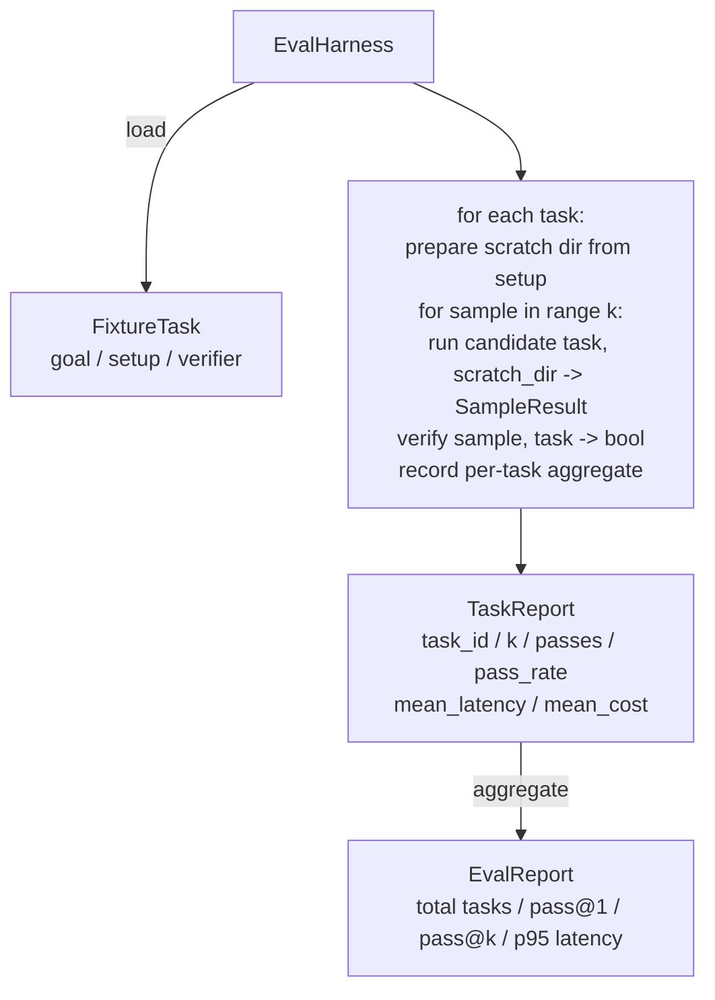

# Capstone Lesson 27: 픽스처 작업(Fixture Task)을 갖춘 평가 하니스

> 코딩 에이전트(coding agent)는 그 성능을 측정하는 작업 모음(suite)만큼만 우수하다. 이 레슨은 픽스처 작업(fixture task)이 담긴 폴더를 받아, 각각을 후보 에이전트를 통해 실행하고, 결정론적(deterministic) 검증기(verifier)로 통과/실패 점수를 매기며, 결과를 pass@1, pass@k, 평균 지연 시간(latency), 평균 비용으로 집계하는 평가 하니스(evaluation harness)를 만든다. 하니스는 회귀(regression)와 리팩터링(refactor)을 구분할 수 있게 해 주는 진실의 원천(source of truth)이다.

**Type:** Build
**Languages:** Python (stdlib)
**Prerequisites:** Phase 19 · 25 (verification gates), Phase 19 · 26 (sandbox runner), Phase 14 · 30 (eval-driven agent development), Phase 14 · 19 (SWE-bench and GAIA benchmarks)
**Time:** ~90분

## 학습 목표 (Learning Objectives)

- 픽스처 작업을 목표(goal), 셋업(setup), 검증기의 세 쌍(triple)으로 정의한다.
- 작업마다 여러 샘플 실행에 점수를 매기고 pass@1과 pass@k를 계산한다.
- 지연 시간과 비용을 평균 및 95번째 백분위수(percentile) 지표로 집계한다.
- 결정론적 검증기(파일 diff, 종료 코드, 정규식 일치)를 재사용 가능한 함수로 연결한다.
- 회귀 추적 스크립트가 받아들일 수 있는 구조화된 JSON 보고서를 방출한다.

## 문제 (The Problem)

평가 하니스 없이 만들어진 에이전트 벤치마크(benchmark)에는 세 가지 실패 모드가 끊임없이 따라붙는다.

첫 번째는 검증되지 않은 통과다. 에이전트가 버그를 고쳤다고 말하고, 사람이 diff를 흘끗 보고, 작업 모음이 초록색으로 표시되며, 3주 뒤 회귀 테스트가 같은 버그를 드러낸다. 에이전트는 실제로는 아무것도 고치지 않은 채 그럴듯하게 추론했을 뿐이다.

두 번째는 감지되지 않은 회귀다. 프롬프트 템플릿(prompt template)을 바꾸자 에이전트가 시끄러운 작업에서는 4% 나아지고 조용한 작업에서는 14% 나빠진다. 골드셋(goldset)과 작업별 점수가 없으면, 회귀는 main 브랜치에 올라타 고객이 불평할 때에야 드러난다.

세 번째는 작업별 드리프트(drift)다. 평가가 월요일에는 100개 작업으로, 금요일에는 그중 95개로 실행되었는데, 누군가가 픽스처 다섯 개의 이름을 바꿨기 때문이다. 통과율은 5% 개선처럼 보인다. 사실은 아니다.

하니스는 이런 실패를 사실(fact)로 바꾸는 프로그램이다. 모든 픽스처를, 매번, 재현 가능한 순서로, 결정론적 검사에서 참 또는 거짓을 반환하는 검증기에 대해 실행한다.

## 개념 (The Concept)

```mermaid
flowchart LR
  F1[fixtures/task_001/<br/>task.json + expected/] --> Harness
  F2[fixtures/task_002/<br/>...] --> Harness
  Harness[Harness<br/>for each task:<br/>setup / run agent k samples /<br/>verify each sample /<br/>record latency, cost]
  Harness --> Report[EvalReport<br/>pass@1 / pass@k<br/>mean ms / p95 ms<br/>mean cost]
```

`FixtureTask`는 작은 JSON 파일에 선택적인 `expected/` 디렉터리를 더한 것이다. JSON은 `id`, `goal`(에이전트에게 전달되는 프롬프트), `setup` 블록(스크래치 디렉터리에 떨어뜨릴 파일들), `verifier` 블록을 선언한다. verifier 블록은 하니스의 검증기 레지스트리(registry)에 있는 함수의 이름을 지정하고 그 인자를 제공한다.

세 가지 검증기 형태가 유용한 작업의 대부분을 포괄한다.

첫 번째는 `file_equals`다. 에이전트가 실행된 뒤, 지정된 파일을 기대 내용과 비교한다. 이것은 "이 버그를 정확히 이런 방식으로 고쳐라" 작업을 잡아낸다.

두 번째는 `regex_match`다. 지정된 파일의 내용이 정규식과 일치하는지 검사한다. 이것은 허용 가능한 해법이 여럿인 "함수가 반드시 존재하고 X를 반환해야 한다" 작업을 잡아낸다.

세 번째는 `shell_exit_zero`다. 하니스는 (레슨 26의 샌드박스를 통해) 셸 명령을 실행하고 그 명령이 0으로 종료할 때만 작업을 통과시킨다. 이것은 "테스트가 반드시 통과해야 한다" 작업을 잡아낸다.

하니스는 각 작업을 `k`번 실행한다. Pass@k는 `1 - (1 - p)^k`이며 여기서 p는 경험적(empirical) 통과율이다. 하니스는 분산(variance)을 파악할 수 있도록 원시 횟수도 함께 보고한다. 지연 시간은 샘플당 벽시계 시간(wall-clock)이다. 비용은 에이전트가 스스로 보고하는 값이면 무엇이든 된다(토큰 수, USD, 또는 둘 다). 하니스는 이 값을 샘플 전체에 걸쳐 합산하고 작업별 및 집계 수치를 제시한다.

## 아키텍처 (Architecture)



후보(candidate)는 호출 가능 객체(callable)다. `Callable[[FixtureTask, str], SampleResult]`. 하니스는 `tempfile.mkdtemp()`로 스크래치 디렉터리를 만들고 그 경로를 평범한 문자열로 전달한다. 하니스는 후보가 어떻게 동작하는지 신경 쓰지 않는다. 후보는 결정론적 패치 적용기(하니스 자체 테스트에 유용함)일 수도, 실제 LLM 에이전트일 수도, 퍼저(fuzzer)일 수도 있다. 계약은 SampleResult다.

## 무엇을 만들 것인가 (What you will build)

`main.py`는 다음을 산출한다.

1. `FixtureTask` 데이터클래스(dataclass).
2. `SampleResult` 데이터클래스: success_self_reported, latency_ms, cost_units, edits.
3. `to_dict()`를 갖춘 `TaskReport`, `EvalReport` 데이터클래스.
4. 검증기 이름을 함수에 매핑하는 `VerifierRegistry`. 내장 검증기: file_equals, regex_match, shell_exit_zero.
5. `EvalHarness` 클래스. 작업 디렉터리를 후보에 대해 실행한다. EvalReport를 반환한다.
6. `tasks/`에 번들로 묶인 다섯 개의 픽스처 작업:
   - `fizzbuzz`의 off-by-one
   - `factorial`의 누락된 return
   - 오류 메시지의 오타
   - 빈 함수 본문
   - 연결 리스트(linked-list) 순회의 off-by-one
7. 하니스가 1.0의 깔끔한 pass@1을 보여 주는 데 사용하는 결정론적 참조 후보(`apply_known_fixes`).
8. 데모는 EvalReport JSON을 출력하고 0으로 종료한다.

픽스처 작업은 `tasks/`의 JSON 파일들과 `tasks/<id>/buggy/` 및 `tasks/<id>/expected/`의 짝지어진 소스 파일들로 번들된다. 하니스는 buggy를 스크래치 디렉터리로 복사하고, 후보에게 건네주고, expected와 대조하여 검증한다.

## 왜 pass@1만이 아니라 pass@k인가 (Why pass@k and not just pass@1)

실제 LLM 에이전트는 확률적(stochastic)이다. pass@1이 0.6이면 실패처럼 보인다. pass@5가 0.95라면 에이전트가 대부분의 경우 올바른 답을 내지만 초기 샘플에서 잘못 선택하고 있다는 뜻이다. 해법은 항상 더 많은 학습이 아니라 샘플링(sampling)과 순위 매기기(ranking)다. Pass@k는 이 차이를 드러내 준다.

Pass@k는 pass@1과 나란히 보고되는데, pass@k가 실제 실패를 덮어 가리기 때문이다. 모델이 스무 번 시도해서 한 번 올바른 답을 낸다면 쓸 만한 에이전트라고 할 수 없다. 하니스는 둘 다 보여 준다.

## 이것이 Track A의 나머지와 어떻게 결합되는가 (How this composes with the rest of Track A)

레슨 25는 게이트 체인(gate chain)을 산출했다. 레슨 26은 샌드박스를 산출했다. 하니스는 모든 `shell_exit_zero` 검증기에 샌드박스를 사용한다. 레슨 28은 각 하니스 실행을 OTel 트레이스로 감싼다. 레슨 29는 번들된 픽스처 중 하나에 대해 종단 간 데모를 실행하고 참조 후보에 대해 pass@1 = 1.0을 단언한다.

## 실행하기 (Running it)

```bash
cd phases/19-capstone-projects/27-eval-harness-fixture-tasks
python3 code/main.py
python3 -m pytest code/tests/ -v
```

데모는 pass@1, pass@5, 평균 지연 시간, 작업별 분해를 포함한 EvalReport를 JSON으로 출력한다. 종료 코드는 0이다. 테스트는 검증기 함수, pass@k 수학, 픽스처 로딩, 그리고 번들된 참조 후보에 대한 하니스의 종단 간 동작을 다룬다.
