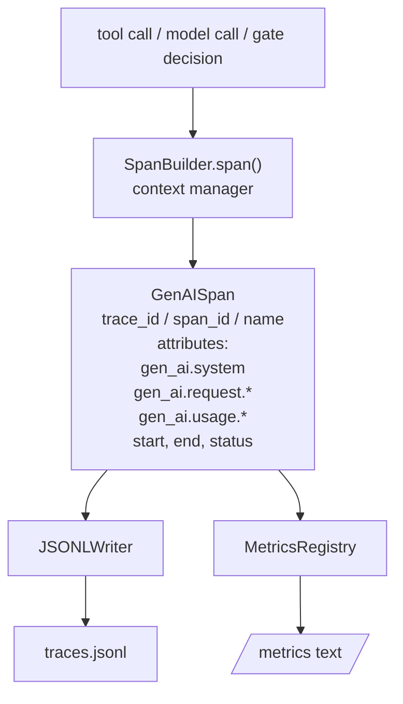
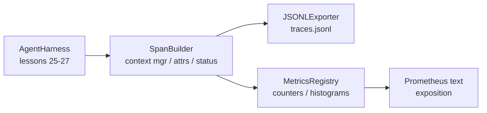

# Capstone Lesson 28: OTel GenAI 스팬(Span)과 Prometheus 지표를 갖춘 관측성

> 관측성(observability)이 없는 에이전트 하니스(agent harness)는 돈을 잡아먹는 블랙박스다. 이 레슨은 OpenTelemetry GenAI 시맨틱 컨벤션(semantic conventions)을 준수하는 레코드를 방출하는 스팬 빌더(span builder)를 손수 만들어, 한 줄에 스팬 하나씩 JSON-Lines 파일에 기록하고, 카운터(counter)와 히스토그램(histogram)을 Prometheus 텍스트 형식으로 노출한다. 전체가 표준 라이브러리(stdlib) 파이썬이며 오프라인으로 실행된다.

**Type:** Build
**Languages:** Python (stdlib)
**Prerequisites:** Phase 19 · 25 (verification gates), Phase 19 · 26 (sandbox), Phase 19 · 27 (eval harness), Phase 13 · 20 (OpenTelemetry GenAI), Phase 14 · 23 (OTel GenAI conventions)
**Time:** ~90분

## 학습 목표 (Learning Objectives)

- OpenTelemetry GenAI 시맨틱 컨벤션에 맞춰진 스팬 데이터 클래스를 만든다.
- 한 줄에 독립적인(self-contained) 스팬 하나를 기록하는 JSONL 익스포터(exporter)를 구현한다.
- 레이블(label)을 갖춘 카운터와 히스토그램을 만들고 Prometheus 텍스트 형식 노출(exposition)을 구현한다.
- 지속 시간(duration), 상태(status), 예외를 기록하는 스팬 컨텍스트 매니저(context manager)로 임의의 호출 가능 객체를 감싼다.
- 방출된 스팬이 `json.loads`를 통해 왕복(roundtrip)하며 명세 형태와 일치하는지 검증한다.

## 문제 (The Problem)

프로덕션(production)의 코딩 에이전트(coding agent)는 매 턴마다 세 가지 부류의 산출물을 만든다. 모델 호출(model call), 도구 실행(tool execution), 검증 게이트(verification gate) 결정. 이들 중 어느 것도 구조화된 텔레메트리(telemetry) 없이는 쓸모가 없다.

첫 번째 실패 모드는 누락된 트레이스(trace)다. 화요일에 무언가 잘못되었지만 유일한 기록은 500줄짜리 채팅 로그다. 어떤 도구가 실행되었는지, 얼마나 걸렸는지, 프롬프트에 몇 개의 토큰(token)이 들어갔는지, 게이트가 무언가를 거부했는지가 기록에 없다. 에이전트 작성자는 추측할 수밖에 없다.

두 번째 실패 모드는 파싱할 수 없는 트레이스다. 하니스가 스팬을 기록했지만 자체적인 임의의 필드 이름을 썼다. Grafana, Honeycomb, Jaeger, 로컬 CLI 어느 것도 이 스팬을 읽지 못한다. 스팬이 비표준이기 때문에 팀의 스택에 존재하는 어떤 도구든 무용지물이 된다.

세 번째 실패 모드는 집계되지 않은 지표(metric)다. 트레이스에서 느린 도구 호출 하나는 볼 수 있지만, 지표가 없고 트레이스만 있기 때문에 "지난 한 시간 동안 read_file 호출의 p95 지연 시간은 무엇인가?"에는 답할 수 없다.

OpenTelemetry GenAI 시맨틱 컨벤션이 바로 이 문제를 풀려고 존재한다. LLM 프레임워크 전반에 걸친 스팬 방출기들이 공유하는 표준 속성(attribute)의 작은 집합을 정의한다. 하니스가 그 속성들을 기록하면, 모든 OTel 호환 백엔드(backend)가 이를 읽는다.

## 개념 (The Concept)



하니스의 모든 연산은 스팬을 만든다. 스팬에는 트레이스 id(전체 에이전트 호출), 스팬 id(이 하나의 연산), 이름(예: `gen_ai.chat`, `gen_ai.tool.execution`), GenAI 컨벤션을 따르는 속성, 시작 및 종료 시각, 상태가 있다.

GenAI 컨벤션은 다음 속성 키들을 표준화한다. `gen_ai.system`(어느 제공자인가, 예: `anthropic`, `openai`), `gen_ai.request.model`(모델 id), `gen_ai.request.max_tokens`, `gen_ai.usage.input_tokens`, `gen_ai.usage.output_tokens`, `gen_ai.response.model`, `gen_ai.response.id`, `gen_ai.operation.name`, 그리고 도구별 키 `gen_ai.tool.name`과 `gen_ai.tool.call.id`.

익스포터는 JSONL을 기록한다. 한 줄에 JSON 객체 하나. 하위 도구가 스트림(stream)하고, grep하고, 임포트(import)하기에 가장 단순한 형식이다. 실제 OTel 익스포터라면 OTLP gRPC를 구사한다. 레슨의 JSONL 익스포터는 그 오프라인 등가물이며 모든 워크스테이션에서 0으로 종료한다.

지표는 트레이스 옆에 산다. 카운터는 각 도구 호출마다 증가한다. `tools_called_total{tool="read_file"}`. 히스토그램은 관측된 지연 시간을 기록한다. `tool_latency_ms{tool="read_file"}`. 둘 다 풀 기반(pull-based) 지표의 사실상 표준인 Prometheus 텍스트 노출 형식으로 직렬화(serialise)된다.

## 아키텍처 (Architecture)



스팬 빌더는 컨텍스트 매니저를 반환하는 `span(name, attrs)` 메서드를 가진 작은 클래스다. 컨텍스트 매니저는 진입(enter) 시 시작 시각을 기록하고, 종료(exit) 시 종료 시각을 기록하며, 예외가 발생했다면 이를 첨부하고, 완성된 스팬을 익스포터로 밀어 넣는다.

지표 레지스트리(registry)는 두 개의 딕셔너리다. 카운터는 `{(name, frozen_labels): int}`다. 히스토그램은 원시 샘플을 리스트에 유지하고 노출 시점에 Prometheus 히스토그램 버킷(bucket)으로 직렬화한다.

## 무엇을 만들 것인가 (What you will build)

`main.py`는 다음을 산출한다.

1. `GenAISpan` 데이터클래스(dataclass): trace_id, span_id, parent_span_id, name, attributes, start_unix_nano, end_unix_nano, status, status_message, events.
2. `span(name, attrs, parent=None)` 컨텍스트 매니저를 갖춘 `SpanBuilder` 클래스.
3. 한 줄을 덧붙이는 `export(span)`을 갖춘 `JSONLExporter` 클래스.
4. `Counter`와 `Histogram` 클래스, 그리고 `MetricsRegistry`.
5. 텍스트 형식 출력을 생성하는 `prometheus_exposition(registry)`.
6. 스팬을 방출하고 지표를 갱신하는 `wrap_tool_call(name)` 데코레이터(decorator).
7. 데모: 완전한 에이전트 호출(도구 스팬을 감싼 gen_ai.chat 스팬)을 합성하고, traces.jsonl을 기록하며, Prometheus 노출을 출력하고, 0으로 종료한다.

스팬 id와 트레이스 id는 `os.urandom`에서 생성된 16바이트 16진수 문자열이다. 이는 OTel의 W3C trace context와 일치한다. 익스포터는 절대 예외를 던지지 않는다. IO 오류는 표면화되지만 하니스는 계속 실행된다.

히스토그램에는 고정된 버킷 집합(밀리초 단위 지연 시간에 대한 OTel 기본값: 5, 10, 25, 50, 100, 250, 500, 1000, 2500, 5000, 10000, +Inf)이 있다. 샘플은 리스트로 저장되며, 노출은 요청 시 버킷별 횟수를 계산한다.

## 왜 opentelemetry-sdk 대신 손수 만드는가 (Why hand-rolled instead of opentelemetry-sdk)

OTel 파이썬 SDK는 실제 의존성(dependency)이다. 동시에 수천 줄의 코드이자, OTLP 익스포터를 돌리는 여러 프로세스이고, 레슨 예산을 압도하는 런타임 비용이기도 하다. 손수 만든 버전은 와이어 형식(wire format)을 가르친다. 프로덕션에서는 같은 속성들을 실제 SDK에 연결하고 OTLP 익스포터, 배칭(batching), 리소스 감지(resource detection)를 공짜로 얻는다.

컨벤션은 안정적이다. 레슨이 방출하는 와이어 형식은 2030년에도 계속 파싱될 것인데, OTel은 GenAI 속성 이름을 절대 깨뜨리지 않고 새로운 것만 추가하기 때문이다.

## 이것이 Track A의 나머지와 어떻게 결합되는가 (How this composes with the rest of Track A)

레슨 25는 게이트 체인(gate chain)을 산출했다. 레슨 26은 샌드박스를 산출했다. 레슨 27은 평가 하니스를 산출했다. 레슨 28은 이 셋 모두를 관측 가능하게 만든다. 레슨 29는 종단 간 데모의 모든 단계를 스팬으로 감싸고 끝에 Prometheus 텍스트를 출력한다.

## 실행하기 (Running it)

```bash
cd phases/19-capstone-projects/28-observability-otel-traces
python3 code/main.py
python3 -m pytest code/tests/ -v
```

데모는 레슨의 작업 디렉터리에 `traces.jsonl`을 방출하고(끝에 정리됨), 세 개 스팬의 샘플을 출력한 뒤, 카운터와 히스토그램에 대한 Prometheus 노출을 출력한다. 테스트는 스팬이 왕복 직렬화되는지, 정규(canonical) GenAI 속성이 존재하는지, 카운터가 올바르게 증가하는지, 히스토그램 노출이 기대 버킷 횟수를 담고 있는지를 검증한다.
