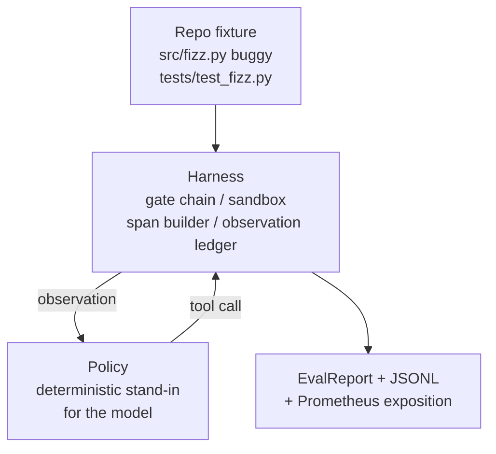
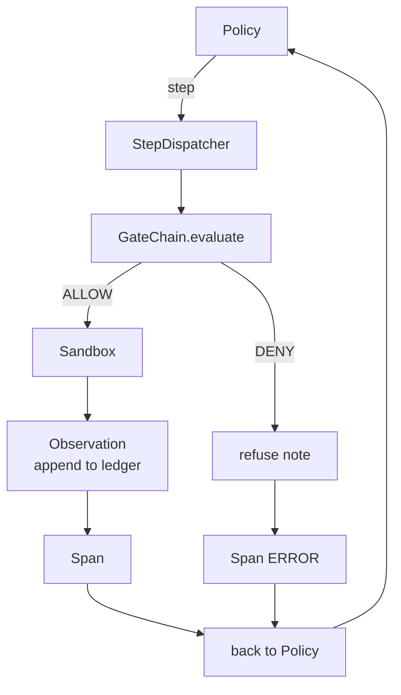

# Capstone Lesson 29: 하니스(Harness) 위의 종단 간 코딩 에이전트

> Track A의 결실. 이 레슨은 게이트 체인(gate chain), 샌드박스(sandbox), 평가 하니스(eval harness), OTel 스팬(span)을 하나의 동작하는 코딩 에이전트(coding agent)로 꿰매어, 다중 파일 파이썬 프로젝트에서 실제(작고 픽스처 규모인) 버그를 고친다. 에이전트는 LLM이 아니라 결정론적(deterministic) 정책(policy)이다. 이 대체는 레슨을 재현 가능하게 만들고, 처음부터 흥미로운 부분은 하니스였음을 보여 준다. 계약은 동일하다. 정책 이음새(seam)에 실제 모델이 꽂힌다.

**Type:** Build
**Languages:** Python (stdlib)
**Prerequisites:** Phase 19 · 25 (verification gates), Phase 19 · 26 (sandbox), Phase 19 · 27 (eval harness), Phase 19 · 28 (observability), Phase 14 · 38 (verification gates), Phase 14 · 41 (workbench for real repos), Phase 14 · 42 (agent workbench capstone)
**Time:** ~90분

## 학습 목표 (Learning Objectives)

- 게이트 체인, 샌드박스, 평가 하니스, 스팬 빌더를 하나의 에이전트 루프(loop)로 구성한다.
- read_file, run_tests, write_file을 사용하여 픽스처 버그를 고치는 결정론적 정책을 구현한다.
- 종단 간 실행 전체에 걸쳐 전역 스텝 예산(step budget)과 관측 토큰 예산(observation token budget)을 강제한다.
- 전체 실행에 대한 완전한 OTel GenAI 트레이스(trace)와 Prometheus 지표(metric)를 방출한다.
- 에이전트가 합법적 도구에서 게이트 작동(trip) 0회로 12스텝 미만에 픽스처를 푸는지 검증한다.

## 문제 (The Problem)

대부분의 에이전트 데모는 격리 상태로 동작한다. 샌드박스 단독, 평가 하니스 단독, 스팬 방출기 단독. 그것들은 괜찮아 보인다. 그것들을 구성하면 이음새가 드러난다.

게이트 체인은 ALLOW라고 말하지만 샌드박스는 체인이 예상하지 못한 이유로 거부한다. 평가 하니스는 통과를 기록하지만 OTel 스팬은 에이전트가 사용했다고 주장하는 도구를 게이트가 거부했다고 말한다. Prometheus 카운터는 한 번 증가해야 할 때 두 번 증가한다. 관측 예산이 초과되었는데도 에이전트가 계속 갔는데, 예산이 체인에서 추적되었고 샌드박스는 그것을 몰랐기 때문이다.

이 레슨은 트랙 전체에 대한 통합 테스트(integration test)다. 에이전트는 순서대로 네 가지 일을 해야 한다. 프로젝트를 읽고, 테스트를 실행하고, 테스트 실패에서 버그를 식별하고, 수정본을 작성하고, 테스트를 다시 실행하고, 멈춘다. 모든 연산은 게이트 체인을 거친다. 모든 도구 실행은 샌드박스를 거친다. 모든 스텝은 스팬으로 감싸진다. 평가 하니스는 끝에 전체를 채점한다.

## 개념 (The Concept)



에이전트의 정책은 상태 기계(state machine)다. 다섯 가지 상태.

`SURVEY`: 에이전트가 프로젝트 목록을 읽는다. 다음 상태는 RUN_TESTS다.

`RUN_TESTS`: 에이전트가 테스트 명령을 실행한다. 테스트가 통과하면 상태 기계는 성공으로 정지한다. 그렇지 않으면 다음 상태는 INSPECT다.

`INSPECT`: 에이전트가 실패한 소스 파일을 읽는다. 다음 상태는 FIX다.

`FIX`: 에이전트가 수정된 파일을 작성한다. 다음 상태는 VERIFY다.

`VERIFY`: 에이전트가 테스트 명령을 다시 실행한다. 테스트가 통과하면 성공으로 정지한다. 그렇지 않으면 실패로 정지한다.

각 상태는 하나의 도구 호출에 대응한다. 각 도구 호출은 게이트 체인을 거친다. 도구 호출이 거부되면, 에이전트는 트레이스에 거부를 보고하고 정지한다.

픽스처 버그는 `fizz.py`의 off-by-one이다. 결정론적 정책은 정규식을 통해 테스트 실패 메시지에서 버그를 감지하고 수정된 파일을 방출한다. 정책을 LLM으로 교체해도 하니스 계약은 바뀌지 않는다.

## 아키텍처 (Architecture)



레슨은 독립적(self-contained)이다. 각 이전 레슨의 기본 요소(primitive)는 `main.py`에 최소 규모로 재구현된다(게이트, 샌드박스, 원장(ledger), 스팬). 그래서 레슨은 형제 레슨들을 임포트하지 않고 실행된다. 이름은 레슨 25-28과 정확히 일치하여 개념적 매핑이 모호하지 않다.

## 무엇을 만들 것인가 (What you will build)

`main.py`는 다음을 산출한다.

1. 레슨 25-28과 같은 이름으로 복사된 최소 하니스 기본 요소: `GateChain`, `Sandbox`, `ObservationLedger`, `SpanBuilder`, `MetricsRegistry`.
2. `CodingAgentPolicy` 클래스: 다섯 가지 상태를 갖는 상태 기계.
3. `Repo` 도우미: 번들된 버그 픽스처로 스크래치 디렉터리를 준비한다.
4. `AgentRun` 클래스: 정책을 구동하고, 하니스를 통해 디스패치(dispatch)하며, `AgentRunReport`를 반환한다.
5. src/fizz.py, tests/test_fizz.py, 그리고 평가 하니스를 위한 expected/ 트리를 갖춘 번들 픽스처(`fixture_repo/`).
6. 데모: 정책을 종단 간으로 실행하고, 단계별 트레이스를 출력하며, 통과를 단언하고, 지표를 출력한다.

번들된 픽스처는 레슨 27의 작업 구조와 같은 형태다. 버그가 있는 파일과 테스트 파일. 테스트 실패 메시지에는 결정론적 정책이 수정을 식별하기에 충분한 정보가 담겨 있다. 실제 LLM은 더 느리고 더 폭넓은 회상(recall)으로 같은 일을 하겠지만, 하니스의 기대를 바꾸지는 않을 것이다.

## 정책이 LLM이 아닌 이유 (Why the policy is not an LLM)

실제 LLM은 API 키, 네트워크 호출, 검증 불가능한 확률성을 요구한다. 하니스는 레슨이 신경 쓰는 부분이다. 결정론적 정책을 대신 끼워 넣으면 레슨이 외부 의존성 없이 어떤 개발자 노트북에서든 실행되고, 테스트 작업 모음이 정확한 스텝 수를 단언할 수 있게 된다.

레슨의 정책은 LLM 에이전트가 하는 일의 엄격한 부분집합이다. 정책은 저장소를 읽고, 실패한 테스트를 보고, 그 줄을 식별하고, 수정본을 방출한다. LLM은 같은 하니스 계약으로 같은 루프를 거친다. 장부 기록(bookkeeping)은 동일하다.

## 데모가 단언하는 것 (What the demo asserts)

종단 간 데모는 종료 시점에 다섯 가지를 단언하며, 테스트 작업 모음이 이를 프로그램적으로 재단언한다.

정책은 12스텝 미만에 픽스처를 풀었다.

관측 예산은 결코 초과되지 않았다.

합법적 도구에서 게이트 거부는 0회 발생했다. (에이전트는 거부된 도구 이름을 결코 지어내지 않았다.)

모든 스텝은 traces.jsonl에 대응하는 스팬을 갖는다.

Prometheus 노출(exposition)은 `tools_called_total{tool="read_file"}` 항목과 `tool_latency_ms` 히스토그램을 담는다.

## 이것이 Track A의 나머지와 어떻게 결합되는가 (How this composes with the rest of Track A)

이 레슨이 통합이다. 레슨 25는 게이트 체인을 작성했다. 레슨 26은 샌드박스를 작성했다. 레슨 27은 평가 하니스를 작성했다. 레슨 28은 관측성을 작성했다. 레슨 29는 그것들이 하나의 시스템으로 동작함을 증명한다. 실제 에이전트 하니스는 여기서 확장된다. 결정론적 정책을 모델로, 번들된 픽스처를 실제 저장소 작업으로, JSONL 익스포터를 OTLP로 교체한다.

## 실행하기 (Running it)

```bash
cd phases/19-capstone-projects/29-end-to-end-coding-task-demo
python3 code/main.py
python3 -m pytest code/tests/ -v
```

데모는 스텝별 트레이스, 최종 평가 보고서, Prometheus 노출을 출력한다. 종료 코드는 0이다. 테스트는 정책 상태 전이, 합성 도구 호출에 대한 게이트 거부, 번들된 픽스처에 대한 종단 간 실행, 그리고 스텝 예산 불변식(invariant)을 다룬다.
