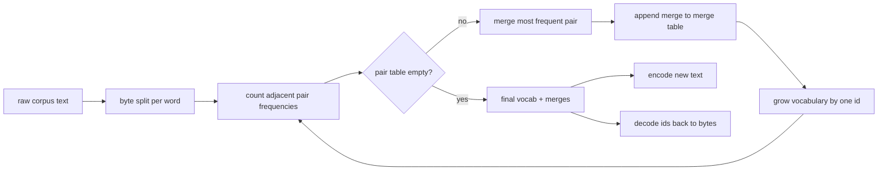
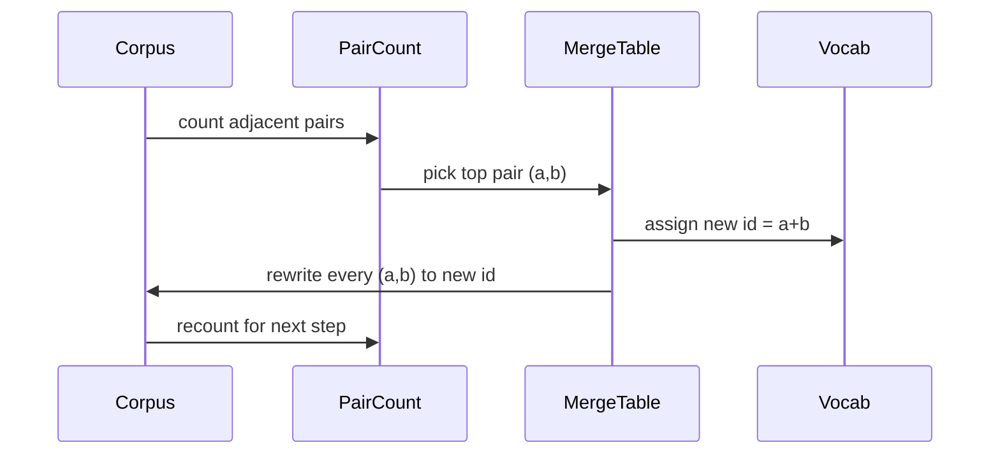

# 밑바닥부터 만드는 BPE 토크나이저(Tokenizer)

> 바이트(byte)가 들어가고, id가 나오고, id가 다시 같은 바이트로 돌아온다. 모든 현대 텍스트 모델이 여전히 출발점으로 삼는 토크나이저(tokenizer)를 만든다.

**Type:** Build
**Languages:** Python
**Prerequisites:** Phase 04 lessons, Phase 07 transformer lessons
**Time:** ~90분

## 학습 목표 (Learning Objectives)
- 가장 빈번한 인접 기호 쌍을 반복적으로 병합(merge)하여 원시 텍스트 말뭉치(corpus)로부터 바이트 쌍 인코딩(Byte-Pair Encoding) 어휘(vocabulary)를 학습한다.
- 결정론적(deterministic) 병합 표(merge table)를 구현하고 그것을 새로운 텍스트에 적용하여 서브워드(subword) id의 스트림(stream)을 생성한다.
- 임의의 UTF-8 입력을 정보 손실 없이 id로, 그리고 다시 원래대로 왕복(round-trip)시킨다.
- 학습과 디코딩(decoding)에서 살아남도록 특수 토큰(special token)(`<|endoftext|>`, `<|pad|>`)을 예약하고 보호한다.
- 바이트 수준 알파벳이 범용 토크나이저의 올바른 바닥인 이유를 추론한다.

## 틀 (The frame)

언어 모델(language model)은 결코 텍스트를 보지 않는다. 정수(integer)를 본다. 문자열에서 정수 리스트로, 그리고 다시 거꾸로 가는 매핑(map)이 토크나이저다. 이 계층을 잘못 다루면 학습 실행의 모든 손실 곡선(loss curve)이 잘못된 것을 측정하게 된다.

범용 텍스트 모델을 위한 서브워드 토크나이저의 지배적인 계열은 바이트 쌍 인코딩(Byte-Pair Encoding)이다. 아이디어는 작다. 알려진 알파벳에서 출발한다. 학습 말뭉치에서 가장 자주 나타나는 인접 기호 쌍을 찾는다. 그것을 새 기호로 병합한다. 어휘가 목표 크기에 도달할 때까지 반복한다. 새 텍스트를 인코딩(encoding)할 때는 같은 병합 목록을 같은 순서로 재사용한다.

우리는 바이트 수준 변형을 만들 것이다. 알파벳은 유니코드 코드 포인트(code point)가 아니라 256개의 원시 바이트다. 그 선택 덕분에 토크나이저는 알 수 없는(unknown) 토큰으로 후퇴하지 않고 어떤 UTF-8 입력이든 다룬다.

## 파이프라인 (The pipeline)

학습 쪽과 추론(inference) 쪽은 병합 표를 공유한다. 그 공유가 계약이다. 추론에서 병합 순서를 바꾸면 다른 id 스트림을 디코딩하게 된다.

## 바이트 알파벳 (The byte alphabet)

처음 256개의 id는 원시 바이트 0x00부터 0xFF까지를 위해 예약된다. 그것은 어떤 병합이 일어나기 전에도 모든 입력 문자열이 어휘 안에서 표현될 수 있음을 보장한다. 바이트 블록 다음에 특수 토큰을 위한 작은 범위를 예약한다. 학습 루프는 그 id들을 결코 병합 대상으로 제안하지 않는데, 우리가 그것들을 사전 토큰화(pretokenized)된 스트림에서 완전히 배제하기 때문이다.

사전 토크나이저(pretokenizer)는 학습이 보기 전에 공백과 구두점 경계에서 말뭉치를 분할한다. 그 분할이 없으면 BPE 병합 단계는 단어 경계를 넘나드는 병합까지 학습하고 어휘가 통째로 된 흔한 구절들로 가득 찬다. 분할이 있으면 병합이 단어 안에 머무르고 결과가 일반화(generalize)된다.

## 학습 루프 (The training loop)

각 학습 스텝마다 루프는 세 가지를 한다. 말뭉치의 모든 단어를 훑으며 현재 기호들의 각 인접 쌍이 얼마나 자주 나타나는지를, 단어 자체가 얼마나 자주 나타나는지로 가중하여 센다. 가장 높은 횟수를 가진 쌍을 고른다. 그 쌍의 모든 출현을, id가 어휘의 다음 빈 슬롯(slot)인 하나의 새 기호로 다시 쓴다. 그런 다음 그 병합을 기록한다.

각 스텝의 비용은 기호 시퀀스의 리스트로 표현된 말뭉치 크기에 선형(linear)이다. 백만 단어와 만 개 id의 목표 어휘에 대해 루프는 몇 초 안에 완료되는데, 병합이 일어날 때마다 기호 시퀀스가 줄어들기 때문이다.

## 새 텍스트 인코딩 (Encoding fresh text)

추론은 병합 카운터를 호출하지 않는다. 학습된 순서와 같은 순서로 병합 표를 적용한다. 새 단어에 대해 인코더는 바이트 분할에서 출발한다. 현재 시퀀스에서 가장 낮은 순위의 병합(적용되는 가장 이른 것)을 스캔한다. 그 병합을 수행한다. 다시 스캔한다. 루프는 표 안의 어떤 병합도 현재 시퀀스에 적용되지 않을 때 끝난다.

순위에 의한 정렬(ordering)은 인코딩을 결정론적으로 만들고 같은 입력에 대한 학습 동작과 일치하게 하는 속성이다. 먼저 학습된 병합은 표의 맨 위에 앉아 먼저 적용된다. 두 병합이 같은 위치에 적용될 수 있다면, 더 낮은 순위의 것이 이긴다.

## 특수 토큰 (Special tokens)

특수 토큰은 바이트 스트림이 결코 생성할 수 없는 id다. 우리가 손으로 예약한다. 이 레슨에는 둘이면 충분하다.

- `<|endoftext|>`는 사전 학습(pretraining) 중 문서를 분리한다. 모델에게 "여기서 새 문서가 시작되며, 이전 문서의 컨텍스트가 새어 들어오지 않게 하라"고 알려 준다.
- `<|pad|>`는 짧은 시퀀스를 채워 배치(batch)가 직사각형 텐서(tensor)가 될 수 있게 한다. 손실 마스크(loss mask)가 학습 중 그것을 숨긴다.

인코더는 입력에 특수 토큰을 허용하는 플래그를 받는다. 플래그가 꺼져 있으면 문자열 `<|endoftext|>`와 `<|pad|>`는 그것들을 철자하는 바이트로 토큰화된다. 플래그가 켜져 있으면 그 문자 그대로의 문자열은 예약된 id로 매핑되며 어떤 병합도 적용되지 않는다.

## 왕복 보장 (Round-trip guarantee)

인코딩한 뒤 디코딩하면 입력 바이트가 정확히 반환되어야 한다. 디코더는 모든 id의 바이트 확장(expansion)을 순서대로 이어 붙인다. 모든 id는 원시 바이트이거나 이전에 알려진 두 id의 연결(concatenation)이므로, 재귀적 확장은 항상 원시 바이트에서 종료된다. 그런 다음 디코딩은 그 바이트들이 철자하는 UTF-8 문자열을 반환한다.

이 레슨의 테스트 작업 모음은 본 적 없는 문장, 유니코드 이모지(emoji)가 있는 문장, 그리고 문자 그대로의 `<|endoftext|>` 토큰을 담은 문장에 대해 그 속성을 검사한다.

## 이 레슨이 하지 않는 것 (What this lesson does not do)

가장 큰 프로덕션(production) 토크나이저 스타일의 정규식 기반 사전 토크나이저는 만들지 않는다. 여기 사전 토크나이저는 작은 공백과 구두점 분할이다. 작은 학습 말뭉치에서 합리적인 병합을 만들기에 충분하며 레슨 체인의 나머지와의 계약은 그대로 유지된다. 다음 레슨은 토크나이저를 블랙박스로 취급하고 그 위에 슬라이딩 윈도(sliding-window) 데이터셋(dataset)을 만든다.

쌍 카운터를 병렬화하지 않는다. 수천 단어의 말뭉치에 대한 파이썬 루프는 1초 안에 훨씬 못 미쳐 끝난다. 더 큰 말뭉치라면 단어별로 쌍을 병렬로 세어 리듀스(reduce)하는 방법이 자연스럽게 떠오른다.

## 코드 읽는 법 (How to read the code)

`main.py`는 네 개의 객체를 정의한다. `BPETokenizer`는 어휘, 병합 표, 특수 토큰 표를 보유한다. `train`은 학습 루프다. `encode`는 추론 경로다. `decode`는 바이트 연결이다. 맨 아래의 데모는 내장 말뭉치로 작은 토크나이저를 학습하고, 따로 떼어 둔(held-out) 문장을 인코딩하고, id를 다시 디코딩한 뒤 둘 다 출력한다. `code/tests/test_bpe.py`의 테스트는 왕복 속성, 특수 토큰 예약, 병합 정렬을 고정(pin)한다.

데모를 실행하라. 그런 다음 데모에서 목표 어휘 크기를 300에서 600으로 바꾸고 따로 떼어 둔 문장의 인코딩 길이가 어떻게 떨어지는지 지켜보라. 그 곡선이 BPE 압축 곡선이다.
