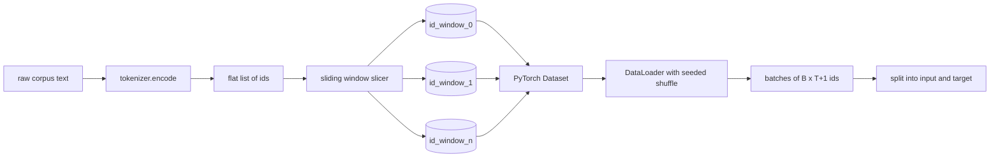
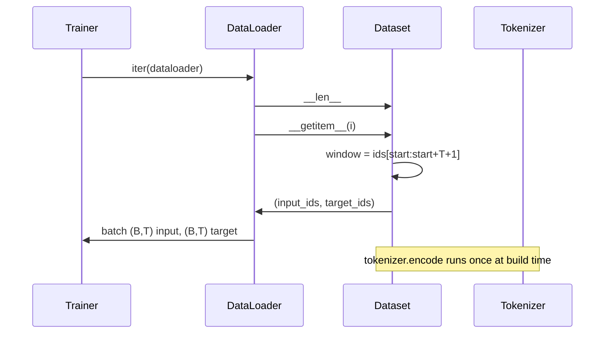

# 슬라이딩 윈도(Sliding Window)를 갖춘 토큰화된 데이터셋

> 사전 학습(pretraining) 실행은 토큰 id에서 그래디언트(gradient)로 가는 함수다. 이 레슨은 id를 공급하는 컨베이어(conveyor)를 만든다.

**Type:** Build
**Languages:** Python
**Prerequisites:** Phase 04 lessons, Phase 07 transformer lessons, Lesson 30 of this phase
**Time:** ~90분

## 학습 목표 (Learning Objectives)
- 토크나이저(tokenizer)를 한 번 호출하여 원시 말뭉치(corpus)를 토큰 id의 스트림(stream)으로 변환한다.
- 구성 가능한 오버랩 스트라이드(overlap stride)로 id 스트림을 고정 길이 윈도(window)로 잘라낸다.
- 다음 토큰 예측(next-token prediction)을 위해 입력과 타깃(target) 텐서(tensor)를 반환하는 PyTorch Dataset을 만든다.
- 에폭(epoch)마다 시드(seed)된 결정론적(deterministic) 셔플(shuffle)로 데이터셋(dataset)을 DataLoader로 감싼다.
- 스트라이드, 중복성(redundancy), 유효 데이터셋 크기 사이의 트레이드오프(trade-off)를 추론한다.

## 틀 (The frame)

사전 학습 실행은 한 번에 토큰 id의 배치(batch) 하나를 읽고 모델을 갱신한다. 각 배치의 형태(shape)는 학습 계약이 고정한다. 인과적(causal) 언어 모델(language model)의 경우, 배치는 `(B, T)` 입력 id와 `(B, T)` 타깃 id를 담으며, 타깃은 입력을 왼쪽으로 하나 옮긴 것이다. 데이터 파이프라인(pipeline)이 하는 일은 그 계약을 결정론적이고 재현 가능한 방식으로, 수 기가바이트의 원시 텍스트일 수 있는 말뭉치에서 요청 시 생성하는 것이다.

이 레슨은 파이프라인을 만든다. 이전 레슨의 토크나이저는 텍스트를 긴 평탄한(flat) id 리스트로 바꾼다. 슬라이딩 윈도(sliding window)는 그 리스트를 학습 예제로 잘라낸다. 커스텀 Dataset이 예제를 텐서로 노출한다. DataLoader가 그것들을 배치하고 알려진 시드로 셔플한다.

## 형태 계약 (The shape contract)

인과적 LM은 `(B, T)` 형태의 id를 소비하며, 여기서 `B`는 배치 크기이고 `T`는 컨텍스트 길이(context length)다. 위치 `t`의 타깃은 위치 `t+1`의 입력이다. 그래서 모든 학습 예제가 `T+1`개의 원시 id를 포괄한다. 윈도 스트라이드(window stride)는 연속한 예제 사이에 중복이 얼마나 존재하는지를 제어한다.

슬라이서(slicer)는 말뭉치의 경계와 결코 겹치지 않는다. 마지막 윈도가 `T+1`개 위치를 채울 만큼 id를 갖지 못하면, 슬라이서는 그것을 버린다. 꼬리를 `<|pad|>`로 패딩(padding)하는 것도 유효한 선택이지만 손실 마스크(loss mask)를 복잡하게 만든다. 이 레슨에서는 버린다.

## 왜 슬라이딩 윈도인가 (Why a sliding window)

사전 학습 말뭉치는 하나의 긴 id 스트림이다. 모델이 겹치지 않는 윈도만 본다면, 모든 학습 예제가 같은 `T` 경계를 가르칠 것이다. 스트라이드를 조정하면 그 경계가 이리저리 움직여 모델이 더 다양한 다음-토큰-예측 작업을 보게 된다.

스트라이드 `T`는 겹치지 않는 윈도를 만든다. 스트라이드 `T // 2`는 50퍼센트 중복을 만들고 유효 데이터셋을 두 배로 늘린다. 스트라이드 `1`은 최대 중복을 만들고 데이터셋을 `T`배만큼 늘린다. 비용은 에폭당 더 많은 연산이다. 이득은 더 많은 경계 다양성이다. 대부분의 사전 학습 실행은 컨텍스트 길이와 같은 스트라이드를 쓰는데, 말뭉치가 이미 모델이 한 에폭에 끝낼 수 있는 것보다 훨씬 크기 때문에 경계 다양성 논거가 더 약하다.

## Dataset 클래스 (The Dataset class)

PyTorch Dataset에는 두 개의 필수 메서드가 있다. `__len__`은 예제 수를 반환한다. `__getitem__`은 한 예제를 텐서 쌍으로 반환한다. 우리 Dataset은 인코딩된 id 스트림과 스트라이드를 저장한다. 여기에 인덱싱하면 윈도의 시작이 즉석에서 계산되어, 스트라이드가 만드는 예제 수와 무관하게 메모리 비용이 id 스트림 한 부(copy)에 그친다.

하나-옮기기(shift-by-one)는 `__getitem__` 안에서 일어난다. Dataset은 `input = window[:-1]`이고 `target = window[1:]`인 `(input, target)`을 반환한다. 둘 다 PyTorch long 텐서다. 학습 루프(loop)는 그것들을 정답(ground truth)으로 취급한다.

## 결정론적 셔플 (Deterministic shuffle)

`shuffle=True`인 DataLoader는 PyTorch 난수 생성기(random generator)에서 읽는다. 에폭마다 시드된 명시적 `torch.Generator`를 전달하면, 실행을 재시작할 때마다 같은 셔플을 얻는다. 이 속성은 단 하나의 하이퍼파라미터(hyperparameter)만 다른 두 실행을 비교하고 싶을 때 중요하다. 시드가 없으면 두 실행이 데이터를 다른 순서로 보고, 손실 곡선(loss curve)이 변경과 무관한 이유로 갈라진다.

이 레슨의 시드 계약은 단순하다. `epoch_seed = base_seed + epoch_index`. 베이스 시드는 생성 시점에 전달한다. 에폭 인덱스는 각 에폭의 맨 위에서 트레이너(trainer)가 증가시킨다. 같은 베이스 시드로 재실행하면 항상 모든 에폭에서 같은 순서를 본다.

## 배치 샘플러 (Batch sampler)

PyTorch의 기본 샘플러(sampler)는 복원 추출을 비활성화한 채 인덱스를 균등하게 무작위로 고른다. 사전 학습에 우리가 원하는 동작이 바로 이것이다. 작은 데이터셋을 파인튜닝(finetuning)할 때도 계약은 동일하다. DataLoader는 `__getitem__`을 `B`번 호출하고 결과를 쌓아 배치를 조립한다. 모든 예제가 구성상 같은 길이이므로 패딩 로직은 필요하지 않다.

레슨은 단순함을 위해 `num_workers=0`을 유지한다. 프로덕션(production) 실행에서는 워커(worker)들이 `__getitem__` 호출을 병렬화한다. 우리 파이프라인에서는 그 작업이 메모리 내 텐서의 슬라이스(slice)일 뿐이므로 대부분 무동작(no-op)이지만, 같은 Dataset API가 워커를 깔끔하게 지원한다.

## 예제 세기 (Counting examples)

길이 `N`의 id 스트림, 컨텍스트 길이 `T`, 스트라이드 `S`에 대해, 예제 수는 `max(0, 1 + (N - (T + 1)) // S)`다. 레슨은 그 계산을 Dataset의 정적 메서드(static method)로 노출하여 트레이너가 반복 없이 에폭당 총 스텝 수를 계산할 수 있게 한다.

## 이 레슨이 하지 않는 것 (What this lesson does not do)

디스크에서 스트리밍하지 않는다. 말뭉치는 메모리에 완전히 인코딩되어 단일 텐서로 보유된다. 수백만 id의 말뭉치라면 그것은 백 메가바이트에 훨씬 못 미치며 레슨에 알맞은 형태다. 디스크 스트리밍은 저장소를 교체하되 Dataset 계약은 유지함으로써 꽂히는 별개의 관심사다.

다중 문서를 다루지 않는다. 말뭉치는 하나의 연속한 id 스트림으로 취급된다. 다음 문서 경계는 말뭉치가 여러 문서로부터 만들어질 때 `<|endoftext|>` id를 삽입하여 인코딩된다. 모델은 경계 주변을 예측하도록 학습한다.

## 코드 읽는 법 (How to read the code)

`main.py`는 두 클래스와 하나의 도우미(helper)를 정의한다. `SlidingWindowDataset`은 PyTorch Dataset이다. `make_dataloader`는 시드된 생성기를 갖춰 구성된 DataLoader를 반환한다. `_encode_corpus_to_ids`는 한 번만 하는 토크나이저 호출이다. 맨 아래의 데모는 프로세스 내에서 작은 토크나이저를 만들고, 내장 말뭉치를 인코딩하고, 데이터셋과 데이터로더를 구성하고, 배치 하나를 출력하고, 형태 계약을 단언한다. `code/tests/test_dataset.py`의 테스트는 윈도 수 공식, 하나-옮기기 속성, 결정론적 셔플, 스트라이드 트레이드오프를 고정(pin)한다.

데모를 실행하라. 그런 다음 컨텍스트 길이를 16에서 32로 바꾸고 에폭당 예제 수가 어떻게 떨어지는지 지켜보라. 그 수가 곧 에폭당 스텝(steps-per-epoch) 예산이다.
