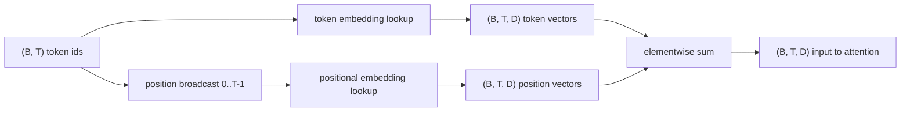
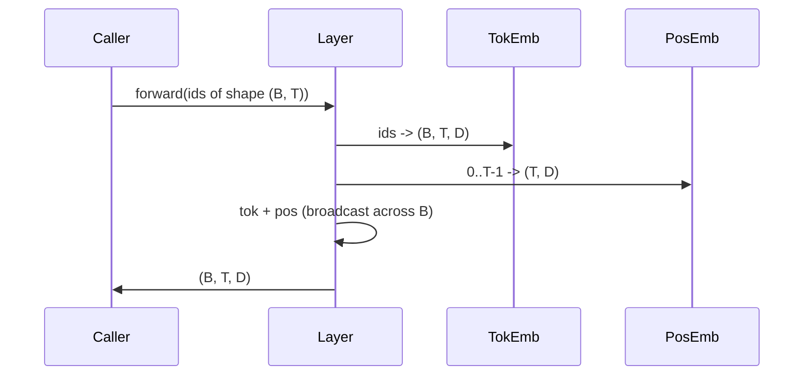

# 토큰 및 위치 임베딩(Token and Positional Embeddings)

> id는 정수다. 모델은 벡터(vector)를 원한다. 둘 사이에 두 개의 룩업 테이블(lookup table)이 놓이며, 위치 임베딩의 선택이 모델이 무엇을 학습할 수 있는지를 결정한다.

**Type:** Build
**Languages:** Python
**Prerequisites:** Phase 04 lessons, Phase 07 transformer lessons, Lessons 30 and 31 of this phase
**Time:** ~90분

## 학습 목표 (Learning Objectives)
- 어휘(vocabulary) id를 밀집(dense) 벡터로 매핑하는 토큰 임베딩(token-embedding) 룩업 테이블을 만든다.
- 위치로 인덱싱되는 학습형(learned) 위치 임베딩(positional-embedding) 룩업 테이블을 만든다.
- 파라미터(parameter)가 없는, 위치로 인덱싱되는 고정 사인파(sinusoidal) 위치 임베딩을 만든다.
- 토큰 임베딩과 위치 임베딩을 트랜스포머(transformer) 블록(block)을 위한 단일 입력으로 합성한다.
- 길이 일반화(length generalization)와 파라미터 수에 대해 학습형 임베딩과 사인파 임베딩을 대조한다.

## 틀 (The frame)

모델이 토큰 id와 처음 접촉하는 것은 토큰 임베딩 행렬(matrix)에서의 행(row) 룩업이다. 행렬은 어휘 id당 한 행, 모델 차원(dimension)당 한 열을 갖는다. 룩업은 모델의 나머지가 id의 의미로 취급하는 벡터를 반환한다. 역전파(backprop)는 순방향 패스(forward pass)에서 사용된 행들을 갱신한다. 학습이 진행되면서 그 행들의 기하학(geometry)은 방향(direction)으로 유사성(similarity)을 인코딩하도록 학습한다.

토큰 id만으로는 순서가 없다. 모델은 위치 1이 위치 17과 다르다고 알려 주는 두 번째 신호가 필요하다. 그 신호를 위한 지배적인 두 선택은 학습형 위치 임베딩(두 번째 룩업 테이블, 위치당 한 행)과 고정 사인파 위치 임베딩(파라미터 없는 수학 공식)이다. 선택에는 결과가 따른다. 학습형 테이블은 파라미터이며 모델이 학습한 최대 컨텍스트 길이(context length)에 의해 제한된다. 사인파 테이블은 이론적으로는 파라미터가 없고 공식이 어떤 위치로든 확장되지만, 이 레슨의 `SinusoidalPositionalEmbedding`은 `max_context_length`에서 고정 테이블을 미리 계산하고 그것의 `forward`는 그 한계를 넘어가면 예외를 일으킨다. 따라서 두 모듈 모두 여기서는 최대 컨텍스트 길이를 강제한다. 테이블이 인덱싱할 만큼 충분히 크더라도 모델은 여전히 학습 길이를 넘어서면 어려움을 겪을 수 있다.

이 레슨은 둘 다 만들고 그것들을 토큰 임베딩과 합성하여 다음 레슨의 어텐션(attention) 블록을 위한 단일 입력으로 만든다.

## 형태 계약 (The shape contract)

임베딩 단계의 입력은 형태 `(B, T)`의 토큰 id 배치(batch)다. 출력은 형태 `(B, T, D)`의 텐서이며 여기서 `D`는 모델 차원이다. 모든 배치 요소는 같은 컨텍스트 길이 `T`를 갖는다. 모든 위치는 같은 벡터 차원 `D`를 갖는다.



합성은 연결(concatenation)이 아니라 합(sum)이다. 더하면 신경망 전체에서 `D`가 일정하게 유지되며, 모델이 각 층에서 특성(feature)별로 토큰 의미가 우세할지 위치가 우세할지를 결정하게 한다.

## 토큰 임베딩 행렬 (The token embedding matrix)

토큰 임베딩은 형태 `(V, D)`의 파라미터 텐서(tensor)이며 여기서 `V`는 어휘 크기다. PyTorch는 그것을 `nn.Embedding(V, D)`로 노출한다. 초기화 시 항목들은 작은 가우시안(Gaussian)에서, 전통적으로는 트랜스포머 규모 모델에 대해 평균 0, 표준편차 약 `0.02`로 뽑힌다. 정확한 초기화는 실행 전반에 걸쳐 일관되게 유지된다는 점보다 덜 중요하다.

순방향 패스는 단일 인덱싱 연산이다. PyTorch는 행을 모음(gather)으로써 `(B, T)` int64 id를 `(B, T, D)` 실수(float)로 매핑한다. 역방향 패스(backward pass)는 순방향 패스에서 건드린 행들에만 그래디언트(gradient)를 누적한다. 배치에 한 번도 나타나지 않은 두 행은 그 스텝에 그래디언트 0을 받는다.

미묘한 세부사항. 토큰 임베딩과 모델 끝의 출력 투영(output projection)은 흔히 가중치(weight)를 공유한다(가중치 묶기, weight tying). 그렇게 되면 모든 역방향 패스가 출력 쪽을 통해 임베딩의 모든 행을 건드린다. 여기 레슨은 둘 다 별개의 모듈로 노출하지만, 완전한 모델에서는 같은 행렬이 두 역할을 모두 할 수 있다.

## 학습형 위치 임베딩 (The learned positional embedding)

학습형 위치 임베딩은 형태 `(max_context_length, D)`의 두 번째 `nn.Embedding`이다. 룩업은 위치 id `0, 1, 2, ..., T-1`로 키잉(keying)된다. 순방향 패스는 그 위치 벡터를 배치 차원에 걸쳐 브로드캐스트(broadcast)한다.

학습형 테이블의 단점은 모델이 위치 `T-1`까지만 학습했다면 위치 `T`에서 질의할 수 없다는 것이다. 그 행이 존재하지 않는다. 이 방식을 쓰는 프로덕션(production) 디코더 전용(decoder-only) 모델은 최대 컨텍스트 길이를 아키텍처에 굳혀 넣고 더 긴 입력의 처리를 거부한다.

## 사인파 위치 임베딩 (The sinusoidal positional embedding)

사인파 위치 임베딩은 위치에서 벡터로 가는 함수다. 위치 `p`와 특성 `i`는 다음을 만든다.

```python
angle = p / (10000 ** (2 * (i // 2) / D))
emb[p, 2k]     = sin(angle)
emb[p, 2k + 1] = cos(angle)
```

함수에는 파라미터가 없다. 모든 위치가 고유한 벡터를 갖는다. 파장(wavelength)은 특성 차원에 걸쳐 기하급수적으로 변하므로, 낮은 차원은 거친(coarse) 위치를 인코딩하고 높은 차원은 미세한(fine) 위치를 인코딩한다.

`sin`과 `cos`를 함께 선택한 데서 따라오는 속성은 위치 `p + k`의 벡터가 위치 `p`의 벡터의 선형 함수(linear function)라는 것이다. 그것은 어텐션 층에 상대 위치 오프셋(relative-position offset)을 학습하는 쉬운 경로를 준다. 모델은 "다섯 토큰 뒤를 보라"를 표현하기 위해 별도의 파라미터가 필요하지 않다.

레슨은 생성 시점에 전체 사인파 테이블을 한 번 계산하고 순방향 시점에 그것에 인덱싱한다.

## 합성 (The composition)

입력 파이프라인(pipeline)은 순서대로 세 가지를 한다. 토큰 id를 읽는다. 토큰 벡터를 룩업한다. 위치 벡터를 더한다. 합을 반환한다.



합 단계의 브로드캐스팅은 `(T, D)` 위치 텐서를 배치 차원을 따라 복제한다. PyTorch는 unsqueeze 후 위치 텐서가 형태 `(1, T, D)`를 갖기 때문에 그것을 자동으로 처리한다.

## 대조 분석 (Contrastive analysis)

레슨은 같은 입력에 대해 두 변형을 모두 실행하고 두 가지 진단(diagnostic)을 출력한다.

첫 번째는 파라미터 수다. 학습형 변형은 토큰 임베딩 위에 `max_context_length * D` 파라미터를 추가한다. 사인파 변형은 0을 추가한다.

두 번째는 이웃 위치의 임베딩 간 코사인 유사도(cosine similarity)다. 사인파 변형은 함수가 연속이기 때문에 매끄럽고 예측 가능한 감쇠(decay)를 갖는다. 초기화 시점의 학습형 변형은 행들이 독립적으로 뽑히기 때문에 거의 무작위에 가까운 유사도를 갖는다. 학습 후, 학습형 변형은 보통 비슷한 매끄러운 구조를 발달시키지만, 그 구조를 데이터에서 발견해야만 한다.

## 이 레슨이 하지 않는 것 (What this lesson does not do)

회전 위치 인코딩(rotary positional encoding, RoPE)이나 AliBi를 만들지 않는다. 그것들은 프로덕션 트랜스포머의 현대적 선택이다. 둘 다 여기 임베딩과 같은 형태 계약(형태 `(B, T, D)`의 벡터에 위치 의존적 변환을 적용)을 따르지만, 입력이 아니라 어텐션 투영(attention-projection) 단계에서 적용된다. 다음 레슨은 어텐션 블록을 만들며, 선택적 확장 중 하나는 거기서 회전(rotary)을 쿼리-키(query-key) 투영에 접어 넣는 것이다.

임베딩을 학습시키지 않는다. 학습에는 손실(loss)이 필요하고, 손실에는 모델 출력이 필요하며, 모델 출력에는 어텐션과 LM 헤드(head)가 필요하다. 그것은 다음 레슨과 그 다음 레슨이다.

## 코드 읽는 법 (How to read the code)

`main.py`는 세 개의 모듈을 정의한다. `TokenEmbedding`은 `nn.Embedding(V, D)`를 감싼다. `LearnedPositionalEmbedding`은 `nn.Embedding(L, D)`를 감싼다. `SinusoidalPositionalEmbedding`은 테이블을 미리 계산하고 그것을 버퍼(buffer)로 노출한다. `EmbeddingComposer`는 토큰 임베딩과 위치 임베딩을 함께 묶는다. 맨 아래의 데모는 형태, 파라미터 수, 이웃 위치 유사도 진단을 출력한다. `code/tests/test_embeddings.py`의 테스트는 형태, 브로드캐스트 동작, 파라미터 수, 사인파 공식을 고정(pin)한다.

데모를 실행하라. 그런 다음 모델 차원 `D`를 64에서 32로 바꾸고 사인파 파장 대역(band)이 어떻게 변하는지 지켜보라.
