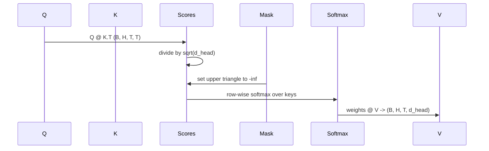

# 멀티헤드 셀프 어텐션(Multi-Head Self-Attention)

> 하나의 선형 투영(linear projection), 세 가지 뷰(view), H개의 병렬 헤드(head), 하나의 마스크(mask). 모델이 실제로 사용하는 어텐션(attention) 블록.

**Type:** Build
**Languages:** Python
**Prerequisites:** Phase 04 lessons, Phase 07 transformer lessons, Lessons 30 through 32 of this phase
**Time:** ~90분

## 학습 목표 (Learning Objectives)
- 단일 선형 층으로서 H개 헤드로 분할되는 배치(batch) 처리된 Query/Key/Value 투영을 구현한다.
- 올바른 정규화(normalization)와 dtype 처리로 스케일드 닷-프로덕트 어텐션(scaled dot-product attention)을 계산한다.
- 한 위치가 미래 위치에 어텐드(attend)하는 것을 막는 인과 마스크(causal mask)를 적용한다.
- 고정된 입력에 대한 헤드별 어텐션 가중치(attention weight)를 살펴보고 각 헤드가 무엇을 보는지 추론한다.
- 작은 어텐션 블록을 장난감(toy) 작업에서 학습시키고 헤드가 특수화(specialize)됨에 따라 손실(loss)이 떨어지는 것을 지켜본다.

## 틀 (The frame)

어텐션은 한 토큰의 표현(representation)이 같은 시퀀스(sequence)의 다른 토큰으로부터 정보를 끌어올 수 있게 하는 함수다. 셀프 어텐션(self-attention)이란 쿼리(query), 키(key), 값(value)이 모두 같은 입력에서 유도됨을 뜻한다. 멀티헤드(multi-head)란 투영이 H개의 병렬 어텐션 문제로 분할되고 그 출력이 연결(concatenate)된 뒤 다시 투영됨을 뜻한다.

효율적인 구현 패턴은 `D`에서 `3 * D`로 투영하는 하나의 선형 층으로, 세 가지 뷰로 슬라이스(slice)된 뒤 각각 크기 `D // H`인 H개 헤드로 재형성(reshape)된다. 행렬곱(matmul), 소프트맥스(softmax), 가중합은 배치 텐서(tensor) 연산으로 일어나 헤드가 가속기(accelerator)에서 병렬로 실행된다.

이 레슨은 그 블록을 만든다. 또한 인과 마스크를 추가하여 같은 코드가 디코더 전용(decoder-only) 언어 모델(language model)의 어텐션 층으로 동작하게 한다. 다음 레슨은 그 블록을 완전한 트랜스포머(transformer)로 쌓고 그 다음 레슨이 그것을 학습시킨다.

## 형태 계약 (The shape contract)

입력은 `(B, T, D)`다. 출력은 `(B, T, D)`다. 마스크는 `(T, T)`이거나 그것으로 브로드캐스트(broadcast) 가능하다. 블록 내부에서 중간 텐서는 형태 `(B, H, T, d_head)`를 가지며 여기서 `d_head = D // H`다. 제약은 `D % H == 0`이다.

```mermaid
flowchart LR
    A["(B, T, D) input"] --> B[Linear D -> 3D]
    B --> C["split into Q, K, V"]
    C --> D["reshape to (B, H, T, d_head)"]
    D --> E["scores = Q @ K.T / sqrt(d_head)"]
    E --> F[apply causal mask]
    F --> G[softmax over keys]
    G --> H["context = weights @ V"]
    H --> I["reshape to (B, T, D)"]
    I --> J[output Linear D -> D]
    J --> K["(B, T, D) output"]
```

두 개의 선형 층(QKV 투영과 출력 투영)이 블록 안의 유일한 파라미터(parameter)다. 마스크, 소프트맥스, 행렬곱, 재형성은 모두 파라미터가 없다.

## QKV 분할 (The QKV split)

순진한 구현에는 Q, K, V 각각을 위한 세 개의 별개 선형 층이 있다. 효율적인 것은 `3 * D` 특성(feature)을 출력하고 그 결과를 분할하는 단일 층을 갖는다. 둘은 수학적으로 동등한데, `(D, D)` 가중치(weight)에 의한 세 번의 별개 행렬곱이 그것들을 쌓아 만든 `(3D, D)` 가중치에 의한 정확히 한 번의 행렬곱이기 때문이다.

효율적인 버전은 가속기가 세 개 대신 하나의 행렬곱을 실행하기 때문에 더 빠르다. 또한 세 부분 행렬이 같은 파라미터 텐서에 살며 함께 초기화될 수 있기 때문에 초기화하기도 더 쉽다.

## 헤드 재형성 (The head reshape)

분할 후, Q, K, V 각각은 `(B, T, D)`다. 그것을 H개의 병렬 어텐션 문제로 바꾸기 위해 `(B, T, H, d_head)`로 재형성하고 `(B, H, T, d_head)`로 전치(transpose)한다. 이제 헤드 차원이 배치 차원 옆에 앉아, PyTorch가 헤드별 어텐션을 `B * H`개의 독립 인스턴스에 걸친 배치 연산으로 취급한다.

d_head 차원은 마지막에 남아 점수 행렬곱 `Q @ K.transpose(-2, -1)`이 그것을 수축(contract)한다. 결과는 `(B, H, T, T)` 헤드별 어텐션 점수다.

## 스케일링 (Scaling)

점수는 소프트맥스 전에 `sqrt(d_head)`로 나뉜다. 그 스케일링이 없으면 내적(dot product)이 `d_head`가 커짐에 따라 커져 소프트맥스를 한 항목이 거의 모든 질량을 갖고 나머지는 사라질 듯 작아지는 영역으로 밀어 넣는다. 그 영역에서 그래디언트(gradient)는 미미하고 학습이 멎는다. `sqrt(d_head)`로 나누면 점수의 분산(variance)이 헤드 크기에 걸쳐 대체로 일정하게 유지된다.

## 인과 마스크 (The causal mask)

디코더 전용 언어 모델은 다음 토큰을 예측할 때 과거에만 조건을 걸 수 있다. 마스크가 그것을 강제한다. 구체적으로, 소프트맥스 전에 `(T, T)` 점수 행렬의 대각선 위의 모든 항목이 음의 무한대(negative infinity)로 대체된다. 소프트맥스 후 그 위치들은 가중치 0을 받는다.

마스크를 생성 시점에 버퍼(buffer)로 등록하여 모델과 같은 장치(device)에 살고 그래디언트 그래프(gradient graph)의 일부가 되지 않게 한다. 마스크는 블록이 보게 될 최대 컨텍스트 길이(context length)를 포괄한다. 순방향 시점에 좌상단 `(T, T)` 모서리를 슬라이스한다.

## 출력 투영 (The output projection)

헤드별 컨텍스트 벡터 `(B, H, T, d_head)` 후, 다시 `(B, T, H, d_head)`로 전치하고, `(B, T, D)`로 재형성하고, 최종 `(D, D)` 선형 투영을 적용한다. 출력 투영은 모델이 헤드를 섞게 한다. 그것이 없으면 H개 헤드는 이후 층을 통해서만 재결합되고 블록이 인위적으로 제약될 것이다.

## 어텐션 가중치 검사 (Attention weight inspection)

레슨은 순방향 패스에 `return_weights=True` 플래그를 노출한다. 설정되면, 블록은 출력과 함께 형태 `(B, H, T, T)`의 헤드별 어텐션 가중치를 반환한다. 데모는 짧은 입력에 대한 한 헤드의 가중치 히트맵(heatmap)을 출력하여 인과 삼각형(causal-triangle) 구조와 위치별 초점을 볼 수 있게 한다.

학습된 모델에서는 서로 다른 헤드가 서로 다른 패턴을 학습한다. 어떤 헤드는 바로 이전 토큰에 어텐드한다. 어떤 헤드는 시퀀스의 시작에 어텐드한다. 어떤 헤드는 어텐션을 거의 균등하게 퍼뜨린다. 검사 훅(hook)은 그러한 해석가능성(interpretability) 작업의 진입점이다.

## 학습 데모 (The training demo)

`main.py` 맨 아래의 데모는 어텐션 블록을 작은 LM 헤드(head)에 연결하고 그 전체를 반복(repeat) 작업에서 학습시킨다. 입력의 각 행은 컨텍스트에 걸쳐 복제된 단일 무작위 id다. 타깃(target)은 입력을 하나 옮긴 것이므로, 모델은 다음 토큰이 이전 토큰과 같다는 것을 학습해야 한다. 손실은 교차 엔트로피(cross-entropy)다. H=4, D=32, T=12, 어휘 64로, 손실은 CPU에서 세 에폭(epoch)에 걸쳐 무작위(약 `log(64) ~ 4.16`)에서 `1.0`을 훨씬 밑도는 값까지 떨어진다.

데모의 요점은 쓸 만한 모델을 학습시키는 것이 아니다. 요점은 그래디언트가 블록의 모든 부분을 통해 흐르고 답이 명백한 문제에서 헤드가 무언가를 학습하는지 확인하는 것이다.

## 이 레슨이 하지 않는 것 (What this lesson does not do)

피드포워드(feed-forward) 블록을 추가하지 않는다. 실제 모델의 트랜스포머 층은 어텐션에 이어 2층 MLP가 오고, 각각 주위에 잔차 연결(residual connection)과 레이어 정규화(layer norm)가 있다. 다음 레슨이 그것들을 추가한다.

회전(rotary)이나 AliBi 위치 인코딩을 구현하지 않는다. 둘 다 같은 블록의 QKV 투영 단계에서 적용되지만, 별개의 교육 단위다. 여기서 만든 블록은 행렬곱 전에 Q와 K를 변환함으로써 둘 중 어느 것과도 호환된다.

추론(inference)을 위한 KV 캐시(cache)를 구현하지 않는다. 순방향 패스에 걸쳐 키와 값을 캐싱하는 것은 자기회귀(autoregressive) 디코딩을 빠르게 만드는 최적화다. 그것은 K와 V 텐서의 형태 계약을 바꾸지만 Q의 것은 바꾸지 않는다. 그것은 추론 레슨에 속한다.

## 코드 읽는 법 (How to read the code)

`main.py`는 `MultiHeadSelfAttention`을 정의한다. 클래스는 두 개의 선형 층과 등록된 마스크 버퍼를 보유한다. 순방향 패스는 투영하고, 재형성하고, 점수를 매기고, 마스킹하고, 소프트맥스하고, 가중하고, 재형성하고, 다시 투영한다. 맨 아래의 데모는 어텐션을 토큰 및 위치 임베딩(embedding)과 LM 헤드로 감싸는 작은 모델을 만들고, 복사(copy) 작업에서 세 에폭 동안 학습시키고, 손실 곡선(loss curve)과 헤드별 어텐션 히트맵을 출력한다. `code/tests/test_attention.py`의 테스트는 형태 계약, 인과성(causality) 속성, 소프트맥스 속성, 헤드 분할 속성, 그래디언트 흐름을 고정(pin)한다.

데모를 실행하라. 그런 다음 `n_heads`를 4에서 8로 늘리고(`d_model=32`를 유지하므로 `d_head=4`) 히트맵이 어떻게 변하는지 지켜보라.
